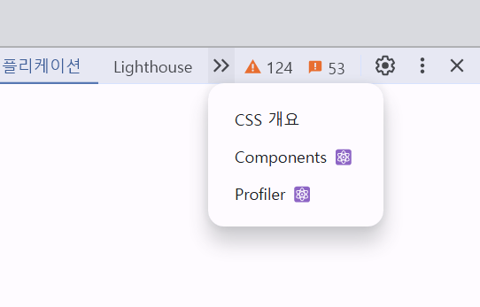
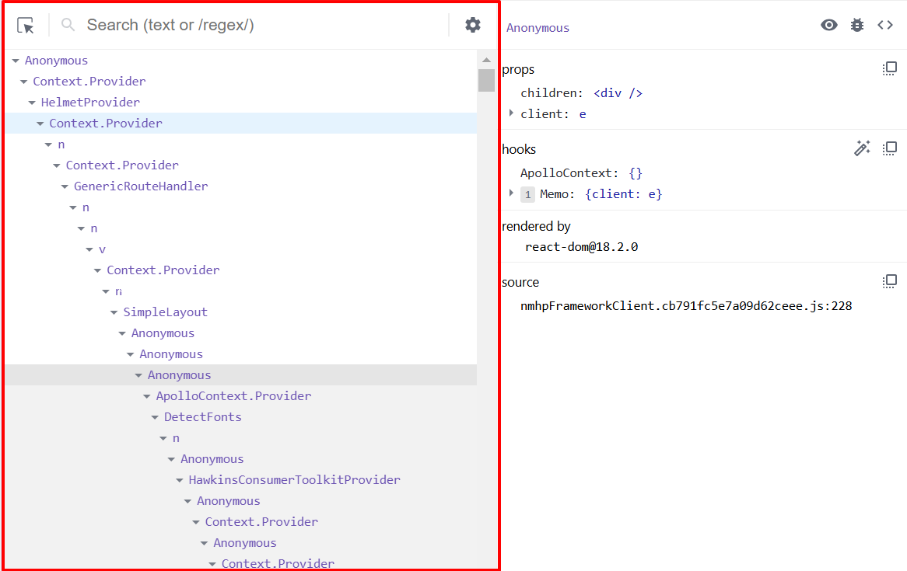

# 6장 리액트 개발 도구로 디버깅하기

## 6.1 리액트 개발 도구란?

- 리액트팀에서 만든 react-dev-tools는 리액트로 만들어진 애플리케이션을 디버깅학 위해 만들어졌으며, 리액트 웹, 네이티브 등 다양한 플랫폼에서 사용할 수 있다.
- 이 도구를 사용하는 방법은 여러 가지지만 가장 편리하게 사용할 수 있는 웹 개발 환경에서의 사용법을 살펴본다

## 6.2 리액트 개발 도구 설치

먼저 브라우저에 리액트 개발 도구를 브라우저 확장 도구로 설치해야 한다.

- [크롬](https://chromewebstore.google.com/detail/react-developer-tools/fmkadmapgofadopljbjfkapdkoienihi?hl=en)
- [파이어폭스](https://addons.mozilla.org/en-US/firefox/addon/react-devtools/)
- [엣지](https://microsoftedge.microsoft.com/addons/detail/react-developer-tools/gpphkfbcpidddadnkolkpfckpihlkkil)

리액트로 개발된 웹사이트에 접속한 후 개발자 모드에서 리액트 로고가 확인된다면 설치가 완료된 것이다.

## 6.3 리액트 개발 도구 활용하기



- 위 사진을 보면 개발자 도구에 Components와 Profiler가 추가된 것을 확인할 수 있다.

### 6.3.1 컴포넌트

- Components 탭에서는 현재 리액트 애플리케이션의 컴포넌트 트리를 확인할 수 있다. 단순히 컴포넌트의 구조 뿐만 아니라 props와 내부 hooks 등 다양한 정보를 확인할 수 있다.

#### 컴포넌트 트리

- Components의 왼쪽 영역은 해당 리액트의 페이지의 컴포넌트 트리를 나타낸다. 리액트 애플리케이션 전체의 트리 구조를 한눈에 보여준다.
  
- 기명 함수로 선언되어 컴포넌트명을 알 수 있다면 해당 컴포넌트명을 보여주고, 만약 익명 함수로 선언돼 있다면 Annonymous라는 이름으로 컴포넌트를 보여준다.
- 함수 선언식 또는 표현식으로 선언되지 않은 컴포넌트는 아래와 같은 문제가 있다. (16.8 버전 이하)
  - 익명 함수를 defalut로 export한 AnnonymousDefalutComponent의 경우 AnnonymousDefalutComponent는 코드 내부에서 사용되는 이름일 뿐, 실제로 defalut export로 내보낸 함수의 명칭은 추론할 수 없다. 따라서 \_defalut로 표시된다.
  - memo를 사용해 익명 함수로 만든 컴포넌트를 감싼 경우, 함수명을 명확히 추론하지 못해서 Annonymous로 표시됐다. 추가로 memo 라벨을 통해 memo로 감싸진 컴포넌트임을 알 수 있다.
  - 고차 컴포넌트인 withSampleHOC로 감싼 HOCComponent의 경우 두 가지 모두 Annonymous로 선언돼 있다. 이 또한 고차 컴포넌트의 명칭을 제대로 추론하지 못했기 때문이다.
- 위 같은 이유로 함수를 기명으로 선언하는 것이 디버깅하는 데 많은 도움이 된다.
- 만약 함수를 기명으로 바꾸기 어렵다면 함수에 displayName 속성을 추가하는 방법도 있다.

```js
const MemoizedComponent = memo(function () {
  return <>MemoizedComponent</>;
});

MemoizedComponent.displayName = "메모 컴포넌트입니다.";
```

- 익명 함수로 선언하기 곤란한 경우, 혹은 함수명과는 별도로 특별한 명칭을 부여해 명시적으로 확인이 필요한 경우에 displayName을 사용하면 좋다.
- 고차 컴포넌트의 경우 이러한 기법을 유용하게 사용할 수 있다. 고차 컴포넌트는 일반적으로 고차 컴포넌트와 일반 컴포넌트의 조합으로 구성되므로 displayName을 잘 설정하면 디버깅하는 데 많은 도움이 된다

```js
function withHigherOrderComponent(WrapperdComponent) {
  class withHigherOrderComponent extends React.Components {
    /* ... */
  }

  WithHigherOrderComponent.displayName = `WithHigherOrderComponent(${getDisplayName(
    WrappedComponent
  )})`;

  return WithHigherOrderComponent;
}

function getDisplayName(WrappedComponent) {
  return WrappedComponent.displayName || WrappedComponent.name || "Component";
}
```

- 물론 앞서 넷플릭스 홈페이지의 컴포넌트 트리의 경우처럼 개발 모드에서 확인하는 리액트 컴포넌트 트리가 아닌 리액트를 빌드한 트리를 확인하는 경우 기명 함수로 선언한다 하더라도 terser 등의 압축 도구 등이 컴포넌트명을 단순하게 난수화하기 때문에 확인하기가 어려워진다.
- Component.displayName의 경우에도 빌드 도구가 사용하지 않는 코드로 인식해 삭제할 가능성도 있다.
- 그러므로 displayName과 함수명은 개발 모드에서만 제한적으로 참고하는 것이 좋다.

#### 컴포넌트명과 props

왼쪽 컴포넌트 트리에서 컴포넌트를 선택했을 때 해당 컴포넌트에 대한 자세한 정보를 보여주는 오른쪽 영역이다.


1. 컴포넌트명과 Key : 컴포넌트의 명칭과 해당 컴포넌트를 나타낸다.
2. 컴포넌트 도구 : 3개의 아이콘이 있다
   ① 눈 아이콘 - 해당 컴포넌트가 HTML의 어디에서 렌더링됐는지 확인할 수 있다.
   ② 벌레 아이콘 - 클릭하면 해당 컴포넌트의 정보(props, hooks, nodes)가 console.log를 실행해 기록된다
   ③ 소스코드 아이콘 - 해당 컴포넌트의 소스코드를 확인할 수 있다

3. 컴포넌트 props : 해당 컴포넌트가 받은 props를 확인할 수 있다. 단순히 원시값뿐만 아니라 함수도 포함돼 있다.

4. 컴포넌트 hooks : 컴포넌트에서 사용 중인 훅 정보를 확인할 수 있다. 여기서 useState는 State와 같이 use가 생략된 이름으로 나타난다.

5. 컴포넌트를 렌더링한 주체, rendered by : 해당 컴포넌트를 렌더링한 주체가 누구인지 확인할 수 있다.

### 6.3.2 프로파일러

리액트가 렌더링하는 과정에서 발생하는 상황을 확인하기 위한 도구다.  
즉 리액트 애플리케이션이 렌더링되는 과정에서 어떤 컴포넌트가 렌더링됐는지, 또 몇 차례나 렌더링이 일어났으며 어떤 작업에서 오래 걸렸는지 등 컴포넌트 렌더링 과정에서 발생하는 일을 확인할 수 있다.  
**프로덕션 빌드로 실행되는 애플리케이션에서는 사용할 수 없다**

#### 설정 변경하기

- 가운데 있는 톱니 모양의 설정 버튼을 눌러서 아래와 같이 설정을 바꿔야 한다
  - General 탭의 Highlight updates when components render : 컴포넌트가 렌더링될 때마다 해당 컴포넌트에 하이라이트를 표시한다. 이 기능은 매우 유용한 기능이므로 꼭 켜두는 것이 좋다.
  - Debugging 탭의 Hide logs during second render in Strict Mode : 엄격 모드를 실행되는 경우 useEffect 등이 두 번씩 동작하는 것으로 막아준다
  - Profiler 탭의 Record why each component rendered while profiling : 프로파일링 도중 무엇 때문에 컴포넌트가 렌더링됐는지 기록한다. 애플리케이션 속도가 조금 느려질 수는 있지만 디버깅에 도움이 되는 옵션이므로 켜듀는 것이 좋다.

#### 프로파일링

- 프로파일링 메뉴 : 리액트가 렌더링할 때 어떠한 일이 벌어지는지 확인할 수 있는 도구다.  
  ① 파란버튼 : 프로파일링 시작/중단 버튼
  ② 원형 화살표 버튼 : 웹페이지를 새로고침되면서 이와 동시에 프로파일링이 시작되는 버튼
  ③ 정지 버튼 : 프로파이링된 현재 내용을 모두 지우는 버튼, 프로파일링된 기록을 모두 삭제할 수 있다
  ④ 위 화살표 : 프로파일 결과를 불러오는 버튼
  ⑤ 아래 화살표 : 프로파일 결과를 json 파일로 저장하는 버튼

#### Flamegraph

- 불꽃 모양의 아이콘을 가진 Flamegraph 탭에서는 렌더 커밋별로 어떠한 작업이 일어났는지 나타낸다.
- 너비가 넓을수록 해당 컴포넌트를 렌더링하는 데 오래 걸렸다는 것을 의미한다.
- 각 컴포넌트에 마우스 커서를 가져다 대면 해당 컴포넌트의 렌더링과 관련된 정보를 확인할 수 있고 오른쪽에는 해당 커밋과 관련된 추가적인 정보를 확인할 수 있다.
- 비단 컴포넌트가 렌더링이 얼마나 걸렸는지 확인할 수 있을뿐더러 렌더링되지 않은 컴포넌트에 대한 정보도 확인할 수 있다.

#### Ranked

- 해당 커밋에서 렌더링하는 데 오랜 시간이 걸린 컴포넌트를 순서대로 나열한 그래프다.
- Flamegraph와 차이점은 모든 컴포넌트를 보여주는 것이 아니라 단순히 렌더링이 발생한 컴포넌트만 보여준다는 데 있다. 렌더링이 발생한 컴포넌트에 대한 정보만 파악하고 싶으면 Ranked 메뉴를 활용하는 것이 좋다.

#### 타임라인

- 시간이 지남에 따라 컴포넌트에서 어떤 일이 일어났는지를 확인할 수 있다.
  - 예) input에 글자를 입력하면서 state의 값이 업데이트되고, 이 값이 동기로 업데이트됐는지, 또 언제 업데이트가 이뤄졌는지 등을 확인할 수 있다.
- 리액트 18 이상의 환경에서만 확인할 수 있다.

#### 프로파일로러 렌더링 원인 파악해서 수정해 보기

- 생략
