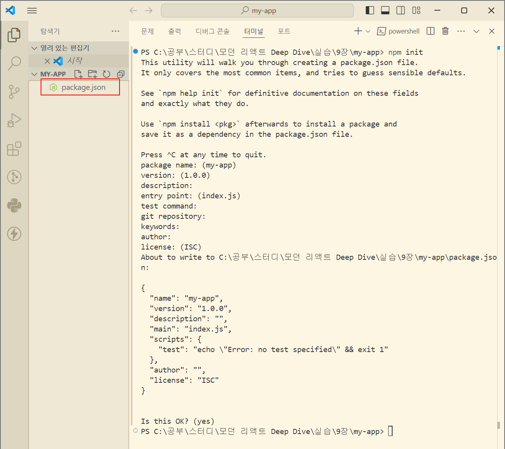
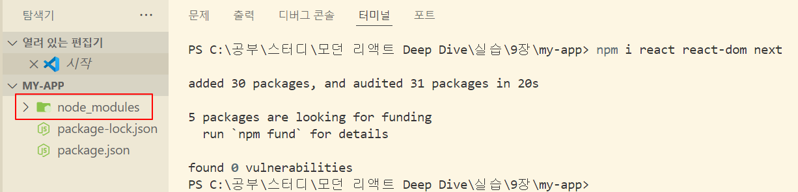

# 9장 모던 리액트 개발 도구로 개발 및 배포 환경 구축하기

빈 폴더만 준비돼 있는 환경에서 가장 각광받는 라이브러리인 리액트와 Next.js로 실무에서도 쓸 수 있는 웹서비스를 구축해보기

## 9.1 Next.js로 리액트 개발 환경 구축하기

- 리액트와 Next.js에서 어떠한 설정이 필요한지 알기 위해서 package.json부터 하나씩 살펴보자
- create-react-app은 더 이상 유지보수되지 않을 가능성이 큼
- 여러 리액트 기반 프레임워크를 제안하는 런처 형태로 변경될 예정이기 때문에 아무것도 없는 상태에서 리액트 프레임워크를 구축하는 방법을 공부해 둘 필요가 있다.

### 9.1.1 create-next-app 없이 하나씩 구축하기

#### 1. package.json 만들기

- `npm init`을 실행하면 package.json을 만드는 CLI를 실행할 수 있다.

  

#### 2. react, react-dom, next 설치

- Next.js 프로젝트를 실행하는데 필요한 핵심 라이브러리를 설치한다

```
npm i react react-dom next
```



#### 3. devDependencies에 필요한 패키지 설치

- typescript, @types/react, @types/react-dom, @types/node, eslint, eslint-config-next를 설치한다
- 그러면 기본적인 패키지 설치는 모두 완료된다

```
npm i typescript @types/react @types/react-dom @types/node eslint eslint-config-next
```

### 9.1.2 tsconfig.json 작성하기

- 이제 타입스크립트 코드를 작성하기 위한 준비를 해야한다
- 타입스크립트 설정은 tsconfig.json에 기록한다.

#### tsconfig.json 작성 방법

- 본격적으로 작성하기 전에 JSON 최상단에 $schema 키와 아래와 같은 값을 넣어야 한다

```
{
  "$schema": "https://json.schemastore.org/tsconfig.json"
}
```

- `$schema`란?
  - schemaStore에서 제공해 주는 정보로, 해당 JSON 파일이 무엇을 의미하는지, 또 어떤 키와 어떤 값이 들어갈 수 있는지 알려주는 도구다.
  - 올바른 값이 선언돼 있다면 IDE에서 자동 완성이 가능해진다

```
{
  "$schema": "https://json.schemastore.org/tsconfig.json",
  "compilerOptions": {
    "target": "es5",
    "lib": ["dom", "dom.iterable", "esnext"],
    "allowJs": true,
    "skipLibCheck": true,
    "strict": true,
    "forceConsistentCasingInFileNames": true,
    "noEmit": true,
    "esModuleInterop": true,
    "module": "esnext",
    "moduleResolution": "node",
    "resolveJsonModule": true,
    "isolatedModules": true,
    "jsx": "preserve",
    "incremental": true,
    "baseUrl": "src",
    "paths": {
      "#pages/*": ["pages/*"],
      "#hooks/*": ["hooks/*"],
      "#types/*": ["types/*"],
      "#components/*": ["components/*"],
      "#utils/*": ["utils/*"]
    }
  },
  "include": ["next-env.d.ts", "**/*.ts", "**/*.tsx"],
  "exclude": ["node_modules"]
}
```

- tsconfig.json에서 사용하는 옵션은 [공식 홈페이지](https://www.typescriptlang.org/tsconfig)에서 확인할 수 있다

### 9.1.3 next.config.js 작성하기

- next.config.js가 제공하는 설정 파일은 버전별로 조금씩 다르다
- 자신이 사용하고 있는 next.config.js에서 사용 가능한 옵션을 확인하고 싶다면 [깃허브 저장소](https://github.com/vercel/next.js/blob/v12.3.1/packages/next/server/config-shared.ts)를 방문해 확인할 수 있다.
- 책에서는 아래와 같이 옵션만 추가했다

```js
/** @type {import('next').NextConfig} */
const nextConfig = {
  // 리액트의 엄격모드를 활성화한다
  reactStrictMode: true,
  // 일반적으로 보안 취약점으로 취급되는 X-Powered-By 헤더를 제거한다
  poweredByHeader: false,
  // 빌드 시에 ESLint를 무시한다
  eslint: {
    ignoreDuringBuilds: true,
  },
};

module.exports = nextConfig;
```

### 9.1.4 ESLint와 Prettier 설정하기

- eslint-config-next를 설치했지만 코드의 스타일링을 정의해주지 않는다.
- 코드 스타일링등 eslint-config-next가 해주지 않는 일반적인 ESLint 작업을 수행하기 위해 가장 설치 및 설정이 쉬운 @titicaca/eslint-config-triple을 설치해 사용한다

```
npm i @titicaca/eslint-config-triple --save-dev
```

- @titicaca/eslint-config-triple에 대한 설정은 [깃허브 저장소](https://github.com/titicacadev/triple-config-kit#eslint-config-triple)에 정리돼 있다
- eslint-config-next와 eslint-config-triple이 함께 작동하게 하려면 .eslintrc.ts 파일에 다음과 같은 별도의 설정이 필요하다

```js
const path = require("path");

const createConfig = require("@titicaca/eslint-config-triple/create-config");

const { extends: extendConfigs, overrides } = createConfig({
  type: "frontend",
  project: path.resolve(__dirname, "./tsconfig.json"),
});

module.exports = {
  // next/core-web-vitals 를 추가하면 두 가지 설정이 모두 적용된다
  extends: [...extendConfigs, "next/core-web-vitals"],
  overrides,
};
```

### 9.1.5 스타일 설정하기

- styled-components를 사용해서 애플리케이션에 스타일 적용해보기

```bash
npm i styled-components
```

- 위 명령어로 설치한 후 swc에 styled-components를 사용한다는 것을 알리기 위해 next.config.js에 `styledComponents: true`을 추가한다
- 추가적으로 pages/\_document.tsx의 Head에 styled-components를 사용하기 위한 ServerStyleSheet를 추가한다

### 9.1.6 애플리케이션 코드 작성

- Next.js 애플리케이션의 폴더 구조는 src/pages 하단에 실제 페이지 라우팅과 관련된 파일을 기재하는 컨벤션만 지키면 된다
- 프로젝트 실행, 빌드, 린트와 관련된 명령어를 package.json에 기재하면 모든 준비를 마치게 된다

### 효율적으로 프로젝트 세팅하기

#### 1. 템플릿 저장소 생성하는 방법

- 프로젝트를 세팅하는 과정을 줄이기 위해 깃허브에서는 템플릿 리포지토리를 만들 수 있다
- [템플릿 리포지토리](https://docs.github.com/ko/repositories/creating-and-managing-repositories/creating-a-template-repository)는 기존 리포지토리를 템플릿으로 만들어서 자신과 다른 사용자가 동일한 디렉터리 구조, 분기 및 파일을 사용하여 새 리포지토리를 생성하도록 할 수 있는 기능이다

#### 2. 나만의 create-\*\*\*-app 구현하기

- cli 패키지로 만들어서 사용자의 입력을 받아 서로 다른 패키지를 만들 수 있다
