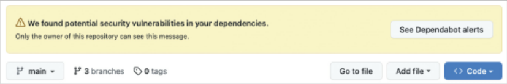
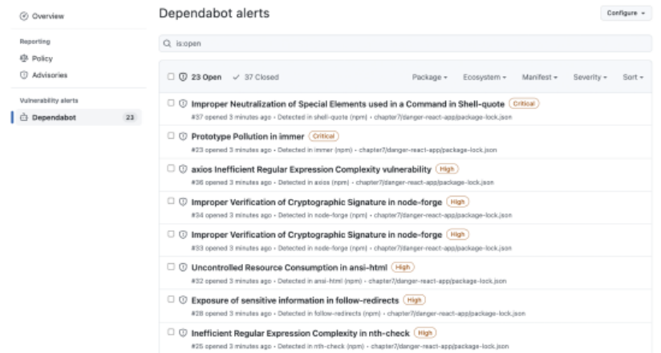
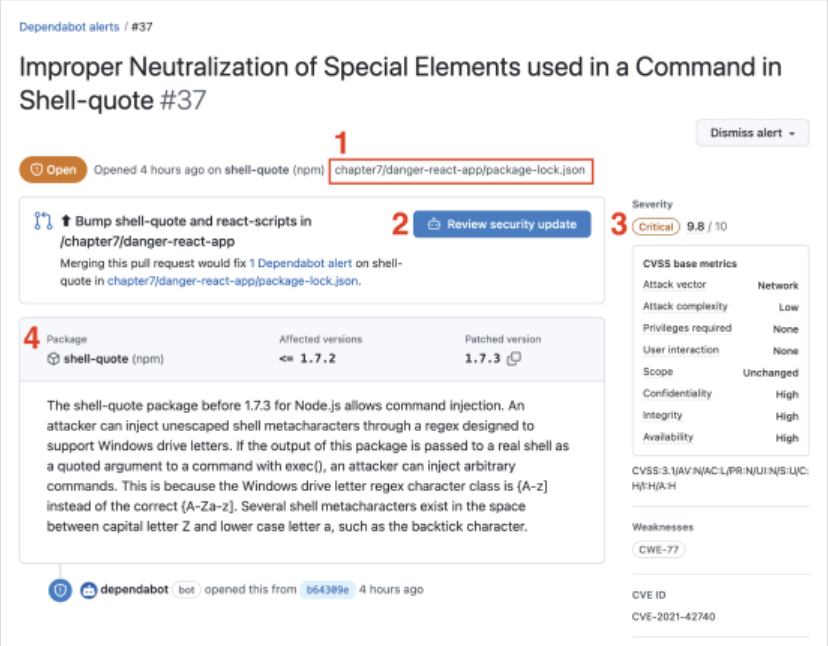

## 9.2 깃허브 100% 활용하기

깃허브에서 제공하는 다양한 서비스를 활용하면 애플리케이션을 개발하는데 많은 도움을 얻을 수 있다

### 9.2.1 깃허브 액션으로 CI 환경 구축하기

#### CI란?

- 코드의 변화를 모으고 관리하는 코드 중앙 저장소에서, 여러 기여자가 기여한 코드를 지속적으로 빌드하고 테스트해 코드의 정합성을 확인하는 과정
- CI의 핵심은 저장소에서 코드의 변화가 있을 때마다 전체 소프트웨어의 정합성을 확인하기 위한 작업(테스트, 빌드, 정적 분석, 보안 취약점 분석 등) 을 자동으로 실행해야 한다

#### 깃허브 액션이란?

- 깃허브에서 출시한 SaaS로, 깃허브 저장소를 기반으로 깃허브에서 발생하는 다양한 이벤트를 트리거 삼아 다양한 작업을 할 수 있게 도와주는 도구이다
- 깃허브 액션이 수행하는 작업
  - 어떤 브랜치에 푸시가 발생하면 빌드를 수행한다
  - 특정 브랜치가 메인 브랜치를 대상으로 풀 리퀘스트가 열리면 빌드, 테스트, 정적 분석을 수행한다
- 이러한 작업이 CI/CD 솔루션을 대체할 수 있다
- CI/CD 배포 뿐만 아니라 프로젝트에서 필요한 자동화 처리, 빌드 확인, 테스트 등을 자동화할 수 있다

#### 깃허브 액션의 기본 개념

- **러너(runner)**  
  파일로 작성된 깃허브 액션이 실행되는 서버를 의미한다. 특별히 지정하지 않으면 공용 깃허브 액션 서버를 이용하며, 별도의 러너를 구축해 자체적으로 운영할 수도 있다

- **액션(action)**  
  러너에서 실행되는 하나의 작업 단위를 의미한다. yaml 파일로 작성된 내용을 하나의 액션으로 볼 수 있다

- **이벤트(event)**  
  깃허브 액션이 일으키는 이벤트를 의미한다. 개발자의 필요에 따라 한 개 이상의 이벤트를 지정할 수 있다. 또한 특정 브랜치를 지정하는 이벤트도 가능하다.

- **잡(jobs)**  
  하나의 러너에서 실행되는 여러 스텝의 모음을 의미한다. 하나의 액션에서 여러 잡을 생성할 수 있으며, 특별히 선언한 게 없다면 내부 가상머신에서 각 잡은 병렬로 실행된다

- **스텝(steps)**  
  잡 내부에서 일어나는 하나하나의 작업을 의미한다. 셀 명령어나 다른 액션을 실행할 수도 있다. 이 작업은 병렬로 일어나지 않는다.

#### 깃허브 액션 작성하기

- ./github/workflow 폴더를 생성하고 내부에 파일을 작성한다. 파일명에 제한이 없고, 확장자를 .yml 또는 .yaml로 지정하면 된다
- yaml 파일을 구성하는 문법은 github [공식 문서](https://docs.github.com/en/actions/writing-workflows/workflow-syntax-for-github-actions)에서 확인할 수 있다

#### 브랜치 보호 규칙

- 브랜치 보호 규칙을 활용하면 테스트, 빌드와 같은 CI가 성공한 코드만 push되도록 설정할 수 있다
- 설정 방법: [Settings] → [Code and automation] → [Branches] → [Add branch protection rule] 클릭
- 브랜치 보호 규칙의 종류는 [공식 문서](https://docs.github.com/ko/repositories/configuring-branches-and-merges-in-your-repository/managing-protected-branches/about-protected-branches)에서 확인할 수 있다

### 9.2.2 직접 작성하지 않고 유용한 액션과 깃허브 앱 가져다 쓰기

- 깃허브에서는 [Marketplaces](https://github.com/marketplace?type=actions)라는 서비스를 제공해 여러 사용자가 만들어 놓은 액션을 손쉽게 가져다 쓸 수 있도록 운영하고 있다

#### 깃허브에서 제공하는 기본 액션

- **actions/checkout**  
  깃허브 저장소를 체크아웃하는 액션이다. 저장소를 기반으로 작업을 해야 한다면 반드시 필요하다.

- **actions/setup-node**  
  Node.js를 설치하는 액션이다. Node.js를 사용하는 프로젝트라면 반드시 필요하다. 설치할 Node.js 버전을 지정할 수도 있다.

- **actions/github-script**  
  Github API가 제공하는 기능을 사용할 수 있도록 도와주는 액션이다. GitHub API를 이용하면 기서브에서 할 수 있는 대부분의 작업을 수행할 수 있으므로 한 번쯤 API 문서를 보는 것을 추천한다.

- **actions/stale**  
  오래된 이슈나 PR을 자동으로 닫거나 더 이상 커뮤니케이션하지 못하도록 닫는다. 저장소가 오래되어 과거에 생성된 이슈나 풀 리퀘스트가 너무 많을 경우 정리하는 데 도움이 된다.

- **actions/dependency-review-action**  
  의존성 그래프에 대한 변경, 즉 package.json, package-lock.json, pnpm-lock.yaml 등의 내용이 변경됐을 때 실행되는 액션으로, 의존성을 분석해 보안 또는 라이센스가 문제가 있다면 이를 알려준다.

- **github/codeql-action**  
  깃허브의 코드 분석 솔루션이 code-ql을 활용해 저장소 내 코드의 취약점을 분석해 준다. languages에 javascript만 설정해 두면 자바스크립트와 타입스크립트를 모두 검사하므로 특정 스케줄을 맞춰서 실행하거나 CI로 활용할 수 있다.

### 9.2.3 깃허브 Dependabot으로 보안 취약점 해결하기

#### Dependabot이란?

- 의존성에 문제가 있다면 이에 대해 문제를 알려주고 가능하다면 해결할 수 있는 풀 리퀘스트를 열어주는 깃허브에서 제공하는 기능이다

#### package.json의 dependencies 이해하기

- 먼저 package.json에서 빼놓을 수 없는 의존성과 버전에 대해서 이해해야 한다
- **버전**
  - 버전은 주.부.수로 구성돼 있으며 각각의 정의는 아래와 같다
  1. 주(主)버전 : 기존 버전과 호환되지 않게 API가 바뀌면 올린다. 주 버전0은 초기 개발을 위해 쓰며, 실험 버전이라고 생각하면 된다.
  2. 부(部) 버전 : 기존 버전과 호환되면서 새로운 기능을 추가할 때 올린다.
  3. 수(修) 버전 : 기존 버전과 호환되면서 버그를 수정할 때 올린다
  - 이 외에도 특정 버전으로 패키지를 배포하고 나면 그 버전의 내용은 절대 변경하지 말야야 한다
  - 한 가지 염두에 둬야 할 점은 유의적 버전은 어디까지나 개발자들 간의 약속일 뿐, 정말로 해당 API의 버전이 이 유의적 버전에 맞춰 구현돼 있는지는 알 수 없다. 그래서 유의적 버전만 신뢰하고 버전을 변경하면 안된다.
- **npm 버전 규칙**

  - react@16.0.0: 버전 앞에 아무런 특수 기호가 없다면 정확히 해당 버전에 대해서만 의존하고 있다는 뜻이다
  - react@^16.0.0: 16.0.0과 호환되는 버전을 의미한다. 호환된다는 뜻은 0보다 높은 부 버전에 대해서는 호환된다는 가정 하에 상위 버전을 설치할 수 있다는 것을 뜻한다. 즉, 여기서 가능한 버전은 16.0.0부터 17.0.0 미만의 모든 버전이다
  - react@~16.0.0: 패치 버전에 대해서만 호환되는 버전을 의미한다. 즉, 여기서 가능한 버전은 16.0.0부터 16.1.0 미만의 모든 버전이다.

- **의존성**
  - npm 프로젝트를 운영하는데 필요한 자신 외의 npm 라이브러리를 정의해 둔 목록이다. JSON 형식으로 작성돼 있으며, dependencies와 devDependencies로 구성돼 있다.
    - dependencies: `npm insatll 패키지명`을 실행하면 package.json에 설치되는 의존성이다. 해당 프로젝트를 실행하는데 꼭 필요한 패키지가 선언된다 (예- react,react-dom, next)
    - devDependencies: `npm install 패키지명 --save-dev`를 실행하면 package.json에 설치되는 의존성이다. 해당 프로젝트를 실행하는 데는 필요하지 않지만 개발 단계에서 필요한 패키지들을 여기에 선언한다. (예-eslint, jest, typescript)

#### Dependabot으로 취약점 해결하기

- 취약점이 있는 애플리케이션을 구현한 후 원격 저장소에 푸시하면 아래와 같이 Dependabot이 저장소의 의존성에 여러 가지 문제가 있다고 알려준다.

- 그리고 배너의 'See Dependabot alerts'를 누르면 구체적으로 어떤 의존성에 문제가 있는지 확인할 수 있다.

- **개별 취약점 살펴보기**

  - 깃허브의 Dependabot은 취약점을 Critical, High, Moderate, Low의 4단계로 나눈다
  - 상세 화면을 살펴보면 아래와 같다
    

  1. 취약점을 발견한 파일의 경로다
  2. 취약점을 바로 수정할 수 있는 경우 표시되는 버튼이다
  3. 보안 취약점의 심각도를 나타낸다
  4. 취약점의 자세한 정보를 나타낸다

  - 문제가 되는 패키지인 shell-quote가 어디에 설치되어 있는지 확인하기 위해서는 `npm ls shell-quote` 명령어를 입력하면 확인할 수 있다
  - 문제가 되는 패키지가 버전에 문제가 없다면 어떻게 사용하고 있는지를 확인하면 된다

- **취약점 해결하기**
  - 가장 쉽게 해결할 수 있는 것은 깃허브 Dependabot이 풀 리퀘스트를 열어준 경우에 그 풀 리퀘스트를 머지하는 것 이다
  - 풀 리퀘스트를 열어줬다는 것은 이미 취약점을 해결한 패치가 존재한다는 것을 의미한다
