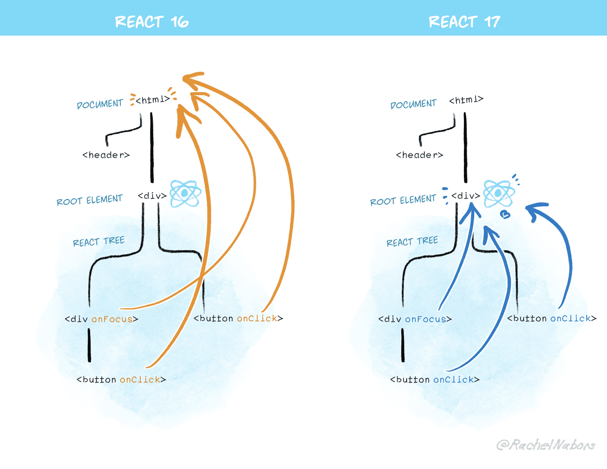
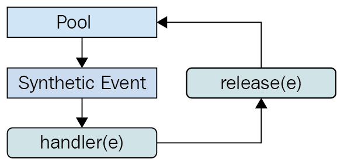

# 10장 리액트 17과 18의 변경 사항 살펴보기

대부분의 리액트 프로젝트들이 최소한 훅과 함수 컴포넌트를 사용하기 위해 16.8 버전을 기반으로 개발됐고, 이것이 고착화되어 더 이상 버전 업하지 않고 운영되고 있다. 그래서 리액트 버전 17과 18 버전은 비교적 많이 사용하고 있진 않다.

## 10.1 리액트 17 버전 살펴보기

- 16 버전과 다르게 새롭게 추가된 기능이 없으며 호환성이 깨지는 변경 사항, 즉 기존에 사용하던 코드의 수정을 필요로 하는 변경 사항을 최소화했다는 점을 가장 큰 특징으로 꼽는다.
- 그래서 16 버전에서 17 버전의 버전 업은 큰 부담없이 할 수 있는 작업이라 볼 수 있다.

### 10.1.1 리액트의 점진적인 업그레이드

#### 16버전까지의 업그레이드 전략

- 리액트의 16버전까지는 유의적 버전 전략에 맞춰 업데이트되고 있었다. 그래서 새로운 주 버전이 릴리즈되면 이전 버전에서의 API 제공을 완전히 중단해 버리고, 전체 애플리케이션을 새롭게 업그레이드하기를 요구하고 있었다.
- 따라서 레거시 애플리케이션을 관리하는 개발자는 전체 웹 서비스가 새로운 버전으로 완전히 넘어가버리거나, 계속 현재(과거 버전)에 머물러 있어야 한다.

#### 17버전 이후부터의 업그레이드 전략

- 17버전부터는 점진적인 업그레이드가 가능해진다. 즉, 두 개 이상의 리액트 버전이 웹 애플리케이션에 존재할 수 있어서 점진적으로 버전 업그레이드가 가능하다는 뜻이다.
- 2개 이상의 버전이 있는 것이 이상적인 방법은 아니지만, 한 번에 버전을 올리기에 부담이 되는 규모가 큰 애플리케이션의 경우에는 충분히 고려해 볼만한 선택지가 될 수 있다.

### 10.1.2 이벤트 위임 방식의 변경

리액트는 이벤트 핸들러를 해당 이벤트 핸들러를 추가한 각각의 DOM 요소에 부탁하는 것이 아니라, 이벤트(click, change) 당 하나의 핸들러를 루트에 부착한다. 이를 `이벤트 위임`이라고 한다. 이벤트 위임을 이해하려면 이벤트가 어떤 단계로 구성돼 있는지 먼저 알아야 한다.

#### 이벤트의 단계

1. **캡처**  
   이벤트 핸들러가 트리 최상단 요소에 부터 시작해서 실제 이벤트가 발생한 타깃 요소까지 내려가는 것을 의미한다.
2. **타깃**
   이벤트 핸들러가 타깃 노드에 도달하는 단계다. 이 단계에서 이벤트가 호출된다.
3. **버블링**
   이벤트가 발생한 요소에서부터 시작해 최상위 요소까지 다시 올라간다.

```
<ul>
    <li />
    <li />
    <li />
    <li />
    <!-- ... -->
</ul>
```

- 만약 모든 li 요소에 이벤트가 필요다면 이 li에 이벤트를 다 추가할 수 있지만 ul에만 추가해서 이벤트를 위임한다면 ul의 자식에 li가 추가 또는 삭제되더라도 이벤트 핸들러도 똑같이 추가 수정할 필요도 없고, 이벤트 추가를 한 번만 하면 되므로 좀 더 효율적으로 관리할 수 있게 된다.
- 리액트는 최초 릴리스부터 이러한 이벤트 위임을 적극적으로 사용했다. 앞서 언급했듯이 리액트는 이벤트 핸들러를 각 요소가 아닌 document에 연결해서 이벤트를 좀 더 효율적으로 관리한다.

#### 17버전부터 바뀐 이벤트 위임 요소

- 리액트 17부터는 이러한 이벤트 위임이 모두 document가 아닌 리액트 컴포넌트 최상단 트리, 즉 루트 요소로 바뀌었다.
- 그 이유는 점진적인 업그레이드를 지원하고, 바닐라 자바스크립트 코드 또는 jQuery 등이 혼재돼 있는 경우 혼란을 방지하기 위해서다.



### 10.1.3 import React from 'react'가 더 이상 필요없다:새로운 JSX transform

#### 16버전까지는 import React from 'react'가 필요한 리액트

- JSX는 브라우저가 이해할 수 있는 코드가 아니므로 바벨이나 타입스크립트를 활용해 JSX를 실행하기 위해 일반적으로 자바스크립트로 변환하는 과정이 꼭 필요하다.
- 이 변환 작업이 개발자에게 보이지 않는 리액트 단에서 이뤄지고 있다. 16버전까지는 이러한 JSX 변환을 사용하기 위해 코드 내에서 React를 사용하는 구문이 없더라도 import React from 'react'가 필요했다.

```js
const Component = (
  <div>
    <span>hello world</span>
  </div>
);

// 리액트 16에서는 이렇게 변환된다
var Component = React.createElement(
  "div",
  null,
  React.craeteElement("span", null, "hello world")
);
```

- 변환 결과를 보면 왜 import 문이 필요한지 알 수 있다. JSX 코드를 변경은 해주지만 React.createElement를 수행할 때 필요한 import문까지는 추가해주지 않기 때문이다.

#### 17버전 이후부터는 import 문이 필요없음

- 리액트 17부터는 바벨과 협력해 import 구문 없이도 JSX를 변환할 수 있게 됐다.
- 이 새로운 변환 식은 import React가 필요 없다는 장점 외에도, 불필요한 import 구문을 삭제해 번들링 크기를 약간 줄일 수 있고, 컴포넌트 작성을 더욱 간결하게 해준다.
- 이전 코드는 17버전에서는 아래와 같이 변환된다

```js
"use strict";

var _jsxRuntime = require("react/jsx-runtime");

var Component = (0, _jsxRuntime.jsx)("div", {
  children: (0, _jsxRuntime.jsx)("span", {
    children: "hello world",
  }),
});
```

- React.createElement가 제거되고, require() 구문이 추가되었다.
- JSX를 변환할 때 필요한 모듈인 react/jsx-runtime을 불러오는 require 구문도 같이 추가되므로 import 문을 작성하지 않아도 된다

### 10.1.4 그 밖의 주요 변경 사항

#### 이벤트 풀링 제거

- 리액트 16에서는 이른바 이벤트 풀링이라 불리는 기능이 있었다.



- **이벤트 풀링 시스템 순서**

  1. 이벤트 핸들러가 이벤트를 발생시킨다
  2. 합성 이벤트 풀에서 합성 이벤트 객체에 대한 참조를 가져온다
  3. 이 이벤트 정보를 합성 이벤트 객체에 넣어준다
  4. 유저가 지정한 이벤트 리스너가 실행된다
  5. 이벤트 객체가 초기화되고 다시 이벤트 풀로 돌아간다

- 언뜻 보기에는 이벤트 풀에 잇는 합성 이벤트를 반복적으로 사용할 수 있어서 효과적으로 보이지만 풀에서 이벤트를 받아오고, 이벤트가 종료되자마자 다시 초기화하는 방식은 분명 사용하는 쪽에서 직관적이지 않았다
- 비동기 코드로 이벤트 핸들러를 접근하기 위해서는 별도 메모리 공간에 합성 이벤트 객체를 할당해야 한다는 점, 그리고 모던 브라우저에서는 이와 같은 방식이 성능 향상에 크게 도움이 안 된다는 점 때문에 이벤트 풀링 개념이 삭제됐다.

#### useEffect 클린업 함수의 비동기 실행

- 리액트의 useEffect에 있는 클린업 함수는 리액트 16 버전까지는 동기적으로 처리됐다. 동기적으로 실행되기 때문에 다른 작업을 실행할 수 없어 불필요한 성능 저하로 이어지는 문제가 존재했다.
- 리액트 17버전부터는 화면이 완전히 업데이트된 이후에 클린업 함수가 비동기적으로 실행된다. 명확히 말하면 클린업 함수는 컴포넌트의 커밋 단계가 완료될 때까지 지연된다.

#### 컴포넌트의 undefined 반환에 대한 일괄적인 처리

- 리액트 16과 17버전은 컴포넌트 내부에서 undefined를 반환하면 오류가 발생한다. 이는 의도치 않게 잘못된 반환으로 이한 실수를 방지하기 위해서다.
- 하지만 리액트 16에서 forwardRef나 memo에서 undefined를 반환하는 경우에는 별다른 에러가 발생하지 않는 문제가 있고, 리액트 17부터는 에러가 정상적으로 발생한다
