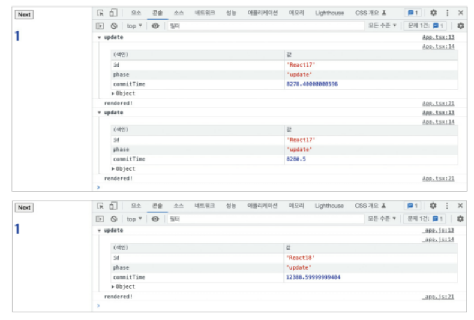

### 10.2.2 react-dom/client

클라이언트에서 리액트 트리를 만들 때 사용되는 API가 변경됐다. 만약 리액트 18 이하 버전에서 만든 create-react-app으로 프로젝트를 유지보수 중이라면 리액트 18로 업그레이드할 때 반드시 index.{t|j}sx에 있는 내용을 변경해야 한다

#### creatRoot

- 기존의 react-dom에 있던 render 메서드를 대체할 새로운 메서드다. 리액트 18의 기능을 사용하고 싶다면 craeteRoot와 render를 함께 사용해야 한다

#### hydrateRoot

- 서버 사이드 렌더링 애플리케이션에서 하이드레이션을 하기 위한 새로운 메서드다.

### 10.2.3 react-dom/server

클라이언트의 변화와 마찬가지로 서버에서도 컴포넌트를 생성하는 API에 변경이 있었다.

#### renderToPipeableStream

- 리액트 컴포넌트를 HTML로 렌더링하는 메서드다.
- 스트림을 지원하는 메서드로, HTML을 점진적으로 렌더링하고 클라이언트에서는 중간의 script를 삽입하는 등의 작업을 할 수 있다.
- 이를 통해 서버에서는 Suspense를 사용해 빠르게 렌더링이 필요한 부분을 먼저 렌더링할 수 있고, 값비싼 연산으로 구성된 부분은 이후에 렌더링되게끔 할 수 있다.

#### renderToReadableStream

- 서버 환경이 아닌 클라우드플레어나 디노 같은 웹 스트림을 사용하는 모던 엣지 런타임 환경에서 사용되는 메서드다
- 실제로 웹 애플리케이션을 개발하는 경우에는 이 메서드를 사용할 일이 거의 없다

### 10.2.4 자동 배치(Automatic Batching)

- 자동 배치는 리액트가 여러 상태 업데이트를 하나의 리렌더링으로 묶어서 성능을 향상시키는 방법을 의미한다

  

- 위 사진은 리액트 17과 18버전에서 버튼 클릭 한 번에 두 개 이상의 state를 동시에 업데이트하는 코드를 실행한 결과이다
- 17에서는 자동 배치가 되지 않아 두 번의 리렌더링이 일어났지만 18에서는 자동 배치 덕분에 리렌더링이 단 한 번만 일어났다

### 10.2.5 더욱 엄격해진 엄격 모드

#### 리액트의 엄격 모드란?

- 리액트에서 제공하는 컴포넌트 중 하나로, 리액트 애플리케이션에서 발생할 수도 있는 잠재적인 버그를 찾는 데 도움이 되는 컴포넌트다.
- 리액트에서 널리 알려져 있는 Fragment나 Suspense와 마찬가지로 컴포넌트 형태로 선언해서 사용할 수 있다

```
import { StrictMode } from 'react'
import { craeteRoot } from 'react-dom/client'

const root = createRoot(document.getElementById('root'))

root.render(
    <StrictMode>
        <App />
    </StrictMode>,
)
```

- 이 엄격 모드에서 수행하는 모드는 모두 개발자 모드에서만 작동하고, 프로덕션 모드에서는 작동하지 않는다.

#### 리액트 엄격 모드에서 하는 작업

1. **더이상 안전하지 않은 특정 생명주기를 사용하는 컴포넌트에 대한 경고**

   - 리액트 클래스 컴포넌트에서 사용되는 생명주기 메서드 중 일부는 더 이상 사용할 수 없게 됐다.
   - 이러한 메서드는 16.3부터 UNSAFE*가 붙게 됐고, 이후 16 버전에서는 UNSAFE*가 붙지 않는 생명주기 메서드를 사용하게 되면 경고로그가 기록되고(?) => `그러면 UNSAFE_가 붙은 생명주기 메서드는 경고가 발생하지 않는건가?`,
     - UNSAFE\_가 없는 메서드: 리액트 16.3 이후 모든 환경(엄격 모드 여부와 상관없이)에서 경고가 발생한다
     - UNSAFE\_가 붙은 메서드: 동작은 가능하나, StrictMode에서만 경고가 발생한다
   - 17 버전부터는 UNSAFE*가 붙은 세 메서드만 남고 나머지는 다 삭제됐다. 그럼에도 불구하고 UNSAFE*가 붙은 생명주기 메서드를 사용하면서 엄격 모드를 켜게 된다면 경고 메시지가 발생한다

2. **문자열 ref 사용 금지**

- 과거 리액트에서는 레거시 문자열 ref라 해서 createRef가 없어도 컴포넌트 내부에서 문자열로 ref를 생성하고, 이를 사용해 DOM 노드를 참조하는 것이 가능했다.
- 하지만 아래와 같은 문제점이 있어 사용이 금지됐다
  ① 문자열로 값을 주는 것은 여러 컴포넌트에 걸쳐 사용될 수 있으므로 충돌의 여지가 있다
  ② 앞의 코드에서도 볼 수 있듯이 단순히 문자열로만 존재하기 때문에 실제로 어떤 ref에서 참조되고 있는지 파악하기 어렵다
  ③ 리액트가 계속해서 현재 렌더링되고 있는 컴포넌트의 ref의 값을 추적해야 하기 때문에 성능 이슈가 있다

3. **findDOMNode에 대한 경고 출력**

- findDOMNode는 클래스 컴포넌트 인스턴스에서 실제 DOM 요소에 대한 참조를 가져올 수 있는 현재는 사용하는 것이 권장되지 않는 메서드다

4. **구 Context API 사용 시 발생하는 경고**

- childContextType와 getChildContext를 사용하는 구 리액트 Context API를 사용하면 엄격 모드에서는 경고를 발생시킨다

5. **예상치 못한 부작용(side-effects) 검사**

- 리액트 엄격 모드 내부에서 다음 내용을 의도적으로 이중으로 호출한다
  - 클래스 컴포넌트의 constructor, render, shouldComponentUpdate, getDerivedStateFromProps
  - 클래스 컴포넌트의 setState의 첫 번째 인수
  - 함수 컴포넌트의 body
  - useState, useMemo, useReducer에 전달되는 함수
- 이중으로 호출하는 이유는 함수형 프로그래밍의 원칙에 따라 리액트의 모든 컴포넌트는 항상 순수하다고 가정하기 때문에 항상 순수한 결과를 내고 있는 개발자에게 확인시켜주기 위함이다

#### 리액트 18에서 추가된 엄격모드

- 향후 리액트에서는 컴포넌트가 마운트 해제된 상태에서도 컴포넌트 내부의 상태값을 유지할 수 있는 기능을 제공할 예정이라고 리액트 팀에서 밝혔다.
- 예를 들어 사용자가 뒤로가기를 했다가 다시 현재 화면으로 돌아왔을 때 리액트가 즉시 이전의 상태를 그대로 유지해 표시할 준비를 하는 기능이 추가되는 것이다.
- 이러한 기능을 지원하기 위해 컴포넌트가 최초에 마운트될 때 자동으로 모든 컴포넌트를 마운트 해제하고 두 번째 마운트에서 이전 상태를 복원하는 기능을 엄격모드의 개발모드에 도입했다

### 10.2.6 Suspense 기능 강화

- Suspense는 리액트 16.6 버전에서 실험 버전으로 도입된 기능으로 컴포넌트를 동적으로 가져올 수 있게 도와주는 기능이다

#### 리액트 18 버전에서 Suspense가 변경된 내용

- 아직 마운트되기 직전임에도 effect가 빠르게 실행되는 문제가 수정됐다. 이제 컴포넌트가 실제로 화면에 노출될 때 effect가 실행된다
- Suspense로 인해 컴포넌트가 보이거나 사라질 때도 effect가 정상적으로 실행된다.
- Suspense를 이제 서버에서도 실행할 수 있게 된다. 서버에서는 일단 fallback 상태의 트리를 클라이언트에 제공하고, 불러올 준비가 된다면 자연스럽게 렌더링된다
- Suspense 내에 스트롤링이 추가됐다. 화면이 너무 자주 업데이트되어 시각적으로 방해받는 것을 방지하기 위해 리액트는 다음 렌더링을 보여주기 전에 잠시 대기한다. 즉, 중첩된 Suspense의 fallback이 있다면 자동으로 스트롤되어 최대한 자연스럽게 보여주기 위해 노력한다

### 10.2.7 인터넷 익스플로러 지원 중단에 따른 추가 폴리필 필요

- 이제 리액트를 사용하는 코드에서 아래와 같은 최신 자바스크립트 기능을 사용할 수 있다는 가정하에 배포된다
  - Promise : 비동기 연산이 종료된 이후에 실패 또는 결괏값을 확인할 수 있는 객체
  - Symbol : 자바스크립트의 새로운 데이터 형식으로, 익명의 객체 속성을 만들 수 있는 특성을 가진 객체
  - Object : 객체의 열거 가능한 모든 속성을 다른 객체로 붙여 넣는 메서드
- 이러한 세 기능을 지원하지 않는 브라우저에서 서비스해야 한다면 이 세 가지 기능을 위한 폴리필을 반드시 추가해야 한다.

### 10.2.8 그 밖에 알아두면 좋은 변경사항

- 이제 컴포넌트에서 undefined를 반환해도 에러가 발생하지 않는다. undefined 반환은 null 반환과 동일하게 처리된다
- 이와 마찬가지로 `<Suspense fallback={undefined}>`도 null과 동일하게 처리한다
- renderToNodeStream이 지원 중단됐다. 그 대신 renderToPipealbeStream을 사용하는 것이 권장된다.
