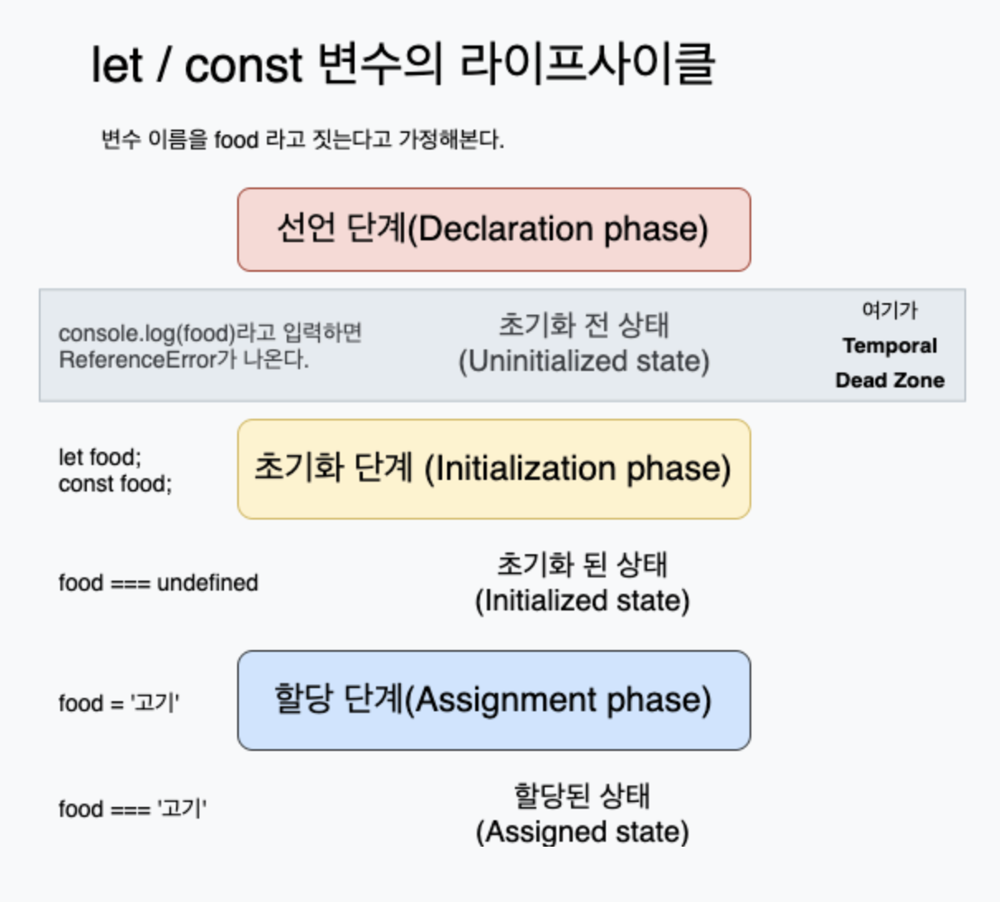
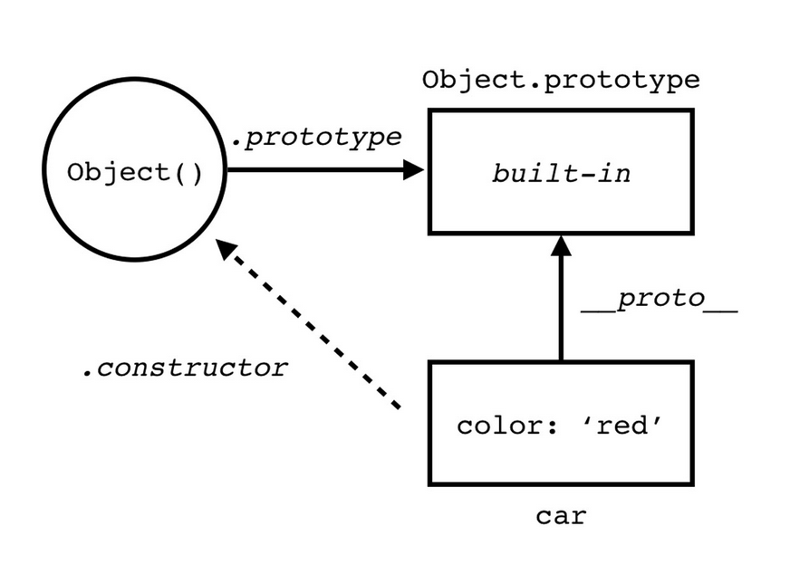

#1장


### 리액트에서의 동등비교

리액트 동등 비교는 `==`나 `===`가 아닌 `Object.is`

```js
function is(x:any, y:any) {
    return(
        (x===y && (x !==0 || 1/x===1/y)) || (x!==x && y!==y)
    )
}

const objectIs:(x:any, y:any) => boolean = typeof Object.is === 'function' ? Object.is : is;

export default objectIs;
```

#### 이를 기반으로 한 shallowEqual 함수 사용 
1. 훅의 의존성 배열 비교
2. 메모이제이션 비교 로직
3. 가상 DOM 비교

```js
// shallowEqual 함수 -> 객체 간 얕은 비교
function shallowEqual(objA:any, objB:any) {
    if(is(objA, objB)) return true;
    if(typeof objA !== 'object' || objA === null || typeof objB !== 'object' || objB === null) return false;

    const keysA = Object.keys(objA);
    const keysB = Object.keys(objB);

    if(keysA.length !== keysB.length) return false;

    for(let i=0; i<keysA.length; i++) {
        if(!hasOwnProperty.call(objB, keysA[i]) || !is(objA[keysA[i]], objB[keysA[i]])) return false;
    }
    return true;
}

export default shallowEqual;
```
> ```shallowEqual```  -> Object.is로 비교 후 Object.is로 비교 안되면 얕은 비교


### 함수

#### 함수 정의 4가지 방법
1. 함수 선언식
```js
function 함수명(매개변수) {
    return 반환값;
}
```
2. 함수 표현식
```js
const 함수명 = function(매개변수) {
    return 반환값;
}
```

#### 호이스팅?

- 함수 호이스팅 -> 함수 선언문이 마치 코드 맨 앞단에 작성된 것 처럼 동작 (표현식은 X)
```js
console.log(표현식함수()); //undefined  //호이스팅 X
console.log(선언식함수()); //1   //호이스팅 때문에 가능
var 표현식함수 = function () {
  return 1;
};

function 선언식함수() {
  return 1;
}
```
- var변수는 호이스팅과정에서 undefined로 초기화가 이루어짐
- let, const는 호이스팅과정에서 초기화 과정이 없어서 참조 에러 발생 ```(TDZ)```

### ❓TDZ❓

- 변수 선언 전에 접근 시 발생하는 에러
- let/const 변수는 선언 전에 접근 시 TDZ에러 발생 (undefined로 초기화되지않고 선언만 된다고 생각하면 편함)
--- 

3. Function 생성자 함수
- 매개변수, 함수 자체를 모두 문자열로 작성 -> 사용 X
```js 
const 함수명 = new Function('매개변수', '반환값');
```
4. 화살표 함수
- constructor 사용 불가
- arguments 사용 불가
- this 바인딩 방식이 다름
    - 화살표 함수 내부에서 this 사용 시 함수 외부의 this 참조 (원래는 함수 자신의 this 참조)
```js
const 함수명 = (매개변수) => 반환값;
```

```jsx
class Component extends React.Component {
    constructor(props) {
        super(props);
        this.state = {
            count: 0
        };
    }

    일반카운트함수(){
        console.log(this); //undefined
        this.setState((prevState) => ({
            count: prevState.count + 1
        }));
    }

    화살표카운트함수 = () => {
        console.log(this); //Component
        this.setState((prevState) => ({
            count: prevState.count + 1
        }));
    }

    render(){
        return <div>
            <p>Count: {this.state.count}</p>
            {/* cannot read properties of undefined (reading 'setState') */}
            <button onClick={this.일반카운트함수}>일반 카운트</button>
            {/* 정상 작동 */}
            <button onClick={this.화살표카운트함수}>화살표 카운트</button>
        </div>
    }
}
```

### 그외 함수들
1. 즉시 실행 함수
- 함수 선언과 동시에 호출
- 다시 호출 불가 (일회성)
```js
(function(){
    return 1;
})();
```

2. 고차 함수
- 함수를 인자로 받거나 함수를 반환하는 함수
```js
function 더하기(a) {
    // a가 존재하는 클로저
    return function(b) {
        b를 인수로 받아서 반환하는 함수 생성
        return a + b;
    }
}
더하기(1)(2); //3
```

### 함수 주의사항
1. 부수효과(Side-Effect) 억제
- 함수 내부에서 외부 상태를 변경하는 것
- 외부 상태를 변경하는 것은 예측 불가능한 결과를 낳을 수 있음
```jsx
// 모범 사례 
function 순수컴포넌트(props){
    const {a,b} = props; 
    return <div>{a+b}</div>
}
```
#### 순수한 함수형 컴포넌트
- 외부 상태에 의존하지 않고 오직 입력값에만 의존하는 컴포넌트
- 외부 상태 변경에 의해 영향을 받지 않는 컴포넌트

#### ❓그러면 UseEffect❓
1. 웹 어플리케이션 개발 과정에서 불가피하게 부수효과 발생
2. useEffect 작동을 최소화, 역할 줄이기 

#### 이해할 수 있는 이름을 붙여라 
```jsx 
// 1번 방법
useEffect(function apiCall(){
    // 외부 상태 변경
}, [])

// 2번 방법
useEffect(()=>{
    // 외부 상태 변경
}, [])


```
1. 함수 선언형태로 useEffect훅을 사용하면 화살표로 했을 때보다 가독성 좋음
2. 함수 선언시 한글로 해도 컴파일 속도 큰차이 X -> 가독성 중시해라 


### 클래스(CLASS)
- 특정한 객체를 만들기 위한 일종의 템플릿 

1. constructor
- 클래스 내부에서 데이터를 초기화하는 역할
- 처음에는 빈객체가 생성되고 constructor에서 초기화 작업 진행
```js
class 사람 {
    constructor(이름,나이) {
        this.name = 이름;
        this.age = 나이;
    }
    나이먹기(){
        this.age++; 
    }
}
```
2. 프로퍼티
- 내부에 정의할 수 있는 속성값
```js
class 사람 {
    name = 이름;
    age = 나이;
}
const 사람1 = new 사람('홍길동', 20);
// '홍길동', 20 -> 프로퍼티
```

3. getter
- 클래스 내부에서 데이터를 조회하는 역할
```js
class 사람 {
    get name() {
        return this.name;
    }
}
```
4. setter
- 클래스 내부에서 데이터를 설정하는 역할
```js
class 사람 {
    set name(이름) {
        this.name = 이름;
    }
}
```

----
### ❓ getter, setter 왜 쓰는가❓

#### get/set 사용 vs 미사용 비교

#### 1. 문법과 사용방식
```js
// get/set 사용
class User {
    #name;
    get name() { return this.#name; }
    set name(value) { this.#name = value; }
}

const user1 = new User();
user1.name = "김철수";   
console.log(user1.name);  

// get/set 미사용
class User {
    #name;
    
    getName() { return this.#name; }
    setName(value) { this.#name = value; }
}
const user2 = new User();
user2.setName("김철수");  
console.log(user2.getName());
````

#### 2. 주요 차이점
1. **문법적 차이**
   - get/set: 프로퍼티처럼 자연스러운 사용
   - 일반 메서드: 함수 호출 형태

2. **용도**
   - get/set: 프로퍼티처럼 보이지만 제어가 필요한 경우
   - 일반 메서드: 명확한 행동이 필요한 경우

3. **유지보수**
   - get/set: 내부 로직 변경이 쉬움
   - 일반 메서드: 변경 시 호출하는 모든 곳 수정 필요

----


#### 인스턴스 메서드
```js
class 사람 {
    constructor(이름,나이){
        this.name = 이름;
        this.age = 나이;
    }
    나이먹기(){
        this.age++;
        console.log(this.age);
    }
}
const 사람1 = new 사람('홍길동', 20);
사람1.나이먹기();  // 
```
- ```사람1.나이먹기();```이렇게 접근할 수 있는 이유는 ```prototype```에 선언되어있기 때문
```js
Object.getPrototypeOf(사람1) // {constructor:ƒ, 나이먹기: ƒ}
``` 

```js
Object.getPrototypeOf(사람1) === 사람.prototype // true
사람1.__proto__ === 사람.prototype // true  -> 가급적 사용 X
```
#### 이렇게 객체에서 선언하지 않았음에도 프로토타입에 있는 메서드를 찾아서 실행을 도와주는 것을 바로 ```프로토타입 체이닝```이라고 함

---

### ❓프로토타입 체이닝❓
- 객체의 프로토타입 체인을 따라 메서드를 찾아가는 과정



----

### 정적 메서드
- 클래스 자체에 속한 메서드
- 인스턴스 생성 없이 호출 가능
```js
class 사람 {
    static 나이먹기(){
        this.age++;
    }
}
const 철수 = new 사람();
철수.나이먹기(); // 에러
사람.나이먹기(); // 정상 작동
```
- 정적 메서드는 인스턴스 메서드와 달리 클래스 자체에 속한 메서드이기 때문에 인스턴스를 통해 호출할 수 없음

#### 이 때문에 getDerivedStateFromProps 메서드를 통해서 this.state에 접근이 불가능하다 


#### 상속
- 부모 클래스의 프로퍼티와 메서드를 자식 클래스에 상속하는 것
```jsx
class 사람 {
    constructor(이름,나이){
        this.name = 이름;
        this.age = 나이;
    }
    나이먹기(){
        this.age++;
    }
}

class 학생 extends 사람 {
    constructor(이름,나이,학교){
        super(이름,나이);  // 부모 클래스의 생성자 호출
        this.school = 학교;
    }
}

const 철수 = new 학생('홍길동', 20, '서울대학교');
철수.나이먹기(); // 21 //학생 클래스에는 정의하지 않은 메서드이지만 부모 클래스에 있기 때문에 정상 작동
```

----

### 클로저(Closure)
- 함수와 함수가 선언된 어휘적 환경의 조합

----
#### ❓어휘적 환경(Lexical Environment)❓
- 함수 내부에서 참조할 수 있는 변수들과 그들의 값을 포함 
- 코드가 작성된 위치에 따라 변수의 유효범위가 정적으로 결정됨 (동적 X) 
```js
function 함수(){
    const a = 1;
    function 내부함수(){
        const b = 2;
        console.log(a+b);
    }
    내부함수(); //3
}
함수() // 3
```
1. a변수의 유효범위는 함수 전체
2. b변수의 유효범위는 내부함수
----

### 스코프 
#### 1. 전역 스코프 
- 전역 변수의 유효범위
- 전역 변수는 어디서든 접근 가능
- 브라우저는 window 객체로 전역 스코프 제공 , 노드는 global 객체로 전역 스코프 제공

#### 2.함수 스코프
- JavaScript는 함수 레벨 스코프를 따름 
- 단순 `{}`로 영역 구분 X 
```js

if(true){
    var a = 1;
}
console.log(a); // 1  -> 함수 스코프라 가능

function 함수(){
    var a = 1;
}
console.log(a); // 에러 -> 함수 스코프라 불가능
```


### 클로저 활용
- 전역 스코프는 어디서든 값에 접근하고 수정될 위험이 있음
- 클로저를 통해 전역 스코프의 변수를 참조하는 것을 제한할 수 있음

#### 리액트에서의 클로저  (useState)
```js
function Components(){
    const [count, setCount] = useState(0);
    function 카운트증가(){
        setCount(count + 1);
    }
}
```
####  ❓useState함수는 첫줄에서 호출된 후 종료되었는데, 왜 카운트 변수에 접근할 수 있는가?
-> 클로저가 useState내부에서 카운트 변수를 참조하고 있기 때문

- 클로저는 성능에 영향을 미칠 수 있음
- 꼭 필요한 경우가 아니라면 클로저 사용 지양 -> 메모리 낭비


### 이벤트 루프와 비동기 통신의 이해 

#### 비동기란 ? 
- 비동기 작업은 현재 실행중인 작업이 완료되지 않아도 다음 작업을 수행할 수 있음 ( 병렬 )
- 자바스크립트는 싱글스레드 언어이기 때문에 동시에 여러 작업을 수행할 수 없지만, 이벤트 루프를 통해 비동기 작업을 수행할 수 있음

#### 자바스크립트가 싱글스레드인 이유
- 멀티스레드 프로그래밍은 동시에 여러 작업을 수행할 수 있음
- 하지만 멀티스레드 프로그래밍은 동시에 여러 작업을 수행할 수 있기 때문에 문제가 발생할 수 있음 ( 동시성 문제 )
- 순차적으로 실행된다는 것에 집중 

#### 사용법
```js
console.log('1');
setTimeout(() => {
    console.log('2');
}, 10);
console.log('3');
// 1 3 2
```
### Event Loop란 ? 


#### 콜스택과 이벤트 큐
- 콜스택 : 함수 호출 순서를 저장하는 자료구조
- 이벤트 큐 : 비동기 작업이 완료된 후 실행할 콜백 함수들을 저장하는 자료구조

####  작동방식
1. 콜 스택이 비어있는지 확인
2. 비어있다면 이벤트 큐에서 콜백 함수를 하나씩 꺼내서 콜 스택에 넣음
3. 콜 스택에 있는 함수를 실행
4. 콜 스택이 비어있을 때까지 반복

```js
function bar(){
    console.log('bar');
}
function baz(){
    console.log('baz');
}
function foo(){
    console.log('foo');
    bar();
    baz();
}
foo();
```
1. foo() 호출 -> 콜 스택에 foo 추가
2. console.log('foo') 실행
3. bar() 호출 -> 콜 스택에 bar 추가
4. console.log('bar') 실행
5. bar 함수 종료 -> 콜 스택에서 bar 제거
6. baz() 호출 -> 콜 스택에 baz 추가
7. console.log('baz') 실행
8. baz 함수 종료 -> 콜 스택에서 baz 제거
9. foo 함수 종료 -> 콜 스택에서 foo 제거

---

### 태스크 큐 & 마이크로태스크 큐
- 태스크 큐 : 일반적인 비동기 작업이 완료된 후 실행할 콜백 함수들을 저장하는 자료구조
- 마이크로태스크 큐 : Promise의 콜백 함수들을 저장하는 자료구조

#### 마이크로태스크 큐 가 항상 태스크 큐보다 먼저 실행됨
-> Promise의 콜백 함수들이 먼저 실행됨

| 태스크 큐 | 마이크로태스크 큐 |
|----------|-----------------|
| setTimeout | Promise |
| setInterval | process.nextTick |
| setImmediate | queueMicrotask |
| requestAnimationFrame | MutationObserver |
| UI 렌더링 | IntersectionObserver |

#### 명백하게 말하자면 UI 렌더링은 마이크로 태스크 큐와 태스크 큐의 사이에서 일어나게 된다. 


### 리액트 JS문법
1. 구조 분해 할당 
```jsx
const arr = [1,2,3,4,5]
const [first, second, ...rest] = arr;
console.log(first, second, rest); // 1 2 [3, 4, 5]
```

```jsx
function SampleComponent({a,b,c}){
    return <div>{a+b+c}</div>
}
```
2. 객체의 전개 구문
```jsx
const obj = {a:1, b:2, c:3};
const newObj = {...obj, d:4};
console.log(newObj); // {a:1, b:2, c:3, d:4}
```

### Array프로토타입 메서드 
1. map
    ```js
    const arr = [1,2,3,4,5];
    const Elements = arr.map((item) => <li>{item}</li>);
    ```
2. filter
```js
const arr=[1,2,3,4,5];
const evenNumbers = arr.filter((item) => item % 2 === 0);
console.log(evenNumbers); // [2, 4]
```
3. reduce
```js
const arr = [1,2,3,4,5];
const sum = arr.reduce((acc, curr) => acc + curr, 0);
console.log(sum); // 15
```
4. forEach
// map과 비슷하지만 반환값이 없음 => 변수할당 불가 
```js
const arr = [1,2,3,4,5];
arr.forEach((item) => console.log(item));
```

---

### 삼항조건 연산자
```js
const isEven = (num % 2 === 0) ? '짝수' : '홀수';
function Component({condition}){
    return <div>{condition ? '참' : '거짓'}</div>
}
```


----

## TypeScript
- 자바스크립트의 슈퍼셋 언어  -> IDE 느낌 
- 일일히 타입 지정 필요 X 

### 리액트 개발을 위한 타입스크립트 활용 TIP 
1. any대신에 unknown 사용 
```ts
function 함수(callback: unknown){
    callback(); // callback is of type 'unknown'
}
```

```ts
function 함수(callback:unknown){
    if(typeof callback === 'function'){
        callback();
    }
    throw new Error('callback is not a function');
}
```
2. never 사용 
- 함수에서 절대 발생하지 않는 값을 반환할 때 사용 
```ts
type Props = Record<string, never>;
type state = {
    counter : 0
}

```
 
3. Type가드 적극 활용
 - instanceof와 typeof 연산자 활용 

 ```ts
 class UnAuthorizedError extends Error{
    constructor(){
        super()
    }

    get message(){
        return '인증되지 않은 사용자입니다.'
    }
 }

class UnExpectedError extends Error{
    constructor(){
        super()
    }
    get message(){
        return '예상하지 못한 에러입니다.'
    }
}

async function fetchData(){
    try{
        const response = await fetch('https://api.example.com/data');
    }catch(error){
        if(error instanceof UnAuthorizedError){
            console.log(error.message);
        }else if(error instanceof UnExpectedError){
            console.log(error.message);
        }
    }
}
 ```

4. 제네릭(generic) 타입 활용 
- 다양한 타입에 대응할 수 있도록 도와주는 도구 
- 입력값과 반환값의 타입이 동일할 때 추천
- T , U 로 쓰지말고 직관성있는 네이밍을 활용하도록하자 
```ts
function 함수<T>(value: T): T{
    return value;
}
```

5. 인덱스 시그니처
- 객체의 키와 값의 타입을 지정할 때 사용 
```ts
type 객체 = {
    [key: string]: number;
}

const obj: 객체 = {
    a: 1,
    b: 2,
}
obj['a'] // number
obj['c'] // undefined  -> 에러가 아니라 undefined 반환 -> Record로 해결
```

#### Record 
- 객체의 키와 값의 타입을 지정할 때 사용 
```ts
type 객체 = Record<string,string>;
const obj: 객체 = {
    a: '1',
    b: '2',
}
obj['a'] // string
obj['c'] // Error // 컴파일 에러: Property 'c' does not exist on type '객체'
```


```ts
Object.keys(hello).map((key) => hello[key])
```
#### ERROR 이유
- Object.keys(hello)는 string[] 타입을 반환하고, 
- hello[key]에 해당하는 key가 없을 수 있기 때문 이럴때는 
```ts
// 1번
Object.keys(hello).map((key) => hello[key as keyof typeof hello]) 이런식으로 타입을 단언해주면 해결
// 2번 
function keysOf<T extends object>(obj: T): Array<keyof T>{
    return Array.from(Object.keys(obj)) as Array<keyof T>;
}
```

### 정리
- Typescript의 핵심 원칙은 타입 체크를 할 때 그 값이 가진 형태에 집중한 다는 것


