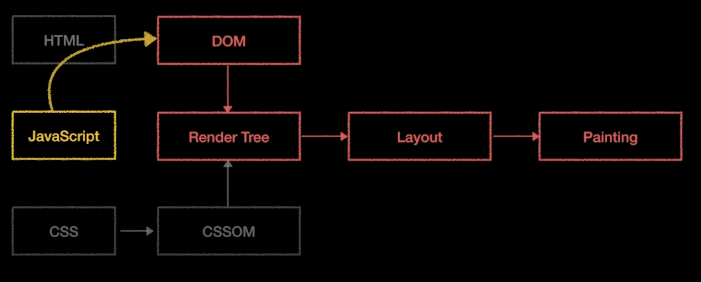
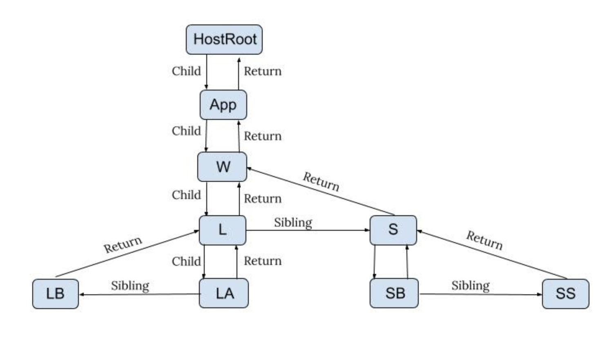

### JSX란?

- 리액트 컴포넌트를 정의하는 문법
- 공식 자바스크립트가 아니므로 v8 엔진에서 인식 못함
- 트랜스파일러를 거쳐야 자바스크립트 코드로 변환이 된다.

#### 결론
- JSX는 표현하기 까다로웠던 XML 스타일의 트리 구문을 작성하는데 편리한 문법

### JSX 종류
1. JSXElement
    - 엘리먼트 타입, 속성, 자식 요소로 구성
    ```<JSXElement />
2. JSXAttribute
    - 속성 이름과 값으로 구성
    ```<Child attribute="value" />```
3. JSXChildren
    - 자식 요소로 구성
    ```<Parent><Child /></Parent>```
4. JSXStrings
    - 문자열 값으로 구성
    ```<div>{string}</div>```

### JSX는 어떻게 반환이 될까?
- @babel/plugin-transform-react-jsx 플러그인을 통해 JSX를 자바스크립트로 변환
- 플러그인 설정 시 반환 함수를 지정할 수 있음
    - 기본 반환 함수: React.createElement
    - 사용자 지정 반환 함수: 사용자 지정 함수를 사용하여 JSX를 처리
- JSXElement를 첫번째 인수로 선언해 요소를 정의
- 옵셔널인 JSXChildren, JSXAttributes,JSXStrings는 이후 인수로 넘겨주어 처리

#### 활용
```jsx
function TextOrHeading({
    isHeading,
    children
}) {
    return isHeading ? <h1>{children}</h1> : <p>{children}</p>
}


// JSX반환되는 특성을 활용해 조건부 렌더링 가능
import {createElement} from 'react'

function TextOrHeading({
    isHeading,
    children
}) {
    return createElement(isHeading ? 'h1' : 'p', null, children)
}
```

### 가상 DOM과 리액트 화이버

#### DOM과 브라우저 렌더링 과정 
1. 브라우저가 사용자가 요청한 주소를 방문해 HTML 파일을 다운로드
2. 브라우저의 렌더링 엔진은 HTML 파일을 파싱하고 DOM 트리를 생성
3. 렌더링 엔진은 각 요소의 스타일 정보를 읽어 CSSOM 트리를 생성
4. DOM노드를 순회하며 각 노드의 스타일 정보를 읽어 렌더 트리를 생성
5. 눈에 보이는 노드를 대상으로 해당 노드에 대한 CSSOM 정보를 찾고 여기서 발견한 CSS 스타일 정보를 이 노드에 적용한다. 이 DOM 노드에 CSS를 적용하는 과정은 크게 두 단계로 나뉜다.
    - 레이아웃 단계: 렌더 트리를 순회하며 각 노드의 레이아웃 정보를 계산
    - 페인트 단계: 레이아웃 단계를 거친 노드에 색과 같은 실체 유효한 모습을 그리는 과정 



#### 가상 DOM 탄생 배경
- 브라우저 렌더링 과정에서 레이아웃 단계와 페인트 단계는 매우 비용이 높은 작업
- 브라우저 성능에 많은 영향을 미침
- 중간의 과정이 아니라 완성된 DOM의 결과가 필요하기 때문에 가상 DOM이 탄생
----
#### 브라우저 성능 저하 예시
```html
<script>
function onClick() {
const $ul = document.getElementById("ul");
for (let i = 0; i < 3000; i++) {
$ul.innerHTML += <li>${i}</li>;
}
}
</script>
<body>
<button onClick="onClick()">리스트 추가하기</button>
<ul id="ul"></ul>
</body>
```
- 버튼을 클릭할 때마다 3000개의 요소를 추가하는 코드
----

### REACT-FIBER
- 자바스크립트 객체
- 가상 DOM과 실제 DOM을 비교해 변경사항을 수집하며, 이를 통해 최소한의 변경사항만 실제 DOM에 반영(Reconciliation)
1. 작업을 작은 단위로 분할하고 쪼개진 작업들을 우선순위에 따라 실행
2. 이러한 작업을 일시 중단하고 다시 시작할 수 있도록 스케줄링
3. 이전에 했던 작업을 다시 재사용하거나 필요하지 않은 경우에는 폐기할 수 있다.
4. 모든 과정이 비동기로 이루어진다. 

#### 작동방식
1. 렌더 단계에서 리액트는 사용자에게 노출되지 않는 모든 비동기 작업을 수행한다. 그리고 이 단계에서 앞서 언급한 파이버노드의 작업, 우선순위를 지정하거나 중지시키거나 버리는 등의 작업이 일어난다.
2. 커밋단계에서는 앞서 언급한 것처럼 DOM에 실제 변경 사항을 반영하기 위한 작업, commitWork()가 실행되는데, 이 과정은 앞서와 다르게 동기식으로 일어나고 중단될 수 없다.

#### 특징
- 리액트 요소는 렌더링이 발생될때마다 새롭게 생성되지만 , 파이버는 가급적 재사용

#### Fiber 트리
1. 파이버트리
2. workInProgress 트리
- 구조: 
    - Fiber 노드들이 트리 형태로 연결된 구조
- current 트리: 현재 화면에 렌더링된 트리
- workInProgress 트리: 작업 중인 트리
- 동작 방식:
    - 변경사항이 발생하면 workInProgress 트리 생성
    - 비동기적으로 변경 작업 수행
    - 작업 완료 후 current ↔ workInProgress 교체
- 장점:
    - 작업 중단/재개 가능
    - 우선순위 기반 작업 처리
    - 효율적인 메모리 사용 (노드 재활용)

#### 파이버의 작업 순서
1. 리액트는 beginWork() 함수를 호출해 파이버 노드의 작업을 시작
2. 작업이 끝나면 completeWork() 함수를 호출해 파이버 노드의 작업을 완료
3. 형제가 있다면 형제로 넘어간다.
4. return으로 돌아가 자신의 작업이 완료되었다는 것을 알림



#### FIBER와 가상 DOM
- 가상 DOM은 파이버 노드의 작업 트리를 기반으로 생성되는 가상의 DOM 트리
- 리액트 컴포넌트에 대한 정보를 1대1로 가지고 있는 것이 파이버
- 리액트 라키텍쳐 내부에서 비동기로 이루어짐  -> 반면 실제 DOM에 반영하는 것은 동기적

### 클래스형 컴포넌트와 함수형 컴포넌트 

1. 클래스형 컴포넌트
 - 생명주기
 1. mount: 컴포넌트가 최초로 렌더링될 때
 2. update: 컴포넌트가 리렌더링될 때
 3. unmount: 컴포넌트가 제거될 때

 #### render 
 - 클래스형 컴포넌트 유일한 필수값
 - UI렌더링에 사용 
 - 순수컴포넌트(부수효과 X)

 #### componentDidMount
 - 컴포넌트가 마운트된 이후 실행
 - this.state 초기화 가능
 - 성능문제가 일어날 수 있으니 api호출 후 업데이트, DOM에 의존적인 작업 등을 하기 위해서만 사용 

 #### componentDidUpdate
- 컴포넌트 업데이트가 일어난 이후 실행
- state나 props가 변경된 경우 실행

#### componentWillUnmount
- 컴포넌트가 언마운트될 때 실행
- 컴포넌트가 제거되기 전 정리 작업 수행 (api 호출 취소)

#### shouldComponentUpdate
- 컴포넌트가 리렌더링 되어야 할지 결정
- 기본적으로 true 반환
- 조건에 따라 리렌더링 방지 가능

#### static getDerivedStateFromProps
- 컴포넌트가 마운트될 때와 업데이트될 때 호출
- 컴포넌트의 state를 props로 업데이트 가능

#### getSnapshotBeforeUpdate
- 컴포넌트가 리렌더링되기 전 호출 ( componentWillUpdate 대체 )
- 업데이트 전 상태를 가져올 수 있음

#### getDerivedStateFromError
- 컴포넌트에서 에러가 발생했을 때 호출
- 에러 처리 로직 구현 가능

#### componentDidCatch
- 자식 컴포넌트에서 발생한 에러를 처리
- error,info 인수 받음 (info => 어떤 컴포넌트에서 발생했는지 알려줌)

### 클래스형 컴포넌트의 한계
1. 데이터 흐름 추적이 어렵다.
2. 코드 재사용성이 떨어진다.
3. 기능이 많아질수록 컴포넌트의 크기가 커진다. 
4. 함수에 비해 상대적으로 어렵다
5. 핫 리로딩 속도가 느리다.


### 함수형 컴포넌트
1. this 바인딩 문제 해결
2. 데이터 흐름 추적이 쉽다.
3. 코드 재사용성이 높다.
4. 함수에 비해 상대적으로 쉽다.
5. 핫 리로딩 속도가 빠르다.


