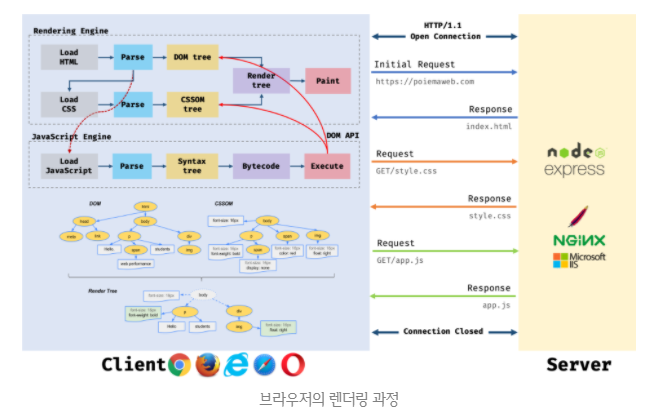

## 02. 리액트 핵심요소 깊게 살펴보기

### JSX란?

- JSX는 자바스크립트 내부에서 표현하기 까다로웠던 XML 스타일의 트리구문을 작성하는데 많은 도움을 주는 새로운 문법이라고 볼 수 있다.
- JSX는 자바스크립트 표준코드가 아닌 페이스북이 임의로 만든 새로운 문법이기 때문에 JSX는 반드시 트랜스파일러를 거쳐야 비로소 자바스크립트 런타임이 이해할 수 있는 의미 있는 자바스크립트 코드로 변환된다.
- 리액트에서 컴포넌트르 만들어 사용할 때에는 반드시 대문자로 시작하는 컴포넌트를 만들어야만 사용가능하다. 이는 JSXElement에 명시돼 있는 표준에 없는 내용인데, 그 이유는 리액트에서 HTML 태그명과 사용자가 만든 컴포넌트 태그명을 구분 짓기 위해서이다.

### JSX는 어떻게 자바스크립트에서 변환될까?

```jsx
const ComponentA = <A required={true}>Hello World</A>;
const ComponentB = <>Hello World</>;
const ComponentC = (
  <div>
    <span>Hello World</span>
  </div>
);
```

```javascript
// JSX 코드를 @babel/plugin-transform-react-jsx로 변환한 결과
'use strict';

var ComponentA = React.createElement(A, { required: true }, 'Hello World');
var ComponentB = React.createElement(React.Fragement, null, 'Hello World');
var ComponentC = React.createElement(
  'div',
  null,
  React.createElement('span', null, 'Hello World')
);
```

**React.createElement**

- 리액트에서 JSX를 사용하지 않고, 컴포넌트를 생성할 때 사용하는 함수이다.
- 이함수는 컴포넌트 타입, 속성, 자식 요소를 받아 리액트 요소를 직접 생성한다.
- JSX를 자바스크립트로 변환한 결과와 거의 동일하므로, JSX가 없는 환경에서 유용하게 활용할 수 있다.

```jsx
// 기본 사용법
React.createElement(
  type, // 필수: 태그 또는 컴포넌트의 타입
  props, // 선택: 태그에 설정할 속성객체
  ...children // 선택: 자식 요소들
);
```

```javascript
function MyComponent(props) {
  return React.createElement('h2', null, `Hello, ${props.name}`);
}

// React가 호출할 때, 자동으로 props({ name: 'Alice' }) 전달
const element = React.createElement(MyComponent, { name: 'Alice' });
```

```jsx
<MyComponent name="Alice" />
```

### 가상 DOM과 리액트 파이버

**DOM과 브라우저 렌더링 과정**

- `DOM(Document Object Model)`: DOM은 웹페이지에 대한 인터페이스로 브라우저가 웹페이지의 콘텐츠와 구조를 어떻게 보여줄지에 대한 정보를 담고있다.
- 브라우저 렌더링 엔진은 HTML 문서를 파싱하여 브라우저가 이해할 수 있는 자료구조인 DOM을 생성한다.
- DOM은 HTML 문서의 계층적 구조와 정보를 표현하며, 이를 제어할 수 있는 API, 즉 프로퍼티와 메서드를 제공하는 트리 자료구조이다.

- `랜더링(rendering)`은 HTML, CSS, JS로 작성된 문서를 파싱하여 `브라우저에 시각적으로 출력하는 것`을 말한다.



1. 브라우저는 HTML, CSS, JS, 이미지, 폰트파일 등 렌더링에 필요한 리소스를 요청하고 서버로부터 응답을 받는다.
2. 브라우저의 렌더링 엔진은 서버로부터 응답된 HTML, CSS를 파싱하여 DOM, CSSOM을 생성하고 이들을 결합하여 렌더 트리를 생성한다.
3. 브라우저 랜더링 엔진은 서버로부터 응답된 JS를 파싱하여 AST(Abstract Syntax Tree)를 생성하고 바이트 코드로 변환하여 실행한다. 이때 JS는 DOM API를 통해 DOM이나 CSSOM을 변경할 수 있다. 변경된 DOM과 CSSOM은 다시 렌더트리로 결합된다.
4. 렌더 트리를 기반으로 HTML 요소의 레이아웃(위치와 크기)을 계산하고 브라우저 화면에 HTML 요소를 페인팅한다.

**가상 DOM의 탄생배경**

렌더링 이후 추가 렌더링 작업은 하나의 페이지에서 모든 작업이 일어나는 SPA(Single Page Application)에서 더욱 많아진다. 페이지가 변경되는 경우 다른 페이지로 가서 새로 받아서 다시 렌더링 과정을 시작하는 일반적인 웹페이지와는 다르게 하나의 페이지에서 계속해서 요소의 위치를 재계산하게 된다. 물론 SPA의 특징 덕분에 사용자는 페이지의 깜빡임 없이 자연스러운 웹페이지 탐색을 할 수 있지만 그만큼 DOM을 관리하는 과정에서 부담해야 할 비용이 커진다.

사용자의 인터렉션에 따라 DOM의 모든 변경사항을 추적하는 것은 개발자 입장에서 너무나 수고스러운 일이다. 그리고 대부분의 경우에 개발자는 인터렉션에 모든 DOM의 변경보다는 결과적으로 만들어지는 DOM 결과물 하나만 알고 싶을 것이다.

이러한 문제점을 해결하기 위해 탄생한 것이 바로 `가상 DOM`이다.

`가상 DOM`은 말 그대로 실제 브라우저의 DOM이 아닌 리액트가 관리하는 가상의 DOM을 의미한다. 가상 DOM은 웹 페이지가 표시해야 할 DOM을 일단 메모리에 저장하고 리액트가 실제 변경에 대한 준비가 완료됐을 때 실제 브라우저의 DOM에 반영한다.

이렇게 DOM 계산을 브라우저가 아닌 메모리에서 계산하는 과정을 한 번 거치게 된다면 실제로는 여러 번 발생했을 렌더링 과정을 최소화할 수 있고 브라우저와 개발자의 부담을 덜 수 있다.

### 가상 DOM을 위한 아키텍처, 리액트 파이버

리액트는 여러 번의 렌더링 과정을 압축해 어떻게 최소한의 렌더링 단위를 만들어 내는 것일까? 이러한 가상 DOM과 렌더링 과정 최적화를 가능하게 해주는 것이 바로 `리액트 파이버(React Fiber)`이다.

**리액트 파이버(React Fiber)**

- 리액트에서 관리한는 평범한 자바스크립트 객체이다.
- 파이버는 파이버 재조정자(fiber reconciler)가 관리하는데, 이는 가상 DOM과 실제 DOM을 비교해 변경 사항을 수집하며, 만약 이 둘 사이에 차이가 있으면 변경에 관련된 정보를 가지고 있는 파이버를 기준으로 화면에 렌더링을 요청하는 역할을 한다.
- `재조정(Reconcilation)`은 리액트에서 어떤 부분을 새롭게 렌더링해야 하는지 가상 DOM과 실제 DOM을 비교하는 작업(알고리즘)이다.

**리액트 파이버의 목표**

- 작업을 작은 단위로 분할하고 쪼갠 다음, 우선순위를 매긴다.
- 이러한 작업을 일시 중지하고 나중에 다시 시작할 수 있다.
- 이전에 했던 작업을 다시 재사용하거나 필요하지 않은 경우에는 폐기할 수 있다.

- 위 같은 모든 과정은 모두 `비동기`로 일어난다.
- 파이버는 리액트 요소와 유사하다고 느낄 수 있지만, 한가지 중요한 차이점은 리액트 요소는 렌더링이 발생할 때마다 새롭게 생성되지만 파이버는 가급적이면 `재사용`된다는 사실이다. 파이버는 컴포넌트가 최초로 마운트되는 시점에 생성되어 이후에는 가급적이면 재사용된다.

**파이버를 생성하는 다양한 함수의 주요 속성**

- `tag`: 파이버는 하나의 element에 하나가 생성되는 1:1 관계를 가지고 있다. 여기서 1:1로 매칭된 정보를 가지고 있는 것이 바로 tag이다. 1:1로 연결되는 것은 리액트 컴포넌트, HTML의 DOM 노드 등이 될 수 있다.
- `stateNode`: 이 속성에서는 파이버 자체에 대한 참조(reference) 정보를 가지고 있으며, 이 참조를 바탕으로 리액트는 파이버와 관련된 상태에 접근한다.
- `child, sibling, return`: 파어버 간의 관계를 나타내는 속성이다. 리액트 컴포넌트 트리가 형성되는 것과 동일하게 파이버도 트리 형식을 갖게 되는데, 이 트리 형식을 구성하는데 필요한 정보가 이 속성 내부에 정의된다.

이렇게 생성된 파이버는 state가 변경되거나 생명주기 메서드 실행되거나 DOM의 변경이 필요한 시점 등에 실행된다. `그리고 중요한 것은 리액트 파이버를 처리할 때마다 이러한 작업을 바로 처리하기도 하고 스케줄링하기도 한다는 것이다.` 즉, 이러한 작업들은 작은 작업단위로 나눠서 처리할 수도, 애니메이션과 같이 우선순위가 높은작업은 가능한 한 빠르게 처리하거나, 낮은 작업을 연기시키는 등 좀 더 유연하게 처리된다.

파이버의 객체 값에서도 알 수 있듯이 `리액트의 핵심원칙은 UI를 문자열, 숫자, 배열과 같은 값으로 관리한다는 것이다.` 변수의 이러한 UI 관련 값을 보관하고, 리액트의 자바스크립트 코드 흐름에 따라 이를 관리하고, 표현하는 것이 리액트이다.

**리액트 파이버 트리**

- 파이버 트리는 사실 리액트 내부에서 두 개가 존재한다.
- 하나는 `현재 모습을 담은 파이버 트리`, 다른 하나는 `작업 중인 상태를 나타내는 workInProgress 트리`이다.
- 리액트 파이버 작업이 끝나면 리액트 단순히 포인터만 변경해 workInProgress 트리를 현재트리로 바꿔버린다.
- 이러한 기술을 `더블 버퍼링`이라고 한다.

**setState와 같은 업데이트가 발생하면 어떻게 될까?**

리액트는 앞서 만든 current 트리가 존재하고, setState로 인한 업데이트 요청을 받아 workInProgress 트리를 다시 빌드하기 시작한다. 최초 렌더링 시에는 모든 파이버를 새롭게 만들어야 했지만, 이제는 파이버가 이미 존재하므로 되도록 새로 생성하지 않고 기존 파이버에서 업데이트된 props를 받아 파이버 내부에서 처리한다.

**파이버와 가상 DOM**

실제 브라우저 구조인 DOM에 반영되는 것은 동기적으로 일어나야 하고, 또 처리하는 작업이 많아 화면에 불완전하게 표시될 수 있는 가능성이 높으므로 이러한 작업을 가상에서, 즉 메모리상에서 먼저 수행해서 최종적인 결과물만 실제 브라우저 DOM에 적용하는 것이다.

가상 DOM과 파이버는 단순히 브라우저에 DOM을 변경하는 작업보다 빠르다는 이유만으로 만들어진 것은 아니다.

만약 이러한 도움없이 개발자가 직접 DOM을 수동으로 하나하나 변경해야 한다면 어떤 값이 바뀌었는지, 또 그 값에 따라 어떠한 값이 변경됐고 이와 관련된 것들이 무엇이었는지 파악하기가 매우 어려울 것이다.

이러한 어려움을 리액트 내부의 파이버와 재조정자가 내부적인 알고리즘을 통해 관리해 줌으로써 대규모 웹 어플리케이션을 효율적으로 유지보수하고 관리할 수 있게 된 것이다.

`가상 DOM과 리액트의 핵심은` 브라우저의 DOM을 더욱 빠르게 반영하는 것이 아니라 바로 `값으로 UI를 표현하는 것이다.`

화면에 표시되는 UI를 자바스크립트의 문자열, 배열 등과 마찬가지로 값으로 관리하고 이러한 흐름을 효율적으로 관리하기 위한 메커니즘이 바로 리액트의 핵심이다.

### 클래스 컴포넌트와 함수 컴포넌트

**클래스 컴포넌트의 생명주기 메서드**

- **render()**

  render() 또한 생명주기 메서드 중 하나로, 리액트 클래스 컴포넌트의 유일한 필수값으로 항상 쓰인다. 이 함수는 컴포넌트가 UI를 렌더링하기 위해서 쓰인다. 이 렌더링은 `마운트`와 `업데이트` 과정에서 일어난다.

  한 가지 주의할 것은 render() 함수는 항상 순수해야 하며 부수 효과가 없아야 한다는 것이다.(no-side effects) 즉, 같은 입력값(props 또는 state)이 들어가면 항상 같은 결과물을 반환해야 한다는 뜻이다.
  따라서 render() 내부에서 state를 직접 업데이트하는 this.setState를 호출해서는 안된다. state를 변경하는 일은 컴포넌트 클래스의 메서드나 다른 생명주기 메서드 내부에서 발생해야 한다.

- **componentDidMount**

  컴포넌트 업데이트가 일어난 이후 바로 실행된다. 일반적으로 state나 props의 변화에 따라 DOM을 업데이트하는 등에 쓰인다.

- **componentWillUnmount**

  컴포넌트가 언마운트되거나 더 이상 사용하지 않기 직전에 호출된다. 메모리 누수나 불필요한 작동을 막기 위한 클린업 함수를 호출하기 위한 최적의 위치이다.

- **shouldComponentUpdate**

  state나 props의 변경으로 컴포넌트가 다시 리렌더링되는 것을 막고 싶다면 이 생명주기 메서드를 사용하면 된다.

**React.Component와 React.PureComponent의 차이점**

이 둘의 차이점은 `shouldComponentUpdate`를 다루는데 차이가 있다.
PureComponent는 state 값에 대해 얕은비교를 수행해 결과가 다를 때만 렌더링을 수행한다. 따라서 state가 객체와 같이 복잡한 구조의 데이터 변경은 감지하기 못하기 때문에 제대로 작동하지 못한다.

만약 대다수의 컴포넌트가 PureComponent로 구성돼 있다면 오히려 성능에 역효과를 미칠 수도 있다. 만약 컴포넌트가 얕은비교를 했을 때 일치하지 않는 일이 더 잦다면 당연히 이러한 비교는 무의미하기 때문이다.

- **static getDerivedStateFromProps**

  render()를 호출하기 직전에 호출된다. static으로 선언되어 있어 this에 접근할 수 없다. 여기서 반환하는 객체는 해당 객체의 내용이 모두 state로 들어가게 된다. 이에 반해 null을 반환하면 아무런 일도 일어나지 않는다.

- **getSnapShotBeforeUpdate**

  componentWillUpdate를 대체할 수 있는 메서드이다. 이 메서드는 DOM이 업데이트되기 직전에 호출된다. 여기서 반환되는 값은 componentDidUpdate로 전달된다. DOM에 랜더링되기 전에 윈도우 크기를 조절하거나 스크롤 위치를 조정하는 등의 작업을 처리하는데 유용하다.

- **getDerivedStateFromError**

  이 메서드와 componentDidCatch 메서드는 정상적인 생명주기에서 실행되는 메서드가 아니라 에러상황에서 실행되는 메서드이다. 또한 이 두 메서드와 getSnapShotBeforeUpdate는 아직 리액트 훅으로 구현되어 있지 않기 때문에 이 3가지 메서드가 필요한 경우가 있다면 반드시 클래스 컴포넌트를 사용해야 한다.

- **componentDidCatch**

  자식 컴포넌트에서 에러가 발생했을 때 실행되며, getDerivedStateFromError에서 에러를 잡고 state를 결정한 이후에 실행된다. componentDidCatch는 두 개의 인수를 받는데, 첫 번째는 getDerivedStateFromError와 동일한 error, 그리고 정확히 어떤 컴포넌트가 에러를 발생시켰는지 정보를 가지고 있는 info이다.

**클래스 컴포넌트의 한계**

1. 데이터 흐름을 추적하기 어렵다.
   state의 흐름을 추적하기 어렵다. 서로 다른 생명주기 메서드에서 state의 업데이트가 일어날 수 있으며, 코드 작성 시 생명주기 메서드의 순서가 강제되어 있는 것이 아니기 때문에 읽기가 매우 어렵다.

2. 애플리케이션 내부 로직의 재사용이 어렵다.
   애플리케이션이 커질수록 재사용할 로직도 많아지는데, 컴포넌트를 또 다른 고차 컴포넌트로 감싸거나 props로 넘겨주는 방식이 있을 것이다. 그러나 공통 로직이 많아질수록 이를 감싸는 고차 컴포넌트 내지는 props가 많아지는 래퍼 지옥(wrapper hell)에 빠져들 위험성이 커진다. 따라서 이를 클래스 컴포넌트 환경에서 매끄럽게 처리하기란 쉽지않다.

3. 기능이 많아질수록 컴포넌트의 크기가 커진다.
   컴포넌트 내부에서 로직이 많아질수록, 또 내부에서 처리하는 데이터 흐름이 복잡해져 생명주기 메서드 사용이 잦아지는 경우 컴포넌트 크기가 기하급수적으로 커지는 문제가 발생한다.

4. 클래스는 함수에 비해 상대적으로 어렵다.
5. 코드 크기를 최적화하기 어렵다.
   클래스 컴포넌트는 최종 결과물인 번들 크기를 줄이는 데도 어려움을 겪는다.
6. 핫 리로딩을 하는데 상대적으로 불리하다.
   `핫 리로딩(hot reloading)`이란 코드에 변경사항이 발생했을 때, 앱을 다시 시작하지 않고서도 해당 변경된 코드만 업데이트해 변경사항을 빠르게 적용하는 기법을 말한다.

   클래스 컴포넌트는 최초 렌더링 시에 인스턴스를 생성하고, 그 내부에서 state 값을 관리하는데, 이 인스턴스 내부에 있는 render를 수정하게 되면 이를 반영할 수 있는 방법은 오직 인스턴스를 새로 만드는 것뿐이다. 그리고 새롭게 만들어진 인스턴스 값은 당연히 초기화될 수 밖에 없다.

   이에 반해 함수 컴포넌트는 state가 함수가 아닌 클로저에 저장해 두므로 함수가 다시 실행되도 해당 state를 잃지 않고 다시 보여줄 수 있게된다.

### 렌더링은 어떻게 일어나는가?

**리액트에서의 렌더링**

- 브라우저가 렌더링에 필요한 DOM 트리를 만드는 과정
- 리액트 어플리케이션 트리 안에 있는 모든 컴포넌트들이 현재 자신들이 가지고 있는 props와 state의 값을 기반으로 어떻게 UI를 구성하고 이를 바탕으로 어떤 DOM 결과를 브라우저에 제공할 것인지 계산하는 일련의 과정
- 이렇게 계산하는 과정을 바로 리액트의 `재조정(Reconciliation)`이라고 한다. 이러한 재조정 과정이 모두 끝나면 모든 변경사항을 하나의 동기 시퀀스로 DOM에 적용해 변경된 결과물이 보이게 된다.
- 리액트의 렌더링은 `렌더단계`와 `커밋단계`라는 두 단계로 분리되어 실행된다.
- 이 두 과정은 항상 동기식으로 작동했다. 그러나 의도된 우선순위로 컴포넌트를 렌더링해 최적화할 수 있는 비동기 렌더링, 이른바 동시성 렌더링이 리액트 18에서 도입됐다.
- 리액트의 렌더링 시나리오를 정확히 이해한다면 컴포넌트의 트리 구조를 개선하거나 불필요한 렌더링 횟수를 줄임으로써 성능 좋은 리액트 웹 애플리케이션을 만들 수 있다.

**리액트의 렌더링이 일어나는 이유(리액트 렌더링은 언제 일어나는가)**

1. 최초 렌더링
2. 리렌더링
   1. 클래스 컴포넌트의 setState가 실행되는 경우
   2. 클래스 컴포넌트의 forceUpdate가 실행되는 경우
      render가 state나 props가 아닌 다른 값에 의존하고 있어 리렌더링을 자동으로 실행할 수 없을 경우, forceUpdate를 실행해 리랜더링을 일으킬 수 있다.
   3. 함수 컴포넌트의 useState()의 두 번째 배열요소인 setter가 실행되는 경우
   4. 함수 컴포넌트의 useReducer()의 두 번째 배열요소인 dispatch가 실행되는 경우
   5. 컴포넌트의 key props가 변경되는 경우
   6. props가 변경되는 경우
   7. 부모 컴포넌트가 렌더링될 경우

**리액트에서 배열에 key가 필요한 이유**

리액트에서 key는 리렌더링이 발생하는 동안 형제요소들 사이에서 요소를 식별하는 값이다. 리렌더링이 발생하면 cueent 트리와 workInprogress 트리 사이에서 어떠한 컴포넌트 변경이 있었는지 구별해야 하는데, 이 두 트리 사이에서 같은 컴포넌트인지를 구별하는 값이 바로 key이다. 이 변경사항을 구별하는 작업은 리렌더링이 필요한 컴포넌트를 최소화해야 하므로 반드시 필요한 작업이다. key가 존재한다면 두 트리 사이에서 동일한 key를 가지고 있는 컴포넌트는 이를 기준으로 구별할 수 있지만, 이 key가 없다면 단순히 파이버 내부의 sibling 인덱스만을 기준으로 판단하게 된다.

**렌더와 커밋**

1. `렌더 단계(Render Phase)`

   - 컴포넌트를 렌더링하고 변경사항을 계산는 하는 모든작업
   - 렌더링 프로세스에서 컴포넌트를 실행해 이 결과와 이전 가상 DOM을 비교하는 과정을 거쳐 변경에 필요한 컴포넌트를 체크하는 단계

2. `커밋 단계(Commit Phase)`

- 렌더 단계에서 변경사항을 실제 DOM에 적용해 사용자에게 보여주는 과정
- 이 단계가 끝나야 비로소 브라우저의 렌더링이 발생한다.
- 리액트의 렌더링이 일어난다고 해서 무조건 DOM 업데이트가 일어나는 것은 아니다. 렌더링을 수행했으나 커밋 단계까지 갈 필요가 없다면, 즉 변경사항을 계산했는데 아무런 변경사항이 감지되지 않는다면 이 커밋단계는 생략될 수 있다. 즉, 리액트의 렌더링은 꼭 가시적인 변경이 일어나지 않아도 발생할 수 있다.


### 컴포넌트와 함수의 무거운 연산을 기억해 두는 메모이제이션

메모이제이션에도 비용이 든다. 값을 비교하고 렌더링 또는 재계산이 필요한지 확인하는 작업, 그리고 이전에 결과물을 저장해 두었다가 다시 꺼내와야 하는 두 가지 비용이 있다. 과연 이 비용이 리렌더링 비용보다 저렴하다고 할 수 있을까?

- **memo**

  컴포넌트를 메모이제이션하여 props가 변경되지 않으면 리렌더링을 방지하는 HOC(Higher Order Component)이다.

  ```javascript
  import React, { memo } from 'react';

  const ChildComponent = memo(({ value }) => {
    console.log('Child component rendered');
    return <div>{value}</div>;
  });

  export default function ParentComponent() {
    const [count, setCount] = useState(0);

    return (
      <div>
        <!-- count 상태가 변경되어 부모 컴포넌트가 리렌더링되어도,
        ChildComponent의 props가 변경되지 않으므로 ChildComponent는 리렌더링되지 않는다. -->

        <ChildComponent value="Hello" />
        <button onClick={() => setCount(count + 1)}>Increase Count</button>
      </div>
    );
  }
  ```

- **useMemo**

  값을 메모이제이션하여, 계산 비용이 큰 함수결과를 캐싱하고 재사용할 수 있게한다. 특정 값이 변하지 않으면 캐싱된 값을 반환하므로 불필요한 계산을 방지한다.

  ```javascript
  import React, { useMemo, useState } from 'react';

  export default function ExpensiveCalculationComponent() {
    const [count, setCount] = useState(0);
    const [text, setText] = useState('');

    const expensiveValue = useMemo(() => {
      console.log('Calculating expensive value');
      return count * 2; // 계산이 비싼 작업이라고 가정
    }, [count]);

    return (
      <div>
        <!-- count가 변경될 때만, expensiveValue가 재계산되고 text가 변경될 때는 캐싱된 값이 그대로 반환된다.  -->

        <h1>Expensive Value: {expensiveValue}</h1>
        <button onClick={() => setCount(count + 1)}>Increase Count</button>
        <input value={text} onChange={(e) => setText(e.target.value)} />
      </div>
    );
  }
  ```

- **useCallback**
  함수를 메모이제이션하여, 의존성 배열에 명시된 값이 변하지 않으면 새로 정의되지 않도록 한다. useCallback은 주로 자식 컴포넌트에 함수를 props로 넘길 때, 불필요한 함수 생성과 렌더링을 방지하기 위해 사용된다.

```javascript
import React, { useCallback, useState } from 'react';
import ChildComponent from './ChildComponent';

export default function ParentComponent() {
  const [count, setCount] = useState(0);

  const handleClick = useCallback(() => {
    console.log('Button clicked');
  }, []);

  return (
    <div>
      {/* handleClick 함수는 count가 변해도 새로 생성되지 않으므로, ChildComponent는 필요할 때만 리렌더링된다. */}
      <ChildComponent onClick={handleClick} />
      <button onClick={() => setCount(count + 1)}>Increase Count</button>
    </div>
  );
}
```

어차피 리액트의 기본 알고리즘 때문에 이전 결과물은 어떻게든 저장해두고 있다. 따라서 우리가 렌더링 비용이 저렴하거나 사실 별로 렌더링이 안되는 컴포넌트에 memo를 썼을 때, 역으로 지불해야 하는 비용은 props에 대한 얕은 비교뿐인 것이다. 물론 이 비용도 props가 크고 복잡해진다면 이 비용 또한 커질 수 있다.

반면 memo를 하지 않았을 때 발생할 수 있는 문제는 다음과 같다.

1. 렌더링 함으로써 발생하는 비용
2. 컴포넌트 내부에서 복잡한 로직의 재실행
3. 그리고 위 2가지가 모든 자식 컴포넌트에서 반복해서 일어남
4. 리액트가 구 트리와 신규 트리를 비교

```javascript
import { useEffect, useMemo, useState } from 'react';

const useMath = (number) => {
  const [double, setDouble] = useState(0);
  const [triple, setTriple] = useState(0);

  useEffect(() => {
    setDouble(number * 2);
    setTriple(number * 3);
  }, [number]);

  return { double, triple };
};

const App = () => {
  const [counter, setCounter] = useState(0);
  const value = useMath(10);

  // useMath는 넘겨주는 값이 변하지 않는 이상 같은 값을 가지고 있어야 하는데,
  // 실제로 handleClick으로 렌더링을 강제로 일으켜보면 console.log가 출력된다.
  // 이는 App이 호출되면서 useMath가 계속 호출되고, 객체 내부의 값은 같지만 참조가 변경되기 때문이다.
  useEffect(() => {
    console.log(value.double, value.triple);
  }, [value]);

  const handleClick = () => {
    setCounter((prev) => prev + 1);
  };

  return (
    <>
      <h1>{counter}</h1>
      <button onClick={handleClick}>+</button>
    </>
  );
};

export default App;
```

```javascript
const useMath = (number) => {
  const [double, setDouble] = useState(0);
  const [triple, setTriple] = useState(0);

  useEffect(() => {
    setDouble(number * 2);
    setTriple(number * 3);
  }, [number]);

  // useMemo를 사용함으로써 값이 변경되지 않는 한 같은 결과물을 가질 수 있고
  // 그 덕분에 사용하는 쪽에서도 참조의 투명성을 유지할 수 있게된다.
  // 즉, 메모이제이션은 컴포넌트 자신의 리렌더링뿐만 아니라 이를 사용하는 쪽에서도 변하지 않는 고정된 값을 사용할 수 있다는 믿음을 줄 수 있다.
  return useMemo(() => ({ double, triple }), [double, triple]);
};
```

**메모이제이션은 하지 않는 것보다 메모이제이션을 했을 때 더 많은 이점을 누릴 수 있다**

이것이 비록 섣부른 초기화라 할지라도 했을 때 누릴 수 있는 이점, 그리고 이를 실수로 빠트렸을 때 치러야 할 위험 비용이 더 크기 때문에 최적화에 자신이 없다면 가능한 모든 곳에 메모이제이션을 활용한 최적화를 하는 것이 좋다.
