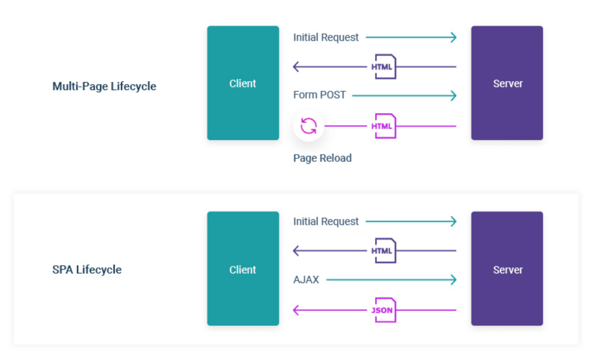
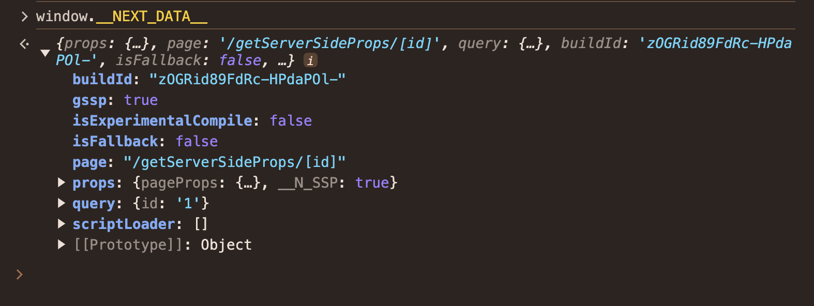

## 04. 서버 사이드 렌더링

과거 리액트 애플리케이션을 만들 때 `Create React App(creat-reat-app)`이 각광받았지만 요즘은 서버 사이드 렌더링을 지원하는 `Next.js` 같은 프레임워크를 사용해 프로젝트를 만드는 것이 큰 인기를 끌고있다.

### 싱글 페이지 애플리케이션이란?

서버 사이드 렌더링이 무엇인지 설명하기에 앞서 먼저 서버 사이드 렌더링 애플리케이션과 반대되는 개념인 싱글 페이지 애플리케이션에 대해 먼저 살펴보자.

`싱글 페이지 애플리케이션(Single Page Application: SPA)`이란 렌더링과 라우팅에 필요한 대부분의 기능을 서버가 아닌 브라우저의 자바스크립트에 의존하는 방식이다. 최초의 첫 페이지에서 데이터를 모두 불러온 이후에는 페이지 전환을 위한 모든 작업이 자바스크립트와 브라우저의 history.pushState와 history.replaceState로 이뤄지기 때문에 페이지를 불러온 이후에는 서버에서 HTML을 내려받지 않고 하나의 페이지에서 모든 작업을 처리하므로 싱글 페이지 애플리케이션이라고 한다. SPA 사이트를 실제로 소스보기로 HTML 코드로 봤을 때는 body 내부에 아무런 내용이 없다.

이는 사이트 렌더링에 필요한 body 내부의 내용을 모두 자바스크립트 코드로 삽입한 이후에 렌더링하기 때문이다. 또 페이지 전환 시에도 새로운 HTML 페이지를 요청하는게 아니라 자바스크립트에서 다음 페이지의 렌더링에 필요한 정보만 HTTP 요청 등으로 가져온 다음, 그 결과를 바탕으로 body 내부에 DOM을 추가, 수정, 삭제하는 방법으로 페이지가 전환된다. 즉, 최초에 서버에서 최소한의 데이터를 불러온 이후에는 이미 가지고 있는 자바스크립트 리소스와 브라우저 API를 기반으로 모든 작동이 이뤄진다.

이러한 작동방식은 최초에 로딩해야 할 자바스크립트 리소스가 커지는 단점이 있지만 한번 로딩된 이후에는 서버를 거쳐 필요한 리소스를 받아올 일이 적어지기 때문에 사용자에게 훌륭한 UI/UX를 제공한다는 장점이 있다.

**전통적인 방식의 애플리케이션과 싱글 페이지 애플리케이션의 작동 비교**

과거 서버 사이드에서 작동하던 전통적인 방식의 애플리케이션은 페이지 전환이 발생할 때마다 새롭게 페이지를 요청하고, HTML 페이지를 다운로드해 파싱하는 작업을 거친다. 이 과정은 페이지를 처음부터 새로 그려야 해서 일부 사용자는 페이지가 전환될 때 부자연스러운 모습을 보게된다.

그러나 이러한 페이지 전환을 모두 자바스크립트에서 한다면 최초에 한번 모든 리소스를 다운로드하고 나면 이후 페이지를 전환할 때 추가로 리소스를 다운로드하는 시간이 필요 없어진다. 그리고 경우에 따라 페이지 전체를 새로 렌더링하는 것이 아니라 페이지 전환에 필요한 일부 영역만 다시 그리게 되므로 훨씬 더 매끄러운 UI를 보여줄 수 있다.

**싱글 페이지 렌더링 방식의 유행과 JAM 스택의 등장**

과거 PHP나 JSP(JavaServer Pages)를 기반으로 대부분의 웹 애플리케이션이 만들어졌을 때는 거의 대부분의 렌더링이 서버 사이드에서 이뤄졌다. 페이지를 요청하면 서버에서 완성된 HTML을 내려받고, 또 페이지 이동이 있으면 새로운 페이지를 서버에서 내려받는 방식이었다. 여기서 자바스크립트는 어디까지나 사용자에게 추가적인 경험을 주기 위한 보조적인 수단으로 사용됐다.

그러나 자바스크립트가 서서히 다양한 작업을 수행하게 되면서 자바스크립트를 모듈화하는 방안이 점차 논의되기 시작했고, 그에 따라 등장한 것이 `CommonJS`와 `AMD(Asynchronous Module Definition)`이다. 이러한 자바스크립트 모듈화의 결실, 그리고 사용자 기기의 성능 향상과 인터넷 속도의 발전 등으로 자바스크립트에서 할 수 있는 일이 점차 다양해지기 시작했다.

이러한 변화에 힘입어 2010년경 Backbone.js와 Angular.js, Knockout.js 등이 등장하면서 자바스크립트 수준에서 MVx(Model-View-Something 패턴, MVC(Model-View-Controller) 패턴에서 파생) 프레임워크를 구현하기 시작했다. 이는 자바스크립트에서도 어느 정도 서버에서만 할 수 있는 복잡한 작업을 할 수 있다는 것을 의미했고, 이때부터 자바스크립트의 역할과 규모가 점점 커져갔다.

이러한 프레임워크의 인기는 자바스크립트의 역할을 더욱 가중시켰고, 이후로 우리가 잘 알고 있는 React, Vue, Angular의 시대가 오게된다. 자바스크립트 개발자들은 이러한 변화에 힘입어 웹페이지의 모든 영역(페이지 렌더링부터 사용자 인터렉션에 이르기까지)을 담당하면서 이를 모두 아우를 수 있는 방식인 싱글 페이지 렌더링이 인기를 얻게 됐다.

싱글 페이지 애플리케이션(클라이언트 사이드 라우팅)이 널리 퍼지게 된 것은 PHP 시절, 웹 애플리케이션을 만들기 위해서는 자바스크립트 외에도 신경 쓸 것이 많았지만 싱글 페이지 애플리케이션에서는 단지 브라우저 내부에서 작동하는 자바스크립트만 잘 작성하면 문제가 없다. 즉, 개발자에게 좀 더 간편한 개발 경험을 제공했고, 더욱 간편하게 웹 애플리케이션을 만들 수 있다는 장점이 있다. 이러한 장점과 시대적인 요구로 많은 싱글 페이지 애플리케이션이 개발되기 시작했다.

이러한 싱글페이지 애플리케이션의 유행으로 인해 새롭게 생겨난 용어가 있는데 바로 JAM 스택이다. 기존의 웹 개발은 `LAMP 스택(Linux-운영체제, Apache-서버, MySQL-데이터베이스, PHP/Python-웹 프레임워크 등)`으로 구성되어 있었다. 이 LAMP 스택은 과거 매우 인기있는 웹 개발 구조이기도 했지만 동시에 어쩔 수 없는 선택이기도 했다. 과거에는 자바스크립트로 할 수 있는 일이 제한적이었기 때문에 대부분의 처리를 서버에서 해야만 했다. 그러나 이러한 서버 의존적인 문제는 웹 애플리케이션의 확장성에도 걸림돌이 작용했는데, 웹 애플리케이션의 기능이 다양해지거나 사용자가 늘어나면 이와 동시에 서버도 확장해야 했지만 클라우드의 개념이 부족했던 이 당시에는 서버를 확장하는 것이 매우 번거로웠다.

그러나 앞서 언급한 프레임워크의 등장으로 등장한 것이 바로 `JAM 스택(Javascript, API, Markup)`이다. 대부분의 작업을 자바스크립트에서 수행할 수 있었기 때문에 개발자는 자바스크립트와 마크업을 미리 빌드해 두고 정적으로 사용자에게 제공하면 이후 작동은 모두 사용자의 클라이언트에서 실행되므로 서버 확장성 문제에서 좀 더 자유로워질 수 있게 된다. 이러한 JAM 스택의 인기와 Node.js의 고도화에 힘입어 MEAN(MongoDB, Express.js, AngularJS, Node.js)이나 MERN(MongoDB, Express.js, React, Node.js) 스택처럼 아예 API 서버 자체도 자바스크립트로 구현하는 구조가 인기를 끌기 시작했다.

**새로운 패러다임의 웹서비스를 향한 요구**

자바스크립트 파싱을 위해 CPU를 소비하는 시간이 눈에 띄게 증가했다는 점이다. 그만큼 자바스크립트에서 처리해야 하는 코드의 절대적인 양이 증가했음을 알 수 있다. 코드의 양이 증가해도 처리시간이 줄어들었다면 괜찮겠지만 사실 그것도 좋지 못하다. 모바일에서 사용자가 상호작용할 수 있을 때까지 대기해야 하는 평균 시간은 12초이며, 모든 콘텐츠 로딩에 소요되는 시간은 약 18초로, 웹 사이트 방문자들은 생각보다 많은 시간을 웹 사이트 로딩에 소비해야 한다.

물론, 이 모든 것이 싱글 페이지 애플리케이션 탓이라는 것은 절대 아니다. 과거 웹 애플리케이션은 단순히 무언가 정보를 보여주기 위한 수단에 불과했지만 현재의 웹 애플리케이션은 정말 다양한 작업을 처리하고 있고, 심지어 하이브리드 애플리케이션의 형태로 앱 내부에서도 마치 웹처럼 구동되는 경우도 많다.

웹 애플리케이션 개발자라면 이러한 웹 서비스의 성능을 역행하는 추세에 책임감을 가질 필요가 있다. ;'웹 개발 환경이 바뀌었다' 라거나 '이전보다 웹에서 많은 작업을 처리한다'라는 사실만으로는 고객을 설득하기 어렵다.

### 서버 사이드 렌더링이란?

싱글 페이지 애플리케이션이 자바스크립트를 활용해 하나의 페이지에서만 렌더링을 수행한다면, 서버 사이드 렌더링은 최초에 사용자에게 보여줄 페이지를 서버에서 렌더링해 빠르게 사용자에게 화면을 제공하는 방식을 의미한다. 앞서 언급했던, 웹 페이지가 점점 느려지는 상황에 대한 문제의식을 싱글 페이지 애플리케이션의 태생적인 한계에서 찾고, 이를 개선하고자 서버에서 페이지를 렌더링해 제공하는 기존 방식의 웹 개발이 다시금 떠오르고 있다.



즉, 싱글 페이지 애플리케이션과 서버에서 페이지를 빌드하는 서버 사이드 렌더링의 차이는 웹페이지 렌더링의 책임을 어디에 두느냐이다. SPA는 사용자에게 제공되는 자바스크립트 번들에서 렌더링을 담당하지만 SSR 방식을 채택하면 렌더링에 필요한 작업을 모두 서버에서 수행한다. CSR은 사용자가 기기의 성능에 영향을 받지만, SSR은 서버에서 제공하기 때문에 비교적 안정적인 렌더링이 가능하다.

### 서버 사이드 렌더링의 장점

- **최초 페이지 진입이 비교적 빠르다**

  SPA는 사용자가 페이지에 진입하고, JS 리소스를 다운로드하고, HTTP 요청을 수행한 이후에 이 응답의 결과를 가지고 화면을 렌더링해야 할 것이다. 그러나 이 작업을 서버에서 이뤄진다면 한결 빠르게 렌더링될 수 있다. 일반적으로 서버에서 HTTP 요청을 수행하는 것이 더 빠르고, 또 HTML을 그리는 작업도 서버에서 해당 HTML을 문자열로 미리 그려서 내려주는 것이 클라이언트에서 기존 HTML에 삽입하는 것보다 더 빠르기 때문이다.

- **검색 엔진과 SNS 공유 등 메타데이터 제공이 쉽다**

  **검색 엔진이 사이트에서 필요한 정보를 가져오는 과정**

  1. 검색 엔진 로봇(머신)이 페이지에 진입한다.
  2. 페이지가 HTML 정보를 제공해 로봇이 이 HTML을 다운로드한다. 단, 다운로드만 하고 자바스크립트 코드는 실행하지 않는다.
  3. 다운로드한 HTML 페이지 내부의 오픈 그래프(Open Graph)나 메타(meta) 태그 정보를 기반으로 페이지의 검색(공유) 정보를 가져오고 이를 바탕으로 검색 엔진에 저장한다.

  SPA는 대부분의 작동이 자바스크립트에 의존하는데, 이러한 메타 정보 또한 마찬가지이다. 검색 엔진이 최초에 방문했을 때, 즉 페이지에 최초로 진입했을 때 이러한 메타 정보를 제공할 수 있도록 조치를 취하지 않는다면, 검색 엔진이나 SNS 공유 시에 불이익이 있을 수 있다. 반면 SSR은 최초의 렌더링 작업이 서버에서 일어난다. 즉, 검색 엔진에 제공할 정보를 서버에서 가공해서 HTML 응답으로 제공할 수 있으므로 검색 엔진 최적화에 대응하기가 매우 유용하다.

- **누적 레이아웃 이동이 적다**

  SSR은 누적 레이아웃 이동(Cumulative Layout Shift)을 줄일 수 있다. 누적 레이아웃 이동이란 사용자에게 페이지를 보여준 이후에 뒤늦게 어떤 HTML 정보가 추가되거나 삭제되어 마치 화면이 덜컥 거리는 것 같은 부정적인 사용자 경험을 말한다. 즉, 사용자가 예상치 못한 시점에서 페이지가 변경되어 불편을 초래하는 것을 말한다. 신문 기사를 제공하는 사이트를 예를 들어보자. 화면 전체에 기사 내용이 있고, 중간에 가로로 긴 배너를 삽입하고자 한다. 그런데 글의 로딩은 빨리 이루어져서 화면에 먼저 노출되고 있는데, 갑작스럽게 뒤늦게 배너가 로딩된다면 배너의 크기만큼 글 영역이 밀리면서 사용자에게 불편을 초래할 것이다. SPA에서는 페이지 콘텐츠가 API 요청에 의존하고, API 요청의 응답 속도가 제각각이며, 이를 적절히 처리해두지 않는다면 이러한 누적 레이아웃 이동 문제가 발생할 수 있다. 반면 SSR의 경우에는 이러한 요청이 완전히 완료된 이후에 완성된 페이지를 제공하므로 문제에서 비교적 자유롭다.

  누적 레이아웃 이동을 해결하기 위해서는 SSR을 사용한다 해도 이러한 문제에서 완전히 자유롭지는 못하다. 리액트를 예로 들어보자. useEffect는 클라이언트에서 컴포넌트가 마운트된 이후에 실행되므로 서버 사이드 애플리케이션이나 싱글 페이지 애플리케이션에서 모두 문제의 소지가 있다. 또한 API 속도가 모두 달랐을 때, SSR에서는 모든 요청이 완료되기 전까지 페이지가 렌더링되지 않을 것이므로 최초 페이지 다운로드가 굉장히 느려질 수도 있다. 그러나 이는 리액트 18에서 등장한 스트림으로 인해 해결될 수도 있다.

- **사용자의 디바이스 성능에 비교적 자유롭다**

  자바스크립트 리소스 실행은 사용자의 디바이스에서만 실행되므로 절대적으로 사용자 디바이스 성능에 의존적이다. 그러나 SSR을 수행하면 이러한 부담을 서버에 나눌 수 있으므로 사용자의 디바이스 성능으로부터 조금 더 자유로워질 수 있다. 물론 이 또한 절대적인 것은 아니다. 인터넷 속도가 느리다면 어떠한 방법론을 쓰든 느릴 것이고, 사용자 방문이 폭증해 서버에 부담이 가중된다면, 그리고 이를 위한 적절한 처리가 수반되지 않았다면 SSR도 충분히 느려질 수 있다.

- **보안에 좀 더 안전하다**

  JAM 스택을 채택한 프로젝트의 공통된 문제점은 애플리케이션의 모든 활동이 브라우저에 노출된다는 것이다. 브라우저의 개발자 도구를 사용하면 웹사이트에서 일어나는 거의 대부분의 작업을 파악할 수 있다. 이 작업에는 API 호출과 같이 사용자에게 노출되면 안되는 민감한 정보 작업도 포함되므로 정상적인 비즈니스 로직을 거치지 않은 상황에서 인증이나 API가 호출되는 것을 항상 방지할 준비가 되어 있어야 한다. 반면 SSR의 경우 인증 혹은 민감한 작업을 서버에서 수행하고 그 결과만 브라우저에서 제공해 이러한 보안 위협을 피할 수 있다는 장점이 있다.

### 서버 사이드 렌더링의 단점

- **소스코드를 작성할 때 항상 서버를 고려해야 한다**

  브라우저 전역객체인 window 또는 sessionStorage와 같이 브라우저에만 있는 전역객체 등이다. 소스코드나 사용 중인 라이브러리에서 window를 사용하고 있고, 이 코드가 만약 서버에서 실행된다면 'window is not defined'라는 에러를 마주하게 된다. 그러므로 서버에서도 실행될 가능성이 있는 코드라면 window에 대한 접근을 최소화해야 하고, window 사용이 불가피하다면 해당 코드가 서버 사이드에서 실행되지 않도록 처리해야 한다. 해당 라이브러리가 마찬가지로 서버에 대한 고려가 돼 있지 않다면 다른 대안을 찾거나 클라이언트에서만 실행될 수 있도록 처리해야 한다. 잠재적인 위험을 가진 코드를 모두 클라이언트에서 실행하는 것 또한 궁극적인 해결책이 되지 못한다. 클라이언트에선만 실행되는 코드가 많아질수록 서버 사이드렌더링의 장점을 잃는 셈이다.

- **적절한 서버가 구축돼 있어야 한다**

  SPA나 정적인 HTML 페이지만으로 서비스할 수 있는 웹페이지의 경우에는 단순히 HTML과 자바스크립트, CSS 리소스를 다운로드할 수 있는 준비만 하면 된다. 서버는 정적인 데이터인 자바스크립트와 HTML을 제공하면 모든 역할이 끝난다. 그러나 SSR은 말 그대로 사용자의 요청을 받아 렌더링을 수행할 서버가 필요하다. 그러나 서버를 구축하는 것은 절대 쉬운 일이 아니다. 사용자의 요청에 따라 적절하게 대응할 수 있는 물리적인 가용량을 확보해야 하고, 때로는 예기치 않은 장애 상황에 대응할 수 있도록 복구 전략도 필요하다. 또한 요청을 분산시키고, 프로세스가 예기치 못하게 다운될 때를 대비해 PM2 같은 프로세스 매니저의 도움도 필요하다. 실제로 프로덕션 SSR 애플리케이션을 운영해 본 경험이 있다면 쿠버네티스 같은 여러 가지 라이브러리와 도구의 도움을 얻더라도 절대 쉽지 않은 일이라는 것을 알 것이다.

- **서비스 지연에 따른 문제**

  SPA에서 어떤 느린작업이 있다고 가정해보자. SPA는 그래도 최초에 어떤 화면이라도 보여준 상태에서 무언가 느린 작업이 수행되기 때문에 '로딩 중'과 같이 작업이 진행 중임을 적절히 안내한다면 충분히 사용자가 기다릴 여지가 있다.

  반면 SSR에서 지연이 일어나면, 특히 이 작업이 최초 렌더링에 발생한다면 사용자에게 보여줄 페이지에 대한 렌더링이 작업이 끝나기까지는 사용자에게 그 어떤 정보도 제공할 수 없다.

### SPA와 SSR을 모두 알아야 하는 이유

- **서버 사이드 렌더링 역시 만능이 아니다**

  클라이언트에서 발생하는 모든 무거운 작업을 서버에 미루고, 작업이 모두 서버에서 이뤄진다고 해서 모든 성능 문제가 해결되는 것은 아니다. 잘못된 웹페이지 설계는 오히려 성능을 해칠 뿐만 아니라 눈에 띄는 성능 개선도 얻지 못하고 서버와 클라이언트 두 군데로 관리 포인트만 늘어나기만 하는 역효과를 낳을 수도 있다. 웹 페이지의 설계와 목적, 그리고 우선순위에 따라 SPA가 더 효율적일 수도 있다. SSR은 성능에 있어 만병통치약이 아님을 알아야 한다.

- **SPA와 SSR**

  - `가장 뛰어난 SPA >> 가장 뛰어난 MPA(멀티 페이지 애플리케이션)`

    완성도가 매우 뛰어난 SPA가 있다고 가정해보자. 최초 페이지 진입 시에 보여줘야 할 정보만 최적화해 요청헤서 렌더링하고, 이미지와 같은 중요성이 떨어지는 리소스는 게으른 로딩으로 렌더링에 방해되지 않도록 처리했으며, 코드 분할(code splitting, 사용자에게 필요한 코드만 나눠서 번들링하는 기법) 또한 칼같이 지켜서 불필요한 자바스크립트 리소스의 다운로드 및 실행을 방지했다. 라우팅이 발생하면 변경이 필요한 HTML 영역만 교체해 사용자의 피로감을 최소해했다. MPA 또한 마찬가지로 엄청난 최적화를 가미했다 하더라도 SPA가 가진 브라우저 API와 자바스크립트를 활용한 라우팅을 기반으로 한 매끄러운 라우팅보다 뛰어난 성능을 보여줄 수는 없을 것이다.

  - `평균적인 SPA는 평균적인 MPA보다 느리다`

    MPA에서는 매번 서버에 렌더링을 요청하고, 서버는 안정적인 리소스를 기반으로 매 요청마다 비슷한 성능의 렌더링을 수행할 것이다. 그러나 SPA는 렌더링과 라우팅에 최적화가 돼 있지 않다면 사용자가 기기에 따라 성능이 들쑥 날쑥하고, 적절한 성능 최적화도 돼 있지 않을 가능성이 높으므로 MPA 대비 성능이 아쉬울 가능성이 크다. 그리고 이러한 최적화는 매우 어렵다. 페이지 전환 시에 필요한 리소스와 공통으로 사용하는 리소스를 분류하고 이에 따른 다운로드나 렌더링 우선순위 전략을 잘 수립해 서비스하기란 매우 어렵다. 따라서 평균적인 노력을 기울여서 동일한 서비스를 만든다면 렌더링 우선순위 전략을 잘 수립해 서비스하기란 매우 어렵다. 따라서 평균적인 노력을 기울여서 동일한 서비스를 만든다면 서버에서 렌더링되는 MPA가 더 우위에 있을 수 있다.

    심지어 최근에는 MPA에서 발생하는 라우팅으로 인한 문제를 해결하기 위한 다양한 API가 브라우저에 추가되고 있다.

    - 페이트 홀딩(Paing Holding): 같은 출처(origin)에서 라우팅이 일어날 경우, 화면을 잠깐 하얗게 띄우는 대신 이전 페이지를 보여주는 기법
    - back forward cache(bfcache): 브라우저 앞,뒤로 가기 실행 시 캐시된 페이지를 보여주는 기법
    - Shared Element Transition: 페이지 라우팅이 일어났을 때, 두 페이지에 동일 요소가 있다면 해당 콘텍스트를 유지해 부드럽게 전환되는 기법

    이러한 기법은 모두 SPA에서 구현 가능한 것이지만 완벽하게 구현하려면 자바스크립트 뿐만 아니라 CSS 등의 도움을 받아야 하고, 상당한 노력을 기울여야 한다. 그러나 평균적인 사용자 경험을 제공한다고 가정한다면 별도의 최적화를 거쳐야 하는 SPA보다는 서버에서 렌더링되는 MPA가 더 나은 경험을 제공한다고 볼 수 있다.

    결국 두 방법론이 모두 상황에 따라 유효한 방법이라는 것을 먼저 이해해야 한다. 두 가지 모두 장단점이 있으며 어느 하나가 완벽하다고 볼 수 없다. SPA가 제공하는 보일러플레이트나 라이브러리가 점차 완벽해지면서 잠재적인 모든 위협을 제거할 수도 있고, MPA이 브라우저 API의 도움을 받아 SPA와 같은 끊김없는 사용자 경험을 제공할 수도 있다.

- **현대의 SSR**

  현대의 SSR은 지금까지 LAMP 스택에서 표현했던 SSR 방식과는 조금 다르다. 먼저 기존 LAMP 스택은 모든 페이지 빌드를 서버에서 렌더링해 초기 페이지 진입이 빠르다는 장점이 있지만 이후에 라우팅이 발생할 때도 마찬가지로 서버에 의존해야 하기 때문에 SPA 방식에 비해 라우팅이 느리다는 단점이 있다.

  그래서 요즘 SSR은 이 2가지 장점을 모두 취한 방식으로 작동한다. 먼저, 최초의 웹사이트 진입 시에는 SSR 방싱으로 서버에서 완성된 HTML을 제공받고, 이후 라우팅에서는 서버에서 내려받은 자바스크립트를 바탕으로 마치 SPA처럼 작동한다. Next.js, Remix 등 요즘 각광받고 있는 SSR 프레임워크는 모두 이러한 방식으로 작동해 사용자에게 더 나은 웹사이트 경험을 안겨준다.

### 서버 사이드 렌더링을 위한 리액트 API 살펴보기

기본적으로 리액트는 프론트엔드 라이브러리로 브라우저 자바스크립트 환경에서 렌더링할 수 있는 방법을 제공하지만 이와 동시에 리액트 애플리케이션을 서버에서 렌더링할 수 있는 API도 제공한다. 이 API는 당연히 브라우저의 window 환경이 아닌 Node.js와 같은 서버 환경에서만 실행할 수 있으며 window 환경에서 실행 시 에러가 발생할 수 있다. 리액트에서 서버 사이드 렌더링을 실행할 때 사용되는 API를 확인해 보려면 리액트 저장소의 react-dom/server.js를 확인하면 된다. 여기에는 react-dom이 서버에서 렌더링하기 위한 다양한 메서드를 제공하고 있다.

리액트 18이 릴리즈되면서 react-dom/server에 renderToPipeableStream이 추가됐고, 나머지는 대부분 지원 중단되는 등 큰 변화를 거쳤다.

**rednerToString**

함수 이름에서 알 수 있듯이 인수로 넘겨받은 리액트 컴포넌트를 렌더링해 HTML 문자열로 반환하는 함수이다. 서버 사이드 렌더링을 구축하는데 가장 기초적인 API로, 최초의 페이지를 HTML로 먼저 렌더링한다고 언급했는데 바로 그 역할을 하는 함수가 renderToString이다.

```javascript
const result = ReactDOMServer.renderToString(
  React.createElement('div', { id: 'rood' }, <SampleComponent />)
);

// 위 result는 다음과 같은 문자열을 반환한다.

<div id="root" data-reactroot="">
  <div>Hello</div>
</div>;
```

renderToString은 useEffect와 같은 훅과 handleClick과 같은 이벤트 핸들러는 결과물에 포함시키지 않는다. 즉, 클라이언트에서 실행되는 자바스크립트 코드를 포함시키거나 렌더링하는 역할까지 해주지는 않는다. 필요한 자바스크립트 코드는 여기에서 생성된 HTML과는 별도로 제공해 브라우저에게 제공되어야 한다.

renderToString을 사용하면 앞서 언급했던 서버 사이드의 이점, 클라이언트에서 실행되지 않고 일단 먼저 완성된 HTML을 서버에서 제공할 수 있으므로 초기 렌더링에서 뛰어난 성능을 보일 것이다. 또한 검색 엔진이나 SNS 공유를 위한 메타 정보도 renderToString에서 미리 준비한 채로 제공할 수 있으므로 SPA 구조보다 손쉽게 완성할 수 있을 것이다.

마지막으로 div#root에 존재하는 속성인 data-reactroot이다. 이 속성은 리액트 컴포넌트의 루트 앨리먼트가 무엇인지 식별하는 역할을 한다. 이 속성은 이후에 자바스크립트를 실행하기 위한 hydrate 함수에서 루트를 식별하는 기준점이 된다. 리액트로 만들어진 애플리케이션을 보면 리액트의 루프 앨리먼트에 data-reactroot 속성이 있는 것을 확인할 수 있다.

**rednerToStaticMarkUp**

renderToString과 rednerToStaticMarkUp 매우 유사한 함수이다. 두 함수 모두 리액트 컴포넌트를 기준으로 HTML 문자열을 만든다는 점에서 동일하다. 한 가지 유의미한 차이점은 앞서 루트 요소에 추가한 data-reactroot와 같은 리액트에서만 사용하는 추가적인 DOM 속성을 만들지 않는다는 점이다. 이처럼 리액트에서만 사용하는 속성을 제거하면 결과물인 HTML 크기를 아주 약간이라도 줄일 수 있다는 장점이 있다.

```javascript
const result = ReactDOMServer.rednerToStaticMarkUp(
  React.createElement('div', { id: 'rood' }, <SampleComponent />)
);

// 위 result는 다음과 같은 문자열을 반환한다.

<div id="root">
  <div>Hello</div>
</div>;
```

이 함수를 실행한 결과로 렌더링을 수행하면 클라이언트에서는 리액트에서 제공하는 useEffect와 같은 브라우저 API를 절대로 실행할 수 없다. 만약 rednerToStaticMarkUp의 결과물을 기반으로 리액트의 자바스크립트 이벤트 리스너를 등록하는 hydrate를 수행하면 서버와 클라이언트의 내용이 맞지 않다는 에러가 발생한다. 즉, rednerToStaticMarkUp은 리액트의 이벤트 리스너가 필요없는 완전히 순수한 HTML을 만들 때만 사용된다. 블로그 글이나 상품의 약관 정보와 같이 아무런 브라우저 액션이 없는 정적인 내용만 필요한 경우 유용하다.

**rednerToNodeStream**

- [더 이상 사용되지 않음](https://ko.react.dev/reference/react-dom/server/renderToNodeStream)
- rednerToNodeStream은 rednerToString과 결과물이 완전히 동일하지만 2가지 차이점이 있다.
- 첫 번째는 rednerToString과 rednerToStaticMarkUp API는 브라우저에서 실행할 수는 있지만 rednerToNodeStream은 브라우저에서 사용하는 것이 완전히 불가능하다.
- 두 번째는 결과물의 타입이다. rednerToString은 결과물이 string인 문자열이지만, rednerToNodeStream의 결과물은 Node.js의 ReadableStream이다. ReadableStream은 utf-8로 인코딩된 바이트 스트림으로, Node.js나 Deno, Bun과 같은 서버 환경에서만 사용할 수 있다. 궁극적으로 브라우저가 원하는 결과물, 즉 string을 얻기 위해서는 추가적인 처리가 필요하다.
- ReadableStream 자체는 브라우저에도 사용할 수 있는 객체이다. 그러나 ReadableStream을 만드는 과정이 브라우저에서는 불가능하게 구현되어 있다.

**스트림(stream)의 개념**

유튜브와 같이 웹에서 동영상을 보는 상황을 상상해보자. 우리는 유튜브 영상을 보기위해 전체 영상을 모두 다운로드할 때까지 기다리지 않는다. 사용자가 볼 수 있는 몇 초라도 먼저 다운로드되면 그 부분을 먼저 보여주고, 이후에 계속해서 영상을 다운로드한다. 스트림은 큰 데이터를 다룰 때 데이터를 청크(chunk, 작은단위)로 분할해 조금씩 가져오는 방식을 의미한다.

rednerToString이 생성하는 HTML 결과물의 크기가 매우 크다면, 이렇게 크기가 큰 문자열을 한번에 메모리에 올려두고 응답을 수행해야 해서 Node.js가 실행되는 서버에 큰 부담이 될 수 있다. 대신 스트림을 사용하면 이러한 큰 크기의 데이터를 청크 단위로 분리해 순차적으로 처리할 수 있다는 장점이 있다.

**rednerToStaticNodeStream**

- rednerToNodeStream과 결과물은 동일하나, 리액트 자바스크립트에 필요한 리액트 속성이 제공되지 않는다.
- hydrate할 필요가 없는 순수 HTML 결과물이 필요할 때 사용하는 메서드이다.

**render**

- hydrate에 대해 설명하기 앞서 hydrate와 비슷한 브라우저에서만 사용되는 메서드인 render를 먼저 살펴보자.
- 이 함수는 주로 create-react-app으로 생성된 프로젝트의 index.jsx에서 찾아볼 수 있다.

```javascript
import * as ReactDOM from 'react-dom';
import App from './App';

const rootElement = document.getElementById('root');
ReactDOM.render(<App />, rootElement);
```

- render 함수는 컴포넌트와 HTML 요소를 인수로 받는다. 이렇게 인수로 받은 두 정보를 바탕으로 HTML의 요소에 해당 컴포넌트를 렌더링하며, 여기에 이벤트 핸들러를 붙이는 작업까지 모두 한 번에 수행한다.
- render는 클라이언트에서만 실행되는, 렌더링과 이벤트 핸들러 추가 등 리액트를 기반으로 온전한 웹페이지를 만드는 데 필요한 모든 작업을 수행한다.

**hydrate**

- hydrate 함수는 rednerToString, rednerToNodeStream으로 생성된 HTML 콘텐츠에 자바스크립트 핸들러나 이벤트를 붙이는 역할을 한다.
- 정적으로 생성된 HTML에 이벤트와 핸들러를 붙여 완전한 웹페이지 결과물을 만든다.
- render와 인수를 넘기는 것이 거의 유사하다. render와의 차이점은 hydrate는 기본적으로 이미 렌더링된 HTML이 있다는 가정하에 작업이 수행되고, 이 렌더링된 HTML을 기준으로 이벤트를 붙이는 작업만 실행한다는 것이다.

```javascript
import * as ReactDOM from 'react-dom';
import App from './App';

const rootElement = document.getElementById('root');
ReactDOM.hydrate(<App />, rootElement);
```

- 만약 hydrate의 두 번째 인수로 rednerToStaticMarkUp 등으로 생성된, 리액트와 관련 정보가 없는 순수한 HTML 정보를 넘겨주면 서버에서 제공받은 HTML에 App 컴포넌트에 있는 것과 같은 요소가 있기를 기대했지만 이 요소가 없다는 경고 문구가 출력된다.
- 이는 hydrate가 서버에서 제공해 준 HTML이 클라이언트의 결과물과 같을 것이라는 가정하에 실행된다는 것을 의미한다.
- 위 예제를 기준으로 설명하면, rootElement 내부에는 <App />을 렌더링한 정보가 이미 포함돼 있어야한 hydrate를 실행할 수 있는 것이다.
- 따라서 hydrate의 두 번째 인수에는 이미 rednerToString 등으로 렌더링된 정적인 HTML 정보가 반드시 담겨있어야 한다.
- 아무것도 없는 빈 HTML에 이 정보를 렌더링하는 render와의 차이점이 바로 이것이다.
- 비록 서버에서 렌더링한 정보가 없어서 경고가 노출됐음에도 불구하고, 리액트는 이 함수를 통해 정상적으로 웹페이지를 만든다.
- 이는 hydrate 작업이 단순히 이벤트나 핸들러를 추가하는 것 이외에도 렌더링을 한 번 수행하면서 hydrate가 수행한 렌더링 결과물 HTML과 인수로 넘겨받은 HTML을 비교하는 작업을 수행하기 때문이다.
- 여기서 발생한 불일치가 바로 에러의 원인이며, 불일치가 발생하면 hydrate가 렌더링한 기준으로 웹페이지를 그리게 된다.
- 물론 이렇게 해서 렌더링이 된다고 하더라도 이것이 올바른 사용법인 것은 아니다. 이렇게 렌더링을 하는 것은 사실상 서버와 클라이언트에서 두 번 렌더링을 하게되고, 결국 SSR의 장점을 포기하는 것이기 때문에 반드시 고쳐야 하는 문제이다.

- 하지만 불가피하게 이러한 결과물이 다를 수밖에 없는 경우도 있을 것이다. 에를 들어 HTML 내부에 현재 시간을 초단위까지 기록해야 한다고 가정해보자. SSR과 hydrate가 제아무리 빨리 끝난다하더라도 1초 단위로 끝나지 않는 이상 불일치가 발생할 수 밖에 없으며, 결국 hydrate는 에러를 발생시킨다.
- 불가피하게 불일치가 발생할 수 있는 경우에는 해당 요소에 `suppressHydrationWarning`을 추가해 경고를 끌 수 있다. 단 이것은 어디까지나 필요한 곳에 제한적으로 써야한다.
- HTML에 정확한 시간을 기록하기 위한 목적이라면 서버에서 실행하는 것보다 차라리 useEffect를 통해 노출하는 편이 더 정확하므로 서버에서는 굳이 해당 함수를 실행조차 하지 않는 것이 나을 수 있다.

```javascript
<div suppressHydrationWarning>{new Date().getTime()}</div>
```

### SSR 렌더링 예제 프로젝트

- 책 참고(278p)

서버에서 다뤄야 할 것들이 많아서 복잡하다고 느낄 수 있다. 이러한 복잡함을 살펴봤다면 왜 리액트 팀이 적절한 프레임워크 사용을 추천했는지 쉽게 이해할 것이다. 어느 정도 성능이 보장된 SSR을 수행하려면 매우 복잡한 코드가 필요하며, 이를 매번 개발자 개인이 작성하는 것은 매우 비효율적이다.

SSR의 장점, 즉 사용자에게 더 빠른 웹페이지 결과물을 제공할 수 있다는 장점 이면에는 서버가 있으며, 이 서버라는 존재 자체가 개발자에게 더욱 부담이 된다. 또한 서버에서 HTML을 제공하는 것 뿐만 아니라 번들링된 자바스크립트 소스도 제공해야 하며, 적절하게 캐시도 사용해야 하는 등 많은 것들을 고려해야 한다.

더욱이 리액트 18에서는 suspense나 concurrent, 그리고 SSR과 약간 다른 ServerComponent 등의 새로운 개념이 추가되면서 서버에서 렌더링하는 것이 더욱 복잡해졌다. SSR 자체만으로 개발자에게 큰 도전이다.

### Next.js 톺아보기

### Next.js란?

Next.js는 Vercel이라는 미국 스타트업에서 만든 풀스택 웹 애플리케이션을 구축하기 위한 리액트 기반 프레임워크이다. PHP에서 영감을 받아 만들어졌으며, 실제로도 PHP 대용품으로 사용되기 위해 만들었다고 언급한 것으로 봐서 최초에 설계 당시부터 서버 사이드 렌더링을 염두에 뒀던 것으로 보인다.

Next.js가 대세가 되기에 앞서 과거 페이스북(현 메타)팀에서 리액트 기반 서버 사이드 렌더링을 위해 고려했던 프로젝트가 있는데 바로 react-page이다. react-page는 페이지를 서버 또는 클라이언트에서 리액트를 손쉽게 사용할 수 있는 것을 목표로 만들어진 프로젝트이며, 현재 해당 프로젝트는 중단됐지만 여기에서 구현해 둔 방향성에 Next.js가 영감을 받아 개발된 것을 확인해 볼 수 있는 내용이 하나 있다.

Next.js의 페이지 구조, 즉 실제 디렉터리 구조가 곧 URL로 변환된는 것은 react-page에서 이미 라우팅을 위해 구현해 놓은 기능으로, Next.js도 동일하게 디렉터리 기반 라우팅을 서비스하고 있다.

### Next.js 시작하기

**next.config.js**

next.config.js는 Next.js 프로젝트의 환경설정을 담당한다.

```javascript
import type { NextConfig } from 'next';

const nextConfig: NextConfig = {
  /* config options here */
  reactStrictMode: true,
  swcMinify: true,
};

export default nextConfig;
```

- `reactStrictMode`: 리액트의 엄격모드와 관련된 옵션으로, 리액트 애플리케이션 내부에서 잠재적인 문제를 개발자에게 알리기 위한 도구이다. 특별한 이유가 없다면 켜두는 것이 도움이 된다.
- `swcMinify`: Vercel에서는 SWC라 불리는 또 다른 오픈소스를 만들었는데, 이 도구는 번들링과 컴파일을 더욱 빠르게 수행하기 위해 만들어졌다. 바벨의 대안이라고 볼 수 있으며, 국내 개발자 강동윤님이 만든 프로젝트로, 개발자 분이 Vercel에 합류하면서 SWC 또한 Next.js와 함께하게 됐다. 바벨보다 빠를 수 있는 이유는 첫째, 자바스크립트 기반의 바벨과는 다르게 러스트(Rust)라는 완전히 다른 언어로 작성했다는 점(러스트는 C/C++과 동등한 수준의 속도를 보여준다고 알려져있다.) 그리고 병렬로 작업을 처리한다는 점 등이 있다. swcMinify는 이러한 SWC 기반으로 코드 최소화 작업을 할 것인지 여부를 설정하는 속성이다. Next.js v15부터 SWC 미니파이어가 이미 기본적으로 활성화되어 있고, 대부분의 경우에 최적의 성능을 제공하기 때문에 해당옵션은 기본옵션으로 빠져있다.

**pages/\_app.tsx**

`_app.tsx`, 그리고 내부에 export default로 내보낸 함수는 애플리케이션 전체 페이지의 시작점이다. 페이지의 시작점이라는 특징 떄문에 웹 애플리케이션에서 공통으로 설정해야 하는 것들을 여기에서 실행할 수 있다. `_app.tsx`에서 할 수 있는 내용은 다음과 같다.

- 에러 바운더리를 사용해 애플리케이션 전역에서 발생하는 에러처리
- reset.css 같은 전역 CSS 선언
- 모든 페이지에 공통으로 사용 또는 제공해야 하는 데이터 제공 등

여기서 서버 사이드 프레임워크의 특징을 확인할 수 있는 재미있는 사실이 있는데, `_app.tsx` 내부에 console.log()를 추가해보자. 그리고 페이지를 새로고침하면 해당 로그가 브라우저 콘솔창이 아닌 Next.js를 실행한 터미널에 기록되는 것을 볼 수 있다. 또 여기에서 페이지를 전환하면 더 이상 서버에서 로깅되지 않고 브라우저에 로깅되는 것을 확인할 수 있다. 이러한 사실로 미뤄 봤을 때 `최초에는 서버 사이드 렌더링을, 이후에는 클라이언트에서 _app.tsx의 렌더링이 실행된다는 것을 짐작할 수 있다.`

**pages/\_document.tsx**

`_document.tsx`는 특별한 커스터마이징이 필요 없는 경우에는 제거해도 실행에 지장이 없는 파일이다. 그럼에도 `_document.tsx`는 몇 가지 시나리오에서 유용한 도움을 준다.

```javascript
import { Html, Head, Main, NextScript } from 'next/document';

export default function Document() {
  return (
    <Html lang="ko">
      <Head />
      <body>
        <Main />
        <NextScript />
      </body>
    </Html>
  );
}
```

`\_app.tsx`가 애플리케이션의 페이지 전체를 초기화하는 곳이라면, `_document.tsx`는 애플리케이션의 HTML을 초기화하는 곳이다. 그렇기에 `\_app.tsx`와 몇 가지 차이점이 있다.

- `<html>`이나 `<body>`에 DOM을 속성을 추가하고 싶다면 `_document.tsx`를 사용한다.
- `_app.tsx`는 렌더링이나 라우팅에 따라 서버나 클라이언트에서 실행될 수 있지만, `_document.tsx`는 무조건 서버에서 실행된다. 따라서 이 파일에서 onClick과 같은 이벤트 핸들러를 추가하는 것은 불가능하다. 이벤트를 추가하는 것은 클라이언트에서 실행되는 hydrate의 몫이기 때문이다.
- Next.js에는 두 가지 <head>가 존재하는데 하나는 next/document에서 제공하는 head이고, 다른 하나는 next/head에서 기본적으로 제공하는 head가 있다. 브라우저의 <head />와 동일한 역할을 하지만 next/document는 오직 \_document.tsx에서만 사용할 수 있다. next/head는 페이지에서 사용할 수 있으며, SEO에 필요한 정보나 title 등을 담을 수 있다. 또한 next/document의 <Head /> 내부에는 <title />을 사용할 수 없다. 웹 애플리케이션의 공통적인 제목이 필요하면 \_app.tsx에, 페이지별 제목이 필요하다면 페이지 파일 내부에서 사용하면 된다.

`_document.tsx`에서 할 수 있는 또 한 가지 작업은 CSS-in-JS의 스타일을 서버에서 모아 HTML로 제공하는 작업이다.

**\_app.tsx와 \_document.tsx의 차이점**

`_app.tsx`는 Next.js를 초기화하는 파일로, Next.js 설정과 관련된 코드를 모아두는 곳이며, 경우에 따라 서버와 클라이언트 모두에서 렌더링될 수 있다. `_document.tsx`는 Next.js로 만드는 웹사이트의 뼈대가 되는 HTML 설정과 관련된 코드를 추가하는 곳이다. 반드시 서버에서만 렌더링된다.

**pages/\_error.tsx**

```javascript
import { NextPageContext } from 'next';

const Error = ({ statusCode }: { statusCode: number }) => {
  return (
    <>
      {statusCode ? `서버에서 ${statusCode}` : `클라이언트에서 ${statusCode}`}
      에러가 발생했습니다.
    </>
  );
};

Error.getInitialProps = ({ res, err }: NextPageContext) => {
  const statusCode = res ? res.statusCode : err ? err.statusCode : '';
  return { statusCode };
};

export default Error;
```

이 페이지 역시 없더라도 실행하는 데 지장이 없다. 이 페이지는 서버 또는 클라이언트 발생하는 500에러를 처리할 목적으로 만들어졌다. Next.js 프로젝트 전역에서 발생하는 에러를 적절하게 처리하고 싶다면 이 페이지를 활용하면 된다. 단, 개발모드에서는 이 페이지에 방문할 수 없고 에러가 발생하면 Next.js가 제공하는 개발자 에러 팝업이 나타나게 된다. 이 페이지가 잘 작동하려면 프로덕션으로 빌드해서 확인해 봐야한다.

**pages/404.tsx**

404 페이지를 정의할 수 있는 파일이다. 만들지 않으면 Next.js에서 제공하는 기본 404 페이지를 볼 수 있고, 원하는 스타일의 404 페이지를 이곳에서 만들 수 있다.

**pages/500.tsx**

서버에서 발생하는 에러를 핸들링하는 페이지이다. \_error.tsx와 500.tsx가 모두 있다면 500.tsx가 우선적으로 실행된다. 마찬가지로 500이나 error 페이지가 없다면 기본적으로 Next.js에서 제공하는 페이지를 볼 수 있다.

**pages/index.tsx**

앞서 소개한 `_app.tsx`, `_document.tsx`, `_error.tsx`, `404.tsx`, `500.tsx`가 Next.js에서 제공하는 예약어로 관리되는 페이지라면 지금부터는 개발자가 자유롭게 명칭을 지정해 만들 수 있는 페이지이다.

- `/pages/hi/[...props].tsx`: 자바스크립트의 전개 연산자가 떠오르는 이 형식은 실제로도 작동이 전개 연산자와 동일하다. /hi를 제외한 /hi 하위의 모든 주소가 여기로 온다. 즉, localhost:3000/hi/hello, localhost:3000/hi/hello/world, localhost:3000/hi/hello/world/foo 등이 여기로 오게된다. 그리고 [...props] 값은 query에 props라는 변수에 배열로 오게된다.

**서버 라우팅과 클라이언트 라우팅의 차이**

`Next.js는 SSR을 수행하지만 동시에 SPA와 같이 클라이언트 라우팅 또한 수행한다.` 먼저 `Next.js는 SSR을 비롯한 사전 렌더링을 지원하기 때문에 최초 페이지 렌더링이 서버에서 수행된다.`

**next/link와 a태그의 차이점**

a태그로 페이지를 이동하는 경우(hello.tsx), 네트워크에서는 해당 페이지 이름의 문서를 요청하고, 이후에는 webpack, framework, main, hello 등 페이지를 만드는 데 필요한 리소스를 처음부터 다 가져온다. 또한 렌더링이 어디에서 일어나는지 판단하기 위한 console.log도 서버와 클라이언트에서 각각 동시에 기록되는 것을 알 수 있다. 즉, 서버에서 렌더링을 수행하고, 클라이언트에서 hydrate하는 과정에서 한 번 더 실행했다는 것을 알 수 있다.

next/link로 페이지를 이동하는 경우, 네트워크에 hello.js만 존재하며, 나머지 어떠한 요청도 없는 것을 볼 수 있다. hello.js 파일 안에는 클라리언트애 로깅을 하기위해 남긴 console.log가 존재하는 것을 확인할 수 있다. 즉, hello.js는 hello 페이지를 위한 자바스크립트이고, next/link로 이동하는 경우 SSR이 아닌 클라이언트에서 필요한 자바스크립트만 불러온 뒤 라우팅하는 클라이언트 라우팅/렌더링 방식으로 작동하는 것을 확인할 수 있다.

`Next.js는 SSR의 장점, 즉 사용자가 빠르게 볼 수 있는 최초 페이지를 제공한다는 점과 SPA의 장점인 자연스러운 라우팅이라는 두 가지 장점을 모두 살리기 위해 이러한 방식으로 작동한다는 것을 기억해두자.`

따라서 이러한 Next.js의 장점을 적극 살리기 위해서는 내부 페이지 이동 시 다음과 같은 규칙을 지켜야 한다.

- a태그 대신 <Link>를 사용한다.
- window.location.push 대신 router.push를 사용한다.

애플리케이션을 처음부터 서버에서 다시 불러와야 하는 정말 드문 케이스 외에는 Next.js가 제공하는 라우터를 사용해 페이지를 이동하는 것이 좋다.

**getServerSide가 없는 빌드**

`getServerSide`가 없는 페이지를 빌드한 뒤 실행해 보면 어떠한 방식으로 접근해도, <a />, <Link />와 상관없이 서버에 로그가 남지 않는 것을 확인할 수 있다. `getServerSide`가 없으면 서버에서 실행되지 않아도 되는 페이지로 처리하고 typeof window의 처리를 모두 object로 바꾼 다음, 빌드 시점에 미리 트리쉐이킹을 해버린다. 이처럼 Next.js는 SSR 프레임워크이지만 모든 작업이 서버에서 일어나는 것은 아니라는 점은 명심해야 한다.

**pages/api/hello.ts**

서버의 API를 정의하는 폴더이다. 기본적인 디렉터리에 따른 라우팅 구조는 페이지와 동일하되, /pages/api가 /api라는 접두사가 붙는다는 점만 다르다. 즉, /pages/api/hello.ts는 /api/hello로 호출할 수 있으며, 이 주소는 다른 pages 파일과 다르게 HTML 요청을 하는 게 아니라 단순히 서버 요청을 주고받게 된다.

```javascript
// Next.js API route support: https://nextjs.org/docs/api-routes/introduction
import type { NextApiRequest, NextApiResponse } from 'next';

type Data = {
  name: string,
};

export default function handler(
  req: NextApiRequest,
  res: NextApiResponse<Data>
) {
  res.status(200).json({ name: 'John Doe' });
}
```

페이지와 마찬가지로 expport default로 내보낸 함수가 실행된다. Express나 Koa 같은 Node.js 기반 서버 프레임워크를 사용해 본 경험이 있다면 쉽게 사용할 수 있을 것이다. 여기에 있는 코드는 당연히 오직 서버에서만 실행된다. window나 document 등 브라우저에서만 접근할 수 있는 코드를 작성하면 당연히 문제가 발생한다.

`서버에서 내려주는 데이터를 조합해 BFF(Backend-For-Frontend) 형태로 활용하거나, 완전한 풀스택 애플리케이션을 구축하고 싶을 때, 혹은 CORS(Cross-Origin Resource Sharing) 문제를 우회하기 위해 사용될 수 있다.`

### Data Fetching

Next.js에서는 SSR 지원을 위한 몇 가지 데이터 불러오기 전략이 있는데, 이를 Next.js에서는 Data Fetching이라고 한다. 이 함수는 /pages의 폴더에 있는 라우팅이 되는 파일에서만 사용할 수 있으며, 예약어로 지정되어 반드시 함수명으로 export를 사용해 함수를 파일 외부로 내보내야 한다. 이를 활용하면 서버에서 미리 필요한 페이지를 만들어서 제공하거나 해당 페이지의 요청이 있을 때마다 서버에서 데이터를 조회해서 미리 페이지를 만들어서 제공할 수 있다.

**getStaticPaths와 getStaticProps**
이 두 함수는 어떠한 페이지를 CMS(Content Management System)나 블로그, 게시판과 같이 사용자와 관계없이 정적으로 결정된 페이지를 보여주고자 할 때 사용되는 함수이다. `getStaticPaths`는 `getStaticProps`와 반드시 함께 있어야 사용할 수 있다.

`getStaticProps`는 `getStaticPaths`가 없어도 사용할 수 있다. `getStaticProps`를 단독으로 사용하는 경우는 정적 라우트를 가진 페이지에서 사용할 때, 빌드 시점에 데이터를 가져와 정적 페이지를 사용하고자 하는 경우이다. 예를 들어 블로그의 메인 페이지나 고정된 정보를 보여주는 페이지에서는 `getStaticProps`만 사용할 수 있다.

`getStaticPaths`와 `getStaticProps`가 함께 사용되는 경우는 동적으로 라우트를 사용하는 페이지에서 정적 생성을 할 때, 빌드 시점에 여러 페이지를 미리 생성해야 해야 하는 경우이다. 예를 들어 블로그 포스트 페이지(/posts/[id].js)와 같은 동적 라우트를 사용하는 경우, `getStaticPaths`로 생성할 경로를 지정하고 `getStaticProps`로 각 경로에 대한 데이터를 가져와야 한다.

```javascript
import { GetStaticPaths, GetStaticProps } from 'next';

export const getStaticPaths: GetStaticPaths = async () => {
  return {
    paths: [{ params: { id: '1' } }, { params: { id: '2' } }],
    fallback: false,
  };
};

export const getStaticProps: GetStaticProps = async ({ params }) => {
  const { id } = params;
  const post = await fetchPost(id);

  return {
    props: { post },
  };
};

export default function Post({ post }: { post: Post }) {
  // post로 페이지를 렌더링한다
}
```

`getStaticPaths`는 /pages/post/[id]가 접근 가능한 주소를 정의하는 함수이다. 즉, `getStaticPaths`에서 해당 페이지는 1,2만 허용하며, /post/3 등은 404 페이지를 반환한다. `getStaticProps`는 1과 2에 대한 데이터를 요청을 수행해 props로 반환한 다음, 마지막으로 Post는 이 결과를 바탕으로 페이지를 렌더링한다. 즉, 이 두 함수를 사용하면 빌드 시점에 미리 데이터를 불러온 다음에 정적인 HTML 페이지를 만들 수 있다.

이렇게 사용자가 접근할 수 있는 페이지를 모조리 빌드해 두고 배포하면 사용자는 굳이 페이지가 렌더링되는 것을 기다릴 필요없이 이미 완성되어 있는 페이지를 받기만 하면 되므로 굉장히 빠르게 해당 페이지를 확인할 수 있다.

`getStaticPaths`에 fallback 옵션은 이렇게 미리 빌드해야 할 페이지가 너무 많은 경우에 사용 가능하다. paths에 미리 빌드해 둘 몇 개의 페이지만 리스트로 반환하고, fallback 값을 true나 blocking으로 값을 선언할 수 있다. 이렇게 하면 next build를 실행할 때 미리 반환해 둔 paths에 기재되어 있는 페이지만 빌드하고, 나머지 페이지의 경우에는 다음과 같이 작동한다.

- `false`: 사용자가 접근 가능한 주소 외에 주소로 접근하면 404에러를 반환한다.
- `true`: 사용자가 미리 빌드하지 않은 페이지에 접근할 경우, 빌드가 되기 전까지는 fallback 컴포넌트를 보여주고, 빌드가 완료된 이후에 해당 페이지를 보여주는 옵션이다.
- `blocking`: 별도의 로딩과 같은 처리를 하지 않고, 단순히 빌드가 완료될 때까지 사용자를 기다리게 하는 옵션이다. SSR에서 렌더링할 때까지 대기한 다음, 렌더링이 완료되면 해당 페이지를 제공한다.

```javascript
import { GetStaticPaths, GetStaticProps } from 'next';
import { useRouter } from 'next/router';

export const getStaticPaths: GetStaticPaths = async () => {
  return {
    paths: [{ params: { id: '1' } }, { params: { id: '2' } }],
    fallback: true,
  };
};

export const getStaticProps: GetStaticProps = async ({ params }) => {
  const { id } = params as { id: string };

  const response = await fetch(
    `https://jsonplaceholder.typicode.com/todos/${id}`
  );
  const post = await response.json();

  return {
    props: { post },
  };
};

export default function Post({ post }: { post: Post }) {
  const router = useRouter();

  // post/3을 요청하면 빌드 전까지 로딩중...을 보여주다가 빌드가 완료되면 해당 페이지를 보여줌
  if (router.isFallback) {
    return <div>로딩중...</div>;
  }

  return <p>{post.title}</p>;
}
```

**getServerSideProps**

앞선 두 함수가 정적인 페이지 제공을 위해 사용된다면, `getServerSideProps`는 서버에서 실행되는 함수이며 해당 함수가 있다면 무조건 페이지 진입 전에 이 함수를 실행한다. 이 함수는 응답값에 따라 페이지의 루트 컴포넌트에 props를 반환할 수도, 혹은 다른 페이지로 리다이렉트 시킬 수도 있다. 이 함수가 있다면 Next.js는 꼭 서버에서 실행해야 하는 페이지로 분류해 빌드 시에도 서버용 자바스크립트 파일을 별도로 만든다.

```javascript
export const getServerSideProps: GetServerSideProps = async (context) => {
  const {
    query: { id },
  } = context;

  const response = await fetch(
    `https://jsonplaceholder.typicode.com/todos/${id}`
  );
  const post = await response.json();

  return {
    props: {
      post,
    },
  };
};

export default function Post({ post }: { post: Post }) {
  return <p>{post.title}</p>;
}
```

```html
<!DOCTYPE html>
<html lang="en">
  <head>
    <meta charset="utf-8" data-next-head="" />
    <meta name="viewport" content="width=device-width" data-next-head="" />
    <link
      rel="preload"
      href="/_next/static/css/a2fe316cdd23b4ed.css"
      as="style"
    />
    <link
      rel="stylesheet"
      href="/_next/static/css/a2fe316cdd23b4ed.css"
      data-n-g=""
    />
    <noscript data-n-css=""></noscript>
    <script
      defer=""
      nomodule=""
      src="/_next/static/chunks/polyfills-42372ed130431b0a.js"
    ></script>
    <script
      src="/_next/static/chunks/webpack-8cac0b4b405cede1.js"
      defer=""
    ></script>
    <script
      src="/_next/static/chunks/framework-e78c0713ba93908d.js"
      defer=""
    ></script>
    <script
      src="/_next/static/chunks/main-a91b4584597b0ba0.js"
      defer=""
    ></script>
    <script
      src="/_next/static/chunks/pages/_app-d80930e7de6cfbce.js"
      defer=""
    ></script>
    <script
      src="/_next/static/chunks/pages/getServerSideProps/%5Bid%5D-26ef74f92e75c2b6.js"
      defer=""
    ></script>
    <script
      src="/_next/static/BEYZmMni1xYIKoLmo9RxX/_buildManifest.js"
      defer=""
    ></script>
    <script
      src="/_next/static/BEYZmMni1xYIKoLmo9RxX/_ssgManifest.js"
      defer=""
    ></script>
  </head>
  <body>
    <div id="__next"><p>quis ut nam facilis et officia qui</p></div>
    <script id="__NEXT_DATA__" type="application/json">
      {
        "props": {
          "pageProps": {
            "post": {
              "userId": 1,
              "id": 2,
              "title": "quis ut nam facilis et officia qui",
              "completed": false
            }
          },
          "__N_SSP": true
        },
        "page": "/getServerSideProps/[id]",
        "query": { "id": "2" },
        "buildId": "BEYZmMni1xYIKoLmo9RxX",
        "isFallback": false,
        "isExperimentalCompile": false,
        "gssp": true,
        "scriptLoader": []
      }
    </script>
  </body>
</html>
```

HTML이 `gerServerSideProps`의 반환값을 기반으로 페이지가 렌더링돼 있음을 알 수 있다. 즉, Next.js의 SSR은 `getServerSideProps`의 실행과 함께 이뤄지며, 이 정보를 기반으로 페이지를 렌더링하는 과정이 바로 SSR을 나타내는 것임을 알 수 있다.

여기서 한 가지 더 눈여겨봐야할 것은 `__NEXT_DATA__`라는 id가 지정된 script이다. 이 스크립트는 `getServerSideProps`의 정보인 props뿐만 아니라 현재 페이지의 정보, query 등 Next.js 구동에 필요한 다양한 정보가 담겨 있다. 그렇다면 이 정보는 왜 script 형태로 삽입되어 있을까?

앞서 리액트의 SSR을 하는 작동을 살펴보자.

1. 서버에서 fetch 등으로 렌더링에 필요한 정보를 가져온다.
2. 1번에서 가져온 정보를 기반으로 HTML을 완성한다.
3. 2번 정보를 클라이언트(브라우저)에 제공한다.
4. 3번 정보를 바탕으로 클라이언트에서 hydrate 작업을 한다. 이 작업은 DOM에 리액트 라이프사이클과 이벤트 핸들러를 추가하는 작업이다.
5. 4번 작업인 hydrate로 만든 리액트 컴포넌트 트리와 서버에서 만든 HTML이 다르다면 불일치 에러를 뱉는다.(suppressHydrationWarning)
6. 5번 작업도 1번과 마찬가지로 fetch 등을 이용해 정보를 가져와야 한다.

즉, 1번과 6번 사이에 fetch 시점에 따라 결과물의 불일치가 발생할 수 있으므로 1번에서 가져온 정보를 결과물인 HTML에 script 형태로 내려주는 것이다. 이 작업을 거치면 1번의 작업을 6번에서 반복하지 않아도 되어 불필요한 요청을 막을 수 있을뿐더러 시점 차이로 인한 결과물의 차이도 막을 수 있다. 6번에서 재요청하는 대신, `<script />`를 읽어도 1번의 데이터를 동일하게 가져올 수 있다. Next.js에서는 이 정보를 window 객체에도 저장해둔다.



이를 통해 알 수 있는 사실 중 하나는, 일반적인 리액트 JSX와는 다르게 `getServerSideProps`의 props로 내려줄 수 있는 값은 JSON으로 제공할 수 있는 값으로 제한된다는 것이다. props의 결과를 HTML에 정적으로 작성해서 내려주기 때문에 JSON으로 직렬화할 수 없는 값, 즉 class나 Date 등은 props로 제공할 수 없다. `getServerSideProps`애서는 반드시 JSON.stringify로 직렬화 할 수 있는 값만 제공해야 하고, 값에 대한 가공이 필요하다면 실제 페이지나 컴포넌트에서 하는 것이 옳다.

그리고 `getServerSideProps`는 무조건 클라이언트가 아닌 서버에서 실행된다는 사실 또한 염두에 두어야 한다. 서버에서 실행되기 때문에 다음과 같은 제약이 있다.

1. window, document와 같이 브라우저에서만 접근할 수 있는 객체에는 접근할 수 없다.
2. API 호출 시 `/api/some/path`와 같이 protocol과 domain없이 fetch 요청을 할 수 없다. 브라우저와 다르게 서버는 자신의 호스트를 유추할 수 없기 때문이다. 반드시 완전한 주소로 제공해야 fetch가 가능하다.
3. 여기에서 에러가 발생한다면 500.tsx와 같이 미리 정의해 둔 에러 페이지로 리다이렉트된다.

항상 `getServerSideProps`는 서버에서 실행되는 함수라는 사실을 기억해 두고 코드를 작성해야 한다. 또한 컴포넌트 내 DOM에 추가하는 이벤트 핸들러 함수와 useEffect와 같이 몇 가지 경우를 제외하고는 서버에서 실행될 수 있다는 사실 또한 기억해야 한다. SSR은 루트 컴포넌트부터 시작해 모든 컴포넌트를 실행해 완성하므로 클라이언트에서만 실행 가능한 변수, 함수, 라이브러리 등은 서버에서 실행되지 않도록 별도로 처리해야 한다.

또한 이 함수는 사용자가 매 페이지를 호출할 때마다 실행되고, 이 실행이 끝나기 전까지는 사용자에게 어떠한 HTML도 보여줄 수 없다. 따라서 `getServerSideProps` 내부에서 실행하는 내용은 최대한 간결하게 작성하기 위해 꼭 최초에 보여줘야 하는 데이터가 아니라면 `getServerSideProps`보다는 클라이언트에서 호출하는 것이 더 유리하다. `getServerSideProps`에는 반드시 해당 페이지를 렌더링하는데 있어 중요한 역할을 하는 데이터만 가져오는 것이 좋다.

```javascript
export const getServerSideProps: GetServerSideProps = async (context) => {
  const {
    query: { id },
  } = context;

  const response = await fetch(
    `https://jsonplaceholder.typicode.com/todos/${id}`
  );
  const post = await response.json();

  if (!post) {
    return {
      redirect: {
        destination: '/404',
        permanent: false,
      },
    };
  }

  return {
    props: {
      post,
    },
  };
};
```

`getServerSideProps`는 조건에 따라 다른 페이지로 보내고 싶다면 redirect를 사용할 수 있다. 이 경우 클라이언트에서 리다이렉트하는 것이 비해서 훨씬 더 자연스럽다. 클라이언트에서는 아무리 리다이렉트를 초기화해도 자바스크립트가 어느 정도 로딩된 이후에 실행할 수 밖에 없다. 하지만 `getServerSideProps`를 사용하면 조건에 따라 사용자에게 미처 해당 페이지를 보여주기도 이전에 원하는 페이지로 보내버릴 수 있어 사용자에게 훨씬 더 자연스럽다.

**getInitialProps**

`getInitialProps`는 getStaticProps나 getServerSideProps가 나오기 전에 사용할 수 있었던 유일한 페이지 데이터 불러오기 수단이었다. 대부분의 경우에는 `getStaticProps`나 `getServerSideProps`를 사용하는 것을 권장하며, `getInitialProps`는 굉장히 제한적인 예시에서만 사용된다. 그러나 과거에 Next.js 코드에는 `getInitialProps`만 존재하고 \_app.tsx와 같이 일부 페이지에서는 `getInitialProps`밖에 사용할 수 없으므로 반드시 알고있어야 한다.

```javascript
export default function Post({ post }: { post: Post }) {
  return <p>{post.title}</p>;
}

Post.getInitialProps = async (context: NextPageContext) => {
  const isServer = context.req;

  console.log(isServer ? '서버' : '클라이언트');

  const {
    query: { id },
  } = context;

  const response = await fetch(
    `https://jsonplaceholder.typicode.com/todos/${id}`
  );
  const post = await response.json();

  return {
    post: post,
  };
};
```

먼저 눈에 띄는 가장 큰 차이점은 페이지의 루트 함수에 정적 메서드로 추가한다는 점과 props 객체를 반환히는 것이 아니라 바로 객체를 반환한다는 것이다. 위 예제를 작성한 뒤 페이지를 최초 진입했을 때와 <Link /> 컴포넌트를 이용해 클라이언트 라우팅을 수행했을 때 console.log가 어디에서 실행되는지 확인해보자. 최초 페이지 진입 시에는 서버에, 그 이후에 클라이언트에서 라우팅을 수행했다면 클라이언트에서 실행되는 것을 확인할 수 있다. 즉, `getInitialProps`는 라우팅에 따라서 서버와 클라이언트 모두에서 실행 가능한 메서드인 것이다. 따라서 `getInitialProps`에 코드를 작성할 때는 반드시 주의를 기울여야 한다. 여기에 있는 코드는 때에 따라 서버와 클라이언트 모두에서 실행될 수 있으므로 이러한 특징을 감안해서 코드를 작성해야 한다.

이 밖에도 `context 객체`에는 다양한 값이 존재한다. 여기에서 말하는 context는 `getServerSideProps`도 포함된다.

- pathname: 현재 경로명, 단 실제 경로가 아닌 페이지상 경로이다. 예제의 경우 pathname은 '/post/[id]'이다.
- asPath: 브라우저에 표시되는 실제 경로를 의미한다. pathname과 다르게 '/post/1'과 같이 사용자에게 표시되는 주소가 보인다.
- query: URL에 존재하는 쿼리, 여기에는 pathname에 있는 [id] 값도 포함된다.
- req: Node.js에서 제공하는 HTTP request 객체(http.IncomingMessage)
- res: Node.js에서 제공하는 HTTP response 객체(http.ServerResponse)

`getInitialProps`는 다른 데이터 가져오기에 비해 사용하기도 까다롭고 여러 가지 주의할 점이 있으므로 가급적이면 `getStaticProps`나 `getServerSideProps`를 사용하는 편이 좋다. `getInitialProps`는 \_app.tsx나 \_error.tsx와 같이 Next.js 특성상 사용이 제한되어 있는 페이지에서만 사용하는 것이 좋다.

### 스타일 적용하기

Next.js에서는 다양한 방식의 스타일을 대부분 지원한다.

**전역 스타일**

CSS Reset이라 불리는, 이른바 브라우저의 기본으로 제공되고 있는 스타일을 초기화하는 등 애플리케이션 전체에 공통으로 적용하고 싶은 스타일이 있다면 \_app.tsx를 활용하면 된다. \_app.tsx에 필요한 스타일을 직접 import로 불러오면 애플리케이션 전체에 영향을 미칠 수 있다. 이러한 글로벌 스타일은 다른 페이지나 컴포넌트와 충돌할 수 있으므로 반드시 \_app.tsx에서만 제한적으로 작성해야 한다.

**컴포넌트 레벨 CSS**

Next.js에서는 컴포넌트 레벨의 CSS를 추가할 수 있다. [name].module.css와 같은 명명 규칙만 준수하면 되며, 이 컴포넌트 레벨 CSS는 다른 클래스명과 겹쳐서 충돌이 일어나지 않도록 고유한 클래스명을 제공한다. 페이지와 다르게 컴포넌트 레벨 CSS는 어느 파일에서건 추가할 수 있다.

```css
/** Button.module.css **/

.alert {
  color: red;
  font-size: 16px;
}
```

```javascript
import styles from './Button.module.css';

export function Button() {
  return (
    <button type="button" className={styles.alery}>
      경고!
    </button>
  );
}
```

```html
<!-- 생략 -->
<head>
  <style>
    .Button_alerr_62TGU {
      color: red;
      font-size: 16px;
    }
  </style>
</head>

<!-- Button_alerr_62TGU => 컴포넌트별 충돌을 방지하기 위해 Next.js의 최적화가 작동 -->
<button type="button" class="Button_alerr_62TGU">경고!</button>
```

**SCSS와 SASS**

sass 패키지를 설치하면 별도의 설정없이 바로 동일하게 스타일을 사용할 수 있다. scss에서 제공하는 variable을 컴포넌트에서 사용하고 싶다면 export 문법을 사용하면 된다.

```css
$primary: blue;

:export {
  primary: $primary;
}
```

```javascript
import styles from './Button.module.css';

export function Button() {
  return (
    <button type="button" style={{ color: styles.primary }}>
      안녕하세요
    </button>
  );
}
```

**CSS-in-JS**

최근에는 자바스크립트 내부에 스타일시트를 삽입하는 CSS-in-JS 방식의 스타일링이 각광받고 있다. 비록 CSS와 비교했을 때 CSS-in-JS가 코드 작성의 편리성 이외에 실제로 성능 이점을 가지고 있는지는 논쟁거리로 남아있지만 CSS 구문이 자바스크립트 내부에 있다는 것은 확실히 개발자에게 직관적이고 편리하게 느껴질 것이다. 현재 대표적으로 사용되고 있는 CSS-in-JS 라이브러리로는 styled-jsx, styled-components, Emotions, Linaria 등 여러 가지가 있다.

styled-components의 스타일을 Next.js에 추가하려면 \_document.tsx에 다음과 같은 코드가 필요하다.

```javascript
import Document, {
  Html,
  Head,
  Main,
  NextScript,
  DocumentContext,
  DocumentInitialProps,
} from 'next/document';
import { ServerStyleSheet } from 'styled-components';

export default function MyDocument() {
  return (
    <Html lang="ko">
      <Head />
      <body>
        <Main />
        <NextScript />
      </body>
    </Html>
  );
}

MyDocument.getInitialProps = async (
  ctx: DocumentContext
): Promise<DocumentInitialProps> => {
  const sheet = new ServerStyleSheet();
  const originalRenderPage = ctx.renderPage;

  try {
    ctx.renderPage = () =>
      originalRenderPage({
        enhanceApp: (App) => (props) => sheet.collectStyles(<App {...props} />),
      });

    const initialProps = await Document.getInitialProps(ctx);
    return {
      ...initialProps,
      styles: (
        <>
          {initialProps.styles}
          {sheet.getStyleElement()}
        </>
      ),
    };
  } finally {
    sheet.seal();
  }
};
```

`_document.tsx`가 문서를 초기화하기 위한 Next.js의 특별한 페이지라고 하는데, 여기에 서버와 클라이언트 모두에서 작동하는 `getInitalProps`를 사용해 무언가를 처리하는 것 같다.

- ServerStyleSheet는 styled-components의 스타일을 서버에서 초기화해 사용되는 클래스이다. 이 클래스를 인스턴스로 초기화하면 서버에서 styled-components가 작동하기 위한 다양한 기능을 가지고 있다.
- originalRenderPage는 ctx.renderPage를 담아두고 있다. 즉, 기존의 ctx.renderPage가 하는 작업에 추가적으로 styled-components 관련 작업을 하기위해 별도 변수로 분리했다.
- ctx.renderPage에는 기존에 해야하는 작업과 함께 enhanceApp, 즉 App을 렌더링할 때 추가로 수행하고 싶은 작업을 정의했다.
  - 여기서 추가로 하는 작업이 바로 `sheet.collectStyles(<App {...props} />)`이다. sheet.collectStyles는 StyleSheetManager라고 불리는 Context.API로 감싸는 역할을 한다. 즉, 우리가 알고있는 기존의 <App /> 위에 styled-components의 Context.API로 한 번 더 감싼 형태로 볼 수 있다.
- `const initialProps = await Document.getInitialProps(ctx)`는 기존에 \_document.tsx가 렌더링을 수행할 때 필요한 getInitialProps를 생성하는 작업을 한다.
- 마지막 반환 문구에서는 기존에 기본적으로 내려주는 props에 추가적으로 styled-components가 모아둔 자바스크립트 파일 내 스타일을 반환한다. 이렇게 되면 SSR시에 최초로 \_document 렌더링될 때, styled-components에서 수집한 스타일도 함께 내려줄 수 있다.

내용이 복잡하지만 요약한다면 리액트 트리 내부에서 사용하고 있는 styled-components의 스타일을 모두 모은 다음, 이 각각의 스타일에 유니크한 클래스명을 부여해 스타일이 충돌하지 않게 클래스명과 스타일을 정리해 이를 \_document.tsx가 서버에서 렌더링할 때 React.Context 형태로 제공하는 것이다. 이렇게 CSS-in-JS의 스타일을 서버에서 미리 모은 다음 SSR에서 한꺼번에 제공해야 올바른 스타일을 적용할 수 있다.

만약 이런 과정을 거치지 않는다면 스타일이 브라우저에서 뒤늦게 추가되어 FOUC(flash of unstyled content)라는, 스타일이 입혀지지 않은 날것의 HTML을 잠시간 사용자에게 노출하게 된다. 이는 다른 CSS-in-JS도 마찬가지로, 코드는 약간씩 다르지만 모두 서버에서 스타일을 모아 SSR시에 일괄 적용하는 과정은 동일하게 거치게 된다. 따라서 CSS-in-JS를 Next.js와 같은 SSR 프레임워크에서 사용할 때는 반드시 이런 초기화 과정을 서버에서 거쳐야 한다.

만약 바벨 대신 swc를 사용한다면 next.config.js에 compiler.styleComponents를 추가하면 된다.

```javascript
import type { NextConfig } from 'next';

const nextConfig: NextConfig = {
  reactStrictMode: true,
  compiler: {
    styledComponents: true,
  },
};

export default nextConfig;
```

**프로덕션 모드로 빌드했더니 `<style />` 태그 내부가 비어있는데, 스타일은 정상적으로 적용되어 있어요. 어떻게 된 일인가요?**

styled-components가 포함된 프로젝트를 빌드하고 소스코드를 살펴보면 개발모드와는 다르게 스타일 태그가 완전히 비어있는 반면 스타일은 제대로 적용되어 있는 것을 볼 수 있다. 그 이유는 styled-components가 개발모드와 다르게 프로덕션 모드에서는 이른바 `SPEEDY_MODE`라고 하는 설정을 사용하기 때문이다. 이 설정이 켜져 있으면 HTML에 스타일을 적용하는 대신 자바스크립트를 활용해 CSSOM 트리에 직접 스타일을 넣는다. 이 때문에 HTML의 `<style />`은 비어있지만 필요한 스타일은 모두 자바스크립트로 삽입했기 때문에 HTML은 문제없이 렌더링 할 수 있게 된다. 그리고 이름에서 알 수 있듯 기존 스타일링 방식보다 훨씬 빠른 것으로 나타났다. 실제 스타일링이 어떻게 삽입되어 있는지 확인하고 싶다면 `document.styleSheets`를 활용하면 된다.
