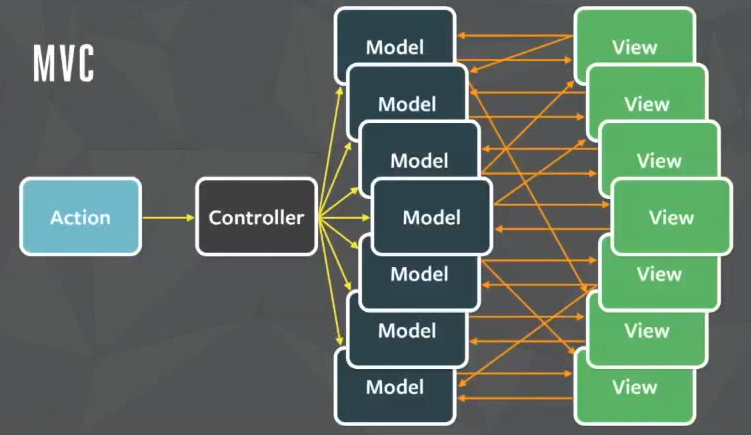
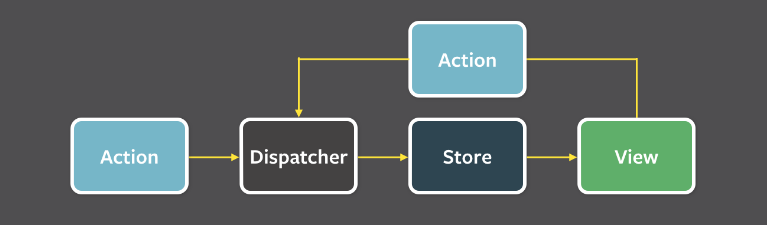

## 05. 리액트와 상태 관리 라이브러리

### 상태관리는 왜 필요한가?

많은 개발자들이 리액트 애플리케이션에 자신의 익숙한 상태관리 라이브러리를 설치하는 것을 익숙해하지만 정작 왜 상태관리가 필요한지, 또 이 상태 관리가 어떻게 리액트와 함께 작동하는지 간과하는 경우가 많다.

여기서 `상태는 어떠한 의미를 지닌 값이며 애플리케이션 시나리오에 따라 지속적으로 변경될 수 있는 값을 의미한다.`

- 웹 애플리케이션에서 상태로 분류될 수 있는 것
  1. UI: 상호작용이 가능한 모든 요소의 현재 값, 다크/라이트 모드, 라디오를 비롯한 각종 input, 알림창 노출 여부 등
  2. URL: 브라우저에서 관리되고 있는 상태값, https://www.airbnb.co.kr/rooms/34113796?adults=2 에서는 roomId=34113796, adults=2라고 하는 상태가 존재하며 이 상태는 사용자 라우팅에 따라 변경된다.
  3. 폼(form): 로딩중인지(loading), 현재 제출됐는지(submit), 접근이 불가능한지(disabled), 값이 유효한지(validation) 등
  4. 서버에서 가져온 값: 클라이언트에서 서버로 요청을 통해 가져온 값, 대표적으로 API 요청이 있다.

**상태관리에 대한 고민**

- 상태를 어디에 둘 것인가?
- 전역 변수에 둘 것 인가?
- 별도의 클로저를 만들 것인가?
- 그렇다면 그 상태가 유효한 범위는 어떻게 제한할 수 있을까?
- 상태변화에 따라 변경돼야 하는 자식요소들은 어떻게 이 상태의 변화를 감지할 것인가?
- 상태변화가 일어남에 따라 즉각적으로 모든 요소들이 변경되어 애플리케이션이 찢어지는 현상(tearing, 하나의 상태에 따라 서로 다른 결과물을 사용자에게 보여주는 현상)을 어떻게 방지할 것인가?

  - tearing 현상의 예시

    1. 상품을 장바구니에 추가한 경우, 여러 UI 요소가 업데이트되어야 한다.
       1. 장바구니 아이콘의 상품 개수
       2. 장바구니 페이지의 상품 목록
       3. 총 금액 표시

    tearing이 발생하면 다음과 같은 불일치가 나타날 수 있다.

    - 장바구니 아이콘에는 3개의 상품이 표시되지만,
    - 장바구니 페이지에는 2개의 상품만 나열되고,
    - 총 금액은 3개 상품가격을 반영한다.

    2. 채팅에서 새 메세지가 도착했을 때
       1. 채팅 목록에 새 메세지 표시
       2. 읽지 않은 메세지 카운터 업데이트
       3. 알림 표시

    tearing이 발생하면

    - 채팅 목록에는 새 메세지가 보이지만,
    - 읽지 않은 메세지 카운터는 업데이트되지 않고,
    - 알림은 표시되지 않을 수 있다.

웹 서비스에서 점차 다양한 기능이 제공됨에 따라 웹 내부에서 관리해야 할 상태도 점차 비례적으로 증가하고 있다. 점차 증가하는 상태를 효과적으로 관리하는 방법을 계속해서 고민해야 하는 시대가 도래한 것이다.

### 리액트 상태 관리의 역사

**Flux 패턴의 등장**

리액트에서는 상태관리, 특히 전역상태 관리를 어떻게 했을까?
리액트에서 Context API(상태관리가 아니라 상태주입을 도와주는 역할)를 선보인 것은 16.3 버전이었고, useContext를 선보인 것은 16.8 버전이었다. 그 전까지는, 리덕스가 나타나기 전까지 리액트 애플리케이션에서 딱히 이름을 널리 알린 상태관리 라이브러리는 없었다.

당시 웹 개발은 웹 애플리케이션이 비대해지고 상태(데이터)도 많아짐에 따라 어디서 어떤 일이 일어나서 이 상태가 변했는지 등을 추적하고 이해하기 어려운 상황이었다.



2014년 경, 리액트의 등장과 비슷한 시기에 Flux 패턴과 함께 이를 기반으로 한 라이브러리인 Flux를 소개하게 된다. 페이스북은 이러한 문제의 원인을 양방향 데이터 바인딩으로 봤다. 뷰(HTML)가 모델(JS)를 변경할 수 있으며, 반대의 경우 모델도 뷰를 변경할 수 있다. 이는 코드를 작성하는 입장에서는 간단할 수 있지만 코드의 양이 많아지고 변경 시나리오가 복잡해질수록 관리가 어려워진다.

페이스북은 양방향이 아닌 단방향으로 데이터 흐름을 변경하는 것을 제안하는데 이것이 바로 Flux 패턴의 시작이다.


- 액션(action)

  - 어떠한 작업을 처리할 액션과 그 액션 발생 시 함께 포함시킬 데이터
  - 액션타입과 데이터를 각각 정의해 이를 디스패처로 보낸다.

- 디스패처(dispatcher)

  - 액션을 스토어에 보내는 역할
  - 콜백함수 형태로 앞서 액션이 정의한 타입과 데이터를 모두 스토어에 보낸다.

- 스토어(store)

  - 실제 상태에 따른 값과 상태를 변경할 수 있는 메서드를 가지고 있다.
  - 액션타입에 따라 어떻게 이를 변경할지가 정의되어 있다.

- 뷰(view)
  - 리액트의 컴포넌트에 해당하는 부분
  - 스토어에서 만들어진 데이터를 가져와 화면을 렌더링하는 역할
  - 뷰에서도 사용자의 입력이나 행위에 따라 상태를 업데이트하고자 할 수 있는데, 이 경우에는 다음 그림처럼 뷰에서 액션을 호출하는 구조로 구성된다.



```typescript
type StoreState = {
  count: number;
};

type Action = { type: 'add'; payload: number };

// 스토어의 역할을 하는 reducer
function reducer(prevState: StoreState, action: Action) {
  const { type: ActionType } = action;

  if (ActionType === 'add') {
    return {
      count: prevState.count + action.payload,
    };
  }

  throw new Error(`Unexpected Action ${ActionType}`);
}

export default function App() {
  const [state, dispatcher] = useReducer(reducer, { count: 0 });

  function handleClick() {
    dispatcher({ type: 'add', payload: 1 });
  }

  return (
    <div>
      <h1>{state.count}</h1>
      <button onClick={handleClick}>+</button>
    </div>
  );
}
```

단방향 데이터 흐름 방식의 불편함도 존재한다. 사용자의 입력에 따라 데이터를 갱신하고 화면을 어떻게 업데이트해야 하는지도 코드로 작성해야 하므로 코드의 양이 많아진다. 그러나 데이터의 흐름은 모두 액션이라는 한 방향(단방향)으로 줄어들므로 데이터의 흐름을 추적하기 쉽고 코드를 이해하기 한결 수월해진다.

**시장 지배자 리덕스의 등장**

리액트와 단방향 데이터 흐름이 점점 두각을 드러내던 와중에 등장한 것이 바로 리덕스(Redux)이다. 리덕스 또한 최초에는 Flux 구조를 구현하기 위해 만들어진 라이브러리 중 하나였다. 이에 한 가지 더 특별한 것은 여기에 Elm 아키텍쳐를 도입했다는 것이다.

Elm은 웹페이지를 선언적으로 작성하기 위한 언어이다. Elm은 model, update, view 이 3가지가 Elm 아키텍처의 핵심이다. 즉, Elm은 Flux와 마찬가지로 데이터 흐름을 3가지로 분류하고, 이를 단방향으로 강제해 웹 애플리케이션의 상태를 안정적으로 관리하고자 노력했다. 그리고 리덕스는 이 Elm을 아키텍처의 영향을 받아 작성됐다.

`리덕스는 하나의 상태 객체를 스토어에 저장해 두고, 이 객체를 업데이트하는 작업을 디스패치에 업데이트를 수행한다. 이러한 작업은 reducer 함수로 발생시킬 수 있는데, 이 함수의 실행은 웹 애플리케이션 상태에 대한 완전히 새로운 복사본을 반환한 다음, 애플리케이션에 이 새롭게 만들어진 상태를 전파하게 된다.`

하나의 글로벌 상태 객체를 통해 이 상태를 하위 컴포넌트에 전파할 수 있기 때문에 props응 깊이 전파해야 하는 이른바 props drilling 문제를 해결할 수 있었고, 스토어가 필요한 컴포넌트라면 단지 connect만 쓰면 스토어에 바로 접근할 수 있었다.

```typescript
import React from 'react';
import { connect } from 'react-redux';
import { increment, decrement } from './actions';

function Counter({ count, increment, decrement }) {
  return (
    <div>
      <h1>Counter: {count}</h1>
      <button onClick={increment}>+</button>
      <button onClick={decrement}>-</button>
    </div>
  );
}

// mapStateToProps: 리덕스 스토어의 상태를 컴포넌트의 props로 매핑
const mapStateToProps = (state) => ({
  count: state.counter.count,
});

// mapDispatchToProps: 리덕스 액션을 컴포넌트의 props로 매핑
// increment, decrement는 액션 생성 함수
// export const increment = () => ({
//   type: INCREMENT,
// });
const mapDispatchToProps = {
  increment,
  decrement,
};

// connect를 사용하여 함수형 컴포넌트를 리덕스 스토어와 연결
export default connect(mapStateToProps, mapDispatchToProps)(Counter);
```

**리덕스의 단점**

단순히 하나의 상태를 바꾸고 싶어도 해야 할 일이 많았다. 먼저 액션 타입 선언과 액션을 수행할 액션 생성 함수를 만들고, dispatcher와 selector도 필요하다. 또 새로운 상태가 어떻게 기존의 리듀서 함수 내부에서 어떤 식으로 변경되어야 하는지 정의해야 했다.
한마디로 `하고자 하는 일에 비해 보일러플레이트가 너무 많다.`

이는 리덕스가 처음 등장했을 때 받던 비판으로, 지금은 이러한 작업이 많이 간소화됐다.(리덕스 툴킷 라이브러리의 등장으로 많이 간소화됨)

**훅의 탄생, 그리고 React Query와 SWR**

훅의 등장으로 이전에는 볼 수 없었던 방식의 상태관리가 등장하는데 바로 `React Query`와 `SWR`이다.

두 라이브러리 모두 외부에서 데이터를 불러오는 fetch를 관리하는데 특화된 라이브러리이지만, API 호출에 대한 상태를 관리하고 있기 때문에 `HTTP 요청에 특화된 상태관리 라이브러리`로 볼 수 있다.

실제로 이 2가지 라이브러리를 사용해 보면 생각보다 애플리케이션의 많은 부분에서 상태를 관리하는 코드가 사라진다.

```javascript
import useSWR from 'swr';

const fetcher = (url) => fetch(url).then(({ json }) => json());

export default function App() {
  // api 주소는 키로도 사용된다
  // 이후 다른 곳에서 동일한 키로 호출하면 useSWR에서 관리하는 캐시의 값을 활용한다
  const { data, error } = useSWR(
    'https://api.github.com/repos/vercel/swr',
    fetcher
  );

  if (error) return 'An error has occurred.';
  if (!data) return 'Loading...';

  return (
    <div>
      <p>{JSON.stringify(data)}</p>
    </div>
  );
}
```

**Recoil, Zustand, Jotai, Valtio에 이르기까지**

SWR과 React Query가 HTTP 요청에 대해서만 쓸 수 있다면 좀 더 범용적으로 쓸 수 있는 상태관리 라이브러리엔 어떤 변화가 있었을까?

훅이라는 새로운 패러다임 등장에 따라, 훅을 활용해 상태를 가져오거나 관리할 수 있는 다양한 라이브러리가 등장하게 된다.

```javascript
// Recoil
const counter = atom({ key: 'counter', default: 0 });
const todoList = useRecoilValue(counter);

// Jotai
const countAtom = atom(0);
const [count, setCount] = useAtom(countAtom);

// Zustand
const useCounterStore = create((set) => ({
  count: 0,
  increase: () => set((state) => ({ count: state.count + 1 })),
}));
const count = useCounterStore((state) => state.count);

// Valtio
const state = proxy({ count: 0 });
const snap = useSnapshot(state);
state.count++;
```

이러한 라이브러리의 등장은 기존 상태관리 라이브러리의 아쉬운 점으로 지적받던 전역상태 관리 패러다임에서 벗어나 개발자가 원하는 만큼의 상태를 지역적으로 관리하는 것을 가능하게 만들었고, 훅을 지원함으로써 함수 컴포넌트에서 쉽게 사용할 수 있다는 정점 또한 가지고 있다.
