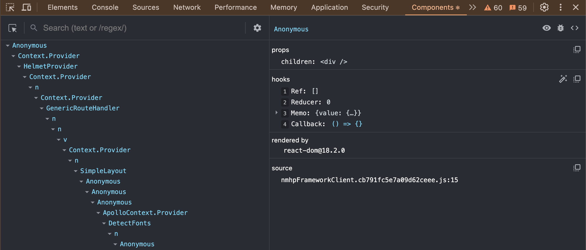
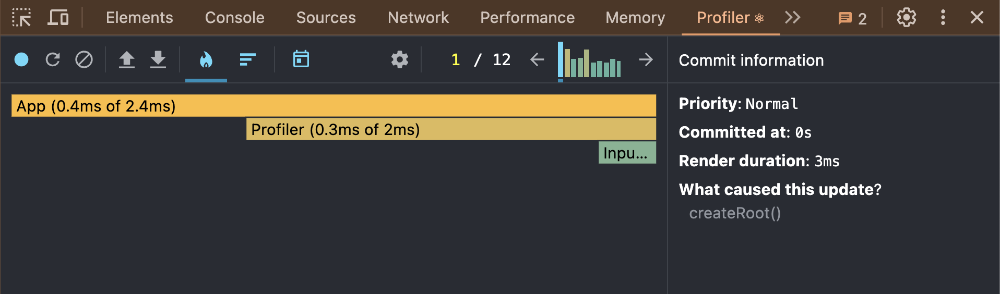
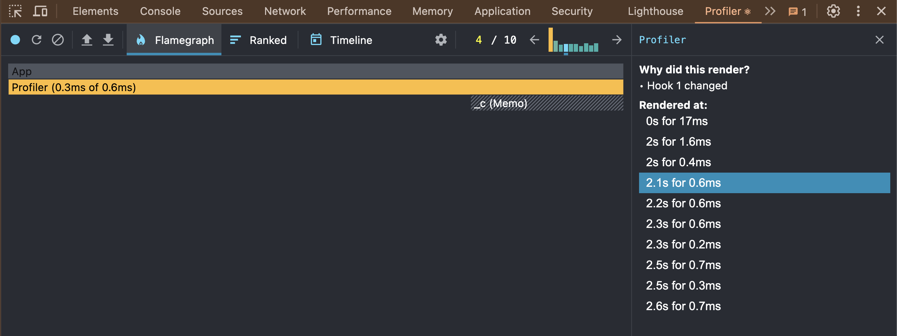
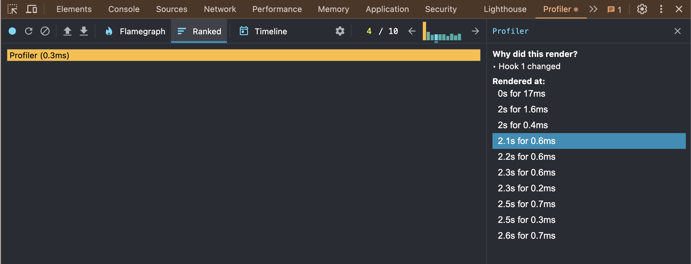
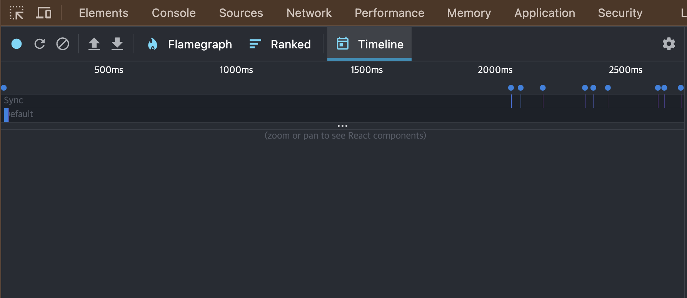

## 06. 리액트 개발 도구로 디버깅하기

### 리액트 개발 도구란?

- 리액트 팀은 리액트 애플리케이션의 원활한 개발을 위한 개발도구인 `react-dev-tools`를 만들어 제공하고 있다.
- 리액트 웹 뿐만 아니라 리액트 네이티브 등 다양한 플랫폼에서 사용할 수 있다.
- 이 개발도구를 사용하는 방법은 여러 가지가 있지만 웹 개발 환경에서 가장 편리하게 사용할 수 있는 방법은 브라우저 확장 프로그램을 사용하는 것이다.

### 리액트 개발 도구 활용하기

- 크롬 우측 상단, 리액트 로고의 색
  - 회색: 리액트 개발도구가 정상적으로 접근할 수 없는 페이지 또는 리액트로 개발 되지 않은 페이지
  - 빨간색: 개발 모드인 리액트 웹 애플리케이션에 정상적으로 리액트 개발도구가 접근할 수 있음
  - 파란색: 실제 프로덕션에 배포되어 있는 웹 애플리케이션

`Components`, `Profiler` 두 탭이 리액트 개발자 도구에서 제공하는 디버그 도구이다.

### 컴포넌트

- 현재 리액트 애플리케이션의 컴포넌트 트리를 확인할 수 있다.
- 단순히 컴포넌트의 구조 뿐만아니라 props와 내부 hooks 등 다양한 정보를 확인할 수 있다.
- 컴포넌트 트리에서 만약 익명함수로 선언되어 있다면 Anonymous라는 이름으로 컴포넌트를 보여준다.
  - 컴포넌트를 기명함수로 선언하는 것은 개발도구에서 확인하는 데 많은 도움을 준다.
  - 만약 함수를 기명함수로 바꾸기 어렵다면 함수에 displayName 속성을 추가하는 방법도 있다.
  - 개발모드에서 확인하는 리액트 컴포넌트 트리가 아닌 리액트에서 빌드한 트리를 확인하는 경우 기명함수로 선언한다 하더라도 terser 등의 압축도구 등이 컴포넌트명을 단순하게 난수화하기 때문에 확인하기가 어려워진다. 이와 마찬가지로 displayName의 경우에도 빌드 도구가 사용하지 않는 코드로 인식해 삭제할 가능성도 있다. 따라서 displayName과 함수명은 개발 모드에서만 제한적으로 참고하는 것이 좋다.

- 빨간색 경고 이모티콘이 나타나면 해당 애플리케이션이 strict mode로 렌더링되지 않았다는 것을 의미한다.
- 눈 아이콘을 누르면 해당 컴포넌트가 HTML의 어디에서 렌더링됐는지 확인할 수 있다.
- 벌레 아이콘을 클릭하면 콘솔(console) 탭에 해당 컴포넌트의 정보가 console.log를 실행해 기록된 것을 확인할 수 있다.
- 소스코드 아이콘을 클릭하면 해당 컴포넌트의 소스코드를 확인할 수 있다.(노란색 강조표시) 소스코드가 프로덕션 모드에서 빌드되어 최대로 압축되어 있기때문에 보기 어려울 수 있다. 이를 해결하기 위해 왼쪽 하단에 `{}`를 클릭하면 여백과 줄바꿈을 거쳐 읽기 쉬운 형태로 볼 수 있다.
- props를 마우스 우클릭하면 props 정보를 복사하는 `Copy value to clipboard`와 window.$r에 해당 정보가 담기는 `Store as global` 버튼이 나온다. `Store as global`를 선택하고 콘솔로 이동하면 해당 변수가 담겨 있는 것을 볼 수 있다.
- 값이 함수인 props를 누르면 해당 함수가 선언된 코드로 이동할 수 있는 `Go to definition`도 나온다. 값을 더블 클릭해 해당 값을 원하는 내용으로 수정할 수도 있다.
- hooks에서는 컴포넌트에서 사용중인 훅 정보를 확인할 수 있다. 여기서 use가 생략된 이름으로 나타난다.
  - 훅도 마찬가지로 기명함수를 넘겨주면 실행되는 함수 이름을 확인할 수 있다.
- `rendered by`는 해당 컴포넌트를 렌더링 한 주체가 누구인지 확인할 수 있다. 프로덕션 모드에서는 react-dom의 버전만 확인할 수 있지만 개발 모드에서는 해당 컴포넌트를 렌더링한 부모 컴포넌트까지 확인할 수 있다.

### 프로파일러

- 컴포넌트 메뉴가 정적인 현재 리액트 컴포넌트 트리의 내용을 디버깅하기 위한 도구라면 프로파일러는 리액트가 렌더링하는 과정에서 발생하는 상황을 확인하기 위한 도구이다.
- 리액트 애플리케이션이 렌더링되는 과정에서 어떤 컴포넌트가 렌더링됐는지, 또 몇 차례나 렌더링이 일어났으며 어떤 작업에서 오래 걸렸는지 등 컴포넌트 랜더링 과정에서 발생하는 일을 확인할 수 있다.
- 이 메뉴는 랜더링 과정에 개입해 디버깅에 필요한 내용을 기록해야 하기 때문에 프로덕션 빌드로 실행되는 리액트 애플리케이션에서는 사용할 수 없다. 프로파일러 메뉴가 어떻게 작동되는지 확인하고 싶다면 개발 모드로 실행되는 리액트 애플리케이션을 준비해야 한다.
- 톱니 모양의 버튼을 누르면 설정창이 나타난다.
  - General 탭의 Highlight updates when components render: 컴포넌트가 랜더링될 때마다 해당 컴포넌트에 하이라이트를 표시한다.
  - Debugging 탭의 Hide logs second render in Strict mode: 리액트 애플리케이션이 엄격 모드에서 실행되는 경우, 원활한 디버깅을 위해 useEffect 등이 두 번씩 작동하는 의도적인 작동이 숨겨져 있다. 이로 인해 useEffect 안에 넣은 console.log가 두 번씩 찍히기도 하는데, 이를 막고 싶다면 해당 버튼을 비활성화하면 된다. 프로덕션 모드에서는 해당 옵션과 관계없이 정상적으로 한 번씩 출력된다.
  - Profiler 탭의 Record why each component rendered while profiling: 프로파일링 도중 무엇 때문에 컴포넌트가 랜더링됐는지 기록한다. 애플리케이션 속도가 조금 느려질 수는 있지만 디버깅에 도움이 되는 옵션이므로 켜두는 것이 좋다.

- 첫 번째 버튼은 `Start Profiling(프로파일링 시작)` 버튼으로, 이 버튼을 누르면 프로파일링이 시작된다. 프로파일링이 시작되면 곧바로 적색 동그라미로 바뀌며, 프로파일링 중이라는 메세지가 나타난다. 그리고 다시 누르면 프로파일링이 중단되고 프로파일링 결과가 나타난다.
- 두 번째 버튼은 `Reload and Start profiling(새로고침 후 프로파일링 시작)` 버튼으로, 이 버튼을 누르면 웹페이지가 새로고침되면서 이와 동시에 프로파일링이 시작된다.
- 세 번째 버튼은 `Clear profiling data` 버튼으로, 프로파일링된 현재 내용을 모두 지우는 버튼이다. 프로파일링된 기록을 모두 삭제할 수 있다.
- 네 번째, 다섯 번째 버튼은 각각 `Load Profile(프로파일 불러오기)`, `Save Profile(프로파일 저장하기)` 버튼으로, 프로파일링 결과를 저장하고 불러오는 버튼이다. 프로파일링 결과를 저장하면 사용자의 브라우저에 해당 프로파일링 정보가 담긴 JSON 파일이 다운로드되며, 이 파일을 다시 로딩해 프로파일링 정보를 불러올 수도 있다.

- 불꽃 모양의 아이콘을 가진 Flamegraph 탭에서는 렌더 커밋별로 어떠한 작업이 일어났는지 나타낸다. 너비가 넓을수록 해당 컴포넌트를 렌더링하는 데 오래 걸렸다는 것을 의미한다. 당연하게도 렌더링이 가장 오래 걸리는 컴포넌트는 모든 컴포넌트를 렌더링해야 하는 루트 컴포넌트이다.
- 각 컴포넌트에 마우스 커서를 가져다 대면 렌더링 정보 이외에도 오른쪽에는 해당 커밋과 관련된 추가적인 정보를 확인할 수 있다.
- 이 메뉴는 컴포넌트 렌더링이 얼마나 걸렸는지 확인할 수 있을뿐더러 렌더링되지 않은 컴포넌트에 대한 정보도 확인할 수 있다.
- 렌더링되지 않은 컴포넌트는 회색으로 표시되며 'Did not render'라는 메세지가 표시된다. 이를 활용하면 개발자가 의도한대로 메모이제이션이 작동하고 있는지, 혹은 특정 상태 변화에 따라서 렌더링이 의도한 대로 제한적으로 발생하고 있는지 확인하는데 많은 도움을 얻을 수 있다.

- Ranked chart는 해당 커밋에서 렌더링하는데 오랜 시간이 걸린 컴포넌트를 순서대로 나열한 그래프이다.
- 앞선 Flamegraph와 차이점은 모든 컴포넌트를 보여주는 것이 아니라 단순히 렌더링이 발생한 컴포넌트만 보여준다는 데 있다.

- Timeline은 시간이 지남에 따라 컴포넌트에서 어떤 일이 일어났는지 확인할 수 있다.
- Timeline은 리액트 18 이상의 환경에서만 확인할 수 있다.
- Timeline은 시간에 흐름에 따라 리액트가 작동하는 내용을 추적하는데 유용하다. 시간단위로 프로파일링 기간동안 무슨 일이 있었는지, 무엇이 렌더링됐고, 또 어느 시점에 랜더링됐는지, 리액트의 유휴시간은 어느 정도였는지 등을 자세히 확인할 수 있다.
- 예를 들어 input에 글자를 입력하면서 state의 값이 업데이트되고, 이 값이 동기로 업데이트됐는지, 또 언제 업데이트가 이뤄졌는지 등을 확인할 수 있다.
