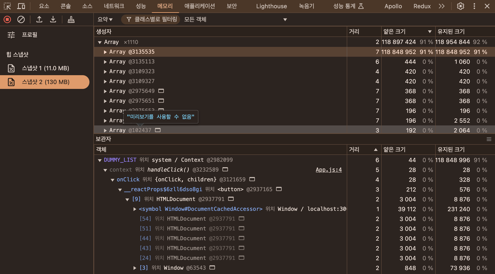
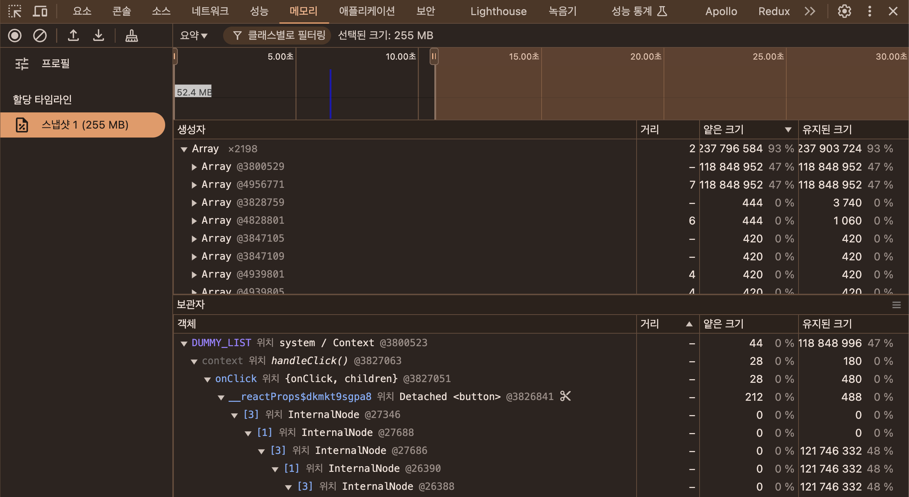
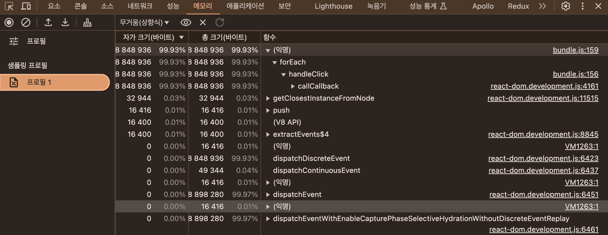

## 07. 크롬 개발자 도구를 활용한 애플리케이션 분석

리액트에서 발생하는 문제를 디버깅하기 위해서는 리액트 개발도구로 충분히 할 수 있지만, 애플리케이션에서 발생하는 버그와 디버깅 이슈는 리액트 밖에서 일어날 때도 있다. 일반적인 브라우저 환경에서 발생할 수 있는 문제를 디버깅할 수 있는 도구를 브라우저 개발자 도구라고 한다.

### 크롬 개발자 도구란?

- 크롬 개발자 도구란 크롬에서 제공하는 개발자용 도구로, 웹페이지에서 일어나는 거의 모든 일을 확인할 수 있는 강력한 개발도구이다.
- `크롬 개발자 도구에서 웹사이트를 제대로 디버깅하고 싶다면 시크릿 모드 또는 프라이빗 모드라 불리는 개인정보 보호 모드에서 페이지와 개발자 도구를 여는 것을 권장한다.` 그 이유는 바로 브라우저에 설치되어 있는 각종 확장 프로그램 때문이다. 브라우저 확장 프로그램은 웹페이지 방문 시 확장 프로그램의 실행을 위해 전역변수나 HTML 요소에 실제 웹 애플리케이션이 제공하지 않은 다른 정보를 추가할 수 있다. 그리고 이러한 정보는 개발자가 추가한 정보가 아닐뿐더러 다른 사용자에게는 볼 수 없는 정보로서 디버깅하는 데 방해가 될 수 있다.

### 요소 탭

- 이곳에서는 현재 웹페이지를 구성하고 있는 HTML, CSS 등의 정보를 확인할 수 있다.
- 배너와 같이 코드에 의해 클래스나 속성값이 동적으로 제어되는 DOM이 있다면 요소의 중단점을 사용해 디버깅할 수 있다.

**요소 정보**

- 스타일
- 계산됨
- 레이아웃: CSS 그리드나 레이아웃과 관련된 정보를 확인할 수 있다.
- 이벤트 리스너: 현재요소에 부착된 각종 이벤트 리스너를 확인할 수 있다. 상위버튼을 해제하면 딱 해당요소에 명확하게 부착된 이벤트만 볼 수 있다. 그러나 이벤트 버블링 등으로 이벤트를 발생시키는 경우에는 확인할 수 없다.
- DOM 중단점: 앞서 설명한 중단점이 있는지 알려주는 탭이다.
- 속성: 해당 요소가 가지고 있는 모든 속성값을 나타낸다.
- 접근성: 접근성이란 웹 이용에 어려움을 겪는 장애인, 노약자를 위한 스크린리더기 등이 활용되는 값을 말한다. 접근성 탭에서는 이러한 접근성 정보를 확인할 수 있다.

### 소스 탭

- 소스 탭에서는 웹 애플리케이션을 불러오기 위해 실행하거나 참조된 모든 파일을 확인할 수 있다.
- 자바스크립트 파일부터, CSS, HTML, 폰트까지 다양한 파일 정보를 확인할 수 있다.
- 파일열기 버튼을 누르면 create-react-app 기반으로 생성된 다양한 파일을 찾아볼 수 있다.
  - ex) 파일열기 > tsx > 해당 파일 클릭
  - 이렇게 찾은 파일은 실제로 코드 내용까지 확인할 수 있다.
- 소스 중단점을 생성해 자바스크립트 실행을 중단시키고 디버깅을 수행할 수 있다.
- 사용중인 라이브러리에서 버그가 의심되는 지점을 디버깅하거나 실제로 소스코드상에서 어떤 식으로 작동하는지 확인하고 싶을 때 매우 유용하다.

**소스 정보**

- 감시: 감시하고 싶은 변수를 선언하고, 해당 변수의 정보를 확인할 수 있는 메뉴, 감시로 확인할 수 없는 값은 `<not availble>`로 표시된다.
- 중단점: 현재 웹사이트에서 추가한 중단점을 확인할 수 있다.
- 범위: 중단점에서의 스코프를 의미한다. 로컬은 현재 로컬 스코프를 의미하며, 이 스코프에서 접근할 수 있는 값을 확인할 수 있다. 이 밖에도 클로저, 전역 스코드 등을 확인할 수 있다.
- 호출 스택: 호출 스택에서는 현재 중단점의 콜스택을 확인할 수 있다. 이 메뉴를 활용하면 자바스크립트 코드가 실행되며 생성되는 실행 컨텍스트가 어떻게 저장되어 현재 모습을 하고 있는지 직접 볼 수 있다.
- 전역 리스너: 현재 전역 스코프에 추가된 리스너 목록을 확인할 수 있다.
- XHR/가져오기, DOM, 이벤트 리스너, CSP 위반 중단점: 소스의 중단점 이외에 다양한 중단점을 확인할 수 있다.

### 네트워크 탭

- 해당 웹페이지를 접속하는 순간부터 발생하는 모든 네트워크 관련 작동이 기록된다.
- HTTP 요청부터 웹 소켓에 이르기까지, 웹사이트가 외부 데이터와 통신하는 정보를 확인할 수 있다.
- 스크린샷 캡쳐 기능을 활용하면 네트워크 요청 흐름에 따라 웹페이지가 어떻게 로딩되고 있는지 확인할 수 있다.

**네트워크 탭을 통해 집중적으로 확인해 봐야하는 점**

- 불필요한 요청 또는 중복되는 요청이 없는지
- 웹페이지 구성에 필요한 리소스 크기가 너무 크지 않은지
- 리소스를 불러오는 속도는 적절한지 또는 너무 속도가 오래 걸리는 리소스는 없는지
- 리소스가 올바른 우선순위로 다운로드되어 페이지를 자연스럽게 만들어가는지

### 메모리 탭

- 애플리케이션에서 발생하는 메모리 누수, 속도 저하, 혹은 웹페이지 프리징 현상을 확인할 수 있는 도구이다.
- 다른 탭과는 다르게 메모리 탭 그 자체만으로는 아무것도 할 수 없다. 리액트 개발도구의 프로파일과 비숫하게 프로파일링 작업을 거쳐야 원하는 정보를 볼 수 있다.

**자바스크립트 인스턴스 VM 선택**

- 하단에 자바스크립트 인스턴스 VM 선택 항목을 보면 현재 실행중인 자바스크립트 VM 인스턴스를 확인할 수 있다.
- 여기서 디버깅하고 싶은 자바스크립트 VM 환경을 선택하면 된다.
- 그리고 환경별 힙 크기를 볼 수 있는데, 실제 해당 페이지가 자바스크립트 힙을 얼마나 점유하고 있는지 나타낸다.
- 이 크기는 자바스크립트 실행에 따라 실시간으로 바뀐다.
- 이 크기만큼 사용자에게 부담을 주기 때문에 불필요하게 크기가 늘어나지 않는지 눈여겨 볼 필요가 있다.

**힙 스냅샷**

- 힙 스냅샷은 현재 페이지의 메모리 상태를 확인해 볼 수 있는 매모리 프로파일 도구이다.
- 힙 스냅샷을 촬영하는 시점을 기준으로 마치 사진으로 촬영하듯 메모리 현황을 보여준다.

```javascript
const DUMMY_LIST = [];

const App = () => {
  const handleClick = () => {
    Array.from({ length: 10_000_000 }).forEach((_, idx) =>
      DUMMY_LIST.push(Math.random() * idx)
    );

    window.alert('complete!');
  };

  return <button onClick={handleClick}>BUG</button>;
};

export default App;
```



- 버튼을 누르기 전의 힙 스냅샷과 버튼을 누른 후 힙 스냅샷을 비교해보면 10MB에서 129MB로 엄청나게 크기가 증가한 것을 확인할 수 있다.
- 이 메모리 차이의 원인을 정확하게 파악하기 위해 모든 객체 메뉴를 클릭하고 스냅샷1과 스냅샷2 사이에 할당된 객체를 클릭해 얕은 크기 항목을 기준으로 내림차순으로 정렬해보자.
- 두 스냅샷 간 사이에 일어났던 유저 인터렉션, 즉 버튼 클릭으로 인해 이러한 메모리 사용량 차이가 발생했다는 것을 알 수 있다.
- 메모리를 크개 차지하고 있는 것이 객체(배열)이라는 점, 그리고 이 액션이 handleClick이라는 함수를 통해 빚어졌다는 점도 파악할 수 있다.
- 스냅샷 촬영을 제대로 활용하려면 스냅샷을 두 개 이상을 촬영한 다음, 그 차이만 비교하는 것이 훨씬 수월하다.

**얕은 크기와 유지된 크기의 차이점**

- 얕은 크기란 객체 자체가 보유하는 메모리 바이트의 크기를 나타낸다.
- 유지된 크기란 해당 객체 자체뿐만 아니라 다른 부모가 존재하지 않는 모든 자식 객체들의 크기까지 더한 값이다.
- 메모리 누수를 찾을 때는 얕은 크기(객체 자체의 크기)는 작으나, 유지된 크기(객체가 참조하고 있는 모든 객체들의 크기)가 큰 객체를 찾아야 한다.
- 두 크기의 차이가 큰 객체는 다른 객체를 참조하고 있다는 뜻이며, 이는 해당 객체가 복잡한 참조 관계를 가지고 있다는 뜻이다.

**타임라인 할당 계측**

- 힙 스냅샷 촬영은 해당 시점의 메모리 내용만 촬영하는 프로파일링 기법이지만, 타임라인 할당 계측은 시간의 흐름에 따라 메모리 변화를 확인할 수 있는 기능이다.
- 시간의 흐름에 따른 메모리 변화를 비롯해 메모리 변화를 일으킨 변수가 무엇인지, 그리고 해당 변수가 어느정도 크기를 차지하고 있는지 등을 확인할 수 있다.
- 시간의 흐름에 따라 메모리의 변화를 모두 기록하기 때문에 상대적으로 많은 부담이 발생한다.



**할당 샘플링**

- 할당 샘플링은 시간에 흐름에 따라 발생하는 메모리 점유를 확인할 수 있다는 점에서 타임라인 할당 계측과 비슷하지만, 자바스크립트 실행 스택별로 분석할 수 있고, 이 분석을 함수 단위로 한다는 차이점이 있다.

```javascript
const DUMMY_LIST = [];

const App = () => {
  const handleClick = () => {
    Array.from({ length: 10_000_000 }).forEach((_, idx) =>
      DUMMY_LIST.push(Math.random() * idx)
    );

    window.alert('complete!');
  };

  return <button onClick={handleClick}>BUG</button>;
};

export default App;
```



- 할당 샘플링을 무거운 순으로 정렬하면 가장 많은 바이트를 차지한 함수의 작업이 맨 위로 올라가는데, 여기서는 익명함수가 문제임을 확인할 수 있다.
- 문제가 되는 함수뿐만 아니라 오른쪽 파일명을 누르거나 마우스 우클릭을 하면 소스 패널에 표시를 선택해 해당 함수가 어느 파일에서 어떻게 정의 됐는지도 확인할 수 있다.
- 할당 샘플링은 타임라인 할당 계측과 유사하지만 프로파일링할 때 브라우저에 주는 부담을 최소화할 수 있어 장기간에 걸쳐 디버깅을 수행할 때 유리하다.
- 만약 메모리 누수가 짐작되지만 정확히 어디에서 발생하는지 확인하기 어려워 힙 스냅샷을 촬영해 비교하기 어려운 경우, 오랜 기간 메모리 누수가 의심되어 프로파일링을 장기간 수행해야 하는 경우에는 할당 샘플링을 활용하는 것이 좋다.

### Next.js 환경 디버깅하기

이전까지 한 실습 내용은 모두 `클라이언트 자바스크립트 환경`을 디버깅한 예제로, 사용자 기기의 성능과 스펙에 따라 같은 메모리 누수라도 다른 결과를 낳게 될 것이다. 비교적 최신 기기를 사용하는 경우라면 메모리 누수로 인한 영향을 비교적 적게 받겠지만, 오래된 기기를 사용하는 사용자라면 이러한 메모리 누수로 인해 치명적인 영향을 받을 것이다.

`서버 사이드 렌더링을 수행하는 자바스크립트 환경`에서는 메모리 누수가 발생한다면 서버 자체에 부담이 발생할 것이고, 서버의 부담은 곧 모든 사용자가 서비스를 사용할 수 없는 심각한 상황을 초래할 것이다.

서버 환경도 동일하게 크롬 개발자 도구로 디버깅이 가능하다.
