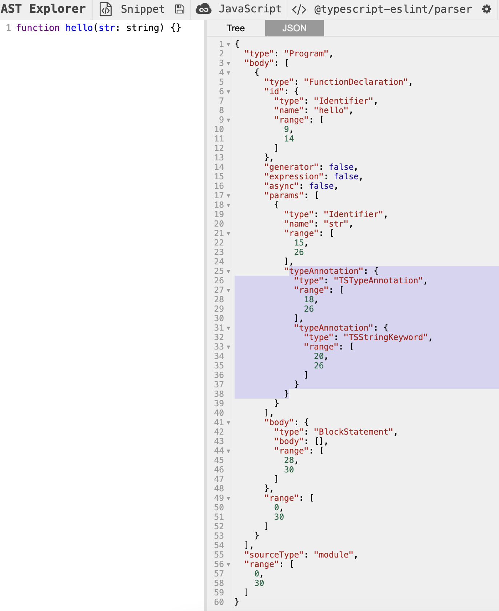
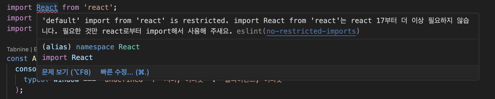
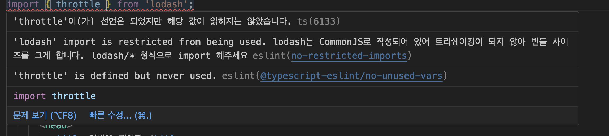

## 08. 좋은 리액트 코드 작성을 위한 환경 구축하기

### ESLint를 활용한 정적 코드 분석

`정적 코드 분석`이란 코드의 실행과 별개로 코드 그 자체만으로 코드 스멜(잠재적으로 버그를 야기할 수 있는 코드)을 찾아내어 문제의 소지가 있는 코드를 사전에 수정하는 것을 의미한다. 자바스크립트에서 생태계에서 가장 많이 사용되는 정적 코드 분석 도구는 바로 `ESLint`이다.

### ESLint 살펴보기

ESLint는 자바스크립트 코드를 정적 분석해 잠재적인 문제를 발견하고 나아가 수정까지 도와주는 도구이다. 그렇다면 ESLint는 어떻게 자바스크립트 코드를 읽어서 분석하는 것일까? 간단하게 요약하면 다음과 같다.

1. 자바스크립트 코드를 문자열로 읽는다.
2. 자바스크립트 코드를 분석할 수 있는 파서(parser)로 코드를 구조화한다.
3. 2번에서 구조화한 트리를 AST(Abstract Syntax Tree)라 하며, 이 구조화된 트리를 기준으로 각종 규칙과 대조한다.
4. 규칙과 대조했을 때 이를 위반하는 코드를 알리거나(report) 수정한다(fix).

여기서 주목해야 할 것은 1번 과정에서 읽은 코드를 구조화하는 과정인 2번이다. 자바스크립트를 분석하는 파서에는 여러가지가 있는데, ESLint는 기본값으로 `espree`를 사용한다.

```javascript
function hello(str) {}
```

이 코드를 [espree로 분석](https://astexplorer.net)하면 다음과 같이 JSON 형태로 구조화된 결과를 얻을 수 있다.

```json
{
  "type": "Program",
  "start": 0,
  "end": 22,
  "range": [0, 22],
  "body": [
    {
      "type": "FunctionDeclaration",
      "start": 0,
      "end": 22,
      "range": [0, 22],
      "id": {
        "type": "Identifier",
        "start": 9,
        "end": 14,
        "range": [9, 14],
        "name": "hello"
      },
      "expression": false,
      "generator": false,
      "async": false,
      "params": [
        {
          "type": "Identifier",
          "start": 15,
          "end": 18,
          "range": [15, 18],
          "name": "str"
        }
      ],
      "body": {
        "type": "BlockStatement",
        "start": 20,
        "end": 22,
        "range": [20, 22],
        "body": []
      }
    }
  ],
  "sourceType": "module"
}
```

espree나 다른 파서로 자바스크립트/타입스크립트 코드를 분석해 보고 싶다면 AST explorer를 방문해보자. 앞의 코드는 AST explorer에서 파서를 espree로 설정하고 분석한 결과이다.

espree 같은 분석 도구는 단순히 변수인지, 함수인지, 함수명은 무엇인지 등을 파악하는 것이 아니라 코드의 정확한 위치와 같은 아주 세세한 정보도 분석해 알려준다. 이러한 자세한 정보가 있어야만 ESLint나 Prettier 같은 도구가 줄바꿈, 들여쓰기 등을 파악할 수 있게 된다.

타입스크립트의 경우도 마찬가지로 @typescript-eslint/typescript-estree라고 하는 espree 기반 파서가 있으며, 이를 통해 타입스크립트 코드를 분석해 구조화한다.



ESLint가 espree로 코드를 분석한 결과를 바탕으로, 어떤 코드가 잘못된 코드이며 어떻게 수정해야 할지도 정해야 한다. 이를 ESLint 규칙(rules)이라고 하며, 특정한 규칙의 모음을 plugins라고 한다.

예를 들어, 코드에서 debugger 사용을 금지하고 싶다고 가정해보자. debugger는 코드 개발 과정에서만 사용해야 하는 구문으로, 프로덕션 애플리케이션에서는 절대 존재해서는 안되는 구문이다. 이 구문을 ESLint를 이용해 사용을 금지하는 규칙을 만든다고 가정해보자. 먼저 debugger가 espree로 분석하면 어떻게 변환되는지 알아야 한다. debugger를 espree로 분석하면 다음과 같은 결과를 확인할 수 있다.

```javascript
debugger;
```

```json
{
  "type": "Program",
  "start": 0,
  "end": 8,
  "range": [0, 8],
  "body": [
    {
      "type": "DebuggerStatement",
      "start": 0,
      "end": 8,
      "range": [0, 8]
    }
  ],
  "sourceType": "module"
}
```

body의 type이 DebuggerStatement를 반환하는 것을 확인할 수 있다. 그리고 이 debugger 사용을 제한하는 규칙인 no-debugger를 확인해보자.

```javascript
module.exports = {
  meta: {
    type: 'problem',

    docs: {
      description: 'Disallow the use of `debugger`',
      recommended: true,
      url: 'https://eslint.org/docs/latest/rules/no-debugger',
    },

    fixable: null,
    schema: [],

    messages: {
      unexpected: "Unexpected 'debugger' statement.",
    },
  },

  create(context) {
    return {
      DebuggerStatement(node) {
        context.report({
          node,
          messageId: 'unexpected',
        });
      },
    };
  },
};
```

먼저 meta라는 이름에서 알 수 있듯 해당 규칙과 관련된 메타 정보를 나타낸다. 규칙을 어겼을 때 반환하는 경고 문구인 messages, 문서화에 필요한 정보인 docs, eslint --fix로 수정했을 때 수정가능한지 여부를 나타내는 fixable 등을 확인할 수 있다.

그리고 create가 실제로 코드에서 문제점을 확인하는 곳이다. create에 있는 함수는 espree로 만들어진 AST 트리를 실제로 순회해, 여기서 선언한 특정 조건을 만족하는 코드를 찾고, 이러한 작업을 코드 전체에서 반복한다. 즉, 여기서 DebuggerStatement를 만나면 해당 노드를 리포해 debugger를 사용했다는 것을 알려준다.

### eslint-plugin과 eslint-config

**eslint-plugin**

`eslint-plugin`이라는 접두사를 시작하는 플러그인은 앞서 언급했던 `규칙을 모아놓은 패키지`이다. 예를 들어 `eslint-plugin-import`라는 패키지는 자바스크립트에서 다른 모듈을 불러오는 import와 관련된 다양한 규칙을 제공한다. 또 한 가지 눈여겨봐야 할 패키지는 `eslint-plugin-react`이다. 만약 코드를 작성하다가 JSX 배열에 키를 선언하지 않았다는 경고 메세지를 본 적이 있다면 바로 이 `eslint-plugin-react`가 제공하는 규칙 중 하나인 react/jsx-key가 경고 메세지를 보여준 것이다. 만약 이러한 규칙이 없다면 브라우저의 콘솔에서 경고해 주는 내용을 확인해야만 수정이 가능하다. 비록 ESLint는 말 그대로 코드 정적 분석 도구라서 key가 유니크한 값인지까지는 확인해 줄 수 없지만 존재 여부만 확인해도 큰 도움을 받을 수 있다. JSX 배열에서 key가 누락된 경우에 경고를 보여주기 위해 이 규칙을 export하는 create 함수를 살펴보면 개발자 입장에서는 별거 아닌 것 같아 보이는 규칙을 위해 엄청나게 복잡한 코드가 숨겨져 있다는 것을 알 수 있다.

**eslint-config**

eslint-plugin이 리액트, import와 같이 특정 프레임워크나 도메인과 관련된 규칙을 묶어서 제공하는 패키지라면 `eslint-config`는 이러한 `eslint-plugin`을 한데 묶어서 완벽하게 한 세트로 제공하는 패키지라 할 수 있다.

예를 들어, 어떤 조직에 여러 자바스크립트 저장소가 있고, 이 저장소는 모두 리액트 기반의 비슷한 개발 환경으로 구성되어 있으며, 이 개발 환경에 맞는 ESLint 규칙과 정의를 일괄적으로 적용하고 싶다고 가정해보자. 물론 eslint-plugin도 규칙을 묶어서 제공하지만 여기에 필요한 eslint-plugin 또한 여러 가지가 있을 수 있다. 이처럼 여러 프로젝트에 걸쳐 동일하게 사용할 수 있는 ESLint 관련 설정을 제공하는 패키지가 바로 `eslint-config`이다.

참고로 eslint-plugin과 eslint-config는 네이밍 관련된 규칙이 한 가지 있는데, eslint-plugin, eslint-config라는 접두사를 준수해야 하며, 반드시 한 단어로 구성해야 한다. 예를 들어, eslint-plugin-naver는 가능하지만 eslint-plugin-naver-financials는 불가능하다. 특정 스코프가 앞에 붙는 것까지는 가능하다. 예를 들어, @titicaca/eslint-config-triple은 가능하지만 마찬가지로 @titicaca/eslint-config-triple-rules는 불가능하다.

**eslint-config-airbnb**

`eslint-config-airbnb`는 지금까지도 리액트 기반 프로젝트에서 eslint-config를 선택한다고 가정했을 때 가장 먼저 손에 꼽는 eslint-config이다. 프로젝트 소개의 맨 첫 줄에서 자랑하는 것처럼 자바스크립트 프로젝트에 적용할 ESLint 중에서는 가장 합리적인 선택이 될 수 있다. 이름에서 알 수 있듯 에어비앤비(Airbnb)에서 만들어졌으며, 에어비앤비 개발자뿐만 아니라 500여 명의 수많은 개발자가 유지보수하고 있는 단연 가장 유명한 eslint-config이며, 다른 유명한 config인 eslint-config-google이나 eslint-config-naver 대비 압도적인 다운로드 수를 자랑한다.

**@titicaca/eslint-config-kit**

`@titicaca/eslint-config-kit`는 한국 커뮤니티에서 운영되는 eslint-config 중 유지보수가 활발한 편에 속하며, 많이 쓰는 eslint-config 중 하나이다. 스타트업 개발사인 트리플(현 인터파크트리플)에서 개발하고 있으며, 현재도 꾸준히 업데이트되고 있다. 이 eslint-config는 다른 패키지와 몇 가지 특징이 있다. 대부분의 eslint-config가 앞서 언급한 eslint-config-airbnb를 기반으로 약간의 룰을 수정해 배포되고 있는 것과 다르게 해당 패키지는 자체적으로 정의한 규칙을 기반으로 운영되고 있다. eslint-config-airbnb를 기반으로 하지 않았음에도 대부분의 유용하고 자바스크립트 개발자 사이에서 널리 알려진 규칙은 모두 제공하기 때문에 사용하는 데 큰 지정이 없다.

또 한 가지 눈여겨볼 만한 것은 외부로 제공하는 규칙에 대한 테스트 코드가 존재한다는 것이다. 이는 eslint-config를 사용하는 개발자가 규칙을 수정하거나 추가할 때, 기대하는 바대로 eslint-config-triple에서 규칙이 추가됐는지 확인할 수 있다. 그리고 CI/CD 환경, 카나리 배포 등 일반적인 npm 라이브러리 구축 및 관리를 위한 시스템이 잘 구축되어 있다. 그리고 별도의 frontend 규칙도 제공하고 있어 Node.js 환경 또는 리액트 환경에 맞는 규칙을 적용할 수 있다는 장점도 있다.

@titicaca/triple-config-kit는 ESLint뿐만 아니라 Prettier와 Stylelint를 각각 별도의 툴인 @titicaca/prettier-config-triple, @titicaca/stylelint-config-triple로 모노래포를 만들어 관리하고 있어 Prettier나 Stylelint도 필요에 따라 설치해서 사용할 수 있다.

**eslint-config-next**

`eslint-config-next`는 리액트 기반 Next.js 프레임워크를 사용하고 있는 프로젝트에서 사용할 수 있는 eslint-config이다. 이 `eslint-config-next`에서 눈여겨볼 점은 단순히 자바스크립트 코드를 정적으로 분석할 뿐만 아니라 페이지나 컴포넌트에서 반환하는 JSX 구문 및 \_app, \_document에서 작성되어 있는 HTML 코드 또한 정적 분석 대상으로 분류해 제공한다는 점이다. 이는 단순히 자바스크립트 코드에 대한 향상뿐만 아니라 전체적인 Next.js 기반 웹 서비스의 성능 향상에 도움이 될 수 있다는 점에서 매우 유용하다. 여기에는 또한 핵심 웹 지표(core web vitals)라고 하는 웹 서비스 성능에 영향을 미칠 수 있는 요소들을 분석해 제공하는 기능도 포함되어 있다. 따라서 Next.js로 작성된 코드라면 반드시 설치하는 것이 좋을 것이다.

### 나만의 ESLint 규칙 만들기

자바스크립트 코드를 작성하다 보면 eslint-config나 eslint-plugin에서 제공하고 있지 않지만 같은 코드를 수정하는 조직 내부에서 필요로 하는 규칙 또는 코드의 변화로 인해 일관적으로 고쳐야 하는 코드가 있을 수도 있다. 이런 경우에 사용할 수 있는 방법이 바로 나만의 ESLint 규칙을 생성하는 것이다. ESLint 규칙을 생성해 관리하면 개발자가 일일이 수정하는 것보다 훨씬 더 빠르고 쉽게 수정할 수 있고, 이후에 반복되는 실수 또한 방지할 수 있어 매우 유용하다.

**이미 존재하는 규칙을 커스터마이징해서 적용하기**

리액트 17버전부터는 새로운 JSX 런타임 덕분에 import React 구문이 필요 없어졌다. 이에 따라 import React를 삭제하게 되면 아주 약간아니마 번들러의 크기를 줄일 수 있게된다.

먼저 import React 구문이 있는 코드를 npm run start로 실행한 뒤 제공되는 bundle.js로 확인해보면, 모든 파일에 `/* harmony import */ var react__WEBPACK_IMPORTED_MODULE_0__=__webpack_require__(/*! react */ "./node_modules/react/index.js");`가 존재하는 것을 볼 수 있다. 그리고 이렇게 웹팩에서 선언한 `react_WEBPACK_IMPORTED_MODULE_0__` 변수는 선언만 됐을 뿐 어디에서도 쓰이지 않는다. 이렇게 쓰이지 않는 변수가 import React를 사용한 횟수만큼 추가되어 있을 것이다. 그리고 import React가 없는 코드에서는 해당 변수가 존재하지 않고, 그 덕분에 파일의 크기도 조금이나마 차이가 있음을 알 수 있다. 이처럼 리액트 17 버전을 사용하고 있다면 import React 구문을 모두 확인한 후에 제거하는 것이 좋다.

그러나 두 코드가 import React 외에 모두 동일한 코드라는 가정하에 npm run build로 빌드된 자바스크립트 파일을 비교하면 정확히 똑같은 크기가 되는 것을 확인할 수 있다. 이는 웹팩에서 제공하는 트리쉐이킹 기능이 사용하지 않는 코드를 모두 삭제하기 때문이다. 결과적으로 두 코드의 크기가 완전히 동일하다 하더라도 import React를 제거하는 것이 여전히 유용하다. 왜나하면 웹팩이 트리쉐이킹을 하는 데 걸리는 시간을 그만큼 줄일 수 있기 때문이다. 트리쉐이킹에 소요되는 시간이 없어진다면 자연스럽게 빌드 속도 또한 빨라질 것이다.

이렇게 사용되는 import React에 대해 리포트할 수 있는 ESLint 규칙을 만들어보자. 여기서 사용할 규칙은 `no-restricted-imports`이다. 이 규칙은 어떠한 모듈을 import 하는 것을 금지하기 위해 만들어진 규칙이다. 이 규칙은 추가적으로 인수를 제공하면 import할 수 있는 모듈을 제한할 수 있는데, 이를 활용하면 import React를 금지할 수 있다.

```json
// eslint.json
{
  "rules": {
    "no-restricted-imports": [
      "error",
      {
        // paths에 금지시킬 모듈을 추가한다.
        "paths": [
          {
            // 모듈명
            "name": "react",
            // 모듈의 이름
            "importNames": ["default"],
            // 경고 메세지
            "message": "import React from 'react'는 react 17부터 더 이상 필요하지 않습니다. 필요한 것만 react로부터 import해서 사용해 주새요."
          }
        ]
      }
    ]
  }
}
```

우리가 금지시킬 모듈은 react인데, 그중에서도 default export만 금지시킬 것이다. 그래야 import React만 올바르게 필터링할 수 있다. 이 exports를 제대로 하지 않는다면 모든 "import {} from 'react'"에 에러가 있다는 잘못된 ESLint 리포트가 만들어질 것이다.



이러한 원리를 활용하면 트리쉐이킹이 되지 않는 lodash 같은 라이브러리를 import 하는 것도 방지할 수 있다.

```json
// eslint.json
{
  "rules": {
    "no-restricted-imports": [
      "error",

      {
        "paths": [
          {
            "name": "lodash",
            "message": "lodash는 CommonJS로 작성되어 있어 트리쉐이킹이 되지 않아 번들 사이즈를 크게 합니다. lodash/* 형식으로 import 해주세요"
          }
        ]
      }
    ]
  }
}
```



`import throttle from 'lodash/throttle';`과 같이 lodash/something은 문제없이 작동한다.

**완전히 새로운 규칙 만들기**

이번에는 한 가지 상황을 가정해 규칙을 만들어보자. 자바스크립트 환경에서는 현재 시간을 알기위해 new Date()를 사용한다. 그러나 이 현재 시간은 기기에 종속된 현재 시간으로, 기기의 현재 시간을 바꿔버리면 new Date()가 반환하는 현재 시간 또한 변경된다. 만약 개발하고자 하는 서비스가 모종의 이유로 사용 중인 기기에 상관없이 한국시간을 반환해야 한다고 가정해보자. 이 경우 new Date()는 기기에 의존적이어서 사용이 불가능하므로 항상 한국시간을 반환하는 서버에 의존해 작업해야 하는 규칙을 팀에서 정의했다고 가정해보자. 따라서 new Date()는 사용하지 못하고, 서버의 시간을 반환하는 함수인 ServerDate()를 만들어 이 함수만 사용해야 하고, 이러한 규칙을 쉽게 준수할 수 있도록 ESLint 규칙을 만들어보자. 여기서 한 가지 조건은 `new Date(123782398429)`나 `new Date('2024-11-25')`는 허용해야 한다는 것이다.

이 규칙을 만들기 전에 해야 할 일은 자바스크립트 코드 내부에서 new Date()의 존재를 파악하는 것이다. new Date()라는 코드를 작성한 다음, espree에서 AST를 어떻게 만드는지 살펴보자.

```json
{
  "type": "Program",
  "start": 0,
  "end": 10,
  "range": [0, 10],
  "body": [
    {
      "type": "ExpressionStatement",
      "start": 0,
      "end": 10,
      "range": [0, 10],
      "expression": {
        "type": "NewExpression",
        "start": 0,
        "end": 10,
        "range": [0, 10],
        "callee": {
          "type": "Identifier",
          "start": 4,
          "end": 8,
          "range": [4, 8],
          "name": "Date"
        },
        "arguments": []
      }
    }
  ],
  "sourceType": "module"
}
```

- `ExpressionStatement`는 해당 코드의 표현식 전체를 나타낸다.
- `ExpressionStatement.expression`는 ExpressionStatement에 어떤 표현이 들어가 있는지 확인한다. 이것이 ESLint에서 확인하는 하나의 노드 단위이다.
- `ExpressionStatement.expression.type`은 해당 표현이 어떤 타입인지 나타내는데, 여기에서는 생성자(new)를 사용한 `NewExpression`임을 알 수 있다.
- `ExpressionStatement.expression.callee`는 생성자를 표현한 표현식에서 생성자의 이름을 나타낸다. 여기서는 `Date`임을 알 수 있다.
- `ExpressionStatement.expression.argument`는 생성자를 표현한 표현식에서 생성자에 전달하는 인수를 나타낸다. 여기서는 인수가 없다.

```javascript
module.exports = {
  meta: {
    type: 'suggestion',
    docs: {
      description: 'disallow use of the new Date()',
      recommended: false,
    },
    fixable: 'code',
    schema: [],
    messages: {
      message:
        'new Date()는 클라이언트에서 실행 시 해당 기기의 시간에 의존적이라 정확하지 않습니다. 현재 시간이 필요하면 ServerDate()를 사용해 주세요.',
    },
  },

  create: function (context) {
    return {
      NewExpression: function (node) {
        if (node.callee.name === 'Date' && node.arguments.length === 0) {
          context.report({
            node: node,
            messageId: 'message',
            fix: function (fixer) {
              return fixer.replaceText(node, 'ServerDate()');
            },
          });
        }
      },
    };
  },
};
```

meta 필드는 해당 규칙과 관련된 정보를 나타내는 필드이다. 규칙과 관련된 정보를 재공하는 필드로, 실제 규칙이 작동하는 코드와는 크게 관련이 없다. 여기서 사용가능한 옵션은 공식 홈페이지의 meta 필드를 참고하면 된다.

중요한 부분은 create 필드에 만들 함수이다. 이 함수는 객체를 반환해야 하는데, 이 객체에서는 코드 스멜을 감지할 선택자나 이벤트명 등을 선언할 수 있다. 여기서는 NewExpression라고 하는 타입의 선택자를 키로 선언해서 new 생성자를 사용할 때 ESLint가 실행되게 한다. 그리고 해당 NewExpression를 찾았을 때, 해당 node를 기준으로 찾고자 하는 생성자인지 검증하는 코드를 넣는다. 여기서는 callee.name이 Date이고, 인수는 없는 경우를 찾는다. 이를 찾았다면 context.report를 통해 해당 코드 스멜을 리포트하고, 문제가 되는 node를 찾았을 때 노출하고 싶은 message를 가리킨다. 이 메세지 정보를 meta.messages에서 가져올 수 있는데, meta.messages의 객체에 키 값을 선언해두면 해당 키 값을 가진 meta.messages의 값을 가져오게 된다. 마지막으로, fix를 키로 하는 함수를 활용해 자동으로 수정하는 코드를 넣어줄 수 있다. 여기서는 ServerDate()라고 하는 함수로 대체할 것이므로 해당 코드로 대체하는 코드까지 넣어준다.

이제 규칙을 만들었으니, 해당 규칙을 배포해보자. 규칙을 하나씩 만들어 배포하는 것은 불가능하며, 반드시 eslint-plugin 형태로 규칙을 묶음으로 배포하는 것만 가능하다.

- [깃허브 코드](https://github.com/wikibook/react-deep-dive-example/tree/main/chapter8/eslint-plugin-yceffort)

먼저 빈 패키지를 만든 다음, yo와 generate-eslint를 활용해 eslint-plugin을 구성할 환경을 빠르게 구성해보자.

```shell
yo eslint:plugin

yo eslint:rule
```

rules/no-new-date.js에 앞서 작성한 규칙을 넣고, docs에는 해당 규칙을 위한 설명을, tests에는 테스트 코드를 작성한다.

```javascript
/**
 * @fileoverview nonewdate
 * @author nonewdate
 */
'use strict';

//------------------------------------------------------------------------------
// Requirements
//------------------------------------------------------------------------------

const rule = require('../../../lib/rules/no-new-date'),
  RuleTester = require('eslint').RuleTester;

//------------------------------------------------------------------------------
// Tests
//------------------------------------------------------------------------------

const ruleTester = new RuleTester();
ruleTester.run('no-new-date', rule, {
  valid: [
    // give me some code that won't trigger a warning
    {
      code: 'new Date(2024, 11, 25)',
    },
    {
      code: 'new Date(2024-11-25)',
    },
  ],

  invalid: [
    {
      code: 'new Date()',
      errors: [{ message: rule.meta.messages.message }],
      output: 'ServerDate()',
    },
  ],
});
```

그리고 마지막으로 npm publish로 배포한 다음, 원하는 프로젝트에서 설치해서 사용하면 된다.

### 주의할 점

**Prettier와의 충돌**

Prettier는 코드의 포메팅을 도와주는 도구이다. ESLint와 마찬가지로 코드를 정적으로 분석해서 문제를 해결한다는 점은 동일하지만, 두 패키지가 지향하는 목표는 다르다. ESLint는 코드의 잠재적인 문제가 될 수 있는 부분을 분석해 준다면, Prettier는 포메팅과 관련된 작업, 즉 줄바꿈, 들여쓰기, 작은따옴표와 큰따옴표 등을 담당한다. 자바스크립트에서만 작동하는 ESLint와는 다르게, Prettier는 자바스크립트 뿐만 아니라 HTML, CSS, 마크다운, JSON 등 다양한 언어에서 적용 가능하다.

여기서 문제는 Prettier와 ESLint가 서로 충돌을 일으킬 수 있다는 것이다. 즉, ESLint에서도 Prettier에서 처리하는 작업(들여쓰기, 줄바꿈, 따옴표, 최대 글자 수 등)을 처리할 수 있기 때문에 두 가지 모두 자바스크립트 코드에서 실행한다면 서로 충돌하는 규칙으로 인해 에러가 발생하고, 최악의 경우 ESLint, Prettier 모두 만족하지 못하는 코드가 만들어질 수도 있다.

이 문제를 해겷하는 방법은 두 가지가 있는데, 첫 번째 방법은 서로 규칙이 충돌되지 않게끔 규칙을 잘 선언하는 것이다. Prettier에서 제공하는 규칙을 어기지 않도록, ESLint에서는 해당 규칙을 끄는 방법이다. 이 경우 코드에 ESLint를 적용하는 작업과 코드 포메팅을 하는 작업이 서로 다른 패키지에서 발생하게 된다.

두 번째 방법은 자바스크립트나 타입스크립트는 ESLint에, 그 외 파일(마크다운, YAML, JSON 등)은 모두 Prettier에 맡기는 것이다. 그 대신 자바스크립트에 추가적으로 필요한 Prettier 관련 규칙은 모두 eslint-plugin-prettier를 사용한다. eslint-plugin-prettier는 Prettier에서 제공하는 모든 규칙을 ESLint에서 사용할 수 있는 규칙으로 만들어둔 플러그인이다. 이렇게 Prettier와 ESLint가 서로 관여하는 파일을 물리적으로 분리한다면 코드 충돌의 위험은 없애고 Prettier가 제공하는 모든 규칙을 사용할 수 있다.

**규칙에 대한 예외처리**

만약 일부 코드에서 특정 규칙을 임시로 제외시키고 싶다면 `eslint-disable-` 주석을 사용하면 된다.

개발자라면 이러한 규칙을 가장 많이 사용하는 곳 중 하나가 바로 `eslint-disable-line no-exhaustive-deps`일 것이다. 이 규칙을 useEffect나 useMemo 같이 의존성 배열을 제대로 선언했는지 확인하는 역할을 한다. 겉보기에는 굉장히 별거 아닌 규칙처럼 보이지만 이 규칙을 위해 작성된 코드는 자그마치 1,800여 줄에 걸쳐 있다. 그만큼 리액트 팀에서는 의존성 배열을 검사하기 위해 많은 공을 들인다고 볼 수 있다. 물론 정말 넣을 것이 없어서 []를 넣는 경우는 당연히 제외된다. 여기서 말하는 경우는 상태에 의존하고 있음에도 고의로 빈 배열을 넣는 경우를 말한다.

이 규칙을 사용하는 케이스

- 괜찮다고 임의로 판단하는 경우: 해당 변수는 컴포넌트 상태와 별개로 동작한다는 것을 의미한다. 이 경우에는 해당 변수를 어떻게 선언할지 다시 고민해 봐야한다.
- 의존성 배열이 너무 긴 경우: 이 말은 useEffect 내부 함수가 너무 길다는 말과 동일하다. useEffect를 쪼개서 의존성 배열의 가독성과 안전성을 확보해야 한다.
- 마운트 시점에 한 번만 실행하고 싶은 경우: [] 배열이 있다는 것은 컴포넌트의 상태값과 별개의 부수 효과가 되어 컴포넌트 상태와 불일치가 일어날 수 있게된다. 상태와 관계없이 한 번만 실행되어야 하는 것이 있다면 컴포넌트에 존재할 이유가 없다. 이 경우 적절한 위치로 옮기는 것이 옳다.

**ESLint 버전충돌**

create-react-app으로 생성된 앱에 원하는 eslint-config-triple을 설치하는 상황을 가정해보자. 최신 버전의 react-scripts인 5.0.1에서 eslint-config-triple 최신 버전을 함께 설치하고 ESLint를 수행하면 다음과 같은 에러가 발생한다.

분명 eslint-plugin-promise는 eslint-plugin-triple에서 제공하고 있기 때문에 정상적으로 설치되어 있다. 그러나 이를 못찾는 이유는 바로 두 개의 다른 ESLint 버전이 설치되어 있기 때문이다.

create-react-app을 실행하면 설치되는 react-scripts의 5.0.1 버전에는 ESLint 8에 의존성을, eslint-config-triple은 ESLint 7에 의존성을 가지고 있다. ESLint가 실행되는 순간, 높은 버전인 8이 실행됐고, 8에는 eslint-plugin-promise가 없기 때문에 에러가 발생한다. 이 때문에 ESLint 공식문서에서는 ESLint를 peerDependencies로 설정해두라고 권장하고 있다.

이러한 문제를 미연에 방지하려면 설치하고자 하는 eslint-config, eslint-plugin이 지원하는 ESLint 버전을 확인하고, 또 설치하고자 하는 프로젝트에서 ESLint 버전을 어떻게 지원하고 있는지 살펴봐야 한다. 두 버전을 모두 충족시킬 수 있는 환경을 만들어두고 설치하는 것이 좋다. 만약 이러한 사전 준비를 제대로 하지 않는다면 ESLint를 사용할 때마다 버전이 맞지 않는다는 오류 메세지를 마주하게 될 것이다.

- [peerDependencies 참고글\_01](https://velog.io/@johnyworld/Peer-Dependencies-%EC%97%90-%EB%8C%80%ED%95%98%EC%97%AC)
- [peerDependencies 참고글\_02](https://jaddong.tistory.com/entry/%EB%94%94%EC%9E%90%EC%9D%B8-%EC%8B%9C%EC%8A%A4%ED%85%9C%EC%9D%84-%EA%B0%9C%EB%B0%9C%ED%95%98%EB%A9%B4%EC%84%9C-%EC%95%8C%EA%B2%8C-%EB%90%9C-peerDependencies%EC%9D%98-%EC%97%AD%ED%95%A0)

### 리액트 팀이 권장하는 리액트 테스트 라이브러리

테스트란 개발자가 만든 프로그램이 코딩을 한 의도대로 작동하는지 확인하는 일련의 작업을 의미한다. 프런트엔드 개발은 HTML, CSS와 같이 디자인 요소뿐만 아니라 사용자의 인터렉션, 의도치 않은 작동 등 브라우저에서 발생할 수 있는 다양한 시나리오를 고려해야 하기 때문에 일반적으로 테스팅하기 매우 번거롭고 손이 많이 가는 작업이다. 그리고 이러한 특징 때문에 제공되는 테스팅 라이브러리도 상당히 다양한 편이다.

### React Tesing Library란?

React Testing Library란 DOM Testing Library를 기반으로 만들어진 테스팅 라이브러리로, 리액트를 기반으로 한 테스트를 수행하기 위해 만들어졌다.
리액트 테스팅 라이브러리를 활용하면 실제로 리액트 컴포넌트를 렌더링하지 않고도, 즉 브라우저를 직접 실행해 눈으로 확인하지 않아도 리액트 컴포넌트가 원하는 대로 렌더링되고 있는지 확인할 수 있다. 이러한 테스트 방식은 굳이 테스트 환경을 구축하는 데 복잡한 과정을 거치지 않아 간편하고, 테스트에 소요되는 시간 역시 효과적으로 단축시킬 수 있다. 그리고 컴포넌트 뿐만 아니라 Provider, 훅 등 리액트를 구성하는 다양한 요소들을 테스트할 수 있다.

### 자바스크립트 테스트의 기초

테스트 코드를 작성하는 방식은 다음과 같은 과정을 거친다.

1. 테스트할 함수나 모듈을 선정한다.
2. 함수나 모듈이 반환하길 기대하는 값을 적는다.
3. 함수나 모듈의 실제 반환값을 적는다.
4. 3번 기대에 따라 2번의 결과가 일치하는지 확인한다.
5. 기대하는 결과를 반환한다면 테스트는 성공이며, 만약 기대와 다른 결과를 반환하면 에러를 던진다.

### 리액트 컴포넌트 테스트 코드 작성하기

리액트에서 컴포넌트 테스트는 다음과 같은 순서로 진행된다.

1. 컴포넌트를 렌더링한다.
2. 필요하다면 컴포넌트에서 특정 액션을 수행한다.
3. 컴포넌트 렌더링과 2번의 액션을 통해 기대하는 결과와 실제 결과를 비교한다.

리액트 컴포넌트에서 테스트하는 일반적인 시나리오는 특정한 무언가를 지닌 HTML 요소가 있는지 여부이다. 이를 확인하는 방법은 크게 3가지가 있다.

1. `getBy...`: 인수의 조건에 맞는 요소를 반환하며, 해당 요소가 없거나 두 개 이상이면 에러를 발생시킨다. 복수 개를 찾고 싶다면 `getAllBy... `를 사용하면 된다.

2. `findBy...`: `getBy...`과 거의 유사하나 한 가지 큰 차이점은 Promise를 반환한다는 것이다. 즉, 비동기로 찾는다는 것을 의미하며, 기본값으로 1000ms의 타임아웃을 가지고 있다. 마찬가지로 두 개 이상이면 에러를 발생시키지만 복수 개를 찾고 싶다면 `findAllBy...`를 사용하면 된다. 이러한 특징 때문에 `findBy는 비동기 액션 이후에 요소를 찾을 때 사용한다.`

3. `queryBy...`: 인수의 조건에 맞는 요소를 반환하는 대신, 찾지 못한다면 null을 반환한다. getBy...와 findBy...는 찾지 못하면 에러를 발생시키기 때문에 찾지 못해도 에러를 발생시키고 싶지 않다면 queryBy...를 사용하면 된다. 마찬가지로 복수 개를 찾았을 때는 에러를 발생시키며, 복수 개를 찾고 싶다면 `queryAllBy...`를 사용하면 된다.

그리고 컴포넌트를 테스트하는 파일은 App.tsx, App.test.tsx의 경우와 마찬가지로 같은 디렉터리상에 위치하는 것이 일반적이다. 이름 규칙인 `*.test.{t|s}jsx`만 준수한다면 디렉터리 내부에서 명확하게 구별되고, 대부분의 프레임워크가 이러한 이름으로 된 파일은 번들링에서 제외하므로 유용하게 사용할 수 있다.

**정적 컴포넌트**

별도의 상태가 존재하지 않아 항상 같은 결과를 반환하는 컴포넌트를 테스트하는 방법은 크게 어렵지 않다. 테스트를 원하는 컴포넌트를 렌더링한 다음, 테스트를 원하는 요소를 찾아 테스트를 수행하면 된다.

```javascript
import { memo } from 'react';

interface IAnchorTagComponent {
  name: string;
  href: string;
  targetBlank?: boolean;
}

const AnchorTagComponent = memo(function AnchorTagComponent({
  name,
  href,
  targetBlank,
}: IAnchorTagComponent) {
  return (
    <a
      href={href}
      target={targetBlank ? '_blank' : undefined}
      rel="noopener norefferrer noreferrer"
    >
      {name}
    </a>
  );
});

const StaticComponent = () => {
  return (
    <ul data-testid="ul" style={{ listStyleType: 'square' }}>
      <li>
        <AnchorTagComponent
          targetBlank
          name="리액트"
          href="https://reactjs.org"
        />
      </li>

      <li>
        <AnchorTagComponent name="블로그" href="https://medium.com/@iamkjw" />
      </li>
    </ul>
  );
};

export default StaticComponent;
```

```javascript
import { render, screen } from '@testing-library/react';
import StaticComponent from '.';

beforeEach(() => {
  render(<StaticComponent />);
});

describe('링크 확인', () => {
  it('링크 2개가 존재한다.', () => {
    const ul = screen.getByTestId('ul');
    expect(ul.children.length).toBe(2);
  });

  it('링크 목록의 스타일이 square이다', () => {
    const ul = screen.getByTestId('ul');
    expect(ul).toHaveStyle('list-style-type: square;');
  });
});

describe('리액트 링크 테스트', () => {
  it('리액트 링크가 존재한다.', () => {
    const reactLink = screen.getByText('리액트');
    expect(reactLink).toBeVisible();
  });

  it('리액트 링크가 올바른 주소로 존재한다', () => {
    const reactLink = screen.getByText('리액트');
    expect(reactLink.tagName).toEqual('A');
    expect(reactLink).toHaveAttribute('href', 'https://reactjs.org');
  });
});

describe('블로그 링크 테스트', () => {
  it('블로그는 같은 창에서 열려야 한다.', () => {
    const blogLink = screen.getByText('블로그');
    expect(blogLink).not.toHaveAttribute('target');
  });
});
```

몇 가지 새로운 jest의 메서드가 보인다.

1. `beforeEach`: 각 테스트(it)을 수행하기 전에 실행하는 함수이다. 여기서는 각 테스트를 실행하기에 앞서 StaticComponent를 렌더링한다.
2. `describe`: 비슷한 속성을 가진 테스트를 하나의 그룹으로 묶는 역할을 한다. 정의에서도 알 수 있듯, 이 describe는 꼭 필요한 메서드는 아니다. 그러나 테스트 코드가 많아지고 관리가 어려워진다면 describe로 묶어서 관리하는 것이 편리하다.
3. `it`: test와 완전히 동일하며, test의 축약어(alias)이다. it이라는 축약어를 제공하는 이유는 테스트 코드를 좀 더 사람이 읽기 쉽게 하기 위헤서이다. describe ... it (something)과 같은 형태로 작성해두면 테스트 코드가 한결 더 문어체 같이 표현되어 읽기 쉬워진다.
4. `testId`: testId는 리액트 테스팅 라이브러리의 예약어로, get 등의 선택자로 선택하기 어렵거나 곤란한 요소를 선택하기 위해 사용할 수 있다. HTML의 DOM 요소에 testId 데이터셋을 선언해 두면 이후 테스트 시에 getByTestId, findByTestId 등으로 선택할 수 있다. 웹에서 사용하는 querySelector([data-testId="${yourId}"])와 동일한 역할을 한다.

**데이터셋이란?**

데이터 셋이란 HTML의 특정 요소와 관련된 임의 정보를 추가할 수 있는 HTML 속성이다. HTML의 특정 요소에 `data-`로 시작하는 속성은 무엇이든 사용할 수 있다.

```javascript
export default function App() {
  const handleClick = (e: MouseEvent<HTMLUListElement>) => {
    if (e.target instanceof HTMLButtonElement) {
      console.log(e.target.dataset.id);
    }
  };

  // 이렇게 하면 버튼마다 onClick 함수를 생성할 필요도 없고
  // 이벤트 버블링을 활용해 ul에서도 원하는 정보를 가져올 수 있다
  return (
    <ul onClick={handleClick}>
      {Array.from({ length: 10 }).map((_, i) => (
        <li>
          <button data-id={index + 1}>{index + 1}</button>
        </li>
      ))}
    </ul>
  );
}
```

**동적 컴포넌트**

상태값이 있는 컴포넌트

```javascript
import { useState } from 'react';

const InputComponent = () => {
  const [text, setText] = useState < string > '';

  const handleChange = (e: React.ChangeEvent<HTMLInputElement>) => {
    const rawValue = e.target.value;
    // 한글 입력만 가능하도록 설정
    const value = rawValue.replace(/[^A-Za-z0-9]/gi, '');
    setText(value);
  };
  const handleClick = () => {
    alert(text);
  };
  return (
    <>
      <label htmlFor="input">아이디를 입력하세요.</label>
      <input
        type="text"
        aria-label="input"
        id="input"
        value={text}
        onChange={handleChange}
        maxLength={20}
      />
      <button onClick={handleClick} disabled={text.length === 0}>
        제출하기
      </button>
    </>
  );
};

export default InputComponent;
```

```javascript
import { fireEvent, render } from '@testing-library/react';
import InputComponent from '.';
import userEvent from '@testing-library/user-event';

describe('InputComponent 테스트', () => {
  const setup = () => {
    const screen = render(<InputComponent />);
    const input = screen.getByLabelText('input') as HTMLInputElement;
    const button = screen.getByText(/제출하기/i);

    return {
      input,
      button,
      ...screen,
    };
  };

  it('input의 초기값은 빈 문자열이다.', () => {
    const { input } = setup();
    expect(input).toHaveAttribute('maxLength', '20');
  });

  it('영문과 숫자만 입력된다.', () => {
    const { input } = setup();
    const inputValue = '안녕하세요123';
    userEvent.type(input, inputValue);
    expect(input.value).toEqual('123');
  });

  it('아이디를 입력하지 않으면 버튼이 활성화되지 않는다.', () => {
    const { button } = setup();
    expect(button).toBeDisabled();
  });

  it('아이디를 입력하면 버튼이 활성화된다.', () => {
    const { input, button } = setup();

    const inputValue = 'hello';
    userEvent.type(input, inputValue);

    expect(input.value).toEqual(inputValue);
    expect(button).toBeEnabled();
  });

  it('버튼을 클릭하면 alert가 해당 아이디로 표시된다.', () => {
    const alertMock = jest
      .spyOn(window, 'alert')
      .mockImplementation((_: string) => undefined);

    const { input, button } = setup();
    const inputValue = 'hello';

    userEvent.type(input, inputValue);
    fireEvent.click(button);

    expect(alertMock).toHaveBeenCalledTimes(1);
    expect(alertMock).toHaveBeenCalledWith(inputValue);
  });
});
```

- `setup 함수`: 내부에서 컴포넌트를 렌더링하고, 또 테스트에 필요한 button과 input을 반환한다. 이 파일에서 수행하는 모든 테스트는 렌더링과 button, input을 필요로 하므로 이를 하나의 함수로 묶어 두었다.
- `userEvent.type`: userEvent.type은 사용자가 타이핑하는 것을 흉내내는 메서드이다. userEvent.type을 사용하면 사용자가 키보드로 타이핑하는 것과 동일한 작동을 만들 수 있다. userEvent는 @testing-library/react에서 제공하는 fireEvent와 차이가 있다. 기본적으로 userEvent는 fireEvent의 여러 이벤트를 순차적으로 실행해 좀 더 자세하게 사용자의 작동을 흉내낸다. 예를 들어, userEvent.click를 수행하면 다음과 같은 fireEvent가 실행된다.

  - fireEvent.mouseOver
  - fireEvent.mouseMove
  - fireEvent.mouseDown
  - fireEvent.mouseUp
  - fireEvent.click

    userEvent.click은 사용자가 마우스를 움직이고, 요소에 올리고, 마우스를 클릭하는 등의 모든 작동을 수행한다. 따라서 userEvent는 사용자의 작동을 여러 fireEvent를 통해 좀 더 자세하게 흉내내는 모듈이라고 볼 수 있다.

    maxLength는 사용자가 하나씩 입력하는 경우에만 막히고, 코드로 한 번에 입력하는 경우에는 작동하지 않는다. fireEvent.type으로는 이 maxLength 작동을 확인할 수 없으므로 userEvent.type을 사용해야 한다.

    요약하자면, 대부분의 이벤트를 테스트할 때는 fireEvent로 충분하고 훨씬 더 빠르다. 단 특별히 사용자의 이벤트를 흉내내야 할 때만 userEvent를 사용하면 된다.

- `jest.spyOn(window, 'alert').mockImplementation()`

  - `jest.spyOn`: Jest가 제공하는 spyOn은 어떠한 특정 메서드를 오염시키지 않고 실행이 됐는지, 또 어떤 인수로 실행됐는지 등 실행에 관련된 정보만 얻고 싶을 대 사용한다. 여기서는 (window, 'alert')라는 인수와 함께 사용됐는데, 이는 window 객체의 메서드 alert을 구현하지 않고 해당 메서드가 실행됐는지만 관찰하겠다는 뜻이다.

  ```javascript
  const cal = {
    add: (a, b) => a + b,
  };

  const spyFn = jest.spyOn(calc, 'add');

  const result = calc.add(1, 2);

  expect(spyOn).toBeCalledTimes(1);
  expect(spyOn).toBeCalledWith(1, 2);
  expect(result).toBe(3);
  ```

  위 코드에서 jest.spyOn으로 calc 객체의 add 메서드를 관찰하는 것을 볼 수 있다. spyOn으로 관찰한 덕분에 한 번 호출됐는지(toBeCalledTimes(1)), 원하는 인수와 함께 호출됐는지(toBeCalledWith(1, 2))를 확인할 수 있다. 그리고 spyOn으로 관찰은 했지만 calc.add의 작동 자체에는 영향을 미치지 않은 것을 확인할 수 있다.

  이처럼 jest.spyOn은 특정 객체의 메서드를 오염시키지 않고 단순히 관찰하는 용도로 사용할 수 있다.

  - `mockImplementation`: 해당 메서드에 대한 모킹(mocking) 구현을 도와준다. 현재 Jest를 실행하는 Node.js 환경에서는 window.alert가 존재하지 않으므로 해당 메서드를 모의 함수(mock)로 구현해야 하는데, 이것이 바로 mockImplementation의 역할이다. 비록 모의함수는 구현된 함수이지만 함수가 실행됐는지 등의 정보는 확인할 수 있도록 도와준다.

  즉, 여기서는 Node.js가 존재하지 않는 window.alert를 테스트하기 위해 jest.spyOn을 사용해 window.alert를 관찰하게끔 하고, mockImplementation을 통해 window.alert이 실행됐는지 등의 정보를 확인할 수 있도록 처리한 것이다. 이렇게 먼저 Node.js 환경에서 실행될 수 없는 window.alert를 처리해주면 실제 alert이 발생했을 대 해당 모의 함수가 실행되어 함수가 몇 번 실행됐는지, 어떤 인수와 함께 실행됐는지 관찰할 수 있다.

Jest에서는 사용자 작동을 흉내내는 메서드는 type 외에도 클릭(click), 더블클릭(dbClick), 클리어(clear) 등 다양하며, 이러한 메서드를 활용하면 웬만한 사용자 작동을 재연할 수 있다. 정적인 컴포넌트에 비해 테스트 코드가 복잡하지만 액션이 수행된 이후에 DOM에 기댓값이 반영됐는지 확인하는 방법은 동일하다.

**비동기 이벤트가 발생하는 컴포넌트**

```typescript
import { MouseEvent, useState } from 'react';

interface ITodoResponse {
  userId: number;
  id: number;
  title: string;
  completed: boolean;
}

const FetchComponent = () => {
  const [data, setData] = useState<ITodoResponse | null>(null);
  const [error, setError] = useState<number | null>(null);

  const handleClick = async (e: MouseEvent<HTMLButtonElement>) => {
    const id = e.currentTarget.dataset.id;

    const response = await fetch(
      `https://jsonplaceholder.typicode.com/todos/${id}`
    );

    if (response.ok) {
      const result = await response.json();
      setData(result);
    } else {
      setError(response.status);
    }
  };

  return (
    <div>
      <p>{data === null ? '불러온 데이터가 없습니다.' : data.title}</p>
      {error && <p style={{ backgroundColor: 'red' }}>에러가 발생했습니다</p>}

      <ul>
        {Array.from({ length: 10 }).map((_, i) => {
          const id = i + 1;
          return (
            <li key={id}>
              <button data-id={id} onClick={handleClick}>{`${id}번`}</button>
            </li>
          );
        })}
      </ul>
    </div>
  );
};

export default FetchComponent;
```

```javascript
jest.spyOn(window, 'fetch').mockImplementation(
  jest.fn(() =>
    Promise.resolve({
      ok: true,
      status: 200,
      json: () => Promise.resolve(MOCK_TODO_RESPONSE),
    })
  ) as jest.Mock
);

// 실제로 정확하게 fetch 메서드를 모킹하려면 많은 메서드가 구현해야 하지만 여기서는 간단하게 json만 구현하고 어설션으로 간단하게 처리했다.
```

위 케이스는 모든 시나리오를 해결할 수 없다. 서버 응답에서 오류가 발생한 경우는 어떻게 테스트할 수 있을까? ok, status, json의 모든 값을 바꿔서 다시 모킹해야 한다. 이러한 방식은 테스트를 수행할 때마다 모든 경우를 새롭게 모킹해야 하므로 테스트 코드가 길고 복잡해진다. 또한 fetch가 할 수 있는 다양한 일(headers를 설정하거나, text()로 파싱하거나, status의 값을 다르게 보는 등)을 일일이 모킹해야 하므로 테스트 코드가 길어지고 유지보수도 어렵다.

이러한 문제를 해결하기 위해 등장한 것이 `MSW(Mock Service Worker)`이다. MSW는 Node.js나 브라우저에서 모두 사용할 수 있는 모킹 라이브러리로, 브라우저에서는 서비스 워커를 활용해 실제 네트워크 요청을 가로채는 방식으로 모킹을 구현한다. 그리고 Node.js 환경에서는 https나 XMLHttpRequest의 요청을 가로채는 방식으로 작동한다. 즉, Node.js나 브라우저에서는 fetch 요청을 하는 것과 동일하게 네트워크 요청을 수행하고, 이 요청을 중간에 MSW가 감지하고 미리 준비한 모킹 데이터를 제공하는 방식이다. 이러한 방식은 fetch의 모든 기능을 그대로 사용하면서도 응답에 대해서만 모킹할 수 있으므로 fetch를 모킹하는 것이 훨씬 더 수월해진다. 비단 테스트 코드뿐만 아니라 create-react-app, Next.js 등 다양한 환경에서도 사용 가능하므로 모킹에 대해 고민하고 있다면 사용해 보는 것을 추천한다.

```javascript
import { setupServer } from 'msw/node';
import { http, HttpResponse } from 'msw';
import { fireEvent, render, screen } from '@testing-library/react';
import FetchComponent from '.';

const MOCK_TODO_RESPONSE = {
  userId: 1,
  id: 1,
  title: 'hello',
  completed: false,
};

const server = setupServer(
  http.get('/todos/:id', ({ params }) => {
    const todoId = params.id;

    if (Number(todoId)) {
      return HttpResponse.json({ ...MOCK_TODO_RESPONSE, id: Number(todoId) });
    } else {
      return new HttpResponse(null, { status: 404 });
    }
  })
);

beforeAll(() => server.listen());
afterEach(() => server.resetHandlers());
afterAll(() => server.close());

beforeEach(() => {
  render(<FetchComponent />);
});

describe('FetchComponent 테스트', () => {
  it('데이터를 불러오기 전에는 기본 문구가 뜬다', async () => {
    const nowLoading = screen.getByText(/불러온 데이터가 없습니다./);
    expect(nowLoading).toBeInTheDocument();
  });

  it('버튼을 클릭하면 데이터를 불러온다.', async () => {
    const button = screen.getByRole('button', { name: /1번/ });
    fireEvent.click(button);

    const data = await screen.findByText(MOCK_TODO_RESPONSE.title);
    expect(data).toBeInTheDocument();
  });

  it('버튼을 클릭하고 서버 요청에서 에러가 발생하면 에러 문구를 노출한다.', async () => {
    // 서버의 응답이 실패하는 경우를 테스트하기 위해 server.use를 사용해 기존 setupServer의 내용을 새롭게 덮어쓴다
    server.use(
      http.get('/todos/:id', () => {
        return HttpResponse.json(null, { status: 503 });
      })
    );

    const button = screen.getByRole('button', { name: /1번/ });
    fireEvent.click(button);

    // 원하는 값을 동기 방식으로 즉시 찾는 get 메서드 대신, 요소가 렌더링될 때까지 일정 시간 동안 기다리는 find 메서드를 사용해 요소를 검색한다
    const error = await screen.findByText(/에러가 발생했습니다/);
    expect(error).toBeInTheDocument();
  });
});
```

`setupServer`는 MSW에서 제공하는 메서드로, 이름 그대로 서버를 만드는 역할을 한다. 그리고 이 함수 내부에서 Express나 Koa와 비슷하게 라우트를 선언할 수 있다. 그리고 이 라우트 내부에서 서버 코드를 작성하는 것과 동일하게 코드를 작성하고, 대신 응답하는 데이터만 미리 준비해 둔 모킹 데이터로 반환하면 된다. 테스트 코드에서는 라우트 /todos/:id의 요청만 가로채서 todoId가 숫자인지 확인한 다음, 숫자일 때만 MOCK_TODO_RESPONSE와 id를 반환하고, 숫자가 아니라면 404를 반환하도록 코드를 구성했다.

```javascript
beforeAll(() => server.listen());
afterEach(() => server.resetHandlers());
afterAll(() => server.close());
```

테스트 코드를 실행하기 전에 서버를 가동하고, 테스트 코드 실행이 종료되면 서버를 종료시킨다. 한 가지 눈에 띄는 것은 afterEach에 있는 server.resetHandlers()이다. 이 코드는 앞에서 선언한 setupServer의 기본설정으로 되돌리는 역할을 한다. 일반적인 경우라면 필요 없지만, 뒤이어서 작성할 '서버에서 실패가 발생하는 경우'를 테스트할 때는 status(503)과 같은 형태로 변경할 것이다. 그러나 이를 리셋하지 않으면 계속해서 실패하는 코드로 남아있을 것이므로 테스트 실행마다 resetHandler를 통해 setupServer로 초기화했던 초기값으로 유지하는 것이다.

여기서 중요한 것은 `MSW를 사용한 fetch 응답 모킹과 findBy를 활용해 비동기 요청이 끝난 뒤에 제대로 된 렌더링이 일어났는지 기다힌 후에 확인하는 것`이다.

### 사용자 정의 훅 테스트하기

테스트로 작성할 훅은 useEffectDebugger라는 훅이다. 이 훅은 컴포넌트명과 props를 인수로 받아 해당 컴포넌트가 어떤 props의 변경으로 인해 리렌더링됐는지 확인해 주는 일종의 디버거 역할을 한다. 이 훅이 구현할 기능은 다음과 같다.

- 최초의 컴포넌트 렌더링 시에는 호출하지 않는다.
- 이전 props를 useRef로 저장해두고, 새로운 props를 넘겨받을 때마다 이전 props와 비교해 무엇이 렌더링을 발생시켰는지 확인한다.
- 이전 props와 신규 props의 비교는 리액트의 원리와 동일하게 Object.is를 활용해 얕은 비교를 수행한다.
- process.env.NODE_ENV === "production"인 경우에는 로깅을 하지 않는다. 이는 웹팩을 빌드도구로 사용할 경우 일반적으로 트리쉐이킹이 이뤄지는 일종의 최적화 기법이다. 웹팩을 비롯한 많은 번들러에서는 process.env.NODE_ENV === "production"인 경우에는 해당 코드가 빌드 결과물에 포함되지 않는다. 이는 운영환경에서 해당 코드가 실행되지 않는다는 의미이다.

```javascript
import { useEffect, useRef } from 'react';

export type Props = Record<string, unknown>;

export const CONSOLE_PREFIX = '[useEffectDebugger]';

export default function useEffectDebugger(
  componentName: string,
  props?: Props
) {
  const prevProps = useRef<Props | undefined>();

  useEffect(() => {
    if (process.env.NODE_ENV !== 'production') {
      return;
    }

    const prevPropsCurrent = prevProps.current;

    if (prevPropsCurrent !== undefined) {
      const allKeys = Object.keys({ ...prevProps.current, ...props });

      const changedProps: Props = allKeys.reduce<Props>((result, key) => {
        const prevValue = prevPropsCurrent[key];
        const currentValue = props ? props[key] : undefined;

        if (!Object.is(prevValue, currentValue)) {
          result[key] = {
            before: prevValue,
            after: currentValue,
          };
        }

        return result;
      }, {});

      if (Object.keys(changedProps).length) {
        console.log(CONSOLE_PREFIX, componentName, changedProps);
      }
    }

    prevProps.current = props;
  });
}
```

```javascript
import { useState } from 'react';
import useEffectDebugger from './useEffectDebugger';

const Test = (props: { a: string, b: number }) => {
  const { a, b } = props;

  useEffectDebugger('TestComponent', props);

  return (
    <>
      <div>{a}</div>
      <div>{b}</div>
    </>
  );
};

export default function App() {
  const [count, setCount] = useState(0);

  return (
    <>
      <button onClick={() => setCount((count) => count + 1)}>up</button>
      <Test a={count % 2 === 0 ? '짝수' : '홀수'} b={count} />
    </>
  );
}
```

```javascript
import { renderHook } from '@testing-library/react';
import useEffectDebugger from './useEffectDebugger';

const consoleSpy = jest.spyOn(console, 'log');
const componentName = 'TestComponent';

describe('useEffectDebugger', () => {
  // 타입스크립트에서는 NODE_ENV를 읽기 전용 속성으로 간주하기 때문에
  // ts-ignore 작성
  afterAll(() => {
    // eslint-disable-next-line @typescript-eslint/ban-ts-comment
    // @ts-ignore
    process.env.NODE_ENV = 'development';
  });

  it('props가 없으면 호출되지 않는다.', () => {
    renderHook(() => useEffectDebugger(componentName));

    expect(consoleSpy).not.toHaveBeenCalled();
  });

  it('최초에는 호출되지 않는다', () => {
    const props = { hello: 'world' };

    // use로 시작하는 훅임에도 훅의 규칙을 위반했다는 경고가 안뜨는 이유는
    // renderHook 함수 내부에서 TestComponent라고 하는 컴포넌트를 생성하고,
    // 이 컴포넌트 내부에서 전달받은 훅을 실행하기 때문이다
    renderHook(() => useEffectDebugger(componentName, props));

    expect(consoleSpy).not.toHaveBeenCalled();
  });

  it('props가 변경되지 않은면 호출되지 않는다.', () => {
    const props = { hello: 'world' };

    const { rerender } = renderHook(() =>
      useEffectDebugger(componentName, props)
    );

    expect(consoleSpy).not.toHaveBeenCalled();

    // renderHook 내부에서는 컴포넌트를 하나 새로 만들어서 훅을 사용하는데
    // 만약 renderHook을 한 번 더 실행하면 훅을 두 번 실행하는 것을 테스트 할 수 없다
    // renderHook 하나당 하나의 독립된 컴포넌트가 생성되므로 같은 컴포넌트에서 훅을 두 번 호출하려면
    // renderHook가 반환하는 객체의 값 중 하나인 rerender 함수를 사용해야 한다
    // rerender 외에도 unmount라는 함수를 반환하는데, 이름 그대로 이 함수를 실행하면 컴포넌트를 언마운트 한다
    rerender();

    expect(consoleSpy).not.toHaveBeenCalled();
  });

  it('props가 변경되면 다시 호출한다', () => {
    const props = { hello: 'world' };

    const { rerender } = renderHook(
      ({ componentName, props }) => useEffectDebugger(componentName, props),
      {
        initialProps: {
          componentName,
          props,
        },
      }
    );

    const newProps = { hello: 'world2' };

    rerender({ componentName, props: newProps });

    expect(consoleSpy).toHaveBeenCalled();
  });

  it('process.env.NODE_ENV가 prduction이면 호출되지 않는다', () => {
    // eslint-disable-next-line @typescript-eslint/ban-ts-comment
    // @ts-ignore
    process.env.NODE_ENV = 'production';

    const props = { hello: 'world' };

    const { rerender } = renderHook(
      ({ componentName, props }) => useEffectDebugger(componentName, props),
      {
        initialProps: {
          componentName,
          props,
        },
      }
    );

    const newProps = { hello: 'world2' };

    rerender({ componentName, props: newProps });

    expect(consoleSpy).not.toHaveBeenCalled();
  });
});
```

### 테스트를 작성하기에 앞서 고려할 점

소프트웨어의 테스트에 대해 논할 때 테스트 커버리지라고 해서 해당 소프트웨어가 얼마나 테스트됐는지를 나타내는 지표에 대해 들어본 적이 있을 것이다. 흔히들 알고 있는 사실 중 하나는 테스트 커버리지가 높을수록 좋고 꾸준히 테스트 코드를 작성한다는 것이다. 그러나 테스트 커버리지가 만능은 아니다. 먼저 테스트 커버리지는 단순히 얼마나 많은 테스트 코드가 테스트 되고 있는지를 나타내는 지표일 뿐, 테스트가 잘되고 있는지를 나타내는 것은 아니다. 그러므로 절대 테스트 커버리지를 맹신해서는 안된다.

또 한 가지 알아둬야 할 점은 테스트 커버리지를 100%까지 끌어올릴 수 있는 상황은 생각보다 드물다는 것이다. 이른바 TDD(Test Driven Development: 테스트 주도 개발)라고 하는 개발 방법론을 차용해서 테스트를 우선시하더라도 서버 코드와는 다르게 프론트엔드 코드는 사용자의 입력이 매우 자유롭기 때문에 이러한 모든 상황을 커버해 테스트를 작성하기란 불가능하다. 그리고 실무에서는 테스트 코드를 작성하고 운영할만큼 여우로운 상황이 별로없다. 때로는 테스트를 QA(Quality Assurence)에 의존해 빠르게 진행해야 할 수도 있고, 이후에 또 개발해야 할 기능이 산적해 있을 수도 있다.

따라서 테스트 코드를 작성하기 전에 생각해 봐야 할 최우선 과제는 `애플리케이션에서 가장 취약하거나 중요한 부분을 파악하는 것`이다. 애플리케이션에서 가장 핵심이 되는 부분부터 테스트코드를 하나씩 작성해 나가는 것이 중요하다. 테스트 코드는 개발자가 단순 코드 작성만으로는 쉽게 이룰 수 없는 목표인 소프트웨어 품질에 대한 확신을 얻기 위해 작성하는 것이다. 무작정 테스트 코드를 작성하기보다는 반드시 이 점을 명심하고 테스트 코드를 작성해야 한다.

### 그 밖에 해볼 만한 여러 가지 테스트

- 유닛 테스트(Unit Test): 각각의 코드나 컴포넌트가 독립적으로 분리된 환경에서 의도된 대로 정확히 작동하는지 검증하는 테스트
- 통합 테스트(Integration Test): 유닛 테스트를 통과한 여러 컴포넌트가 묶어서 하나의 기능으로 정상적으로 작동하는지 확인하는 테스트
- 엔드 투 렌드(End to End Test): 흔히 E2E 테스트라고 하며, 실제 사용자처럼 작동하는 로봇을 활용해 애플리케이션의 전체적인 기능을 확인하는 테스트

리액트 테스팅 라이브러리는 유닛, 통합 테스트를 도와주는 도구이며, E2E 테스트를 수행하려면 Cypress 같은 다른 라이브러리의 힘을 빌려야 한다. 각 테스트 설명에서도 알 수 있지만 유닛 테스트에서 통합 테스트, E2E 테스트로 갈수록 테스트가 실패할 지점이 많아지고, 태스트 코드도 복잡해지며, 테스트해야 할 경우의 수도 많아지고, 테스트 자체를 구축하는 것도 어려워진다. 그러나 유닛에서 통합 E2E로 갈수록 개발자에게 있어 코드에 대한 자신감을 심어줄 수 있는 가능성 또한 커진다.
