## 09. 모던 리액트 개발도구로 개발 및 배포환경 구축하기

### Next.js로 리액트 개발환경 구축하기

`create-react-app`과 `create-next-app`은 각각 리액트 애플리케이션과 Next.js 애플리케이션을 손쉽게 만들기 위한 CLI 도구이다. 이 두 가지는 모두 애플리케이션을 빠르게 만들기 위해 선택할 수 있는 탁월한 도구이지만 애플리케이션 구축에 필요한 대부분의 작업을 대신해 주기 때문에 프로젝트 구조를 공부하고 이해하는 데는 크게 도움이 되지 못한다. 개발자가 직접 만든 애플리케이션을 이해하려면 package.json부터 시작해서 하나씩 필요한 파일을 직접 설정해봐야 한다.

### create-next-app 없이 하나씩 구축하기

- [완성 코드](https://github.com/wikibook/react-deep-dive-example/tree/main/chapter9/zero-to-next)

1. 모든 Node.js 프로젝트와 마찬가지로 가장 먼저 할 일은 package.json을 만드는 것이다. package.json 파일을 직접 만들 수도 있지만, npm init을 실행하면 package.json을 만드는 CLI를 실행할 수 있다.

2. Next.js 프로젝트를 실행하는 데 필요한 핵심 라이브러리인 react, react-dom, next를 설치하자.

3. 그리고 devDependencies에 필요한 패키지를 설치하자. 여기서는 typescript, 타입스크립트 내부에서 리액트 타입 지원에 필요한 @types/react, @types/react-dom, 마찬가지로 Node.js의 타입을 사용하기 위한 @types/node, 그리고 ESLint 사용에 필요한 eslint, eslint-config-next를 설치한다.

### tsconfig.json 작성하기

npm 설정을 package.json에 하는 것처럼 타입스크립트 설정은 tsconfig.json에 기록한다.

```json
{
  "$schema": "https://json.schemastore.org/tsconfig.json"
}
```

위와 같이 JSON 최상단에 `$schema` 키와 위와 같은 값을 넣어보자. `$schema`는 schemaStore에서 제공해주는 정보로, 해당 JSON 파일이 무엇을 의미하는지, 또 어떤 키와 어떤 값이 들어갈 수 있는지 알려주는 도구이다. `$schema`에 올바른 값이 설정되어 있다면 VS Code나 웹스톰 같은 IDE에서 자동완성이 가능해진다.

이 밖에도 .eslintrc, .prettierrc와 같이 JSON 방식으로 설정을 작성하는 라이브러리가 schemastore에 해당 내용을 제공하고 있다면 더욱 편리하게 JSON 설정을 작성할 수 있다.

```json
{
  "$schema": "https://json.schemastore.org/tsconfig.json",
  // ts를 js로 컴파일할 때 사용하는 옵션
  "compilerOptions": {
    // ts가 변환을 목표로 하는 언어의 버전(폴리필 지원X)
    "target": "es5",
    // dom은 ts환경에서 window, document 등 브라우저 위주의 API에 대한 명세를 사용할 수 있게하기 위함
    // esnext를 추가하면 target은 es5라 할지라도 신규기능에 대한 API 정보를 확인할 수 있게되어 에러발생X(폴리필 준비가 되어있는 상태)
    "lib": ["dom", "dom.iterable", "esnext"],
    // ts가 js 파일 또한 컴파일할지를 결정한다. 주로 js 프로젝트에서 ts로 전환하는 과정에서 .js와 .ts가 혼재됐을 때 사용하는 옵션
    "allowJs": false,
    // 라이브러리에서 제공하는 d.ts(ts 제공하는 타입에 대한 정보를 담고 있는 파일)에 대한 검사 여부를 결정한다. true이면 검사X
    // false인 경우 전체적인 프로젝트 컴파일 시간이 길어지므로 일반적으로 꺼놓은 경우가 많다
    "skipLibCheck": true,
    // ts가 컴파일러의 엄격모드를 제어한다. 켜두는 것을 권장
    "strict": true,
    // true이면 파일이름의 대소문자를 구분하도록 강제한다. 예를 들어 이 옵션이 켜져있으면 Signup과 SignUp은 서로 다른 파일로 간주한다
    "forceConsistentCasingInFileNames": true,
    // 컴파일을 하지않고, 타입 체크만 한다.
    // ts를 사용함에도 이 옵션을 켜두는 이유는 Next.js는 swc가 ts파일을 컴파일하므로 굳이 ts가 js로 컴파일할 필요가 없다
    // 이 옵션이 켜져있으면 ts는 단순히 타입검사만 한다.
    "noEmit": true,
    // CommonJs 방식으로 보낸 모듈을 ES모듈 방식의 import로 가져올 수 있게 해준다
    "esModuleInterop": true,
    // 모듈 시스템을 설정, commonjs(require 사용), esnext(import 사용)
    "module": "esnext",
    // 모듈을 해석하는 방식설정, node는 node_modules를 기준으로 모듈을 해석, classic은 tsconfig.json이 있는 디렉터리 기준으로 모듈해석
    "moduleResolution": "node",
    // JSON 파일을 import할 수 있게 해준다. 이 옵션을 켜두면 allowJS 옵션도 자동으로 켜진다
    "resolveJsonModule": true,
    // ts 컴파일러는 파일에 import나 export가 없다면 단순 스크립트 파일로 인식해 이러한 파일이 생성되지 않도록 막는다
    // 즉, 단순히 다른 모듈 시스템과 연계되지 않고 단독으로 있는 파일의 생성을 막기 위한 옵션
    "isolatedModules": true,
    // .tsx 파일 내부에 있는 JSX를 어떻게 컴파일할지 설정한다
    // preserve(변환하지 않고 그대로 유지), swc가 JSX 또한 변환해 주기때문에 preserve로 설정
    "jsx": "preserve",
    // 이 옵션이 활성화되면 ts는 마지막 컴파일 정보를 .tsbuildinfo 파일 형태로 만들어 디스크에 저장한다
    // 이렇게 컴파일 정보를 별도파일에 저장해두면 이후에 다시 컴퍼일러가 호출됐을 때 해당 정보를 활용해
    // 가장 비용이 적게 드는 방식으로 컴파일을 수행해 컴파일이 더 빨리지는 효과를 누릴 수 있다
    "incremental": true,
    // 모듈을 찾을 때 기준이 되는 디렉타리 지정
    "baseUrl": "src",
    // 경로에 별칭(alias)을 지정
    // @는 자제하는 것이 좋다. @angular, @types와 같이 스코프 패키지에 널리 사용되기 때문에 네이밍에 충돌할 여지가 있다
    "paths": {
      "#pages/*": ["pages/*"],
      "#hooks/*": ["hooks/*"],
      "#types/*": ["types/*"],
      "#components/*": ["components/*"],
      "#utils/*": ["utils/*"]
    }
  },
  // ts 컴파일 대상에서 포함시킬 파일 목록, next-env.d.ts는 Next.js에서 자동으로 생성하는 파일이다
  "include": ["next-env.d.ts", "**/*.ts", "**/*.tsx"],
  // ts 컴파일 대상에서 제외시킬 파일 목록
  "exclude": ["node_modules"]
}
```

이 밖에도 다양한 옵션이 있는데, [여기서](https://www.typescriptlang.org/tsconfig) 사용가능한 옵션을 모두 확인할 수 있다.

### next.config.js 작성하기

타입스크립트를 위한 tsconfig.json을 만들었다면 이번에는 Next.js 설정을 위한 next.config.js를 만들 차례이다.

```javascript
import type { NextConfig } from 'next';

const nextConfig: NextConfig = {
  // 리액트 엄격모드 활성화
  reactStrictMode: true,
  // 일반적으로 보안 취약점으로 취급되는 X-Powered-By 헤더를 제거
  poweredByHeader: false,
  // 빌드 시에 eslint를 무시한다. 일반적으로 eslint는 Next.js 빌드 시에 ESlint도 같이 수행하는데,
  // 여기서는 true로 설정해 빌드 시애 ESLint를 수행하지 않게 했다
  // 이후에 ESLint는 CI 과정에서 별도로 작동하게 만들어 빌드를 더욱 빠르게 만들 것이다
  eslint: {
    ignoreDuringBuilds: true,
  },
};

export default nextConfig;
```

next.config.js가 제공하는 설정 파일은 버전별로 조금씩 다르다. 본인이 사용하고 있는 next.config.js에서 사용가능한 옵션을 확인하고 싶다면 [깃허브 저장소](https://github.com/vercel/next.js)를 방문해 확인할 수 있다. 깃허브 저장소에서 본인이 사용 중인 버전의 태그를 찾아 들어가면 사용가능한 옵션을 확인할 수 있다.

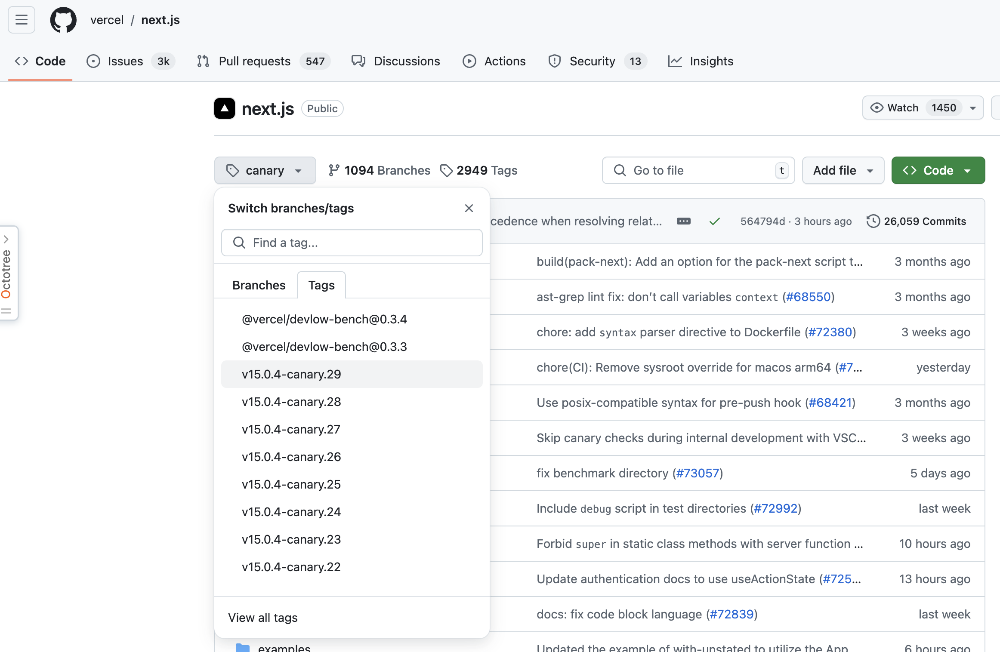

### ESLint와 Prettier 설정하기

앞서 프로젝트 단계에서 eslint와 eslint-config-next를 설치했지만 이것만으로는 부족하다. eslint-config-next는 단순히 코드에 있을 잠재적인 문제를 확인할 뿐, 띄어쓰기나 줄바꿈과 같이 코드의 스타일링을 정의해 주지는 않는다. 코드 스타일링 등 eslint-config-next가 해주지 않는 일반적인 ESLint 작업을 수행하기 위해 가장 설치 및 설정이 쉬운 `@titicaca/eslint-config-triple`을 설치해 사용한다.

`@titicaca/eslint-config-triple` 설정은 [깃허브 저장소](https://github.com/titicacadev/triple-config-kit)에 일목요연하게 정리되어 있다. 한 가지 유념해야 할 것은 `eslint-config-next`와 `eslint-config-triple`이 함께 작동하게 하려면 다음과 같은 별도의 설정이 필요하다.

```js
// .eslintrc.js
module.exports = {
  extends: ['next/core-web-vitals'],
};
```

즉, extends에 `next/core-web-vitals`를 추가하면 두 가지 설정이 모두 적용된다. 이 외에도 `.eslintignore`나 `.prettierignore`에 `.next`나 `.node_modules`를 추가해 정적 분석 대상에서 제외시킨다.

### 스타일 설정하기

여기서는 Next.js에 스타일을 적용하기 위해 styled-components를 사용하고자 한다.
swc에 styled-components를 사용한다는 것을 알리기위헤 `styledComponents: true`를 next.config.js에 추가한다. 이렇게 하면 swc가 styled-components를 사용하는 코드를 더 빠르게 변환한다. 추가적으로 `pages/_document.tsx`의 Head에 styled-components를 사용하기 위한 ServerStyleSheet를 추가한다.

### 애플리케이션 코드 작성

Next.js 프로젝트 구축을 위한 준비를 모두 마쳤으니 이제 본격적으로 웹사이트에 필요한 코드를 작성해보자. 여기서는 JSONPlaceholder에서 제공하는 todo API를 getServerSideProps에서 불러와 렌더링하는 간단한 예시 프로젝트를 만들었다.

이제 마지막으로 Next.js 프로젝트 실행, 빌드, 린트와 관련된 명령어를 package.json에 기재하면 모든 준비는 마치게 된다.

요즘은 대다수의 서비스가 마이크로 프론트엔드를 지향하기 때문에 프로젝트를 구축하는 일도 잦다. 프로젝트를 새로 만들 때마다 똑같은 설정을 매번 반복하는 것은 비효율적이기 때문에 다음과 같은 방법을 고려해 볼 수 있다.

1. 보일러 플레이트 프로젝트를 만든 다음, 깃허브에서 'Template respository' 옵션을 체크해두는 것이다. 이렇게 저장소를 템플릿 저장소로 만들어두면 다른 저장소를 생성할 때 이 내용을 모두 복사해서 생성할 수 있다.

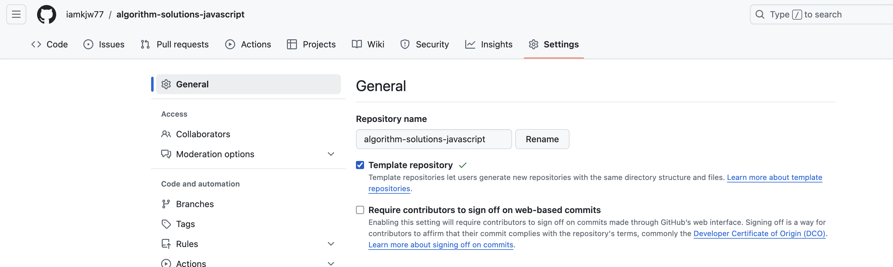
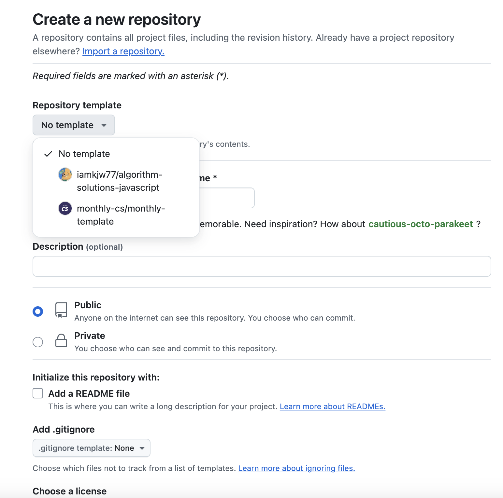

그리고 템플릿으로 저장소를 생성하면 저장소명과 함께 'generated from'이라는 메세지로 어떤 템플릿에서 만들어진 저장소인지 확인할 수 있다.

2. create-react-app에서 한 발 더 나아가 나만의 `create-***-app`을 만드는 것이다. 앞선 방법은 내용을 그대로 가져오는 수준이지만 cli 패키지로 만든다면 craet-next-app과 마찬가지로 사용자의 입력을 받아 서로 다른 패키지를 만들 수 있다. 이 방법은 앞선 방법보다 훨씬 더 손이 많이 가지만 조직 내에서 마이크로서비스를 지향하고 있고, 앞으로 생성해야 할 프로젝트 또한 많다면 충분히 검토해 볼 만하다. 다음 두 사이트를 참고해 create-\*\*\*-app을 한번 직접 구현해보자.

- [create-next-app 내부의 코드](https://github.com/vercel/next.js/blob/canary/packages/create-next-app/index.ts): create-next-app의 소스 코드를 살펴보면 알겠지만 일단 하나의 템플릿을 미리 만들어 둔 다음, 여기에서 CLI로 사용자의 입력을 받아 커스터마이징한 것을 알 수 있다.
- [Creating a CLI tool with Node.js](https://blog.logrocket.com/creating-a-cli-tool-with-node-js): npm을 기반으로 CLI 패키지를 만드는 방법을 상세하게 설명하고 있다.

### 깃허브 100% 활용하기

깃허브는 무료 Git 저장소 서비스를 시작으로 패키지를 저장할 수 있는 이미지 레지스트리 서비스인 Github Packages, 지라(Jira)와 같이 프로젝트를 관리할 수 있게 도와주는 GitHub Projects, 간단한 웹사이트를 운영할 수 있는 GitHub Pages, 그리고 인공지능 코딩 어시스턴스 서비스인 GitHub Codespaces까지 다양한 서비스를 제공한다.

깃허브에서 제공하는 다양한 서비스를 활용하면 애플리케이션을 개발하는 데 많은 도움을 얻을 수 있다. 코드 저장소의 역할을 기반으로 CI/CD와 같은 자동화, 보안 이슈 점검, 프로젝트 관리 등 일반적인 웹서비스 관리 및 운영에 필요한 많은 일을 할 수 있으며, 이 다양한 기능을 개인 사용자의 경우 거의 무료로 사용할 수도 있다.

### 깃허브 액션으로 CI 환경 구축하기

소프트웨어를 구성하는 핵심 요소인 코드는 여러 개발자들이 계속해서 코드에 기여함으로써 계속해서 진화하고 발전한다. 이러한 코드의 변화를 모으고 관리하는 코드 중앙 저장소에서, 여러 기여자가 기여한 코드를 지속적으로 빌드하고 테스트해 코드의 정합성을 확인하는 과정을 바로 CI라고 한다. 이러한 CI의 핵심은 저장소에서 코드의 변화가 있을 때마다 전체 소프트웨어의 정합성을 확인하기 위한 작업을 자동으로 실행해야 한다는 것이다. 여기서 자동으로 실행해야 하는 작업이란 테스트, 빌드, 정적 분석, 보안 취약점 분석 등이 있다.

과거 이 CI 환경을 구축하기 위해 가장 자주 쓰인 솔루션은 바로 젠킨스(Jenkins)이다. 젠킨스는 CI에 필요한 다양한 기능을 제공하는 무료 솔루션이었지만 사용하는데 번거로운 측면이 많았다. 기본적으로 설치형 솔루션이기 때문에 별도 서버를 구축해야 하고, 서버 내에서 젠킨스를 설치해야 하고, 또 젠킨스를 사용 중인 저장소와 연결하는 작업을 해야만 했다. 젠킨스 자체는 편리하고 많은 플러그인을 통해 다양한 기능을 통합할 수 있었지만 설치 및 유지보수가 번거롭다는 단점이 있다.

이러한 젠킨스의 대안으로 떠오르고 있는 것이 바로 깃허브 액션이다. 깃허브 액션은 깃허브에서 출시한 Saas(Software as a Service, 클라우드 기반의 소프트웨어 제공 모델)로, 깃허브 저장소와 함께 사용할 수 있는 강력한 도구이다. 엄밀히 말하면 깃허브 액션은 젠킨스 같은 CI 솔루션을 대체하기 위해 만들어진 도구는 아니다. 깃허브 액션의 본래 목적은 깃허브 저장소를 기반으로 깃허브에서 발생하는 다양한 이벤트를 트리거 삼아 다양한 작업을 할 수 있게 도와주는 것이다. 이러한 작업에는 다음과 같은 것이 포함된다.

- 깃허브에서 어떤 브랜치에 푸시가 발생하면 빌드를 수행한다.
- 깃허브의 특정 브랜치가 메인 브랜치를 대상으로 풀 리퀘스트가 열리면 빌드, 테스트, 정적 분석을 수행한다.

즉, 깃허브를 둘러싼 다양한 이벤트를 기반으로 깃허브에서 제공하는 가상환경에서 사용자가 원하는 작업을 수행할 수 있도록 도와주는 서비스이다. 그리고 이러한 특징을 활용하면 다른 CI/CD(Continuous Integration/Continuous Delivery) 솔루션을 대체할 수 있는 것이 널리 알려지게 되면서 깃허브 액션이 CI/CD 서비스로서 각광받게 되었다.

물론 깃허브 액션이 젠킨스와 같이 유서 깊고 오래된 CI 도구를 즉시 대체할 수 있는 수단이라고까지 보기는 어렵다. 젠킨스는 구축에 어려움이 있지만 한번 잘 구축한 젠킨스 CI 파이프라인으로는 단순히 한 저장소의 코드에 그치지 않고 많은 것들을 수행할 수 있으며, 자체 서버를 구축할 수 있다는 장점 덕분에 제한적인 환경에서도 구축할 수 있다.

그럼에도 깃허브 액션은 깃허브 저장소를 기반으로 CI를 구축하고자 할 때 매우 유용하게 사용할 수 있다. 프론트엔드 애플리케이션은 일부 서버 응답과의 연동을 하는 시나리오만 제외한다면 저장소에 있는 코드만으로 테스트, 빌드, 정적 분석 등 CI에 필요한 대부분의 기능을 손쉽게 구현할 수 있다. 하나의 저장소에서 빠르고 다양한 CI 환경을 구축하고자 하는 상황에서 깃허브 액션이 훨씬 경제적이다.

**깃허브 액션의 기본개념**

- `러너(runner)`: 러너란 파일로 작성된 깃허브 액션이 실행되는 서버를 의미한다. 특별히 지정하지 않으면 공용 깃허브 액션 서버를 이용하며, 별도의 러너를 구축해 자체적으로 운영할 수도 있다.
- `액션(action)`: 러너에서 실행되는 하나의 작업 단위를 의미한다. yaml 파일로 작성된 내용을 하나의 액션으로 볼 수 있다.
- `이벤트(event)`: 깃허브 액션의 실행을 일으키는 이벤트를 의미한다. 개발자의 필요에 따라 한 개 이상의 이벤트를 지정할 수 있다. 또한 특정 브랜치를 지정하는 이벤트도 가능하다. 주로 사용되는 이벤트는 다음과 같다.
  - `pull_request`: PR(pull request)과 관련된 이벤트로서, PR이 열리거나, 닫히거나, 수정되거나, 할당되거나, 리뷰 요청되는 등의 PR과 관련된 이벤트를 의미한다.
  - `issues`: 이슈와 관련된 이벤트로서 이슈가 열리거나, 닫히거나, 삭제되거나, 할당되는 등 이슈와 관련된 이벤트를 의미한다.
  - `push`: 커밋이나 태그가 푸시될 때 발생하는 이벤트를 의미한다.
  - `schedule`: 저장소에서 발생하는 이벤트와 별개로 특정 시간에 실행되는 이벤트를 의미한다. 여기서 말하는 시간은 cron에서 사용되는 시간을 의미한다. cron이란 유닉스 계열 운영체제에서 실행되는 시간 기반 잡 스케줄러로, 여기서는 특정시간을 표현할 때 다음과 같은 형식을 취한다.
    - 5 4 \* \* *: 매일 4시 5분에 실행, 분, 시간, 일, 월, 요일 순으로 표현하며, *는 모든 값을 의미한다. 본인이 원하는 시간대를 표현해보고 싶다면 crontab guru를 방문해보자.
- `잡(jobs)`: 잡이란 하나의 러너에서 실행되는 여러 스탭의 모음을 의미한다. 하나의 액션에서 여러 잡을 생성할 수 있으며, 특별히 선언한 게 없다면 내부 가상머신에서 각 잡은 병렬로 실행된다.
- `스탭(steps)`: 잡 내부에서 일어나는 하나하나의 작업을 의미한다. 셀 명령어나 다른 액션을 실행할 수도 있다. 이 작업을 병렬로 일어나지 않는다.

요약하자면 스탭들을 엮어서 잡을 만들고, 이러한 여러 개의 잡은 병렬로 실행되며, 이러한 잡을 하나 이상 모아둔 것을 액션이라고 한다. 그리고 이 액션을 실행하는 것이 러너이다.

**깃허브 액션 작성하기**

액션을 작성하려면 저장소 루트에 `.github/workflows`폴더를 생성하고 내부에 파일을 작성하면 된다. 파일명은 마음대로 지정할 수 있으며, yaml 파일 작성을 위해 확장자는 .yml 또는 .yaml로 지정해야 한다.

```yaml
# name은 액션의 이름이다. 필수값은 아니지만, 액션을 구별하는데 도움이 되므로 이름을 지정하는 것이 좋다
name: chapter7 build
# run-name은 액션이 실행될 때 구별할 수 있는 타이틀명이다. 이 또한 필수 값은 아니다
# 만약 설정되어 있지 않다면 pr 이름이나 마지막 커밋 메세지 등이 출력된다
run-name: ${{ github. actor }} has been added new commit.

# on은 필수값으로, 언제 이 액션을 실행할지를 정의한다
on:
  push:
    branches-ignore:
      - main

# jobs는 필수값으로, 해당 액션에서 수행할 잡을 의미한다. 한 개 이상 설정할 수 있으며, 여러 개를 지정하면 병렬로 실행된다
jobs:
  # build는 GibHub Actions의 예약어가 아니다. 임의로 지정한 이름으로, name과 같은 역할을 한다고 보면된다
  # jobs의 하위항목으로 반드시 들여쓰기해야 한다
  # 이 파일에서는 jobs에 1개 이상의 작업이 있는데, 그중 하나의 작업이 build라는 것을 의미한다
  build:
    # 어느 환경에서 실행될지를 결정한다. 별도의 러너를 설정하고 싶지않고
    # 깃허브에서 제공하는 서버를 쓰고 싶다면 ubuntu-latest를 선언하면 된다
    # 만약 커스텀 러너를 쓴다면 해당 러너명을 지정하면 된다
    # 커스텀 러너를 쓰고 싶다면 저장소의 Settings => Acitons => Runners에서 추가할 수 있다
    runs-on: ubuntu-latest
    # 해당 잡에서 순차적으로 수행할 작업을 정의한다
    steps:
      # 해당 스탭에서 작업을 actions/checkout@v3를 사용해서 작업하겠다는 것을 의미한다
      # actions/checkout@v3는 깃허브에서 제공하는 기본액션으로, 별도 파라미터를 제공하지 않으면 해당 브랜치의 마지막 커밋을 기준으로 체크아웃한다
      # 최신코드를 기준으로 작동해야 하는 CI 액션에서는 필수적으로 사용된다
      - uses: actions/checkout@v3
      # 해당 스탭에서 작업을 actions/setup-node@v3를 사용해서 작업하겠다는 것을 의미한다
      # actions/setup-node@v3 역시 깃허브에서 제공하는 기본액션으로, 해당 러너에 Node.js를 설치한다
      # with: node-version: 16을 함께 지정했는데, Node.js 16 버전을 설치한다
      - uses: actions/setup-node@v3
        with: node-version: 16
      # 해당 스탭의 명칭을 지정했다. 여기서는 의존성을 설치하는 작업을 수행한다
      # working-directory는 터미널의 cd 명령과 비슷한 역할을 하는데, 뒤이어 수행할 작업을 해당 디렉터리에서 수행하겠다는 뜻이다
      # 만약 루트에서 실행해도 된다면 따로 지정하지 않아도 된다
      # run을 통해 수행할 작업을 명시했다
      - name: 'install dependencies'
        working-directory: ./chapter7/my-app
        run: npm ci
      # 마지막으로 빌드를 수행한다
      - name: 'build'
        working-directory: ./chapter7/my-app
        run: npm run build
```

저장속에 Prettier가 설치되어 있다면 yaml 파일도 함께 포함시켜 코드 스타일을 유지하는 것이 좋다.

위 액션은 앞서 작성한 Next.js 애플리케이션의 빌드를 확인하는 CI 액션이다. 헤당 파일을 .github/workflows/build.yaml이라는 이름으로 저장한 다음, 별도 브랜치에서 푸시하고 풀 리퀘스트를 만들어 확인해보자.

**브랜치 보호 규칙(branch protection rule)**

머지하기 전에 꼭 성공해야 하는 액션이 있다면 별도로 저장소에 브랜치 보호 규칙을 추가할 수 있다. 해당 저장소의 Settings => Code and automation => Branches로 이동한 다음, Add branch protection rule을 클릭해보면 브랜치 보호 규칙을 설정할 수 있다.

- `Require status checkes to pass before merging`: 머지하기 전에 상태 체크를 필수로 한다.
- `Require branches to be up to date before merging`: 머지하기 전에 브랜치가 최신 내용인지 확인한다.

위 두 개의 기능을 켜고 마지막으로 꼭 실행되야 하는 액션의 파일명을 선택하고 저장하면, 해당 액션이 성공하기 전까지는 main 브랜치에 대한 머지를 막을 수 있다.
즉, 기본 브랜치에는 항상 테스트, 빌드와 같은 CI가 성공한 코드만 푸시될 수 있어 코드의 정합성을 확보할 수 있다.
추가로 브랜치 설정에서 `Do not allow bypassing the above settings`를 활성화하면 관리자조차 강제로 머지할 수 없게 되어 무조건 해당 액션이 성공해야만 머지할 수 있게된다.

### 직접 작성하지 않고 유용한 액션과 깃허브 앱 가져다 쓰기

깃허브 액션은 비교적 작성하기 쉬운 편이긴 하지만 위와 같이 단순한 빌드나 린트, 테스트 같은 작업 외에 여러 가지 작업을 수행하기에는 여전히 조금 복잡하고 어려울 수 있다. 이를 위해 깃허브에서는 [Marketplaces](https://github.com/marketplace?type=actions)라는 서비스를 제공해 여러 사용자가 만들어 놓은 액션을 손쉽게 가져다 쓸 수 있도록 운영하고 있다. 이곳에 공개된 액션을 적절히 활용하면 앞선 action/checkout 예시처럼 복잡한 작업을 수행하는 액션을 손쉽게 가져다 사용할 수 있다. 여기서는 프론트앤드 애플리케이션 구축에 도움이 되는 유용한 액션 몇 가지를 소개하고자 한다.

**깃허브에서 제공하는 기본액션**

먼저 깃허브에서 제공하는 기본액션이다. 이것들은 다른 액션을 만들 때 쓰이는 주요 액션이므로 숙지하다.

- `actions/checkout`: 깃허브 저장소를 체크아웃하는 액션이다. 저장소를 기반으로 작업을 해야 한다면 반드시 필요하다. 일반적으로는 아무런 옵션 없이 사용해 해당 액션을 트리거한 최신 커밋을 불러오지만 ref를 지정해 특정 브랜치나 커밋을 체크아웃할 수도 있다.
- `actions/set-up-node`: Node.js를 설치하는 액션이다. Node.js를 사용하는 프로젝트라면 반드시 필요하다. 설치할 Node.js 버전을 지정할 수도 있다.
- `actions/stale`: 오래된 이슈나 PR을 자동으로 닫거나 더 이상 커뮤니케이션하지 못하도록 닫는다. 저장소가 오래되어 과거에 생성된 이슈나 PR이 너무 많을 경우 정리하는데 도움이 된다.
- `actions/dependency-review-action`: 의존성 그래프에 대한 변경, 즉, package.json, package.lock.json, pnpm-lock.json 등의 내용이 변경되었을 때 실행되는 액션으로, 의존성을 분석해 보안 또는 라이선스애 문제가 있다면 이를 알려준다.
- `github/codeql-action`: 깃허브의 코드 분석 솔루션인 code-ql을 활용해 저장소 내 코드의 취약점을 분석해준다. languages에 javascript만 설정해두면 자바스크립트와 타입스크립트를 모두 검사하므로 특정 스케줄에 맞춰서 실행하거나 CI로 활용할 수 있다.

이 밖에도 깃허브에서 제공되는 다양한 기본액션이 있으니 한 번쯤 둘러보는 것을 권장한다.

**calibreapp/image-actions**

프론트엔드 프로젝트를 진행하다 보면 이미지를 추가해서 관리하는 경우도 종종있다. 잘 구축된 프로젝트의 경우 별도의 CDN을 사용해 이미지를 제공하기도 하지만 매우 중요한 이미지거나 혹은 아직 CDN을 구축하지 못한 경우 등은 이미지를 내부에 두고 함께 관리하곤 한다. 이러한 이미지들은 사용자에게 불편함을 주지 않는 선에서 가장 작은 파일로 관리될 필요가 있는데, 이 이미지를 압축해 관리하는 게 여간 귀찮은 일이 아니다. 이를 위해 저장소에 포함되어 있는 이미지를 최적화하는 액션이 있는데, 바로 `calibreapp/image-actions`이다. 이 액션을 PR로 올라온 이미지(jpg, png 등)를 sharp 패키지를 이용해 거의 무손실로 압축해서 다시 커밋해 준다. 물론 잘 구성된 프레임워크, 예를 들어 Next.js 같은 경우에는 이미 next/image로 이미지를 최적화하는 방법을 제공하고 있지만 저장소 자체의 이미지 크기를 줄인다면 풀(pul)할 때 부담 또한 덜 수 있어 유용하다.

```yaml
name: Optimize images
on: pull_request
jobs:
  build:
    name: calibreapp/image-actions
    runs-on: ubuntu-latest
    steps:
      - name: Checkout Repo
        uses: actions/checkout@v2

      - name: Compress Images
        uses: calibreapp/image-actions@main
        with:
          githubToken: ${{ secrets.GITHUB_TOKEN }}
          ignorePaths: 'LCPSample.jpeg'
```

저장소에 PR이 생성되면 저장소를 checkout해서 calibreapp/image-actions이라는 액션을 실행한다. 그리고 이 액션은 이미지를 가져다가 새롭게 커밋해야 하므로 액션이 커밋을 할 수 있도록 권한을 줘야 한다. 이 권한을 제공하려면 githubToken: ${{ secrets.GITHUB_TOKEN }}을 추가하면 된다. 그리고 ignorePaths에 파일을 기재하면 해당파일에 대해서는 압축을 건너뛸 수도 있다.

만약 액션을 생성하는 것조차 번거롭게 느껴진다면 imgbot이라는 앱을 사용할 수도 있다. calibreapp/image-actions와는 다르게 액션 파일을 작성하는 방식이 아니라서 설정하는 방법이 약간 다르지만 이미지를 최적화하는 기능은 동일하다. 단 imgbot은 플랜에 따라 유료로 제공될 수 있으므로 설정에 주의를 기울여야 한다.

**lirantal/is-website-vulnerable**

lirantal/is-website-vulnerable은 특정 웹사이트에 방문해 해당 웹사이트에 라이브러리 취약점이 존재하는지 확인하는 깃허브 액션이다. Synk라는 솔루션을 기반으로 작동하며, 앞서 소개한 액션과는 다르게 '실제로 웹사이트를 방문해서 웹사이트에 노출되고 있는 라이브러리'를 분석한 결과를 알려준다 차이점이 있다. 이 경우 개발자의 컴퓨터에서 설치만 되고 실제 배포에 포함되지 않은 deDependencies나 번들링 과정에서 트리쉐이킹으로 인해 사라진 코드는 취약점으로 진단되지 않는다. 먼저 이 액션은 npm 패키지 실행도구인 npx로도 실행이 가능하다. 따라서 직접 npx를 실행하는 액션을 만들어 사용할 수도 있다.

```shell
npx is-website-vulnerable https://netflix.com/kr
```

다음 액션은 기본 브랜치인 main 브랜치에 푸시가 일어나면 lirantal/is-website-vulnerable@main을 실행하도록 설정한 것이다.

```yaml
name: Test site for publicly known js vulnerabilies

on:
  push:
    branches: [main]

jobs:
  security:
    runs-on: ubuntu-latest
    steps:
      - name: Test for public javascript library vulnerabilies
        uses: lirantal/is-website-vulnerable@main
        with:
          scan-url: 'https://iamkjw77.github.io/portfolio'
```

만약 웹사이트에서 취약점이 발견되면 액션이 실패한다.
이 액션의 경우 main 브랜치에 푸시가 일어나는 경우에 확인하지만 사실 이 방법은 그다지 좋지 못하다. 왜냐하면 푸시가 일어났다고 해서 반드시 배포가 실행되거나, 혹은 배포가 실행됐다고 하더라도 아직 배포가 끝나기 전일 수도 있기 때문이다. 이 경우에는 배포 액션의 잡 중 하나에 [need: \*\*\*](https://docs.github.com/en/actions/writing-workflows/workflow-syntax-for-github-actions#jobsjob_idneeds) 구문을 추가해 배포 잡이 끝난 이후에 실행하게 하거나, 혹은 별도의 액션을 추가해 [on.workflow_run](https://docs.github.com/en/actions/writing-workflows/choosing-when-your-workflow-runs/events-that-trigger-workflows#workflow_run)으로 실행하는 방법도 있다.

```yaml
on:
  workflow_run:
  # 해당 워크플로우는 deploy가 완료된 이후에 실행된다
  workflows: [deploy]
  types:
    - completed
```

**Lighthouse CI**

Lighthouse CI는 구글에서 제공하는 액션으로, 웹 성능 지표인 라이트하우스를 CI를 기반으로 실행할 수 있도록 도와주는 도구이다. 이 깃허브 액션을 활용하면 프로젝트의 URL을 방문해 라이트하우스(lighthouse) 검사를 실행한다. 이를 통해 현재 머지 예정인 웹사이트의 성능 지표를 측정할 수 있다.

먼저 [Lighthouse CI 홈페이지](https://github.com/apps/lighthouse-ci)를 방문해서 Configure를 누른다음, 해당 깃허브 앱이 사용하고자 하는 저장소의 권한을 얻는다.

```yaml
name: Lighthouse CI
on: [push]

jobs:
  lhic:
    name: Lighthouse
    runs-on: ubuntu-latest
    steps:
      - uses: actions/checkout@v3
      - uses: actions/setup-node@v3
        with:
          node-version: 20
      - name: install & build
        run: |
          npm install
          npm run build
      - name: run Lighthouse CI
        run: |
          npm install -g @lhci/cli@0.14.x
          lhci autorun
        env:
          LHCI_GITHUB_APP_TOKEN: ${{ secrets.LHCI_GITHUB_APP_TOKEN }}
```

먼저 저장소를 checkout한 후, Node.js를 설치하고, 설치 후 빌드를 한다. 그리고 이후에 lhci를 설치해 실행한다. 이때 LHCI_GITHUB_APP_TOKEN이라는 환경변수에 LHCI_GITHUB_APP_TOKEN을 넣는다. 이렇게 토큰을 넣으면 lhci가 PR이나 액션애 권한을 얻어 사용자에게 결과를 보여줄 수 있다. 그 다음에는 lhci를 실행하는 데 필요한 설정파일을 추가하자. 이 파일은 저장소 루트에 생성해야 한다.

```javascript
module.exports = {
  ci: {
    collect: {
      url: ['http://localhost:3000'],
      collect: {
        numberOfRuns: 5,
      },
    },
    upload: {
      startServerCommand: 'npm run start',
      target: 'temporary-public-storage',
    },
  },
};
```

lhci로 라이트하우스 분석을 진행하려면 몇 가지 추가적인 설정이 필요하다. 먼저 lhci에 어떤 사이트를 분석해야 하는지 알려줘야 한다. 위 코드는 Next.js를 기반으로 작성되어 있는데, npm run start를 통해 서버를 실행하고, http://localhost:3000을 분석하도록 설정되어 있다. 또한 lhci는 기본적으로 한 번만 분석하므르 numberOfRuns를 다섯 번으로 수정해 여러 차례 분석한 다음, 각각의 결과를 최종 결과로 반환하도록 수정했다. 그리고 그 결과를 temporary-public-storage, 즉 임시 저장소에 업로드해 분석하도록 명령을 내렸다.

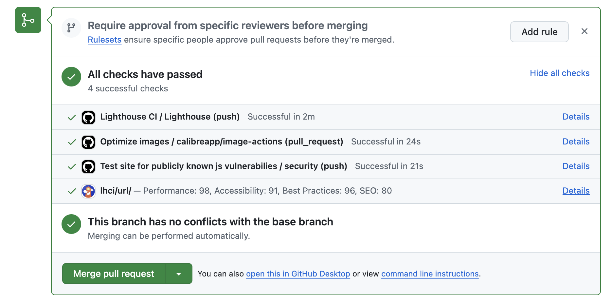

위와 같이 깃허브 액션이 끝나자마자 PR의 마지막에 라이트하우스의 결과가 추가됐다.
Details를 눌러 확인하면 라이트하우스 결과에 따른 지표정보를 확인할 수있다.

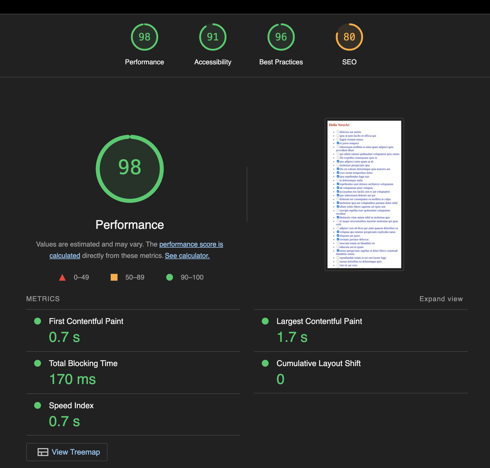

또한 설정을 통해 라이트하우스 실행결과가 일정 점수 미만이 되면 마치 테스트 코드의 assert와 비슷하게 에러를 발생시키거나, 혹은 자체 라이트하우스 분석 서버를 만들어 별도의 분석 프로세스를 실행할 수 있다. 이렇게 PR을 통해 개발된 서비스의 성능 지표를 매번 노출한다면 개발자들에게 항상 성능에 대한 지속적인 경각심을 심어줄 수 있다.

### 깃허브 Dependabot으로 보안 취약점 해결하기

깃허브에서 제공하는 강력한 기능 중 하나는 Dependabot으로, 의존성에 문제가 있다면 이에 대해 문제를 알려주고 가능하다면 해결할 수 있는 PR까지 열어준다.

**package.json의 dependencies 이해하기**

의존성에 대한 문제를 해결하기에 앞서 먼저 의존성과 버전에 대해 알아야 한다. package.json에서 뺴놓을 수 없는 의존성과 버전이 무엇인지 하나씩 살펴보자.

**버전**

버전에 대해 이야기하려면 먼저 유의적 버전(semantic versioning)에 대해 알아야 한다. 유의적 버전의 정의는 다음과 같다.

버전은 **주, 부, 수**로 구성되어 있으며 각각의 정의는 다음과 같다.

1. 기존 버전과 호환되지 않게 API가 바뀌면 "주 버전"을 올리고,
2. 기존 버전과 호환되면서 새로운 기능을 추가할 때는 "부 버전"을 올리고,
3. 기존 버전과 호환되면서 버그를 수정한 것이라면 "수 버전"을 올린다.

이 외에 중요힌 내용을 몇 가지 꼽자면 다음과 같다.

- 특정 버전으로 패키지를 배포하고 나면 그 버전의 내용은 절대 변경하지 말아야 한다. 변경사항이 있다면 반드시 새로운 버전으로 배포한다.
- 주 버전 0(0.y.z)은 초기개발을 위해 쓴다. 이 버전은 아무 때나 마음대로 바꿀 수 있다. 이 공개 API는 안정판으로 보지 않는 게 좋다. 대표적인 예로 Recoil이 있다. 2022년 10월 기준 Recoil의 버전은 0.7.6이다. 만약 어느 날 0.8.0으로 버전이 올라갔다면 이는 기능이 추가된 것이 뿐만 아니라 API 스팩이 변경됐을 수도 있다. 그러므로 0으로 시작하는 실험 버전 라이브러리는 항상 사용에 주의를 기울여야 한다.
- 수 버전 Z(x.y.Z | x > 0)는 반드시 그 이전 버전 API와 호환되는 버그 수정의 경우에만 올린다. 버그 수정은 잘못된 내부기능을 고치는 것이라 정의한다. 만약 버그 수정이 API 스팩 변경을 동반한다면 반드시 주 버전을 올려야 한다. 만약 주 버전을 올리는 것이 껄끄럽다면 해당 API를 지원중단(deprecated)으로 처리하고, 새로운 API를 만들어 부 버전으로 올리는 것이 좋다.

그리고 npm은 이러한 버전에 대해 나름의 규칙을 정의해 뒀다. 주로 사용하는 버전 방식은 다음과 같다.

- `react@16.0.0`: 버전 앞에 아무런 특수기호가 없다면 정확히 해당버전에 대해서만 의존하고 있다는 뜻이다.
- `react@^16.0.0`: 16.0.0과 호환되는 버전을 의미한다. 호환된다는 뜻은 0보다 높은 부 버전에 대해서는 호환된다는 가정하에 상위버전을 설치할 수 있다는 것을 뜻한다. 즉, 여기서 가능한 버전은 16.0.0부터 17.0.0 미만의 모든 버전이다. 단, 앞서 언급한 것처럼 주 버전이 0인 경우에는 부 버전을 올라가도 API 변경이 있을 수 있으므로 수 버전까지만 수용한다.
- `react@~16.0.0`: 패치 버전에 대해서만 호환되는 버전을 의미한다. 즉, 여기서 가능한 버전은 16.0.0부터 16.1.0 미만의 모든 버전이다. 기능이 추가되는 수 버전은 사용하지 않는다.

한 가지 염두에 둬야 할 점은 유의적 버전은 어디까지나 개발자들 간의 약속일 뿐, 정말로 해당 API의 버전이 유의적 버전에 맞춰 구현되어 있는지는 알 수 없다는 것이다. npm은 이에 대해 보증해 주지 않으며, 어디까지나 개발자 간의 암묵적인 약속일 뿐이다. 수 버전이 올라갔는데도 기존 버전과 호환되지 않을 수도, 주 버전이 올라갔는데 변경된 사항이 없을 수도 있다.

**의존성**

package.json에서 dependencies란 npm 프로젝트를 운영하는 데 필요한 자신 외의 npm 라이브러리를 정의해 둔 목록이다. JSON 형식으로 작성되어 있으며, 주로 dependencies와 devDependencies로 구성되어 있다. 그리고 peerDependencies도 있지만, 이는 주로 라이브러리에서 사용된다.

- `dependencies:`: package.json에서 npm install을 하면 설치되는 의존성이며, npm install 패키지명을 실행하면 dependencies에 추가된다. 해당 프로젝트를 실행하는데 꼭 필요한 패키지가 여기에 선언된다.
- `devDependencies`: package.json에서 npm install을 실행하면 설치되는 의존성이며, npm install 페키지명 --save-dev를 실행하면 devDependencies에 추가된다. 해당 프로젝트를 실행하는데는 필요하지 않지만 개발 단계에서 필요한 패키지들을 여기에 선언한다.
- `peerDependencies`: 주로 서비스보다는 라이브러리와 패키지에서 자주 쓰이는 단위이다. 이는 직접적으로 해당 패키지를 require하거나 import하지는 않지만 호환성으로 인해 필요한 경우를 의미한다. 만약 재사용 가능한 훅을 제공하는 패키지를 만든다고 가정해보자. 이 경우 실제 react를 import하는 일은 경우에 따라 없을 수도 있지만 사용하려면 리액트 16.8.6 이상이 필요하다. 단순히 useCounter를 제공한다고 해서 쓸모 있는 것이 아니라, 리액트 훅을 제공하는 버전을 설치한 서비스에서 사용해야만 올바르게 사용할 수 있을 것이다. 이 경우 다음과 같이 peerDependencies를 선언하면된다.

```json
{
  "peerDependencies": {
    "react": ">=16.8",
    "react-dom": ">=16.8"
  }
}
```

그러나 최근에는 애플리케이션 실행에 필요한 패키지를 구분하는 것에 의문을 제기하는 목소리도 있다.

첫 번째 이유는 번들러의 존재이다. devDependencies로 설치한 것이든, dependencies로 설치한 것이든 모두 node_modules에 동일하게 설치한다. 그리고 실제로 이 중에서 실제 서비스에 배포해야 하는 라이브러리인지를 결정하는 것은 번들러이다. 번들러가 코드의 시작점에서부터 각 파일의 종속성을 판단한 다음, 필요한 파일을 빌드 과정을 거쳐 하나의 결과물로 만든다. dependencies와 devDependencies 간의 차이가 애플리케이션 최종 결과물에는 전혀 영향을 미치지 않는 것이다.

두 번째 이유는 복잡해진 개발 파이프라인이다. 과거에는 이러한 구분이 의미가 있었던 이유가 개발과정에서는 npm install로 설치해 모든 패키지를 설치하고, 실제 프로젝트를 실행할 때는 npm install --only=production으로 실행해 패키지만 빠르게 설치하는 전략이 주효했기 때문이다. 그렇다면 현재의 애플리케이션은 typescript를 설치한다고 가정했을 때, 위와 같은 논리대로라면 devDependencies에 설치하고, 마찬가지로 @types/와 같은 타이핑 파일도 devDependencies에 설치할 것이다. 과거의 패키지 전략대로라면 npm install --only=production만으로 빌드와 실행이 되어야 한다. 그러나 실제로는 애플리케이션 시작은커녕 빌드조차 할 수 없다. typescript와 관련 패키지 devDependencies에 선언된 탓에 tsc가 실행되지 못하는 것이다. 그러므로 dependencies와 devDependencies의 경계가 적어도 프론트엔드 애플리케이션의 경우애는 모호해지고 있다. 그래서 일부 프로젝트를 보면 둘을 구분하지 않고 모두 dependencies에 몰아넣고 관리하는 경우도 있다.

그렇다고 dependencies와 devDependencies의 구분이 완전히 무의미한 것은 아니다. npm에 업로드할 패키지를 개발한다면 이러한 두 의존성의 구분은 매우 중요해진다(dependencies에 있는 패키지들만 모두 최종 패키지 결과물에 포함되게 해야한다). 개발자가 프론트엔드 서비스를 위해 package.json을 작성하고 관리한다면 dependencies에 모두 넣는 것은 크게 문제가 되지 않지만 향후 다른 패키지의 의존성을 읽거나 출시하는데 도움이 되려면 이 둘의 차이를 분명히 알고 있어야 한다.

**Dependabot으로 취약점 해결하기**

먼저 프로젝트 취약점이 있는 예제 애플리케이션을 만들어야 한다. package.json은 다음과 같이 구성했다.

- [예제코드](https://github.com/wikibook/react-deep-dive-example/tree/main/chapter9/danger-react-app)

```json
{
  "name": "danger-react-app",
  "version": "0.1.0",
  "private": true,
  "dependencies": {
    "axios": "^1.1.3",
    "mobx": "^5.11.0",
    "mobx-react-lite": "^1.4.1",
    "react": "^16.8.6",
    "react-dom": "^16.8.6",
    "react-router-dom": "^5.0.1",
    "react-scripts": "^3.4.1",
    "react-swipeable-views": "^0.13.3"
  },
  "devDependencies": {
    "@titicaca/eslint-config-triple": "^5.0.0",
    "@titicaca/prettier-config-triple": "^1.0.2"
  },
  "scripts": {
    "start": "react-scripts start",
    "build": "react-scripts build",
    "test": "react-scripts test",
    "eject": "react-scripts eject",
    "lint": "eslint . --fix",
    "prettier": "prettier . --write"
  },
  "browserslist": {
    "production": [">0.2%", "not dead", "not op_mini all"],
    "development": [
      "last 1 chrome version",
      "last 1 firefox version",
      "last 1 safari version"
    ]
  },
  "overrides": {
    "ansi-html": "^0.0.8",
    "browserslist": "^4.21.4",
    "immer": "^9.0.6",
    "jsdom": "^16.5.0",
    "glob-parent": "^5.1.2",
    "minimatch": "^3.0.5",
    "node-notifier": "^8.0.1",
    "nth-check": "^2.1.1",
    "node-forge": "^1.3.0",
    "postcss": "^7.0.36",
    "react-dev-utils": "^11.0.4",
    "shell-quote": "^1.7.3"
  }
}
```

그리고 이 package.json을 설치해보자.

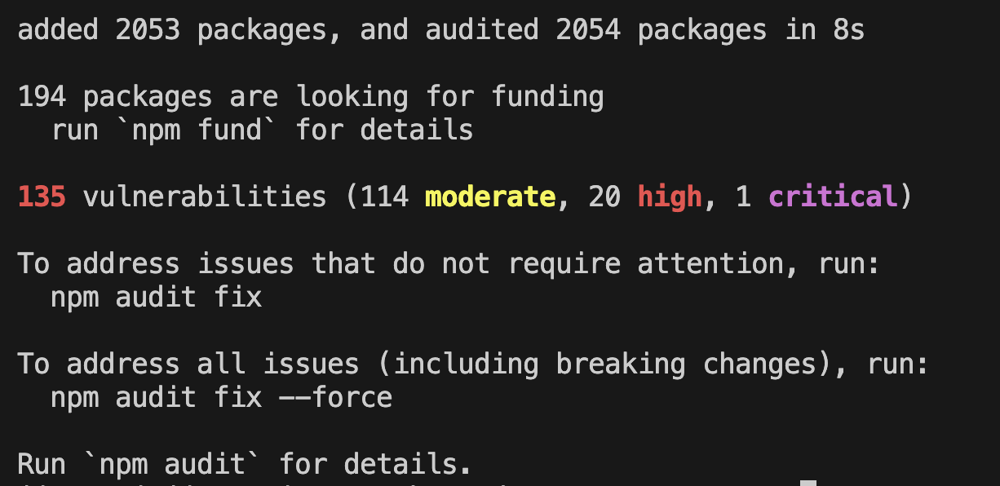

설치만 했을 뿐인데, 각종 vulnerabilities를 발견했다는 메세지가 눈에 띈다. 깃허브에서 이를 탐지하는 것을 확인하기 위해 원격 저장소로 푸시해보자.

원격 저장소를 확인해보면 Dependabot이 저장소의 의존성에 여러가지 문제가 있다고 알려준다.

알려주지 않는 경우, Dependabot이 disabled 되어 있는 경우이다. 이 경우 setting => code security => Dependabot alerts을 enable로 설정해주자.

그리고 배너의 'See Dependabot alerts'를 누르면 구체적으로 어떤 의존성에 문제가 있는지 확인할 수 있다.
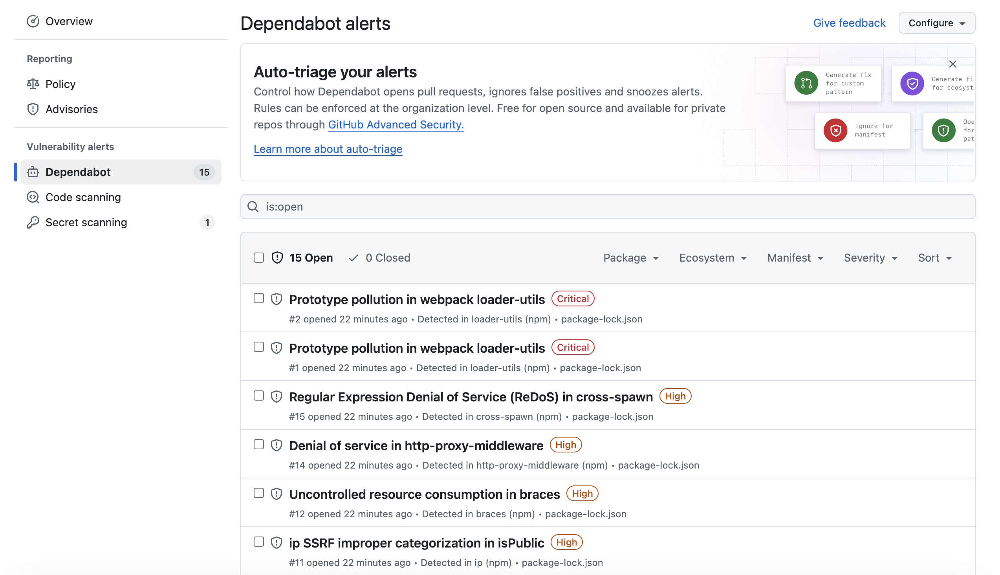

물론 이 패키지를 사용했던 당시에는 문제가 없는 패키지였을 수도 있다. 하지만 시간이 지나면서 보안 취약점이 발견되는 것이 일반적이므로 지금 시점에 보기에는 바로 빌드해서 배포하기엔 조금 위험해 보인다. 이제 본격적으로 이 문제점을 하나씩 파악해서 수정해보자.

**개별 취약점 살펴보기**

깃허브의 Dependabot은 취약점을 `Critical`, `High`, `Moderate`, `Low`의 4단계로 분류한다(Critical의 심각도가 가장높고, Low의 심각도가 가장 낮음). 위 예제 기준으로는 가장 심각도가 높은 Critical 취약점이 두 개가 있는데, 먼저 'Prototype pollution in webpack loader-utils'를 살펴보자.

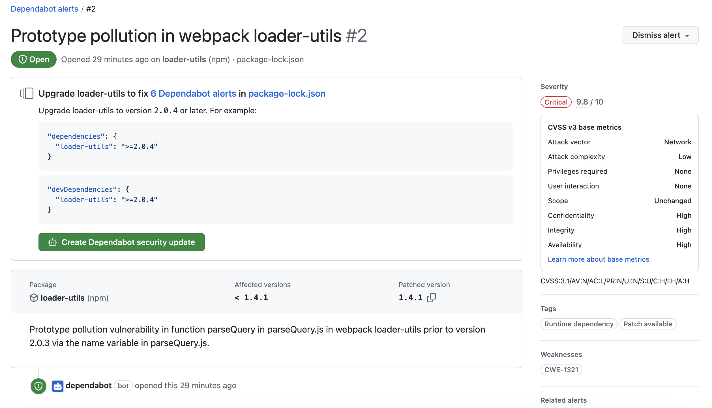

1. 먼저 상단 제목 아래에 package-lock.json은 취약점을 발견한 파일의 경로이다. dependencies에 직접 명시한 경우 package.json이 발견되는 경우도 있으며, dependencies가 의존하고 있는 패키지에서 발견되는 경우 이렇게 lock 파일이 명시된다.
2. Create dependabot security update 버튼은 취약점을 바로 수정할 수 있는 경우 표시되는 버튼이다. Dependabot은 단순히 패키지의 취약점을 검사해 주는 것뿐만 아니라 취약점을 수정할 수 있다면 이렇게 PR도 생성해 준다. 그러나 모든 취약점에 대해 PR이 생성되는 것은 아니다. Dependabot이 수정가능하다고 판단하는 경우에만 PR이 생성되며, 그렇지 않은 경우에는 취약점만 알려준다.
3. 가장 오른쪽 Severity 밑에 있는 태그가 보안 취약점의 심각도를 나타낸다. Weaknesses에 CVE란 'Common Vulnerabilities and Exposures'의 약자로, 공개적으로 알려진 컴퓨터 보안 결함 목록을 나타낸다. CVE는 미국 국토안보부 산하의 사이버 보안 및 보안국의 재정지원을 받아 MITRE Corporation에서 감독한다. 이 취약점의 경우 CVE-2022-37601에 해당하는 것을 확인할 수 있다.
4. 가운데 두 번째 색션은 취약점의 자세한 정보를 나타낸다. 어떤 패키지가 취약점으로 지정됐는지, 현재 사용 중인 버전은 무엇이며, 어느 버전을 설치해야 해결할 수 있는지, 그리고 해당 취약점이 발생하는 상황과 조심해야 할 것들을 나타낸다.

문제가 무엇인지 확인했으니, 이제 문제의 패키지가 어디에서 설치됐는지 확인해보자. package.json을 살펴보면 직접적으로 문제가 되는 loader-utils를 설치해서 사용하는 곳은 없다. 대부분의 의존성은 package-lock.json에 숨어 있는 경우가 많다. 패키지가 어디에 설치되어 있는지 확인해 보려면 다음과 같이 명령어를 입력해 보면 된다.

```shell
npm ls loader-utils
```

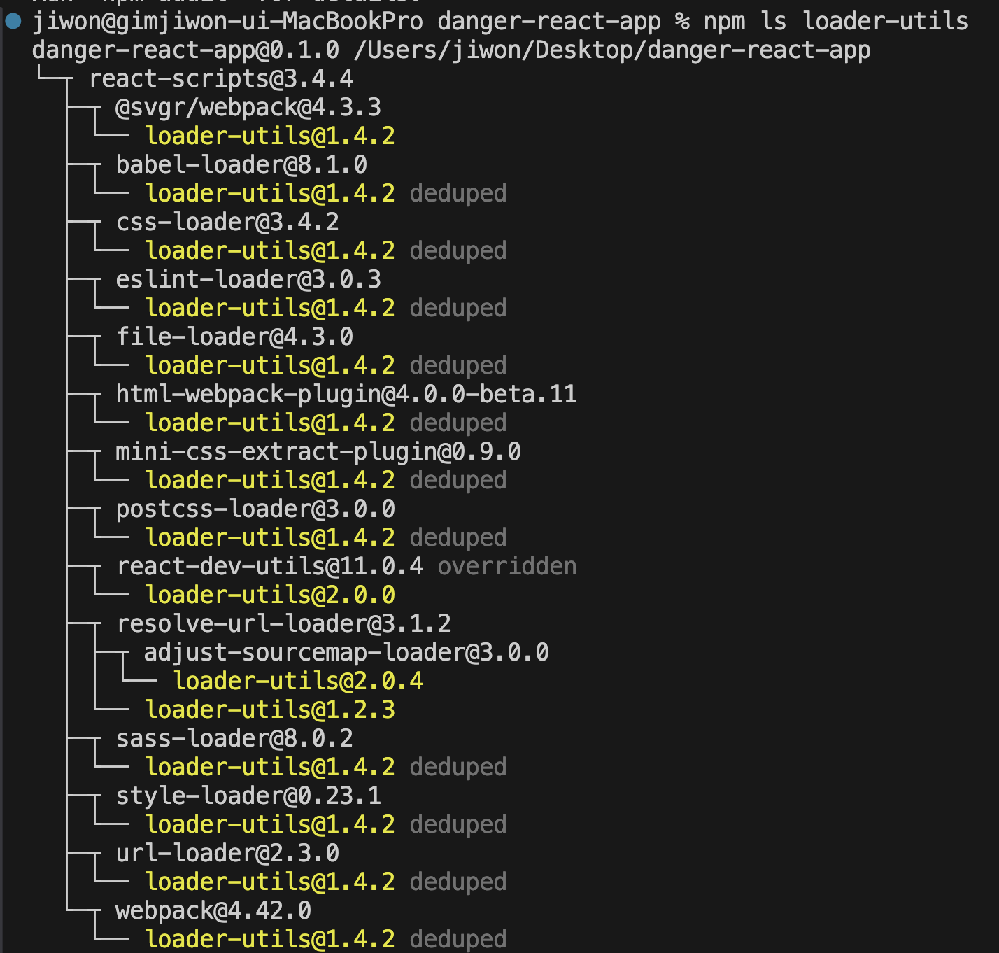

`npm ls`는 'list installed packages'라는 뜻으로 설치된 패키지가 왜 어떤 의존성 때문에 설치됐는지 확인할 수 있는 명령어이다. 위 내용을 토대로 loader-utils는 react-scripts의 @svgr/webpack가 사용하고 있음을 알 수 있다. @svgr/webpack에서는 loader-utils를 어떤 버전으로 사용하고 있는지 확인해 보자.

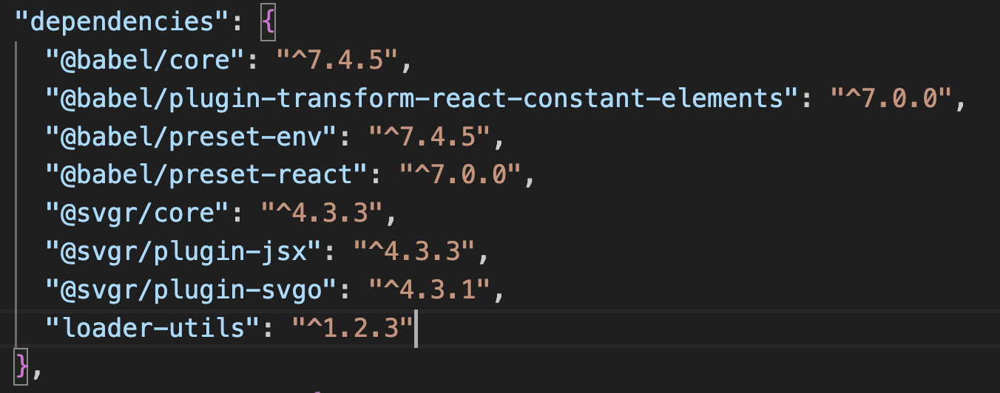
loader-utils는 유의적 버전과 npm의 규칙에 따라 1.2.3보다 높은 모든 부 버전에 대해서는 호환된다는 가정하에 상위 버전을 설치할 수 있다는 것을 뜻한다.

그리고 해당 패키지를 어떻게 사용하고 있는지 살펴보자.
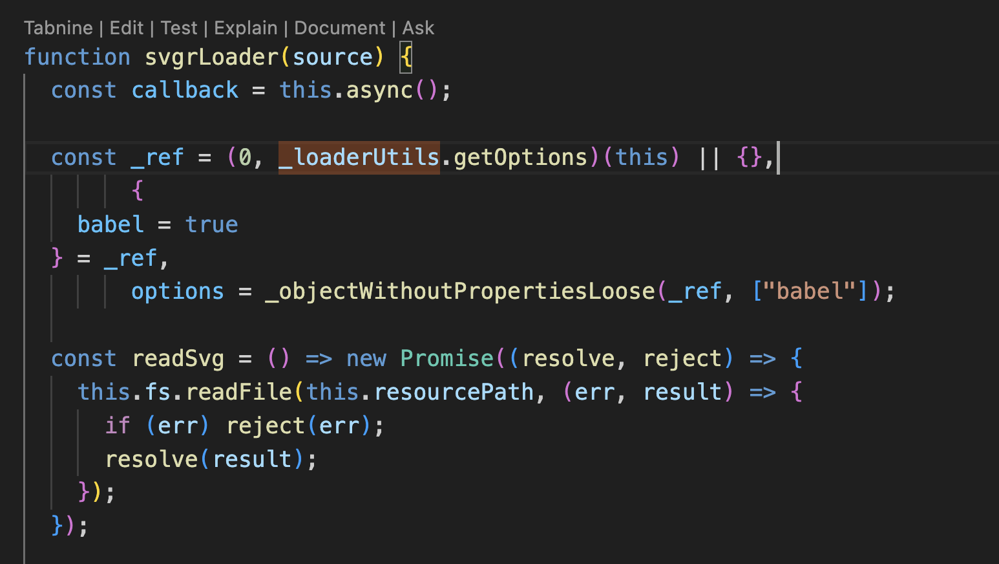

이러한 방법을 활용해 문제 패키지가 왜 문제가 되는지 파악해 볼 수 있다. 그리고 직접적으로 영향이 없을 것으로 판단되는 패키지에 대해서는 시급성을 낮춰서 대응하는 것이 좋다.

react-scripts를 사용하다 보면 유독 취약점 관련 경고가 많은 것을 느낄 수 있다. 그 이유는 리액트 팀이 실제 취약점이 있는 패키지를 사용한다 하더라도 실제 개발자에게 미칠 수 있는 영향이 없는 경우에는 취약점을 긴급하게 수정하지 않겠다고 선언했기 때문이다.

해당 내용은 리액트 개발자 중 한 명인 댄 아브라모프의 블로그 글 "npm audit: Broken by Design"에서 확인할 수 있다. 해당 글은 npm audit에 대한 이야기이지만 깃허브 Dependabot에도 해당된다. 해당 내용은 npm audit, 즉 npm에서 제공하는 취약점 분석 도구에 대한 비판의 글인데, 요약하자면 앞선 언급한 내용과 비슷하다. 취약점이 있는 패키지가 존재한다 하더라도 취약점이 발생하는 시나리오로 사용하지 않는다면 문제없다는 뜻이다. 이 글에서 언급한 예시 중 하나는 구 버전에 포함된 browserslist의 정규표현식 취약점이다. browserslist의 인수로 잘못된 정규식을 넣는다면 애플리케이션이 기하급수적으로 느려지는 ReDos가 있다는 것인데, 리액트 프로젝트에서 browserslist를 작성할 수 있는 건 개발자뿐이므로 개발자 본인이 악의적인 목적으로 정규식을 넣어서 본인의 서비스를 느리게 하지 않는 이상, 실제 위협이 될 수 는 없다는 것이다.

결론적으로 초보 개발자에게는 혼란을 일으키고, 노련한 개발자에게는 불필요한 취약점임을 언급해야 하는데 과도한 시간을 쏟아 부어야 하므로 이러한 방식의 취약점 보고는 도움이 되지 않고, 실제로 빨리 고쳐야 하는 진짜 취약점을 보는데 방해가 된다고 주장한다. 그래서 리액트 팀은 거짓 양성(false positive), 즉 취약점이 있으나 해당 코드를 사용하지 않거나 따로 문제가 없다고 자체적으로 판단한 취약점에 대해서는 공식적으로 대응하지 않겠다고 선언한 바 있다. 또한 이러한 문제점을 수정하기 위해 몇 가지 제안이 npm에 반영되고 있는 중으로 보인다.

**취약점 해결하기**

가장 쉽게 해결할 수 있는 것은 깃허브 Create Dependabot security update 버튼을 누르는 것이다. 이 버튼을 누르면 Dependabot이 취약한 종속성을 수정하기 위한 작업을 시작하고, 몇 분정도 기다리면 Dependabot이 자동으로 취약점을 해결하기 위한 PR을 열어준다(안열어 줄 수도 있음). PR을 열어줬다는 것은 이미 취약점을 해결한 패치가 존재한다는 것을 의미한다. 머지하는 즉시 보안 경고가 사라지고 해당 취약점을 해결하는 최소버전의 업데이트가 진행된다. 이처럼 보안 취약점을 매우 손쉽게 해결할 수 있다.

다음으로 PR로 손쉽게 해결할 수 없는 경우를 살펴보자.

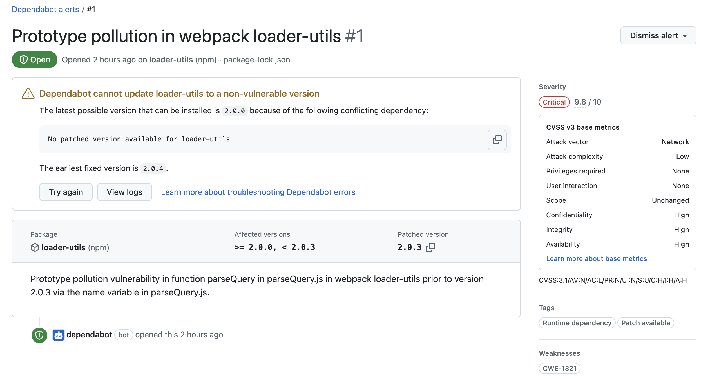

이 보안의 취약점은 loader-utils 버전을 2.0.3 버전 이상으로 올려야만 해결된다고 나와 있다.


`npm ls loader-utils`로 살펴보면 loader-utils 패키지는 여러 곳에서 쓰이고 있었고, 대부분의 패키지에서 2.0.3 버전 미만을 사용하고 있는 것이 확인됐다. 이 문제를 가장 손쉽게 해결 할 수 있는 방법은 수 버전을 올려서 대응하는 것이다. 유의적 버전에 따르면 수 버전을 올리는 것은 단순 패치 수정일 것이므로 올려도 기능상에 큰 문제는 없음을 짐작할 수 있다.(여기서 loader-utils는 2.0.3 버전 이상으로 업데이트 해야하는 주 버전의 업데이트가 필요하다. 이 경우 loader-utils에 방문해 2.0.3 버전으로 올리면서 그동안 어떤 커밋이 추가됐는지 꼭 확인해야 한다)

패키지 내부에 선언된 의존성을 강제로 올릴 수 있는 방법은 npm이 제공하는 overrides를 활용하는 것이다. package.json에 overrides를 선언해 두면 패키지 내부의 버전을 강제로 올릴 수 있다.

```json
"overrides": {
    "ansi-html": "^0.0.8",
    "browserslist": "^4.21.4",
    "immer": "^9.0.6",
    "jsdom": "^16.5.0",
    "glob-parent": "^5.1.2",
    "minimatch": "^3.0.5",
    "node-notifier": "^8.0.1",
    "nth-check": "^2.1.1",
    "node-forge": "^1.3.0",
    "postcss": "^7.0.36",
    "react-dev-utils": "^11.0.4",
    "shell-quote": "^1.7.3",
    "loader-utils": "^2.0.3"
  }
```

이것은 내부 의존성에서 사용하고 있는 모든 loader-utils 버전을 강제로 ^2.0.3으로 덮어쓰라는 의미이다.

overrides를 작성하고, npm install을 실행하면 다음과 같이 loader-utils 버전이 2.0.4로 올라가는 것을 확인할 수 있다.

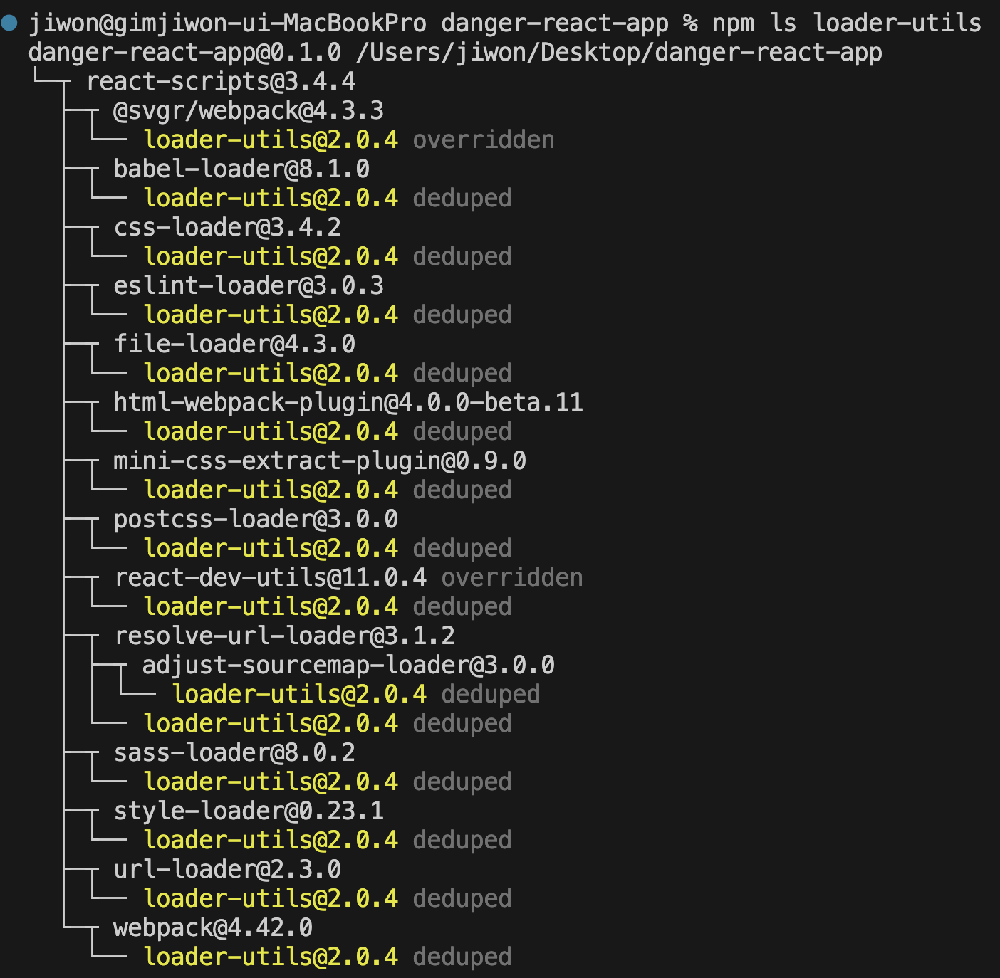

그런데 왜 하필 2.0.4 버전으로 올라갔을까? 먼저 loader-utils의 최신 2.x 버전은 2.0.4이다. overrides가 ^2.0.3로 선언되어 있어 ^2.0.4을 설치해도 된다는 판단이 내려졌기 때문에 ^2.0.3로 통일된 것이다.

만약 overrides에 loader-utils가 2.0.3으로 고정되어 있다면 overrides 규칙에 따라 모든 패키지가 2.0.3으로 고정될 것이다. 그러나 굳이 이렇게 할 필요는 없으므로 ^2.0.3으로 선언해 모든 패키지를 최신 2.x 버전으로 업데이트해 보안이슈를 해결했다.

의존성 관련 이슈를 방지하는 가장 좋은 방법은 의존성을 최소한으로 유지하는 것이다. 바깥에 노출되는 면적이 클수록 위험에 노출되는 확률이 커지는 것과 마찬가지로 의존성, 즉 dependencies와 node_modules의 크기가 커질수록 위험에 노출될 확률 또한 높아진다. 가능한 내재화할 수 있는 모듈은 내재화하고, 의존성을 최소한으로 유지하는 것이 좋다.

마지막으로, 깃허브 Dependabot은 이슈를 찾는 용도로만 사용하고, 절대로 완벽하게 수정해 준다고 맹신해서는 안된다. 앞선 예제처럼 취약점 수정을 위해 제안하는 것은 주 버전을 올리는 것이었다. 그러나 유의적 버전에 따라 주 버전을 올라는 것은, 실제 라이브러리를 사용하는데 많은 변경이 있을 수 있기 때문에 무작정 올려서는는 안 된다.
