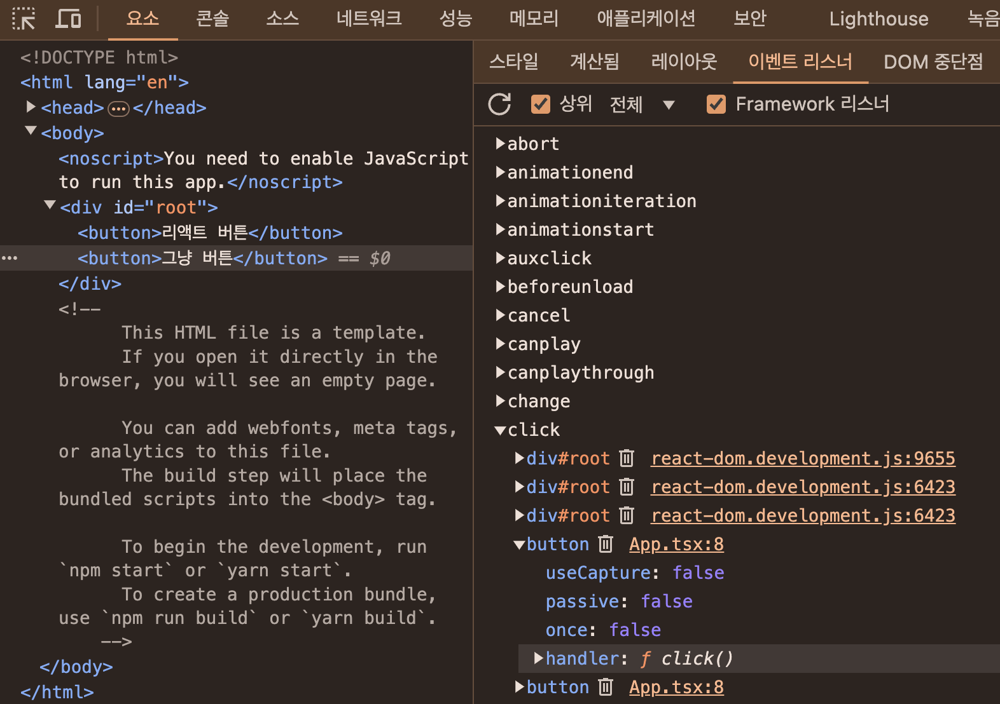
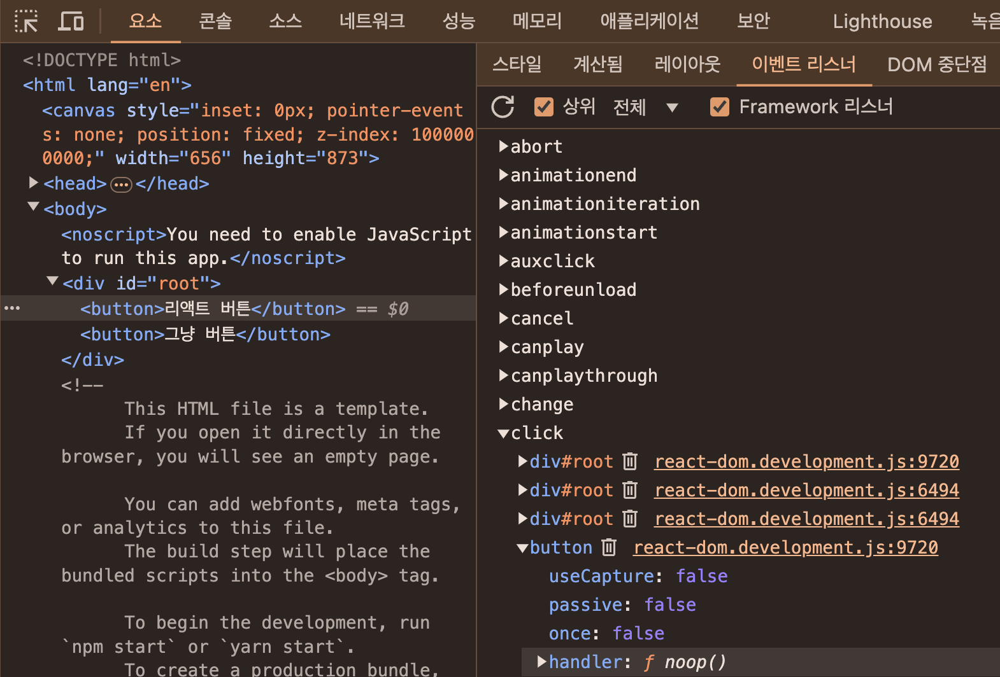
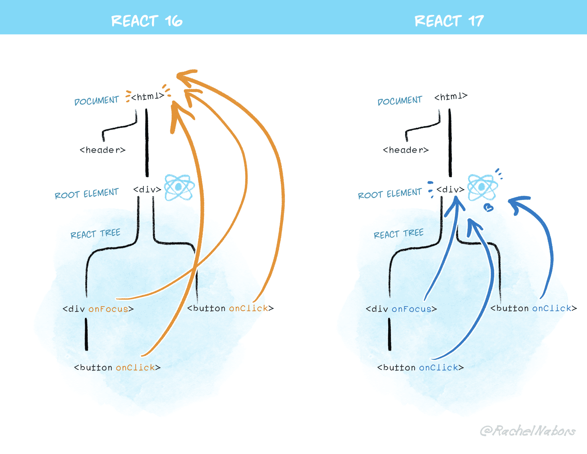

## 10. 리액트 17과 18의 변경 사항 살펴보기

이번에는 리액트 17과 18 버전에 어떠한 변화가 있었는지 살펴보자. 17 버전과 18 버전으로 두 버전을 나눈 이유는 현재 가장 널리 사용되고 있는 리액트 버전이 리액트 16이기 때문에 그 이후에 나온 두 버전이 상대적으로 덜 설치되어 사용 중이기 때문이다. 아마도 대부분의 리액트 프로젝트들이 최소한 훅과 함수 컴포넌트를 사용하기 위해 16.8 버전을 기반으로 개발됐고, 이것이 고착화되어 더 이상 버전 업하지 않고 운영되고 있을 것이다.

### 리액트 17 버전 살펴보기

먼저 리액트 17 버전은 16 버전과 다르게 새롭게 추가된 기능이 없으며 호환성이 깨지는 변경사항, 즉 기존에 사용하던 코드의 수정을 필요로 하는 변경사항을 최소화했다는 점에서 가장 큰 특징으로 꼽는다. 리액트 팀에서 이야기한 바로는, 10만 개 이상의 컴포넌트 중 호환성이 깨지는 변경사항에 영향을 받은 것은 20개 미만으로, 대부분의 애플리케이션이 별다른 문제없이 16버전에서 17버전으로 업그레이드할 수 있을 것으로 내다봤다. 그만큼 16 버전에서 17 버전으로의 버전 업은 큰 부담없이 할 수 있는 작업이라 볼 수 있다.

### 리액트의 점진적인 업그레이드

리액트 16에서 17로의 업데이트는 기존 버전인 16에서 더 이상 호환되지 않는 API가 있거나 새로운 리액트 17을 사용하는데 있어 이전과 작동방식이 달라질 수 있기 때문에 단행한 주 버전 업데이트이다. 반면 수 버전 업데이트인 16.7에서 16.8로의 버전 업은 신규 기능 추가(리액트 훅)로 인해 발생한 것이다.

리액트도 유의적 버전(semantic version)을 기반으로 업데이트를 거치고 있었다. 즉, 새로운 주 버전이 릴리즈되면 이전 버전에서의 API 제공을 완전히 중단해 버리고, 전체 애플리케이션을 새롭게 업그레이드하기를 요구하고 있었다. 이는 새롭게 API를 작성하는 리액트 개발팀 입장에서는 굉장히 편리하면서도 유용한 전략이었지만 오래된 코드 베이스를 기반으로 돌아가는 실제 웹 애플리케이션에는 그다지 좋지 못한 일이다. 새로운 리액트 주 버전이 릴리즈됐다고 가정해보자. 이제 새로운 버전이 릴리즈되면 어떠한 API 수정이 있는지 일일리 확인해서 적용해야 한다. 또 지원을 중단한 API는 또 어떻게 고쳐야 할지도 파악해야 한다. 따라서 레거시 애플리케이션을 관리하는 개발자는 항상 선택의 기로에 놓여 있었다. 전체 웹 서비스가 새로운 버전으로 완전히 넘어가버리거나, 계속 현재(과거 버전)에 머물러 있어야 한다.

그러나 이제 리액트 17 버전부터는 점진적인 업그레이드가 가능해진다. 리액트 17을 설치하고, 이후에 리액트 18로 업데이트하는 상황을 가정해보자. 리액트 18에서 제공하는 대부분의 기능을 사용할 수도 있지만 일부 기능에 대헤서는 리액트 17에 머물러 있는 것이 가능해진다. 즉, 전체 애플리케이션 트리는 리액트 17이지만 일부 트리와 컴포넌트에 대해서만 리액트 18을 선택하는 점진적인 버전 업이 가능해진다. 물론 이것은 이상적인 방법이 아닐 수는 있다. 버전이 서로 다른 리액트가 두 개 존재해야 하는 것이므로 한 개가 있을 때보다는 당연히 관리 지점이 많아진다. 그러나 리액트 버전을 올리기에는 너무 부담이 되는 큰 에플리케이션의 경우에는 충분히 고려해 볼 만한 선택지가 될 수 있다.

이러한 점진적인 업그레이드를 지원하기 위한 리액트 일부 컴포넌트 변경이 리액트 17 업데이트의 주요 변경사항 중 하나이다. 향후 업데이트가 부담된다 하더라도 17 버전부터 제공되는 점진적인 업그레이드를 사용하기 위해서라도 17 버전 업데이트를 고려해 봄 직하다. 일종의 `업데이트를 위한 업데이트`라 볼 수 있다.

그렇다면 여기서 언급한 '한 애플리케이션 내에 여러 버전의 리액트가 존재하는 시나리오'는 어떤 것일까?

- [깃허브 소스코드](https://github.com/wikibook/react-deep-dive-example/tree/main/chapter10/react-gradual-demo)

위 예제는 크게 리액트 17로 구성된 애플리케이션과 리액트 16으로 구성된 애플리케이션으로 나눠서 살펴볼 수 있다. 리액트 17 애플리케이션은 내부에서 리액트 16을 게으르게(lazy) 불러온다. 불러오는 과정에서 리액트 16을 위한 별도의 루트 요소를 만들고, 여기에 불러온 리액트 16 모듈을 렌더링하는 구조로 구성되어 있다. 이렇게 불러온 결과, 서로 렌더링하는 과정에서 버전의 불일치로 인한 에러도 발생하지 않고 하나의 웹사이트에서 두 개의 리액트가 존재하게 되었다. 그리고 이 두 개의 리액트 루트는 단 하나만 존재하는 컴포넌트와 훅을 서로 불러와서 사용할 수 있다. 즉, 리액트 16과 17 버전을 모두 지원하는 컴포넌트나 훅이라면 버전이 다른 두 리액트에서도 무리없이 사용가능히다. Context도 마찬가지로 ThemeContext의 값을 리액트 16과 17이 모두 동일하게 사용하고 있으며, 이 Context가 제공하는 값을 마찬가지로 동일하게 사용할 수 있음을 알 수 있다.

리액트 팀에서는 이를 어디까지나 한꺼번에 업그레이드가 불가능한 상태에서만 차선책으로, 여전히 리액트 버전을 한꺼번에 업데이트하는 게 복잡성 감소 측면에서 좋다고 언급했다.

### 이벤트 위임 방식의 변경

이벤트 위임 방식의 변화를 이해하려면 먼저 리액트에서 이벤트가 어떻게 추가되는지를 이해해야 한다.

```javascript
import { useEffect, useRef } from 'react';

function App() {
  const buttonRef = (useRef < HTMLButtonElement) | (null > null);

  useEffect(() => {
    if (buttonRef.current) {
      buttonRef.current.addEventListener('click', function clcik() {
        alert('Button clicked!');
      });
    }
  }, []);

  function hello() {
    alert('hello');
  }

  return (
    <>
      <button onClick={hello}>리액트 버튼</button>
      <button ref={buttonRef}>그냥 버튼</button>
    </>
  );
}

export default App;
```

먼저 '리액트 버튼'은 일반적으로 리액트 애플리케이션에서 DOM에 이벤트를 추가하는 방식으로 onclick 이벤트를 추가했다. 반면 '그냥 버튼'의 이벤트는 직접 DOM을 참조해서 가져온 다음, DOM에 onclick에 직접 함수를 추가하는 고전적인 이벤트 핸들러 추가 방식을 사용했다. 이 두 방식이 실제 웹에서 어떻게 다른지 살펴보자.





리액트 버튼에 부착한 이벤트는 `<button>`의 onClick 이벤트에 noop이라는 이벤트 핸들러가 추가되어 있는 것을 볼 수 있다. 해당 버튼의 click에는 noop이라고 하는 함수가 달려있고, 이 noop은 문자 그대로(no operation) 아무런 일도 하지 않는 것을 볼 수 있다. 그러나 두 버튼 모두 동일하게 작동한다. 그렇다면 리액트에서는 이벤트를 어떻게 처리할까?

리액트는 이벤트 핸들러를 해당 이벤트 핸들러를 추가한 각각의 DOM 요소에 부탁하는 것이 아니라, 이벤트 타입(click, change)당 하나의 핸들러를 루트에 부착한다. 이를 이벤트 위임이라고 한다. 이벤트 위임을 이해하려면 이벤트가 어떤 단계로 구성되어 있는지 먼저 알아야 한다.

1. `캡쳐(capture)`: 이벤트 핸들러가 트리 최상단 요소에서부터 시작해서 실제 이벤트가 발생한 타깃 요소까지 내려가는 것을 의미한다.
2. `타깃(target)`: 이벤트 핸들러가 타깃 노드에 도달하는 단계이다. 이 단계에서 이벤트가 호출된다.
3. `버블링(bubbling)`: 이벤트가 발생한 요소에서부터 시작해 최상위 요소까지 다시 올라간다.

이벤트 위임이란 이러한 이벤트 단계의 원리를 활용해 이벤트를 상위 컴포넌트에만 붙이는 것을 의미한다.

리액트는 최초 릴리즈부터 이러한 이벤트 위임을 적극적으로 사용했다. 리액트는 이벤트 핸들러를 각 요소가 아닌 document에 연결해서 이벤트를 좀 더 효율적으로 관리한다. 그러나 이러한 이벤트 위임이 리액트 16 버전까지는 모두 document에서 수행되고 있었다. 그런데 리액트 17부터는 이러한 이벤트 위임이 모두 document가 아닌 리액트 컴포넌트 최상단 트리, 즉 루트 요소로 바뀌었다.

그 이유는 앞서 이야기한 점진적인 업그레이드 지원, 그리고 다른 바닐라 자바스크립트 코드 또는 jQuery 등이 혼재되어 있는 경우 혼란을 방지하기 위해서이다. 점진적인 업그레이드 지원이 활성화됐고, 그 덕분에 여러 리액트 버전이 한 서비스에 공존한다고 가정해보자. 마냑 기존 리액트 16 방식대로 모든 이벤트가 document에 달려있으면 어떻게 될까?

```html
<html>
  <body>
    <div id="React-16-14">
      <div id="React-16-8"></div>
    </div>
  </body>
</html>
```

리액트 16 이벤트 위임 원리에 따라 모든 이벤트는 docuemnt에 부착된다. 만약 이 상황에서 React-16-8 컴포넌트가 이벤트 전파를 막는 e.stopPropagation을 실행하면 어떻게 될까? 이미 모든 이벤트는 docuemnt로 올라가 있는 상태이기 떄문에 stopPropagation을 실행한다 하더라도 이미 모든 이벤트는 docuemnt에 있으므로 document의 이벤트 전파는 막을 수 없게된다. 따라서 e.stopPropagation() 실행이 무색하게 바깥에 있는 React-16-14에도 이 이벤트를 전달받게 될 것이다. 이처럼 서로 다른 리액트 버전에서 발생할 수 있는 문제를 해결하기 위해 이벤트 위임의 대상을 document에서 컴포넌트의 최상위로 변경했다. 이렇게 수정하게 되면 각 이벤트는 해당 리엑트 컴포넌트 트리 수준으로 격리되므로 이벤트 버블링으로 인한 혼선을 방지할 수 있다.

이러한 문제는 리액트끼리만 발생하는 것이 아니다. 한 애플리케이션에는 jQuery 같은 다른 라이브러리와 리액트 16 등이 혼재되어 있는 상황인 경우에도 이와 동일한 문제가 충분히 발생할 수 있다.

이러한 document로 이벤트를 위임하는 특성 떄문에 발생하는 또 한 가지 재미있는 일이 있는데, 리액트 16버전에서 document와 리액트가 렌더링되는 루트 컴포넌트 사이에서 이벤트 코드를 막는 코드를 추가하면 리액트의 모든 핸들러가 작동하지 않도록 막을 수 있었다.

```html
<!DOCTYPE html>
<html lang="en">
  <head>
    <meta charset="utf-8" />
    <meta
      name="viewport"
      content="width=device-width, initial-scale=1 shink-to-fit=no"
    />
  </head>
  <body>
    <div id="main">
      <div id="root"></div>
    </div>
  </body>
  <script>
    document.getElementById('main').addEventListener(
      'click',
      function (e) {
        e.stopPropagation();
      },
      false
    );
  </script>
</html>
```

이제 이러한 작동 방식 또한 이벤트 위임 방식이 변경되면서 사라지게 됐다.



이러한 변경으로 인해 코드에서 확인해 볼 것이 하나 생겼다. 만약 코드에 document.addEventListener를 활용해 리액트의 모든 이벤트를 document에서 확인하는 코드가 있다면 여기까지 이벤트가 전파되지 않는 경우도 존재할 수 있으므로 꼭 확인해 봐야한다.

```javascript
import { MouseEvent, useEffect } from 'react';

function App() {
  useEffect(() => {
    document.addEventListener('click', (e) => {
      console.log('이벤트가 document까지 올라옴');
    });
  }, []);

  function hello(e: MouseEvent<HTMLButtonElement>) {
    e.stopPropagation();
    alert('Hello');
  }

  return <button onClick={hello}>리액트 버튼</button>;
}
```

이 코드는 리액트 16과 17에서 다르게 작동한다. 리액트 16에서는 모든 이벤트가 document에 달려 있으므로 stopPropagation이 의미가 없지만 리액트 17의 경우에는 컴포넌트 루트에 달려 있으므로 document에 부착한 console 이벤트를 볼 수 없을 것이다. 리액트의 이러한 이벤트 작동 방식을 기반으로 작성한 코드가 있다면 리액트 17을 적용하면서 함께 반드시 수정해야 한다.

### import React from 'react'가 더 이상 필요없다. 새로운 JSX transform

JSX는 브라우저가 이해할 수 있는 코드가 아니므로 바벨이나 타입스크립트를 활용해 JSX를 실행하기 위해 일반적인 자바스크립트로 변환하는 과정이 꼭 필요하다. 일반적으로 create-react-app을 활용해서 개발하면 이러한 작업을 따로 처리한 경험이 없겠지만 대부분의 경우에는 이 변환 작업이 개발자에게 보이지 않는 리액트 단에서 이뤄지고 있었다. 16버전까지는 이러한 JSX 변환을 사용하기 위해 코드 내에서 React를 사용하는 구문이 없더라도 import React from 'react'가 필요했고, 이 코드가 없다면 에러가 발생했다.

그러나 리액트 17부터 바벨과 협력해 이러한 import 구문 없이도 JSX를 변환할 수 있게 됐다. 이 새로운 변환식은 import React가 필요 없다는 장점 외에도, 불필요한 import 구문을 삭제해 번들링 크기를 약간 줄일 수 있고, 컴포넌트 작성을 더욱 간결하게 해준다.

```javascript
// 구버전 JSX 변환(리액트 16)
const Component = {
  <div>
    <span>hello world</span>
  </div>
}

// React.createElement를 수행할 때 import React from 'react'가 팔요하다
var Component = React.createElement(
  'div',
  null,
  React.createElement('span', null, 'hello world')
)
```

```javascript
// 리액트 17
'use strict';

var _jsxRuntime = require('react/jsx-runtime');

var Component = (0, _jsxRuntime.jsx)('div', {
  children: (0, _jsxRuntime.jsx)('span', {
    children: 'hello world',
  }),
});
```

React.createElement가 사라진 것도 눈에 띄지만 한 가지 더 주목해 볼 만한 것은 바로 require() 구문이다. 이제 JSX 변환에 필요한 모듈인 react/jsx-runtime을 불러오는 require 구문도 같이 추가되므로 import React from 'react'를 작성하지 않아도 된다.

기존 코드에서 굳이 import React를 삭제하지 않고 둬도 상관없지만 번들링 사이즈를 조금이라도 줄이고 싶다면 react-codemod를 사용해 모두 삭제할 수 있다.

```shell
npx react-codemod update-react-imports
```

따라서 특별한 이유가 없다면 import React를 지우고, tsconfig.json의 jsx를 react-jsx 등으로 변경하여 이점을 모두 누리도록 하자.

### 그 밖에 주요 변경사항

**이벤트 풀링 제거**

과거 이벤트 16에서는 이른바 이벤트 풀링이라 불리는 기능이 있었다. 리액트에는 이벤트를 처리하기 위한 SyntheticEvent라는 이벤트가 있는데, 이 이벤트는 브라우저의 기본 이벤트를 한 번 더 감싼 이벤트 객체이다. 리액트는 이렇게 브라우저 기본 이벤트가 아닌 한번 래핑한 이벤트를 사용하기 때문에 이벤트가 발생할 때마다 이 이벤트를 새로 만들어야 했고, 그 과정에서 항상 새로 이벤트를 만들 때마다 메모리 할당 작업이 일어날 수 밖에 없다. 또한 메모리 누수를 방지하기 위해 이렇게 만든 이벤트를 주기적으로 해제해야 하는 번거로움도 있다. 여기서 이벤트 풀링이란 SyntheticEvent 풀을 만들어서 이벤트가 발생할 때마다 가져오는 것을 의미한다.

즉, 이벤트 풀링 시스템에서는 다음과 같이 이벤트가 발생한다.

1. 이벤트 핸들러가 이벤트를 발생시킨다.
2. 합성 이벤트 풀에서 합성 이벤트 객체에 대한 참조를 가져온다.
3. 이 이벤트 정보를 합성 이벤트 객체에 넣어준다.
4. 유저가 지정한 이벤트 리스너가 실행된다.
5. 이벤트 객체가 초기화되고 다시 이벤트 풀로 돌아간다.

언뜻 보기에는 이벤트 풀에 있는 합성 이벤트를 반복적으로 사용할 수 있어서 효과적으로 보이지만 풀에서 이벤트를 받아오고, 이벤트가 종료되자마자 다시 초기화하는(null로 변경하는) 방식은 분명 사용하는 쪽에서는 직관적이지 않았다.

```javascript
// error
// Cannot read properties of null (reading 'value')

export default function App() {
  const [value, setValue] = useState('');

  function handleChange(e: ChangeEvent<HTMLInputElement>) {
    setValue(() => {
      return e.target.value;
    });
  }

  return <input onChange={handleChange} value={value} />;
}
```

리액트 16 이하 버전에서는 이벤트 풀링 방식을 통해 서로 다른 이벤트 간에 이벤트 객체를 재사용하고, 그리고 이 재사용하는 사이에 모든 이벤트 필드를 null로 변경하기 때문에 위와 같은 에러가 발생한다. 좀 더 쉽게 표현하자면 한번 이벤트 핸들러를 호출한 SyntheticEvent는 이후 재사용을 위해 null로 초기화된다. 따라서 비동기 코드 내부에서 SyntheticEvent인 e에 접근하면 이미 사용되고 초기화된 이후이기 때문에 null만 얻게 된다. 비동기 코드 내부에서 이 합성 이벤트 e에 접근하기 위해서는 추가적인 작업인 e.persist() 같은 처리가 필요했다.

리액트 17부터는 매 이벤트마다 새로운 SyntheticEvent 객체를 생성한다.

```javascript
export default function App() {
  const [value, setValue] = useState('');

  function handleChange(e: ChangeEvent<HTMLInputElement>) {
    e.persist();
    setValue(() => {
      return e.target.value;
    });
  }

  return <input onChange={handleChange} value={value} />;
}
```

비동기 코드로 이벤트 핸들러에 접근하기 위해서는 이러한 방식으로 별도 메모리 공간에 합성 이벤트 객체를 할당해야 한다는 점, 그리고 모던 브라우저에서는 이와 같은 방식으로 성능 향상에 크게 도움이 안 된다는 점 때문에 이러한 이벤트 폴링 개념이 사라졌다. 그리고 모던 브라우저에서는 이러한 이벤트 처리에 대한 성능이 많이 개선됐기 때문에 이러한 처리는 더욱 의미가 퇴색하게 되었다. 따라서 이벤트 핸들러 내부에서 이벤트 객체에 접근할 때 비동기든 동기든 상관없이 일관적으로 코딩할 수 있게됐다.

**useEffect 클린업 함수의 비동기 실행**

먼저 리액트의 useEffect에 있는 클린업 함수는 리액트 16 버전까지는 동기적으로 처리됐다. 동기적으로 실행됐기 때문에 이 클린업 함수가 완료되기 전까지는 다른 작업을 방해하므로 불필요한 성능 저하로 이어지는 문제가 존재했다. 그러나 리액트 17 버전부터는 화면이 완전히 업데이트된 이후에 클린업 함수가 비동기적으로 실행된다. 조금 더 정확히 이야기하면 클린업 함수는 컴포넌트 커밋 단계가 완료될 때까지 지연된다. 즉, 화면이 업데이트가 완전히 끝난 이후에 실행되도록 바뀌었으며, 이로써 약간의 성능적인 이점을 볼 수 있게 됐다.

리액트 16에서는 클린업 함수가 'update'(Profile에서 update는 리렌더링을 의미한다) 이전에 실행됐지만 리액트 17에서는 리랜더링이 일어난 뒤에 실행되어 화면에 업데이트가 반영되는 시간인 commitTime이 조금이나마 빨라진다.

**컴포넌트의 undefined 반환에 대한 일괄적인 처리**

리액트 16과 17 버전은 컴포넌트 내부에서 undefined를 반환하면 오류가 발생한다. 이는 의도치 않게 잘못된 반환으로 인한 실수를 방지하기 위해서였다.

```javascript
export default function App() {
  // 반환되는게 없으므로 undefined가 반환됨
}
```

그러나 리액트 16에서 forwardRef나 memo에서 undefined를 반환하는 경우에는 별다른 에러가 발생하지 않는 문제가 있었다. 그러나 리액트 17부터는 에러가 정상적으로 발생한다. 참고로 리액트 18부터는 undefined를 반환해도 에러가 발생하지 않는다.

### 리액트 18 버전 살펴보기

리액트 17에서 점진적인 업그레이드를 위한 준비를 했다면 리액트 18에서는 리액트 17에서 하지 못했던 다양한 기능들이 추가됐다. 그중 가장 큰 변경점은 바로 동시성 지원이다. 현재 시점의 최신 버전인 18.2.0 버전에는 어떠한 변경점이 있는지 살펴보자.

### 새로운 추가된 훅 살펴보기

**useId**

useId는 컴포넌트별로 유니크한 값을 생성하는 새로운 훅이다. 사실 컴포넌트 내부에서 사용할 수 있는 유니크한 값을 생성하는 것은 생각보다 쉽지 않은 일이다. 하나의 컴포넌트가 여러 군데에서 재사용되는 경우도 고려해야 하며, 리액트 컴포넌트 트리에서 컴포넌트가 가지는 모든 값이 겹치지 않고 다 달라야 한다는 제약도 있다. 또한 서버 사이드 렌더링 환경에서 하이드레이션이 일어날 때도 서버와 클라이언트에서 동일한 값을 가져야 에러가 발생하지 않으므로 이러한 점도 고려해야 한다.

그러나 새로운 훅인 useId를 사용하면 클라이언트와 서버에서 불일치를 피하면서 컴포넌트 내부의 고유한 값을 생성할 수 있게 됐다. 같은 컴포넌트임에도 서로 인스턴스가 다르면 다른 랜덤한 값을 만들어 내며, 이 값들이 모두 유니크한 것을 볼 수 있다. 또한 서버 사이드와 클라이언트 간에 동일한 값이 생성되어 하이드레이션 이슈도 발생하지 않는 것을 알 수 있다. 이 useId가 생성하는 값을 :로 감싸져 있는데, 이는 CSS 선택자나 querySelector에서 작동하지 않도록 하기 위한 의도적인 결과이다.

리액트에서 useId를 활용한 아이디 생성 알고리즘에 대해 간단하게 소개하자면 id는 기본적으로 현재 트리에서의 자신의 위치를 나타내는 32글자의 이진 문자열로 이뤄져 있으며, 왼쪽 5자리가 부모의 트리를 나타낸다. 앞 글자가 R이면 서버에서 생성된 값이며, r이면 클라이언트에서 생성된 값이다.

**useTransition**

useTransition 훅은 UI 변경을 가로막지 않고 상태를 업데이트할 수 있는 리액트 훅이다. 이를 활용하면 상테 업데이트를 긴급하지 않은 것으로 간주해 무거운 렌더링 작업을 조금 미룰 수 있으며, 사용자에게 조금 더 나은 사용자 경험을 제공할 수 있다.

```javascript
import { memo, useState } from 'react';

type Tab = 'about' | 'posts' | 'contact';

export default function App() {
  const [tab, setTab] = useState < Tab > 'about';

  function selectTab(nextTab: Tab) {
    setTab(nextTab);
  }

  return (
    <>
      <button onClick={() => selectTab('about')}>about</button>
      <button onClick={() => selectTab('posts')}>posts</button>
      <button onClick={() => selectTab('contact')}>contact</button>

      {tab === 'about' && <div>about</div>}
      {tab === 'posts' && <PostTab />}
      {tab === 'contact' && <div>contact</div>}
    </>
  );
}

const PostTab = memo(function Posts() {
  const items = Array.from({ length: 1500 }).map((_, i) => (
    <PostItem index={i} />
  ));

  return <ul>{items}</ul>;
});

function PostItem({ index }: { index: number }) {
  let startTime = performance.now();

  // 랜더링이 느려지는 상황을 가정하기 위해 느린 코드를 추가
  while (performance.now() - startTime < 1) {}

  return <li>Post #{index + 1}</li>;
}
```

위 코드를 실행한 후, post를 선택한 후에 바로 contact 선택해보자. 이때 <PostTab />을 렌더링하기 위해 잠시 브라우저가 작동을 멈춘 듯한 모습을 보이며, 렌더링이 끝난 이후에야 비로소 contact를 렌더링하는 것을 확인할 수 있다. 이는 setTab이라는 상태 업데이트로 인해 PostTab을 렌더링하고, 이 PostTab 렌더링 작업이 상당한 시간이 소요되어 UI 렌더링을 가로막기 때문이다. 이러한 시나리오에는 사실 사용자가 PostTab을 실수로 누른 것으로 볼 수 있기 때문에 지금까지의 PostTab 렌더링을 중단하고 바로 contact를 보여주는 것이 더 적절한 시나리오였을 것이다. 그러나 이전까지 리액트의 렌더링은 한번 시작하면 멈출 수 없는 작업이었기 때문에 이러한 문제가 발생했다.

이처럼 상태 변경으로 인해 무거운 작업이 발생하고, 이로 인해 렌더링이 가로막힐 여지가 있는 경우 useTransition을 사용하면 이러한 문제를 해결할 수 있다.

```typescript
import { memo, useState, useTransition } from 'react';

type Tab = 'about' | 'posts' | 'contact';

export default function App() {
  const [isPending, startTransition] = useTransition();

  const [tab, setTab] = useState<Tab>('about');

  function selectTab(nextTab: Tab) {
    startTransition(() => {
      setTab(nextTab);
    });
  }

  return (
    <>
      {isPending && <div>로딩중...</div>}
      <button onClick={() => selectTab('about')}>about</button>
      <button onClick={() => selectTab('posts')}>posts</button>
      <button onClick={() => selectTab('contact')}>contact</button>

      {tab === 'about' && <div>about</div>}
      {tab === 'posts' && <PostTab />}
      {tab === 'contact' && <div>contact</div>}
    </>
  );
}

const PostTab = memo(function Posts() {
  const items = Array.from({ length: 1500 }).map((_, i) => (
    <PostItem index={i} />
  ));

  return <ul>{items}</ul>;
});

function PostItem({ index }: { index: number }) {
  let startTime = performance.now();

  // 랜더링이 느려지는 상황을 가정하기 위해 느린 코드를 추가
  while (performance.now() - startTime < 1) {}

  return <li>Post #{index + 1}</li>;
}
```

useTransition은 아무런 인수를 받지 않으며, isPending과 startTransition이 담긴 배열을 반환한다. isPending은 상태 업데이트가 진행 중인지를 확인할 수 있는 boolean이고, startTransition은 긴급하지 않은 상태 업데이트로 간주할 set 함수를 넣어둘 수 있는 함수를 인수로 받는다. 여기서는 `() => {setTab(nextTab)}`를 인수로 받았지만 경우애 따라서는 여러 개의 setter를 넣어줄 수도 있다.

위 코드를 실행해보면 이전과 다르게 탭을 아무리 선택해도 렌더링이 블로킹되지 않는 것을 알 수 있다.

즉, 렌더링에 시간이 소요되는 `<PostTab />`은 동기방식으로 브라우저의 다른 작업을 방해하면서 즉각 렌더링을 시작하지 않고, 마치 async와 await처럼 비동기로 렌더링한다. 그리고 `<PostTab />` 컴포넌트 렌더링 와중에 다른 상태 업데이트로 전환되면 `<PostTab />`이 취소될 수도, 혹은 완성될 때까지 기다리되 다른 렌더링을 가로막지 않을 수 있다.

useTransition은 리액트 18의 변경사항의 핵심 중 하나인 `동시성(concurrency)`을 다룰 수 있는 새로운 훅이다. 과거 리액트의 모든 렌더링은 동기적으로 작동해 느린 렌더링 작업이 있을 경우 애플리케이션 전체적으로 영향을 끼쳤지만 useTrasition과 같은 동시성을 지원하는 기능을 사용하면 느린 렌더링 과정에서 로딩화면을 보여주거나 혹은 지금 진행 중인 렌더링을 버리고 새로운 상태값으로 다시 렌더링하는 등의 작업을 할 수 있게된다. 이는 앱의 성능을 향상시킬 뿐만 아니라 시용자에게 좀 더 자연스러운 서비스를 경험할 수 있게 해준다.

useTransition은 이름에서도 알 수 있듯 컴포넌트에서만 사용 가능한 훅이다. 훅을 사용할 수 없는 상황이라면 단순히 startTransition을 바로 import할 수도 있다.

```javascript
import { startTransition } from 'react';
```

**useTransition을 사용할 때 주의할 점**

- startTransition 내부는 반드시 setState와 같은 상태를 업데이트하는 함수와 관련된 작업만 넘길 수 있다. 만약 props나 커스텀 훅에서 반환하는 값 등을 사용하고 싶다면 뒤이어 나올 useDefferedValue를 사용하면 된다.
- startTransition으로 넘겨주는 상태 업데이트는 다른 모든 동기 상태 업데이트로 인해 실행이 지연될 수 있다. 예를 들어, 타이핑으로 인해 setState가 일어나는 경우 타이핑이 끝날 때까지 useTransition으로 지연시킨 상태 업데이트는 일어나지 않는다.
- startTransition으로 넘겨주는 함수는 반드시 동기함수여야 한다. 만약 이 안에 setTimeout과 같은 비동기 함수를 넣으면 제대로 작동하지 않게 된다. 이는 startTransition 작업을 지연시키는 작업과 비동기 함수가 실행되는 작업 사이에 불일치가 일어나기 때문이다.

**useDefferedValue**

useDefferedValue는 리액트 컴포넌트 트리에서 리렌더링이 급하지 않은 부분을 지연할 수 있게 도와주는 훅이다. 일반적으로 개발자들 사이에서 널리 사용되고 있는, 특정 시간 동안 발생하는 이벤트를 하나로 인식해 한 번만 실행하게 해주는 디바운스와 비슷하지만 디바운스 대비 useDefferedValue만이 가진 장점이 몇 가지 있다.

먼저 디바운스는 고정된 지연시간을 필요로 하지만 useDefferedValue는 고정된 지연시간 없이 첫 번째 렌더링이 완료된 이후에 이 useDefferedValue로 지연된 렌더링을 수행한다. 그러므로 이 지연된 렌더링은 중단할 수도 있으며, 사용자의 인터렉션을 차단하지도 않는다.

```javascript
import { ChangeEvent, useDeferredValue, useMemo, useState } from 'react';

export default function Input() {
  const [text, setText] = useState('');
  const defferedText = useDeferredValue(text);

  const list = useMemo(() => {
    const arr = Array.from({ length: defferedText.length }).map(
      (_) => defferedText
    );

    return (
      <ul>
        {arr.map((str, i) => (
          <li key={i}>{str}</li>
        ))}
      </ul>
    );
  }, [defferedText]);

  function handleChange(event: ChangeEvent<HTMLInputElement>) {
    setText(event.target.value);
  }

  return (
    <>
      <input value={text} onChange={handleChange} />
      {list}
    </>
  );
}
```

list를 생성하는 기준을 text가 아닌 deferredText로 설정함으로써 잦은 변경이 있는 text를 먼저 업데이트해 렌더링하고, 이후 여유가 있을 때 지연된 deferredText를 활용해 list를 새로 생성하게 된다. list에 있는 작업이 더 무겁고 오래 걸릴수록 useDeferredValue를 사용하는 이점을 더욱 누릴 수 있을 것이다.

그렇다면 useDeferredValue와 useTransition은 어떤 차이가 있을까? useTransition은 state 값을 업데이트하는 함수를 감싸서 사용하는 반면, useDeferredValue는 state 값 자체만을 감싸서 사용하는 것을 볼 수 있다. 방식에만 차이가 있을 뿐, 지연된 렌더링을 한다는 점에서는 모두 동일한 역할을 하는 것을 알 수 있다. 따라서 두 가지를 모두 동시에 사용할 필요는 없으며, 상황에 맞는 방법을 선택하면 된다.

만약 낮은 우선순위로 처리해야 할 작업에 대해 직접적으로 상태를 업데이트할 수 있는 코드에 접근할 수 있다면 useTransition을 사용하는 것이 좋다. 그러나 컴포넌트의 props와 같이 상태 업데이트에 관여할 수는 없고 오로지 값만 받아야 하는 상황이라면 useDefferedValue를 사용하는 것이 타당하다. 렌더링을 지연시켜도 되는 작업에 대해 상황에 맞게 둘 중 하나를 사용하면 될 것이다.

**useSyncExternalStore**

useSyncExternalStore는 일반적인 애플리케이션 코드를 작성할 때는 사용할 일이 거의 별로 없는 훅이다. 이 훅의 기원을 알려면 리액트 17까지 존재했던 useSubscription에 대해 알아야한다. 간단히 요약하자면 useSubscription의 구현이 리액트 18에 이르러서 useSyncExternalStore로 대체된 것을 확인할 수 있다.

리액트 17에서는 테어링(tearing) 현상이 일어날 여지가 없었다. 그러나 리액트 18에서는 앞서 useTransition, useDefferrdValue의 훅처럼 렌더링을 일시 중지하거나 뒤로 미루는 등의 최적화가 가능해지면서 동시성 이슈가 발생할 수 있다. 예를 들어, startTranstion으로 렌더링을 일시중지했다고 가정해보자. 만약 이러한 일시중지 과정에서 값이 업데이트되면 동일한 하나의 변수(데이터)에 대해서 서로 다른 컴포넌트 형태가 나타날 수 있다.

과거에 리액트에서는 중간에 데이터가 업데이트가 일어나는 것과 상관없이 동기적으로 렌더링이 한 번에 발생해서 이러한 문제가 없었다. 그러나 리액트 18부터는 리액트가 렌더링을 앞선 훅의 예제처럼 중지했다가 다시 실행하는 등 '양보'가 가능해졌기 때문에 이러한 문제가 발생할 가능성이 존재하는 것이다. 물론 리액트에서 관리하는 state라면 useTransition이나 useDefferedValue 예제와 같이 내부적으로 이러한 문제를 해결하기 위해 처리를 해뒀지만 리액트에서 관리할 수 없는 외부 데이터 소스에서라면 문제가 달라진다. 여기서 말하는 리액트가 관리할 수 없는 외부 데이터 소스란 리액트 클로저 범위 밖에 있는, 관리 범위 밖에 있는 값들을 말한다. 글로벌 변수, document, body, window.innerWidth, DOM, 리액트 외부에 상태를 저장하는 외부 상태 라이브러리 등이 모두 여기에 해당한다. 즉 useState나 useReducer가 아닌 모든 것들이 바로 외부 데이터 소스이다. 이 외부 데이터 소스에 리액트에서 추구하는 동시성 처리가 추가되어 있지 않다면 테어링 현상이 발생할 수 있다. 그리고 이 문제를 해결하기 위한 훅이 바로 useSyncExternalStore이다.

```javascript
import { useSyncExternalStore } from 'react';

// useSyncExternalStore(
//   subscribe: (callback) => Unsubscribe
//   getSnapshot: () => State
// ) => State
```

- 첫 번째 인수는 subscribe로, 콜백 함수를 받아 스토어에 등록하는 용도로 사용된다. 스토어에 값이 변경되면 이 콜백이 호출되어야 한다. 그리고 useSyncExternalStore는 이 훅을 사용하는 컴포넌트를 리렌더링한다.
- 두 번째 인수는 컴포넌트에 필요한 현재 스토어의 데이터를 반환하는 함수이다. 이 함수는 스토어가 변경되지 않았다면 매번 함수를 호출할 때마다 동일한 값을 반환해야 한다. 스토어에서 값이 변경됐다면 이 값을 이전 값과 Object.is로 비교해 정말로 값이 변경됐다면 컴포넌트를 리렌더링한다.
- 마지막 인수는 옵셔널 값으로, 서버 사이드 렌더링 시에 내부 리액트를 하이드레이션하는 도중에만 사용된다. SSR애서 렌더링되는 훅이라면 반드시 이 값을 넘겨줘야 하며, 클라이언트 값과 불일치가 발생할 경우 오류가 발생한다.

useSyncExternalStore는 리액트에서 렌더링이 일어나는 경우에 추가로 useSyncExternalStore 훅의 외부 스토어 데이터 변경 또한 리렌더링을 발생시킬 수 있다는 것을 알 수 있다.

```javascript
import { useSyncExternalStore } from 'react';

function subscribe(callback: (this: Window, ev: UIEvent) => void) {
  window.addEventListener('resize', callback);

  return () => {
    window.removeEventListener('resize', callback);
  };
}

export default function App() {
  const windowSize = useSyncExternalStore(
    subscribe,
    () => window.innerWidth,
    () => 0 // SSR 시 제공되는 기본값, 서버 사이드에서 해당 값을 추적할 수 없으므로 0을 제공
  );

  return <>{windowSize}</>;
}
```

useSyncExternalStore를 통해 현재 윈도우의 innerWidth를 확인하는 코드를 작성했다. innerWidth는 리액트 외부에 있는 데이터 값이므로 이 값의 여부를 확인해 리렌더링까지 이어지게 하려면 useSyncExternalStore를 사용하는 것이 매우 적절하다.

이를 하나의 훅으로 만들어서 사용할 수도 있다.

```javascript
import { useSyncExternalStore } from 'react';

function subscribe(callback: (this: Window, ev: UIEvent) => void) {
  window.addEventListener('resize', callback);

  return () => {
    window.removeEventListener('resize', callback);
  };
}

function useWindowWidth() {
  return useSyncExternalStore(
    subscribe,
    () => window.innerWidth,
    () => 0
  );
}

export default function App() {
  const windowSize = useWindowWidth();

  return <>{windowSize}</>;
}
```

사실 이전에도 useSyncExternalStore가 없어도 이와 비슷한 훅을 만들 수 있었다.

```javascript
function useWindowWidth() {
  const [windowWidth, setWindowWidth] = useState(0);

  useEffect(() => {
    function handleResize() {
      setWindowWidth(window.innerWidth);
    }

    window.addEventListener('resize', handleResize);

    return () => window.removeEventListener('resize', handleResize);
  }, [windowWidth]);

  return windowWidth;
}
```

그렇다면 useSyncExternalStore와 앞의 두 예제 사이에 어떠한 차이가 있을까? 앞서 useTransition을 사용한 예제에서 두 가지 훅을 추가해 차이를 비교해보자.

```javascript
const PostTab = memo(function Posts() {
  const width1 = useWindowWidth();
  const width2 = useWindowWidthWithSyncExternalStore();

  const items = Array.from({ length: 1500 }).map((_, i) => (
    <PostItem key={i} index={i} />
  ));

  return (
    <>
      <div>useState + useEffect {width1}px</div>
      <div>useSyncExternalStore {width2}px</div>
      <ul>{items}</ul>
    </>
  );
});
```

PostTab을 선택하면 앞서 예제에서 보았듯 렌더링을 지연시키는 startTransition이 실행된 이후에 PostTab이 노출된다. 그리고 startTransition 이후에 width를 보면 그 차이를 확연하게 알 수 있는데, useSyncExternalStore를 사용한 훅은 컴포넌트 렌더링 이후에 정확하게 바로 현재 width를 가져온 반면, 사용하지 않은 쪽은 아예 값을 가져오지 못하고 초기값인 0이 나타나는 것을 확인할 수 있다. 즉, 외부에 상태가 있는 데이터는 반드시 useSyncExternalStore를 사용해 값을 가져와야 startTransition 등으로 인한 테어링 현상이 발생하지 않음을 알 수 있다.

**useInsertionEffect**

앞서 useSyncExternalStore가 상태관리 라이브러리를 위한 훅이라면 useInsertionEffect는 CSS-in-js 라이브러리를 위한 훅이다.

앞서 Next.js에 styled-components를 적용하는 예제를 만들어봤다면 \_document.tsx에 styled-components가 사용하는 스타일을 모두 모아서 SSR 이전에 `<style>`태그에 삽입하는 작업을 해봤을 것이다. CSS의 추가 및 수정은 브라우저에서 렌더링하는 작업 대부분을 다시 계산해 작업해야 하는데, 이는 리액트 관점으로 본다면 모든 리액트 컴포넌트에 영향을 미칠 수 있는 매우 무거운 작업이다. 따라서 리액트 17과 styled-components에서는 클라이언트 렌더링 시에 이러한 작업이 발생하지 않도록 서버 사이드에서 스타일 코드를 삽입했다. 그러나 이 작업을 훅으로 처리하는 것은 지금까지 쉽지 않았는데, 훅에서 이러한 작업을 할 수 있도록 도와주는 새로운 훅이 바로 useInsertionEffect이다.

useInsertionEffect의 기본적인 훅 구조는 useEffect와 동일하다. 다만 useEffect와 다른 차이점은 바로 실행시점인데, useInsertionEffect는 DOM이 실제로 변경되기 전에 동기적으로 실행된다. 이 훅 내부에 스타일을 삽입하는 코드를 집어넣음으로써 브라우저가 레이아웃을 계산하기 전에 실행될 수 있게끔 해서 좀 더 자연스러운 스타일 삽입이 가능해진다. useEffect, useLayoutEffect, useInsertionEffect의 실행순서는 다음과 같다.

```javascript
function Index() {
  useEffect(() => {
    console.log('useEffect'); // 3
  });

  useLayoutEffect(() => {
    console.log('useLayoutEffect'); // 2
  });

  useInsertionEffect(() => {
    console.log('useInsertionEffect'); // 1
  });
}
```

useLayoutEffect와 비교했을 때 실행되는 타이밍이 미묘하게 다르다. 두 훅 모두 브라우저에 DOM에 렌더링되기 전에 실행된다는 공통점이 있지만 useLayoutEffect는 모든 DOM의 변경작업이 끝난 이후에 실행되는 반면 useInsertionEffect는 이러한 DOM 변경작업 이전에 실행된다. 이러한 차이는 브라우저가 다시금 스타일을 입혀서 DOM을 재계산하기 않아도 된다는 점에서 매우 크다고 볼 수 있다.

리액트에서 권고하는 것처럼 useSyncExternalStore와 마찬가지로 useInsertionEffect는 실제 애플리케이션 코드를 작성할 때는 사용될 일이 거의 없으므로 라이브러리를 작성하는 경우가 아니라면 참고만 하고 실제 애플리케이션 코드에는 가급적 사용하지 않는 것이 좋다.

### react-dom/client

클라이언트에서 리액트 트리를 만들 때 사용되는 API가 변경됐다. 만약 리액트 18 이하 버전에서 만든 create-react-app으로 프로젝트를 유지보수 중이라면 리액트 18로 업그레이드할 때 반드시 index.{t|j}sx에 있는 내용을 변경해야 한다.

**createRoot**

기존에 react-dom에 있던 render 메서드를 대체할 새로운 메서드이다. 리액트 18의 기능을 사용하고 싶다면 이 createRoot와 render를 함께 사용해야 한다.

```javascript
// before
import ReactDOM from 'react-dom';
import App from 'App';

const container = document.getElementById('root');

ReactDOM.render(<App />, container);

// after
import ReactDOM from 'react-dom';
import App from 'App';

const container = document.getElementById('root');
const root = ReactDOM.createRoot(container);
root.render(<App />);
```

**hydrateRoot**

SSR 애플리케이션에서 하이드레이션을 하기위한 새로운 메서드이다. 뒤이어 설명할 React DOM서버 API와 함께 사용된다.

```javascript
// before
import ReactDOM from 'react-dom';
import App from 'App';

const container = document.getElementById('root');

ReactDOM.hydrate(<App />, container);

// after
import ReactDOM from 'react-dom';
import App from 'App';

const container = document.getElementById('root');
const root = ReactDOM.hydrateRoot(container, <App />);
```

이렇게 API가 변경된 것 외에도 추가로 두 API는 새로운 옵션인 onRecoverableError를 인수로 받는다. 이 옵션은 리액트가 렌더링 또는 하이드레이션 과정에서 에러가 발생했을 때 실행하는 콜백 함수이다. 기본값으로 reportError 또는 console.error를 사용하지만 필요하다면 원하는 내용을 추가해도 된다.

### react-dom/server

클라이언트의 변화와 마찬가지로 서버에서도 컴포넌트를 생성하는 API에 변경이 있었다.

**renderToPipeableStream**

리액트 컴포넌트를 HTML로 렌더링하는 메서드이다. 이 메서드는 이름에서 알 수 있듯 스트림을 지원한는 메서드로, HTML을 점진적으로 렌더링하고 클라이언트에서는 중간에 script를 삽입하는 등의 작업을 할 수 있다. 이를 통해 서버에서는 Suspense를 사용해 빠르게 렌더링이 필요한 부분을 먼저 렌더링할 수 있고, 값비싼 연산으로 구성된 부분은 이후에 렌더링되게끔 할 수 있다. 여기에 앞서 소개한 hydrateRoot를 호출하면 서버에서는 HTML을 렌더링하고, 클라이언트의 리액트에서는 여기에 이벤트만 추가함으로써 첫 번째 로딩을 매우 빠르게 수행할 수 있다.

기존 renderToNodeStream의 문제는 무조건 렌더링을 순서대로 해야하고, 그리고 이 순서에 의존적이기 때문에 이전 렌더링이 완료되지 않는다면 이후 렌더링도 끝나지 않는다는 것이다. 따라서 만약에 중간에 오래 걸리는 작업이 있다면 그 작업 때문에 나머지 렌더링도 덩달아 지연된다는 문제가 있다. 그러나 이번에 새롭게 추가된 renderToPipeableStream을 활용하면 순서나 오래걸리는 렌더링에 영향받을 필요없이 빠르게 렌더링을 수행할 수 있게된다.

리액트 18에서 제공하는 `<Suspense />`와 같은 코드분할 내지는 지연 렌더링을 서버 사이드에서 완전히 사용하기 위해서는 renderToPipeableStream을 사용해야 한다. 물론 실제로 renderToPipeableStream을 가지고 SSR을 만드는 경우는 거의 없겠지만 사용하고자 하는 프레임워크에서 리액트 18을 사용하고 싶다면 해당 메서드의 지원여부를 확인해보는 것이 좋다.

**renderToReadableStream**

renderToPipeableStream이 Node.js 환경에서의 렌더링을 위해 사용된다면, renderToReadableStream은 웹 스트림(web stream)을 기반으로 작동한다는 차이가 있다. 이는 서버 환경이 아닌 클라우드플레어(Cloudflare)나 디노(Deno) 같은 웹 스트림을 사용하는 모던 엣지 런타임 환경에서 사용되는 메서드이다. 실제로 웹 애플리케이션을 개발하는 경우에는 이 메서드를 사용할 일이 거의 없을 것이다.

### 자동 배치(Automatic Batching)

자동배치, 이른바 Automatic Batching은 리액트가 여러 상태 업데이트를 하나의 리렌더링으로 묶어서 성능을 향상시키는 방법을 의미한다. 예를 들어, 버튼 클릭 한 번에 두 개 이상의 state를 동시에 업데이트한다고 가정해보자. 자동배치에서는 이를 하나의 리렌더링으로 묶어서 수행한다.

```javascript
import { Profiler, useEffect, useState } from 'react';

const sleep = (ms: number) => {
  return new Promise((resolve, reject) => setTimeout(resolve, ms));
};

export default function App() {
  const [count, setCount] = useState(0);
  const [flag, setFlag] = useState(false);

  const callback = (
    id: string,
    phase: 'mount' | 'update' | 'nested-update',
    actualDuration: number,
    baseDuration: number,
    startTime: number,
    commitTime: number
  ) => {
    console.group(phase);
    console.table({ id, phase, commitTime });
    console.groupEnd();
  };

  useEffect(() => {
    console.log('rendered!');
  });

  function handleClick() {
    sleep(3000).then(() => {
      setCount((c) => c + 1);
      setFlag((f) => !f);
    });
  }

  return (
    <Profiler id="React18" onRender={callback}>
      <button onClick={handleClick}>Next</button>
      <h1 style={{ color: flag ? 'blud' : 'red' }}>{count}</h1>
    </Profiler>
  );
}
```

위 코드를 리액트 17과 18에서 확인해보면, 17에서는 자동배치가 되지않아 두 번의 리렌더링이 일어났지만 18에서는 자동배치 덕분에 리렌더링이 단 한 번만 일어난다. 예제에서 버튼을 누르면 리액트 18에서는 한 번의 rendered만 기록되지만, 리액트 17 이전 버전에서는 두 번 기록되는 것을 확인할 수 있다. 그리고 또 한 가지 특이한 점은 Promise를 사용해 고의로 실행을 지연시키는 sleep 함수를 호출하지 않으면 버전과 상관없이 동일하게 한 번만 렌더링된다는 것이다. 이는 리액트 17이하의 과거 버전의 경우 이벤트 핸들러 내부에서는 이러한 자동배치 작업이 이뤄지고 있었지만, Promise, setTimeout 같은 비동기 이벤트에서는 자동배치가 이뤄지고 있지 않았기 때문이다. 즉, 동가와 비동기 배치 작업에 일관성이 없었고, 이를 보완하기 위해 리액트 18 버전부터는 루트 컴포넌트를 createRoot를 사용해서 만들면 모든 업데이트가 배치 작업으로 최적화할 수 있게된다.

```javascript
import React from 'react';
import ReactDOM from 'react-dom';
import App from 'App';

const rootElement = document.getElementById('root');
const root = ReactDOM.createRoot(rootElement);

root.render(
  <React.StrictMood>
    <App />
  </React.StrictMood>
);
```

만약 이러한 자동배치를 리액트 18에서 하고 싶지 않거나 이러한 작동방식이 기존코드에 영향을 미칠 것으로 예상된다면 flushSync를 사용하면 된다.

```javascript
import flashSync from 'react-dom';

function handleClick() {
  flashSync(() => {
    setCounter((c) => c + 1);
  });

  flashSync(() => {
    setFlag((f) => !f);
  });
}
```

### 더욱 엄격해진 엄격모드

리액트 18에서 변경된 엄격모드에 대해 다루기 전에 리액트에서 이야기하는 엄격모드가 무엇인지 먼저 알아보자.

**리액트의 엄격모드**

리액트 엄격모드는 리액트에서 제공하는 컴포넌트 중 하나로, 리액트 애플리케이션에서 발생할 수도 있는 잠재적인 버그를 찾는 데 도움이 되는 컴포넌트이다. Fragment나 Suspense와 마찬가지로 컴포넌트 형태로 선언해서 사용할 수 있다.

```javascript
import { StrictMode } from 'react';
import { createRoot } from 'react-dom';

const root = createRoot(document.getElementById('root'));
root.render(
  <StrictMode>
    <App />
  </StrictMode>
);
```

이 엄격모드에서 수행하는 모드는 모두 개발자 모드에서만 작동하고, 프로덕션 모드에서는 작동하지 않는다. 컴포넌트 형태로 사용할 수 있으므로 위 예제처럼 모든 리액트 애플리케이션 전체에서 작동하게 할 수도, 원한다면 특정 컴포넌트 내부에서만 작동하게 할 수도 있다. 이제 리액트 엄격모드에서 하는 작업에 대해 알아보자.

**더 이상 안전하지 않은 특정 생명주기를 사용했던 컴포넌트에 대한 경고**

이전에 리액트 클래스 컴포넌트에서 사용되는 생명주기 메서드 중 일부인 `componentWillMount`, `componentWillReceiveProps`, `componentWillUpdate`는 더 이상 사용할 수 없게됐다. 이러한 세 메서드는 16.3 버전부터 UNSAFE*가 붙게됐고, 이후 16 버전에서는 UNSAFE*를 붙히지 않고 세 메서드를 사용하게 되면 경고로그가 기록되고, 17 버전부터는 UNSAFE*를 붙히지 않으면 에러가 발생한다. 그럼에도 불구하고 UNSAFE*가 붙은 생명주기 메서드를 사용하면서 엄격모드를 켜게 된다면 경고로그가 기록된다.

**문자열 ref 사용금지**

과거 리액트에서는 레거시 문자열 ref라 해서 createRef가 없어도 컴포넌트 내부에서 문자열로 ref를 생성하고, 이를 사용해 DOM 노드를 참조하는 것이 가능했다.

```javascript
class UnsafeClassComponent extends Component {
  componentDidMount() {
    console.log(this.refs.myInput);
  }

  render() {
    return (
      <div>
        <input type="text" ref="myInput" />
      </div>
    );
  }
}
```

ref를 단순히 문자열로 ref에 할당한 것을 볼 수 있으며, 이를 토대로 refs를 바탕으로 DOM에 접근할 수 있다는 것을 알 수 있다. 그러나 이는 몇 가지 문제가 있어 사용이 금지됐다. 따라서 엄격모드에서는 이를 사용하면 경고문구가 출력된다.

리액트 팀이 언급한 문자열 ref의 문제

- 문자열로 값을 주는 값은 여러 컴포넌트에 걸쳐 사용될 수 있으므로 충돌의 여지가 있다.
- 단순히 문자열로 존재하기 때문에 실제로 어떤 ref에서 참조되고 있는지 파악하기 어렵다.
- 리액트가 계속해서 현재 렌더링되고 있는 컴포넌트의 ref의 값을 추적해야 하기 때문에 성능이슈가 있다.

**findDOMNode에 대한 경고출력**

findDOMNode는 클래스 컴포넌트 인스턴스에서 실제 DOM 요소에 대한 참조를 가져올 수 있는, 현재는 사용하는 것이 권장되지 않는 메서드이다. 엄격모드에서 findDOMNode를 사용하면 경고문구가 출력된다. 문자열 ref와 마찬가지로 findDOMNode는 createRef, useRef를 사용하는 방향으로 전환되어 지원이 중단됐다.

```typescript
class UnsafeClassComponent extends Component {
  componentDidMount() {
    const node = ReactDOM.findDOMNode(this);
    if (node) {
      (node as HTMLDivElement).style.color = 'red';
    }
  }

  render() {
    return <div>UnsafeClassComponent</div>;
  }
}
```

**구 Context API 사용시 발생하는 경고**

childContextTypes와 getChildContext를 사용하는 구 리액트 Context API를 사용하면 엄격모드에서는 경고문구가 출력된다.

**예상치 못한 부작용(side-effect) 검사**

리액트 엄격모드 내부에서는 다음 내용을 의도적으로 이중으로 호출한다.

- 클래스 컴포넌트의 constructor, render, shouldComponentUpdate, getDerivedStateFromProps
- 클래스 컴포넌트의 setState 첫 번째 인수
- 함수 컴포넌트의 body
- useState, useMemo, useReducer에 전달되는 함수

```javascript
import { useCallback, useMemo, useState } from 'react';

export default function App() {
  console.log('component body');

  const [number, setNumber] = useState(() => {
    console.log('initialize state');
    return 0;
  });

  const handleClick = useCallback(() => {
    setNumber((prev) => prev + 1);
  }, []);

  const tenTimes = useMemo(() => {
    console.log('* 10!');
    return number * 10;
  }, [number]);

  return <button onClick={handleClick}>{tenTimes} 클릭</button>;
}

// component body
// initialize state
// * 10!

// component body
// initialize state
// * 10!
```

엄격모드에서는 console.log의 작동방식이 리액트 17과 리액트 18에서 조금씩 다르다. 리액트 17은 이러한 작동방식에 따른 혼선을 방지하기 위해 의도적으로 두 번씩 기록되지 않게 하는 반면, 리액트 18에서는 두 번씩 기록하되 두 번째 기록, 즉 엄격모드에 의해 실행된 console.log는 회색으로 표시하게끔 바뀌었다. 엄격모드에서도 한 번씩 기록되게 하고 싶다면 리액트 개발자 도구를 설치한 뒤 리액트 개발자 모드에서 설정 => debugging => hide log during second render in Strict Mode를 체크하면 된다.

그렇다면 왜 엄격모드에서는 두 번씩 실행되는 것일까? 그 이유는 프로그래밍 원칙에 따라 리액트의 모든 컴포넌트는 항상 순수하다고 가정하기 때문이고, 엄격모드에서는 앞에서 언급한 내용이 실제로 지켜지고 있는지, 즉 항상 순수한 결과물을 내고 있는지 개발자에게 확인시켜 주기위해 두 번 실행하게 되는 것이다. 리액트에서는 state, props, context가 변경되지 않으면(입력 값이 변경되지 않으면) 항상 동일한 JSX(항상 같은 결과물)를 반환해야 한다. 리액트에서는 이러한 규칙을 위배하는 컴포넌트는 잠재적으로 버그가 존재할 수 있다고 판단하기 때문에 엄격모드에서는 순수해야 하는 함수, 메서드 등을 두 번 실행해 이러한 내용을 사전에 개발자가 파악할 수 있도록 유도하는 것이다.

믾은 개발자들이 이러한 작동방식을 귀찮아하고 엄격모드를 끄는 경우가 많지만 엄격모드를 활성화해서 이러한 순수함수의 원칙이 잘 지켜지는지 살펴보면 앞으로 리액트 코드를 작성하는데 많은 도움이 될 것이다.

**리액트 18에서 추가된 엄격모드**

향후 리액트에서는 컴포넌트가 마운트 해제된 상태에서도(컴포넌트가 렌더링 트리에 존재하지 않는 상태에서도) 컴포넌트 내부의 상태값을 유지할 수 있는 기능을 제공할 예정이라고 리액트 팀에서 밝혔다. 예를 들어, 사용자가 뒤로가기를 했다가 다시 현재화면으로 돌아왔을 때, 리액트가 즉시 이전의 상태를 유지해 표시할 준비를 하는 기능이 추가되는 것이다. 이러한 기능을 향후에 지원하기 위해 엄격모드의 개발모드에 새로운 기능을 도입했다. 컴포넌트가 최초에 마운트될 떄 자동으로 모든 컴포넌트를 마운트 해제하고 두 번째 마운트에서 이전 상태를 복원하게 된다. 이 기능은 오직 개발모드에서만 적용된다.

```javascript
import { useEffect } from 'react';

let count = 0;

export default function App() {
  useEffect(() => {
    count += 1;
    console.log(`mount App, ${count}`);

    return () => {
      console.log(`unmount App, ${count}`);
    };
  }, []);

  return <h1>hello</h1>;
}

// react 18
// mount App, 1
// unmount App, 1
// mount App, 2

// react 17
// mount App, 1
```

마치 최초에 useEffect가 두 번 작동한 것처럼 보이는데, 이는 리액트 18의 StrictMode에서 의도된 작동방식이다. 즉, 이후에 있을 변경을 위해 StrictMode에서 고의로 useEffect를 두 번 작동시키는 내용을 추가한 것이다. 따라서 미래에 있을 리액트 업데이트에 효과적으로 대비하려면 이 두 번의 useEffect 호출에도 자유로운 컴포넌트를 작성하는 것이 좋다. 이를 위해서는 useEffect를 사용할 때 반드시 적절한 cleanup 함수를 배치해서 반복실행될 수 있는 useEffect로부터 최대한 자유로운 컴포넌트를 만드는 것이 좋다.

### Suspense 기능 강화

Suspense는 리액트 16.6 버전에서 실험 버전으로 도입된 기능으로, 컴포넌트를 동적으로 가져올 수 있게 도와주는 기능이다.

```javascript
export default function SampleComponent() {
  return <>동적으로 가져오는 컴포넌트</>;
}

import { lazy, Suspense } from 'react';

const DynamicComponent = lazy(() => import('./component/SampleComponent'));

export default function App() {
  return (
    <Suspense fallback={<>로딩중...</>}>
      <DynamicComponent />
    </Suspense>
  );
}
```

React.lazy는 컴포넌트를 첫 번째 렌더링 시에 불러오지 않고, 최초 렌더링 이후에 컴포넌트를 지연시켜 불러오는 역할을 한다. 그리고 이렇게 불러온 SampleComponent는 Suspense로 감싸져 있는데, 이 Suspense는 React.lazy를 통해 지연시켜 불러온 컴포넌트를 렌더링하는 역할을 한다. Suspense는 크게 두 가지 인수를 받는데, 하나는 fallback props로, 지연시켜 블러온 컴포넌트를 미처 불러오지 못했을 때 보여주는 fallback을 나타낸다. 그리고 children으로는 React.lazy로 선언한 지연 컴포넌트를 받는다. 즉, 지연 컴포넌트를 로딩하기 전에는 fallback을 보여주고, 이 lazy로 불러온 컴포넌트가 지연 로딩이 완료되면 fallback 대신 비로소 해당 컴포넌트를 보여주게 된다. 이처럼 lazy와 Suspense는 한 쌍으로 사용됐고, 애플리케이션에서 상대적으로 중요하지 않은 컴포넌트를 분할해 초기 렌더링 속도를 향상시키는데 많은 도움을 줬다.

그러나 리액트 18이전의 Suspense에는 몇 가지 문제점이 있다.

- 기존에 Suspense는 컴포넌트가 아직 보이기도 전에 useEffect가 실행되는 문제가 존재했다.

  ```javascript
  import { Suspense, useState } from 'react';

  function ProfilePage() {
    // initialResource는 Promise로 데이터를 불러오는 데 어느정도 시간이 필요함
    const [resource, setResource] = useState(initialResource);

    return (
      <>
        <Suspense fallback={<h1>Loading profile...</h1>}>
          <Suspense fallback={<h1>Loading posts...</h1>}>
            <Sibling name="two" />
            <ProfileTimeline resource={resource} />
          </Suspense>
        </Suspense>
      </>
    );
  }
  ```

  위 예제에서 resource는 Promise를 통해 데이터를 비동기로 불러온다. 개발자의 의도는 이 비동기 데이터 로딩이 끝나기 전까지는 `<Suspense>` 하단의 컴포넌트가 렌더링되지 않게 하는 것이다. `<Suspense />`의 자식으로 존재하는 `<Sibling>`은 비록 비동기 데이터에 의존하지 않지만 Suspense의 자식으로 존재하므로 반드시 Suspense의 fallback이 종료된 이후에 effect가 실행돼야만 했다. 이는 UI상으로는 문제가 없었지만 실제 useEffect나 useLayoutEffect 등으로 보면 아직 `<Suspense>` 작업이 진행 중임에도 불구하고 `<Sibling>`의 effect가 실행되는 버그가 있었다.

- Suspense는 서버에서 사용될 수 없었다.
  Next.js에서 `<Suspense>`를 사용하면 `Error: ReactDOMServer does not yet support Suspense`에러가 발생한다. 실험 단계인 기존의 Suspense에서는 지연 중인 컴포넌트를 렌더링할 방법이 없었기 때문이다. 기존의 SSR 구조에서 Suspense를 활용하려면 useMount와 같은 훅을 구현해서 반드시 클라이언트에서만 작동하도록 처리해야 했다.

  ```javascript
  import { ComponentProps, Suspense, useEffect, useState } from 'react';

  function useMounted() {
    const [mounted, setMounted] = useState(false);

    useEffect(() => {
      setMounted(true);
    }, []);

    return mounted;
  }

  export default function CustomSuspense(
    props: ComponentProps<typeof Suspense>
  ) {
    const isMounted = useMounted();

    if (isMounted) {
      return <Suspense {...props} />;
    }

    return <>{props.fallback}</>;
  }
  ```

  이제 리액트 18 버전에서는 Suspense가 실험 단계를 벗어나 정식으로 지원된다. 구체적으로 변경된 내용은 다음과 같다.

  - 앞에서 언급했던, 아직 마운트되기 직전임에도 effect가 빠르게 실행되는 문제가 수정됐다. 이제 컴포넌트가 실제로 화면에 노출될 때 effect가 실행된다.
  - Suspense로 인해 컴포넌트가 보이거나 사라질 때도 effect가 정상적으로 실행된다. 이전에는 컴포넌트 스스로가 Suspense에 의해 현재 보여지고 있는지, 숨겨져 있는지 알 방법이 없었다. 그러나 이제 Suspense에 의해 노출된다면 useLayoutEffect의 effect(ComponentDidMount)가, 가려진다면 useLayoutEffect의 cleanup(componentWillUnmount)가 정상적으로 실행된다.
  - Suspense를 이제 서버에서도 실행할 수 있게 된다. 위의 예제와 같이 CustomSuspense를 구현하지 않더라도 정상적으로 Suspense를 사용할 수 있다. 서버에서는 일단 fallback 상태의 트리를 클라이언트에게 제공하고, 불러올 준비가 된다면 자연스럽게 렌더링한다.
  - Suspense 내에 스로틀링이 추가됐다. 화면이 너무 자주 업데이트되어 시각적으로 방해하는 것을 방지하기 위해 리액트는 다음 렌더링을 보여주기 전에 잠시 대기한다. 즉, 중첩된 Suspense의 fallback이 있다면 자동으로 스로틀되어 최대한 자연스럽게 보여주기 위해 노력한다.

Suspense의 사용이 이전보다 비교적 자연스러워 졌지만 여전히 Suspense를 사용할 수 있는 시나리오는 제한적인 편인다. 먼저 위 예제처럼 React.lazy를 사용해 컴포넌트를 지연시켜 불러오거나, 혹은 Next.js와 같이 Suspense를 자체적으로 지원하는 프레임워크에서만 Suspense를 사용하는 것이 가능하다. 향후에는 이러한 프레임워크 없이도 Suspense를 사용할 수 있는 방법이 나올 것으로 보인다.

현재 리액트 공식문서의 예제에는 아직 정식공개되지 않은 Promise를 바로 사용할 수 있는 [use 훅을 활용한 예제](https://github.com/reactjs/rfcs/pull/229)가 있는데, 이러한 방식을 활용한 Suspense가 공개될 것으로 보인다.

### 인터넷 익스플로러 지원중단에 따른 추가 폴리필 필요

이제 리액트는 리액트를 사용하는 코드에서 다음과 같은 최신 자바스크립트 기능을 사용할 수 있다는 가정하에 배포된다.

- Promise: 비동기 연산이 종료된 이후에 실패 또는 결괏값을 확인할 수 있는 객체
- Symbol: 자바스크립트의 새로운 데이터 형식으로, 익명의 객체 속성을 만들 수 있는 특성을 가진 객체
- Object.assign: 객체의 열거 가능한 모든 속성을 다른 객체로 붙여 넣는 메서드

이러한 3가지 기능을 지원하지 않는 브라우저에서 서비스해야 한다면 이 3가지 기능을 위한 폴리필을 반드시 추가해야 한다. 예를 들어 인터넷 익스플로러 11 환경에서 이 3가지 폴리필이 설치되어 있지 않다면 리액트는 정상적으로 작동하지 않을 수도 있다. 이는 2022년 6월 15일 인터넷 익스플로러가 더 이상 지원을 중단했기 때문으로 보인다. 리액트뿐만 아니라 요즘 출시되는 대부분의 라이브러리가 ES5 지원을 중단하는 추세이기 때문에 만약 웹서비스가 여전히 인터넷 익스플로러 11을 지원해야 하다면 폴리필 설치 및 트랜스파일에 각별히 신경 써야한다.

### 그 밖에 알아두면 좋은 변경사항

- 이제 컴포넌트에서 undefined를 반환해도 에러가 발생하지 않는다. undefined 반환은 null 반환과 동일하게 처리된다.
- 이와 마찬가지로 `<Suspense fallback={undefined} />`도 null과 동일하게 처리된다.
- renderToNodeStream이 지원 중단됐다. 그 대신 renderToPipeableStream을 사용하는 것이 권장된다.
