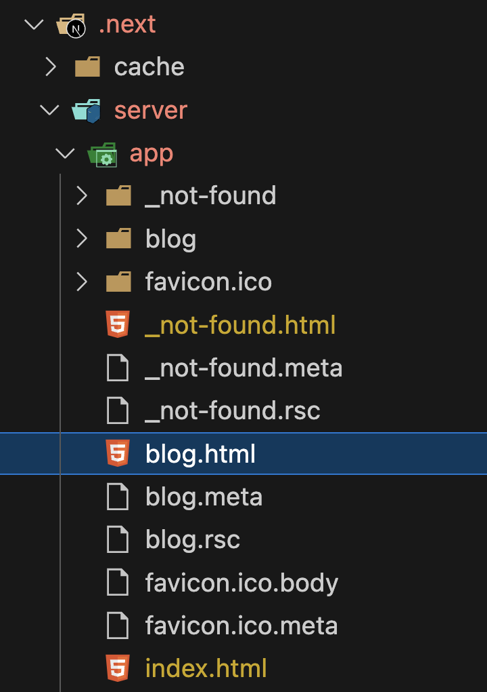
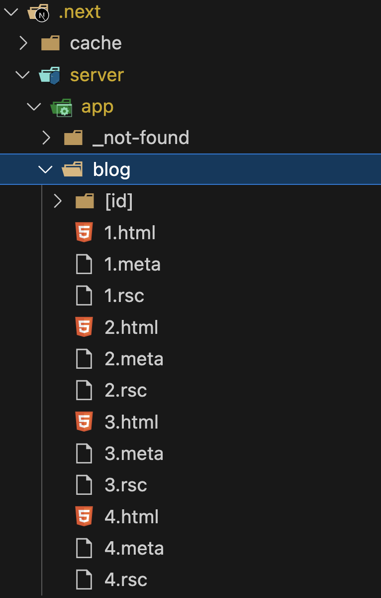
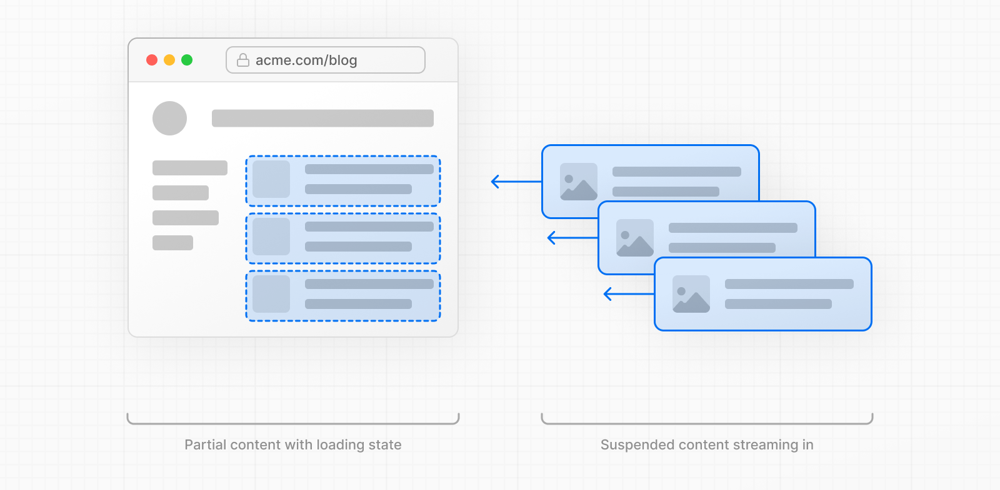
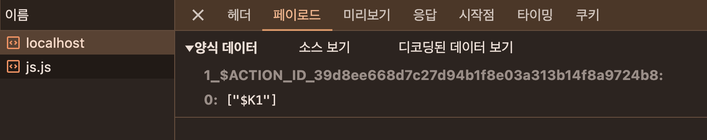

## 11. Next.js 13과 리액트 18

Next.js 버전 13은 Next.js의 릴리즈 역사를 통틀어 가장 큰 변화가 있는 릴리즈라고 해도 과언이 아니다. 크게 눈에 띄는 점은 먼저 SSR의 구조에 많은 변화가 있는 리액트 18을 채택했으며, 기존에 Next.js의 큰 약점으로 지적됐던 레이아웃 지원을 본격적으로 지원하기 시작했고, 바벨을 대체할 러스트(Rust) 기반 SWC를 뒤이어 웹팩을 대체할 Turbopack까지 출시했다.

### app 디렉터리의 등장

현재까지 Next.js의 아쉬운 점으로 평가받던 것 중 하나는 바로 레이아웃의 존재이다. 공통 헤더와 공통 사이드바가 거의 대부분의 페이지에 필요한 웹사이트를 개발한다고 가정해보자. 그렇다면 이 같은 구조를 Next.js에서 유지하려면 어떻게 해야할까? 13버전 이전까지는 모든 페이지는 각각의 물리적으로 구별된 파일로 독립되어 있었다. 페이지 공통으로 무언가를 집어 넣을 수 있는 곳은 \_document와 \_app이 유일하다. 그나마도 이 파일들을 다음과 같이 서로 다른 목적을 지니고 있다.

- `_document`: 페이지에서 쓰이는 `<html>`과 `<body>` 태그를 수정하거나, SSR시 styled-components 같은 일부 CSS-in-JS를 지원하기 위한 코드를 삽입하는 제한적인 용도로 사용된다. 오직 서버에서만 작동하므로 onClick과 같은 이벤트 핸들러를 붙이거나 클라이언트 로직을 붙이는 것을 금지하고 있다.
- `_app`: \_app은 페이지를 초기화하기 위한 용도로 사용되며, 다음과 같은 작업이 가능하다고 명시되어 있다.
  - 페이지 변경 시에 유지하고 싶은 레이아웃
  - 페이지 변경 시 상태유지
  - componentDidCatch를 활용한 에러 핸들링
  - 페이지간 추가적인 데이터 삽입
  - global CSS 주입

즉, 이전의 Next.js 12 버전까지는 무언가 페이지 공통 레이아웃을 유지할 수 있는 방법은 `_app`이 유일했다. 그러나 이 방식은 `_app`에서밖에 할 수 없어 제한적이고, 각 페이지별로 서로 다른 레이아웃을 유지할 수 있는 여지도 부족했다. 이러한 레이아웃의 한계를 극복하기 위해 나온 것이 Next.js의 app 레이아웃이다. 이제 레이아웃 app 디렉터리에서 어떻게 구현되는지 살펴보자.

### 라우팅

가장 먼저 눈에 띄는 변화는 기존에 /pages로 정의하던 라우팅 방식이 /app 디렉터리로 이동했다는 점, 그리고 파일명으로 라우팅하는 것이 불가능해졌다는 것이다.

**라우팅을 정의하는 법**

기본적으로 Next.js의 라우팅은 파일 시스템을 기반으로 하고 있으며, 이 원칙은 Next.js가 처음 나온 8년 전부터 지금까지 유효하다. 이번에 등장한 새로운 app 기반 라우팅 시스템은 기존에 /pages를 사용했던 것과 비슷하지만 다음과 같은 약간의 차이가 있다.

- Next.js 12 이하: `/pages/a/b.tsx` 또는 `/pages/a/b/index.tsx`는 모두 동일한 주소로 변환된다. 즉, 파일명이 index라면 이 내용은 무시된다.
- Next.js 13 app: `/app/a/b`는 `/a/b`로 변환되며, 파일명은 무시된다. 폴더명까지만 주소로 변환된다.

즉, Next.js 13의 app 디렉터리 내부의 파일명은 라우팅 명칭에 아무런 영향을 미치지 못한다. 이 app 내부에서 가질 수 있는 파일명은 뒤이어 설명할 예약어로 제한된다.

**layout.js**

Next.js 13부터는 app 디렉터리 내부의 폴더명이 라우팅 되며, 이 폴더에 포함될 수 있는 파일명은 몇 가지로 제한되어 있다. 그중 하나가 `layout.js`이다. 이 파일은 이름에서 알 수 있는 것처럼 페이지의 기본적인 레이아웃을 구성하는 요소이다. 해당 폴더에 layout이 있다면 그 하위폴더 및 주소에 모두 영향을 미친다.

```typescript
// /app/layout.tsx
import type { Metadata } from 'next';
import localFont from 'next/font/local';
import './globals.css';

const geistSans = localFont({
  src: './fonts/GeistVF.woff',
  variable: '--font-geist-sans',
  weight: '100 900',
});
const geistMono = localFont({
  src: './fonts/GeistMonoVF.woff',
  variable: '--font-geist-mono',
  weight: '100 900',
});

export const metadata: Metadata = {
  title: 'Create Next App',
  description: 'Generated by create next app',
};

export default function RootLayout({
  children,
}: Readonly<{
  children: React.ReactNode;
}>) {
  return (
    <html lang="ko">
      <head>
        <title>지원이의 홈페이지</title>
      </head>
      <body className={`${geistSans.variable} ${geistMono.variable}`}>
        <h1>지원이의 홈페이지에 오신 것을 환영합니다!</h1>
        <main>{children}</main>
      </body>
    </html>
  );
}

// /app/blog/layout.tsx
export default function BlogLayout({
  children,
}: {
  children: React.ReactNode;
}) {
  return <section>{children}</section>;
}
```

먼저 루트에는 단 하나의 layout을 만들어 둘 수 있다. 이 layout은 모든 페이지에 영향을 미치는 공통 레이아웃이다. 일반적으로 웹페이지를 만드는데 필요한 공통적인 내용(html, head 등)을 다루는 곳으로 보면된다. 이는 이전 버전부터 많은 개발들을 헷갈리게 했던 `_app`, `_document`를 하나로 대체할 수 있는 좋은 시작점으로 사용될 것으로 보인다. 꼭 공통 레이아웃이 필요하진 않더라도 웹페이지에 필요한 기본 정보만 담아둬도 충분히 유용하다.

`_document`가 없어짐으로써 가장 먼저 떠오르는 고민은 바로 styled-components 같은 CSS-in-JS의 초기화이다. 과거 `_document`에서 CSS-in-JS의 스타일을 모두 모은 다음, SSR시에 이를 함께 렌더링하는 방식으로 적용했는데, `_document`가 사라짐으로써 이제 그러한 방식을 적용하는 것은 불가능하다. 대신 이 작업 또한 마찬가지로 루트의 레이아웃에서 적용하는 방식으로 바뀌었다.

```javascript
// next.config.js
/** @type {import('next').NextConfig} */
const nextConfig = {
  reactStrictMode: true,
  swcMinify: true,
  // 추가
  compiler: {
    styledComponents: true,
  },
};

module.exports = nextConfig;
```

```typescript
// /lib/StyledComponentsRegistry.tsx
'use client';

import React, { useState } from 'react';
import { useServerInsertedHTML } from 'next/navigation';
import { ServerStyleSheet, StyleSheetManager } from 'styled-components';

export default function StyledComponentsRegistry({
  children,
}: {
  children: React.ReactNode;
}) {
  const [styledComponentsStyleSheet] = useState(() => new ServerStyleSheet());

  useServerInsertedHTML(() => {
    const styles = styledComponentsStyleSheet.getStyleElement();
    styledComponentsStyleSheet.instance.clearTag();
    return <>{styles}</>;
  });

  if (typeof window !== 'undefined') return <>{children}</>;

  return (
    <StyleSheetManager sheet={styledComponentsStyleSheet.instance}>
      {children}
    </StyleSheetManager>
  );
}

// /app/layout.tsx
export default function RootLayout({
  children,
}: Readonly<{
  children: React.ReactNode;
}>) {
  return (
    <html lang="ko">
      <head>
        <title>지원이의 홈페이지</title>
      </head>
      <body className={`${geistSans.variable} ${geistMono.variable}`}>
        <StyledComponentsRegistry>
          <h1>지원이의 홈페이지에 오신 것을 환영합니다!</h1>
          <main>{children}</main>
        </StyledComponentsRegistry>
      </body>
    </html>
  );
}
```

- `use client`: use strict를 연상시키는 이 내용은 클라이언트 컴포넌트를 의미하는 지시자로, 리액트 18에서 새롭게 등장한 개념이다.
- `useServerInsertedHTML`: 과거 useFlushEffects라는 이름의 훅이었는데, 좀 더 명확한 useServerInsertedHTML로 변경됐다. 아 훅은 리액트 18에서 새롭게 추가된 useInsertionEffect를 기반으로 하는 훅으로, CSS-in-JS 라이브러리와 같이 서버에 추가해야 할 HTML을 넣는 용도로 만들어졌다.

즉, `_document`에서 추가하던 SSR 스타일을 이제 새로운 방식을 활용해 layout에서 집어넣게끔 변경됐다.

그리고 페이지 하위에 추가되는 layout은 해당 주소 하위에만 적용된다. 이처럼 layout은 주소별 공통 UI를 포함할 수 있을뿐만 아니라 `_app`과 `_document`를 대신해 웹페이지를 시작하는데 필요한 공통 코드를 삽입할 수도 있다. 그리고 이 공통 코드는 기존의 `_app`과 `_document`처럼 모든 애플리케이션의 영향을 미치지 않고 오로지 자신과 자식 라우팅에만 미치게 된다. 이로써 개발자들은 하나의 애플리케이션에서 레이아웃을 더욱 유연하게 구성할 수 있게 됐다.

layout.js의 또 다른 장점은 `_document.jsx`에서만 처리할 수 있었던 부자연스러움이 사라졌다는 것이다. 기존에는 애플리케이션의 `<html />`이나 `<body />`에 무언가를 추가하는 등의 작업을 하려면 `_document.jsx`를 사용해야 했을뿐만 아니라 `<Html />`이나 `<Body />`, `<Head />`처럼 Next.js에서 제공하는 태그를 사용해야만 했다. 그러나 이제 HTML에서 기본으로 제공하는 `<html />`등의 태그를 추가하고 수정함으로써 별도로 import하는 번거로움이 사라지고 좀 더 자연스럽게 코드를 작성할 수 있게됐다.

layout에서 주의해야 할 점

- layout은 app 디렉터리 내부에서는 예약어이다. 무조건 `layout.{js|jsx|ts|tsx}`로 사용해야 하며, 레이아웃 이외의 다른 목적으로는 사용할 수 없다.
- layout은 children을 props로 받아서 렌더링해야 한다. 레이아웃이므로 당연히 그려야 할 컴포넌트를 외부에서 주입받고 그려야 한다.
- layout 내부에는 반드시 export default로 내보내는 컴포넌트가 있어야 한다.
- layout 내부에서도 API 요청과 같은 비동기 작업을 수행할 수 있다.

**page.js**

layout과 마찬가지로 page도 예약어이며, 이전까지 Next.js에서 일반적으로 다뤘던 페이지를 의미한다.

```javascript
// /app/blog/page.tsx
export default function BlogPage() {
  return <h1>안녕하세요</h1>;
}
```

위 page는 앞에서 구성했던 layout을 기반으로 위와 같은 리액트 컴포넌트를 노출하게 된다. 이 page가 받는 props는 다음과 같다.

- `params`: 옵셔널 값으로, 앞서 설명한 [...id]와 같은 동적 라우트 파라미터를 사용할 경우 해당 파라미터에 값이 들어온다.
- `searchParams`: URL에서 ?a=1과 같은 URLSearchParams를 의미한다. 예를 들어, `?a=1&b=2`로 접근할 경우 searchParams에는 `{ a: '1', b: '2' }`라는 자바스크립트 객체 값이 오게된다. 한 가지 주목해야 할 것은 이 값은 layout에서 제공되지 않는다는 것이다. 그 이유는 layout은 페이지 탐색 중에는 리렌더링을 수행하지 않기 때문이다. 즉, 같은 페이지에서 search parameter만 다르게 라우팅을 시도하는 경우 layout을 리렌더링하는 것은 불필요하기 때문이다. 만약 search parameter에 의존적인 작업을 해야 한다면 반드시 page 내부에서 수행해야 한다.

page 규칙

- page도 역시 app 디렉터리 내부의 예약어이다. 무조건 `page.{js|jsx|ts|tsx}`로 사용해야 하며, 레이아웃 이외의 다른 목적으로는 사용할 수 없다.
- page도 역시 내부에서 반드시 export default로 내보내는 컴포넌트가 있어야한다.

**error.js**

error.js는 해당 라우팅 영역에서 사용되는 공통 에러 컴포넌트이다. 이 error.js를 사용하면 특정 라우팅별로 서로 다른 에러 UI를 렌더링하는 것이 가능해진다.

```typescript
// error.tsx
'use client';

import { useEffect } from 'react';

export default function Error({
  error,
  reset,
}: {
  error: Error;
  reset: () => void;
}) {
  useEffect(() => {
    console.log('logging error:', error);
  }, [error]);

  return (
    <div>
      <strong>Error: {error?.message}</strong>
      <button onClick={() => reset()}>에러 리셋</button>
    </div>
  );
}
```

error 페이지는 에러 정보를 담고있는 error: Error 객체와 에러 바운더리를 초기화할 reset: () => void를 props로 받는다. 한 가지 명심해야 할 점은, 에러 바운더리는 클라이언트에서만 작동하므로 error 컴포넌트도 클라이언트 컴포넌트이어야 한다는 점이다. 그리고 이 error 컴포넌트는 같은 수준의 layout에서 에러가 발생할 경우 해당 error 컴포넌트로 이동하지 않는다는 점도 명심해야 한다. 그 이유는 아마도 `<Layout><Error>{children}</Error></Layout>`과 같은 구조로 페이지가 렌더링되기 때문일 것이다. 만약 Layout에서 발생한 에러를 처리하고 싶다면 상위 컴포넌트의 error를 사용하거나, app의 루트 에러 처리를 담당하는 `/app/global-error.js` 페이지를 생성하면 된다.

**not-found.js**

not-found는 특정 라우팅 하위의 주소를 찾을 수 없는 404 페이지를 렌더링할 때 사용된다.

```javascript
// not-found.tsx
export default function NotFound() {
  return (
    <>
      <h2>Not Found</h2>
      <p>404</p>
    </>
  );
}
```

error 컴포넌트와 마찬가지로 전체 애플리케이션에서 404를 노출하고 싶다면 `/app/not-found.js`를 생성해 사용하면 된다.

**loading.js**

loading은 뒤이어 설명할 리액트 Suspense를 기반으로 헤당 컴포넌트가 불러오는 중임을 나타낼 때 사용할 수 있다.

```javascript
export default function Loading() {
  return 'Loading...';
}
```

이 컴포넌트는 'use client' 지시자를 사용해 클라이언트에서 렌더링되개 할 수도 있다.

**route.js**

Next.js 13.4.0에서 app 디렉터리가 정식으로 출시되면서 이전까지 지원하지 못했던 `/pages/api`에 대한 /app 디렉터리 내부의 지원도 추가됐다. `/pages/api`와 동일하게 `/app/api`를 기준으로 디랙터리 라우팅을 지원하며, 앞서 파일명에 대한 라우팅이 없어진 것과 마찬가지로 `/api`에 대해서도 파일명 라우팅이 없어졌다. 그 대신 디렉터리가 라우팅 주소를 담당하며 파일명은 `route.js`로 통일됐다.

```typescript
// /app/api/hello/route.ts
import { NextRequest } from 'next/server';

export async function GET(request: NextRequest) {}
export async function HEAD(request: NextRequest) {}
export async function POST(request: NextRequest) {}
export async function PUT(request: NextRequest) {}
export async function PATCH(request: NextRequest) {}
export async function DELETE(request: NextRequest) {}
export async function OPTIONS(request: NextRequest) {}
```

이 route.ts 파일 내부에 REST API의 get, post와 같은 메서드명을 예약어로 선언해두면 HTTP 요청에 맞게 해당 메서드를 호출하는 방식으로 작동한다. 한 가지 흥미로운 점은 /app/api 외에 다른 곳에서 선언해도 작동한다는 것이다.

```typescript
// /app/internal-api/hello/route.ts
import { NextRequest } from 'next/server';

export async function GET(request: NextRequest) {
  return new Response(JSON.stringify({ name: 'hello' }), {
    status: 200,
    headers: {
      'content-type': 'application/json',
    },
  });
}
```

```shell
curl -X GET "htts://localhost:3000/internal-api/hello"

# {name: 'hello'}
```

라우팅 명칭에 자유도가 생긴 대신, 당연하게도 route.ts가 존재하는 폴더 내부에는 page.tsx가 존재할 수 없다.

이 route의 함수들이 받을 수 있는 파라미터는 다음과 같다.

- `request`: NextRequest 객체이며, fetch의 Request를 확장한 Next.js만의 Request라고 보면된다. 이 객체에는 API 요청과 관련된 cookie, headers 등뿐만 아니라 nextUrl 같은 주소 객체도 확인할 수 있다.
- `context`: params만을 가지고 있는 객체이며, 이 객체는 앞서 파일 기반 라우팅에서 언급한 것돠 동일한 동적 라우팅 파라미터 객체가 포함되어 있다. 이 객체는 Next.js에서 별도 인터페이스를 제공하지 않으므로 주소의 필요에 따라 원하는 형식으로 선언하면 된다.

```typescript
import { NextRequest } from 'next/server';

export async function GET(
  request: NextRequest,
  context: { params: { id: string } }
) {
  const response = await fetch(
    `https://jsonplaceholder.typicode.com/users/${context.params.id}`
  );

  // ...

  return new Response(JSON.stringify(result), {
    status: 200,
    headers: {
      'Content-Type': 'application/json',
    },
  });
}
```

### 리액트 서버 컴포넌트

리액트 18에서 새로 도입된 리액트 서버 컴포넌트는 SSR과 완전히 다른 개념이다.

### 기존 리액트 컴포넌트와 SSR의 한계

- 자바스크립트 번들크기가 0인 컴포넌트를 만들 수 없다.
  게시판 등 사용자가 작성한 HTML에 위험한 태그를 제거하기 위해 사용되는 유명한 npm 라이브러리로 `sanitize-html`이 있다. 이 `sanitize-html`을 리액트 컴포넌트에서 사용한다고 가정해보자.

  ```typescript
  import sanitizeHtml from 'sanitize-html';

  function Board({ text }: { text: string }) {
    const html = useMemo(() => sanitizeHtml(text), [text]);

    return <div dangerouslySetInnerHTML={{ __html: html }} />;
  }
  ```

  이 컴포넌트는 63.6KB에 달하는 sanitize-html을 필요로하며, 더욱이 이는 클라이언트인 브라우저에서 해당 라이브러리를 다운로드해야 할뿐만 아니라 실행까지 거쳐야 한다. 이처럼 어느정도 규모 있는 웹 애플리케이션을 작성하다 보면 브라우저 환경에서 타사 라이브러리의 이용은 피할 수 없게된다. 그리고 이는 그만큼 사용자 기기의 부담으로 고스란히 자리 잡게 된다.

  만약 이 컴포넌트를 서버에서만 렌더링하고 클라이언트는 결과만 받는다면 어떨까? sanitize-html은 서버만 가지고 있고, 서버에서는 해당 라이브러리를 실행한 결과와 컴포넌트 렌더링 결과물만 클라이언트에 제공하면 어떨까? 클라이언트는 무거운 sanitize-html 라이브러리를 다운로드해 실행하지 않고도 사용자에게 보여주고 싶은 컴포넌트를 렌더링할 수 있게 될 것이다.

- 백엔드 리소스에 대한 직접적인 접근이 불가능하다.
  리액트를 사용하는 클라이언트에서 백엔드 데이터에 접근하려면 REST API와 같은 방법을 사용하는 것이 일반적이다. 이 방법은 편리하지만 백엔드에서 항상 클라이언트에서 데이터를 접근하기 위한 방법을 마련해야 한다는 불편함이 있다. 만약 클라이언트에서 직접 백엔드에 접근해 원하는 데이터를 가져올 수 있다면 어떨까?

  ```typescript
  import db from 'db'; // 어떤 DB

  async function Board({ id }: { id: string }) {
    const text = await db.board.get(id);
    return <>{text}</>;
  }
  ```

  이처럼 데이터베이스에 직접 엑세스하거나, 혹은 백엔드의 파일 시스템에 직접 접근하는 등 클라이언트에 데이터를 제공하기 위한 수고로움이 줄어들 것이다. 또한 성능 관점에서 볼 때도 마찬가지로 백엔드에 접근할 수 있는 단계가 하나 줄어든 셈이므로 확실히 더 이점을 가지고 있다고 볼 수 있다.

- 자동 코드 분할(code split)이 불가능하다.
  코드 분할이란 하나의 거대한 코드 번들 대신 코드를 여러 작은 단위로 나누어 필요할 때만 동적으로 지연 로딩함으로서 앱을 초기화하는 속도를 높여주는 기법을 말한다. 일반적으로 리액트에서는 lazy를 사용해 구현해 왔다.

  ```typescript
  import { lazy } from 'react';

  const OldPhotoRenderer = lazy(() => import('./OldPhotoRenderer.js'));
  const NewPhotoRenderer = lazy(() => import('./NewPhotoRenderer.js'));

  function Photo(props) {
    if (FeatureFlags.useNewPhotoRenderer) {
      return <NewPhotoRenderer {...props} />;
    } else {
      return <OldPhotoRenderer {...props} />;
    }
  }
  ```

  이 기법은 훌륭하지만 몇 가지 단점이 있다. 먼저 일일리 lazy로 감싸는 것을 기억해야 한다. 개발자는 항상 코드 분할을해도 되는 컴포넌트인지를 유념하고 개발해야 하기 때문에 이를 누락하는 경우가 발생할 수 있다. 또 다른 단점으로, 해당 컴포넌트가 호출되고(Photo) if문을 판단하기 전까지 어떤 지연 로딩한 컴포넌트를 불러올지 결정할 수 없다. 이는 지연 로딩으로 인한 성능 이점을 상쇄해 버리는 결과를 만들고 만다.

  만약 이 코드 분할을 서버에서 자동으로 수행해 준다면 어떨까? 개발자는 굳이 코드분할을 염두에 두지 않더라도 자연스럽게 성능이점을 누릴 수 있을 것이다. 그리고 어떤 컴포넌트를 미리 불러와서 클라이언트에 내려줄지 서버에서 결정할 수 있다면 코드분할의 이점을 100% 활용할 수 있게된다.

- 연쇄적으로 발생하는 클라이언트와 서버의 요청을 대응하기 어렵다.
  하나의 요청으로 컴포넌트가 렌더링되고, 또 그 컴포넌트의 렌더링 결과로 또 다른 컴포넌트들을 렌더링하는 시나리오를 상상해 보자. 이 시나리오에서는 최초 컴포넌트의 요청과 렌더링이 끝나기 전까지는 하위 컴포넌트의 요청과 렌더링이 끝나지 않는다는 큰 단점이 있다. 또한 그만큼 서버에 요청하는 횟수도 늘어난다. 그리고 부모 컴포넌트의 요청과 렌더링이 결정되기 전까지, 그 부모 컴포넌트의 결과물에 의존하는 하위 컴포넌트들의 서버 요청이 지연되고 아직 렌더링될 준비가 되지 않았음을 나타내는 불필요한 렌더링까지 발생한다.

  그렇다면 만약 이러한 작업을 서버에서 모두 수행하면 어떨까? 데이터를 불러오고 컴포넌트를 렌더링하는 것이 모두 서버에서 이뤄지므로 클라이언트에서 서버로 요청함으로써 발생하는 지연을 줄일 수 있고, 또한 클라이언트에서는 반복적으로 요청을 수행할 필요도 없어진다. 서버에서는 필요에 따라 백엔드 데이터에 접근하거나 지속적으로 데이터를 불러옴으로써 클라이언트에서보다 더 효율적으로 컴포넌트를 렌더링할 수 있게 된다.

- 추상화에 드는 비용이 증가한다.
  리액트는 템플릿 언어로 설계되지 않았다. 일반적으로 웹 개발에서 템플릿 언어란 HTML에 특정 언어의 문법을 집어넣어 사용할 수 있는 것을 의미한다. 예를 들면 다음과 같은 것이 템플릿 언어라고 볼 수 있다.

  ```typescript
  
  <li>
    <a href="/post/{{ post.id }}">{{ post.text }}</a>
  </li>
  
  ```

  템플릿 언어는 HTML에서 할 수 없는 for문이나 if문 등을 처리할 수 있지만 그 밖의 복잡한 추상화나 함수 사용은 어렵다. 리액트는 자바스크립트를 기반으로 함수나 클래스를 사용해 다양한 작업을 수행할 수 있게끔 제공한다. 이는 개발자에게 자유를 주지만 문제는 이러한 추상화가 복잡해질수록 코드의 양은 많아지고, 런타임 시에는 오버헤드가 발생한다는 점이다.

  만약 이렇게 복잡한 추상화에 따른 결과물을 연산하는 작업을 서버에서 수행하면 어떨까? 컴포넌트가 여러 개가 중첩되고 합성되어 복잡해 보일 수 있지만 서버에서 클라이언트로 전송되는 내용을 서버에서 미리 다 계산해서 내려준다면 여러 가지 장점이 있다. 클라이언트에서는 복잡한 작업을 하지 않아도 되므로 속도가 빨라질 것이고, 서버에서 클라이언트에서 전송되는 결과물 또한 단순해 가벼워질 것이다. 코드 추상화에 대한 비용은 서버에서만 지불하면 된다.

이렇게 SSR의 한계점을 살펴보면 모든 문제는 리액트가 클라이언트 중심으로 돌아가기 때문에 발생하는 문제라는 것을 알 수 있다. 물론 과거에 전통적인 웹 애플리케이션 구축방법, 즉 PHP나 레일즈, JSP와 같은 완전히 정적인 방식의 SSR 방식을 도입하면 이러한 문제점들을 일부 해결할 수 있지만 리액트처럼 브라우저에서 고객에게 다양한 경험을 안겨주기는 어렵다. 성능을 위해 클라이언트의 역할을 일부 희생할 것인가? 혹은 사용자에게 다양한 사용자 경험을 안겨주기 위해 일부 성능을 희생하더러도 클라이언트에서 다양한 작업을 처리할 것인가?

결국 SSR, CSR 모두 이 문제를 해결하기에는 조금씩 아쉬움이 있다. SSR은 정적 콘텐츠를 빠르게 제공하고, 서버에 있는 데이터를 손쉽게 제공할 수 있는 반면 사용자의 인터렉션에 따른 다양한 사용자 경험을 제공하긴 어렵다. CSR은 사용자의 인터렉션에 따라 정말 다양한 것들을 제공할 수 있지만 서버에 비해 느리고 데이터를 가져오는 것도 어렵다. 이러한 두 구조의 장점을 모두 취하고자 하는 것이 바로 리액트 서버 컴포넌트이다.

### 서버 컴포넌트란(Server Component)?

서버 컴포넌트란 하나의 언어, 하나의 프레임워크, 그리고 하나의 API와 같은 개념을 사용하면서 서버와 클라이언트 모두에서 컴포넌트를 렌더링할 수 있는 기법을 의미한다. 서버에서 할 수 있는 일은 서버가 처리하게 두고, 서버가 할 수 없는 나머지 작업은 클라이언트인 브라우저에서 수행된다. 즉, 일부 컴포넌트는 클라이언트에서, 일부 컴포넌트는 서버에서 렌더링되는 것이다. 여기서 한 가지 명심해야 하는 사실은 클라이언트 컴포넌트는 서버 컴포넌트를 import할 수 없다는 것이다. 만약 클라이언트 컴포넌트가 서버 컴포넌트를 불러오게 된다면 클라이언트 컴포넌트는 서버 컴포넌트를 실행할 방법이 없기 때문에(서버 환경이 브라우저에는 존재하지 않으므로) 컴포넌트를 호출할 수 없다.

그렇다면 과연 어떻게 리액트 트리 내부의 컴포넌트를 서버 컴포넌트와 클라이언트 컴포넌트 각각을 만들어서 관리할 수 있는 것일까?


위 그림은 리액트 컴포넌트 트리를 간단히 도식화한 것이다. 서버 컴포넌트 이론에 따르면 모든 컴포넌트는 서버 컴포넌트가 될 수도 있고 클라이언트 컴포넌트가 될 수도 있다. 따라서 컴포넌트 트리에서 위와 같이 클라이언트 및 서버 컴포넌트가 혼재된 상황은 자연스러울 것이다. 어떻게 이런 구조가 가능한 것일까? 그 비밀은 흔히 children으로 자주 사용되는 ReactNode에 달려있다.

```javascript
// ClientComponent.jsx
// X, 이렇게 클라이언트 컴포넌트에서 서버 컴포넌트를 불러오는 것은 불가능하다
'use client';

import ServerComponent from './ServerComponent.server';
export default function ClientComponent() {
  return (
    <div>
      <ServerComponent />
    </div>
  );
}

'use client';
// ClientComponent.jsx

export default function ClientComponent({ children }) {
  return (
    <div>
      <h1>클라이언트 컴포넌트</h1>
      { children }
    </div>
  )
}

// ServerComponent.jsx
export default function ServerComponent() {
  return <span>서버 컴포넌트</span>
}

// ParentServerComponent.jsx
// 이 컴포넌트는 서버 컴포넌트일 수도, 클라이언트 컴포넌트 일 수도 있다
// 따라서 두 군데 모두에서 사용할 수 있다

import ClientComponent from './ClientComponent';
import ServerComponent from './ServerComponent';

export default function ParentServerComponent() {
  return (
    <ClientComponent>
      <ServerComponent />
    </ClientComponent>
  )
}
```

이 코드는 리액트 서버 컴포넌트를 기반으로 리액트 컴포넌트 트리를 설계할 때 어떠한 제안이 생기는지를 나타낸다. 한 가지 눈에 띄는 것은 서버 컴포넌트와 클라이언트 컴포넌트가 있으며 동시에 두 군데에서 모두 사용할 수 있는 공용 컴포넌트가 있다는 것이다. 이 세 컴포넌트의 차이와 제약사항에 대해 각각 알아보자.

- **서버 컴포넌트**

  - 요청이 오면 그 순간 서버에서 딱 한 번 실행될 뿐이므로 상태를 가질 수 없다. 따라서 리액트에서 상태를 가질 수 있는 useState, useReducer 등의 훅을 사용할 수 없다.
  - 렌더링 생명주기도 사용할 수 없다. 한 번 렌더링되면 그걸로 끝이기 때문이다. 따라서 useEffect, useLayoytEffect를 사용할 수 없다.
  - 앞의 두 가지 제약사항으로 인해 effect나 state에 의존하는 커스텀 훅을 또한 사용할 수 없다. 다만 effect나 state에 의존하지 않고 서버에서 제공할 수 있는 기능만 사용하는 훅이라면 사용가능하다.
  - 브라우저에서 실행되지 않고 서버에서만 실행되기 때문에 DOM API를 쓰거나 window, document 등에 접근할 수 없다.
  - 데이터베이스, 내부 서비스, 파일 시스템 등 서버에서만 있는 데이터를 async/await으로 접근할 수 있다. 컴포넌트 자체가 async한 것이 가능하다.
  - 다른 서버 컴포넌트를 렌더링하거나 div, span, p 같은 요소를 렌더링하거나 혹은 클라이언트 컴포넌트를 렌더링할 수 있다.

- **클라이언트 컴포넌트**

  - 브라우저 환경에서만 실행되므로 서버 컴포넌트를 불러오거나, 서버 전용 훅이나 유틸리티를 불러올 수 없다.
  - 그러나 서버 컴포넌트가 클라이언트 컴포넌트를 렌더링하는데, 그 클라이언트 컴포넌트가 자식으로 서버 컴포넌트를 갖는 구조는 가능하다. 그 이유는 클라이언트 입장에서 봤을 때 서버 컴포넌트는 이미 서버에서 만들어진 트리를 가지고 있을 것이고, 클라이언트 컴포넌트는 이미 서버에서 만들어진 그 트리를 삽입해서 보여주기만 하면 되기 때문이다. 따라서 서버 컴포넌트와 클라이언트 컴포넌트를 중첩해서 갖는 구조로 설계하는 것이 가능하다.
  - 이 두 가지 예외 사항을 제외하면 일반적으로 우리가 알고 있는 리액트 컴포넌트와 같다. state, effect를 사용할 수 있으며, 브라우저 API도 사용할 수 있다.

- **공용 컴포넌트(shared components)**
  - 이 컴포넌트는 서버와 클라이언트 모두에서 사용할 수 있다. 공통으로 사용할 수 있는만큼, 당연히 서버 컴포넌트와 클라이언트 컴포넌트의 모든 제약을 받는 컴포넌트가 된다.

그렇다면 리액트는 어떻게 서버 컴포넌트인지, 클라이언트 컴포넌트인지, 공용 컴포넌트인지 판단할까? 기본적으로 알아둬야 할 사실은 리액트는 모든 것을 다 공용 컴포넌트로 판단한다는 것이다. 즉, 모든 컴포넌트를 다 서버에서 실행 가능한 것으로 분류한다. 대신 클라이언트 컴포넌트라는 것을 명시적으로 선언하려면 파일 맨 첫 줄에 `use client`라고 작성해 두면 된다.

만약 `.server.tsx`, `.client.tsx`와 같이 파일명으로 구분하는 글이나 코드를 본 적이 있다면 이는 v1 기준 문서를 본 것이다. 현재는 `use client`로 바뀌었다.

이번 리액트 서버 컴포넌트는 여러가지 제약 요소로 인해 번들러나 특정 프레임워크의 도움을 받는 것이 필수적이다. 리액트 팀에서 제공하는 공식 예제에서는 웹팩과 자체적인 서버 번들링을 위한 react-server-dom-webpack을 만들어 활용했고, 서버 컴포넌트 제안 문서에서는 노골적으로 Next.js 팀과 협업하고 있음을 언급했으며, 애플리케이션의 라우팅 시스템과 번들러 사이의 통합이 필요하다는 것을 강조했고, Next.js와 같은 한 개 이상의 프레임워크 팀과 리액트 서버 컴포넌트 초기 구축을 위한 노력을 기울이고 있음을 언급했다.

### SSR과 서버 컴포넌트의 차이

따라서 이후에는 SSR과 서버 컴포넌트를 모두 채택하는 것도 가능해질 것이다. 서버 컴포넌트를 활용해 서버에서 렌더링할 수 있는 컴포넌트는 서버에서 완성해서 제공받은 다음, 클라이언트 컴포넌트는 SSR로 초기 HTML을 빠르게 전달받을 수 있다. 이 2가지 방법을 모두 결합하면 클라이언트 및 서버 컴포넌트를 모두 빠르게 보여줄 수 있고, 동시에 클라이언트에서 내려받아야 하는 자바스크립트의 양도 줄어들어 브라우저의 부담을 덜 수도 있다.

결론적으로 둘은 대체제가 아닌 상호보완하는 개념으로 봐야 할 것이다. 리액트 팀에서도 미래에는 두 가지 기법이 모두 쓰일 수 있는 가능성을 암시하고 있다.

- React 19에서 안정화: React 19 버전에서 서버 컴포넌트가 안정화(stable) 단계에 진입했다.
- 릴리스 상태
  - 2024년 5월 15일, React 19가 베타에서 릴리스 후보(Release Candidate, RC) 단계로 진입했다.
  - 안정 버전 출시는 곧 있을 것으로 예상된다.
- 사용 제한
  - 서버 컴포넌트는 현재 프레임워크와 함께 사용해야 한다.
  - Next.js 13.4+ 버전의 새로운 App Router를 사용하면 서버 컴포넌트를 활용할 수 있다.
- 주의사항
  - React 19.x 마이너 버전 간에 기반 API가 변경될 수 있으므로, 번들러나 프레임워크는 특정 버전에 고정해야 한다.

결론적으로, 리액트 서버 컴포넌트는 베타 단계를 지나 안정화 단계에 있으며, React 19의 정식 출시와 함께 완전히 안정된 기능으로 사용할 수 있을 것으로 예상된다.

### 서버 컴포넌트는 어떻게 작동하는가?

리액트 서버 컴포넌트를 렌더링하기 위해 실제로 어떠한 일들이 일어나는지 핵심 내용만 간단하게 살펴보자. 여기서 사용하는 예제 코드는 리액트 팀에서 2021년에 공식적으로 제공한 server-components-demo를 포크한 prisma/server-components-demo이다. 해당 포크를 사용한 이유는 기존 리액트 팀의 예제 애플리케이션은 PostgresSQL을 이용해 구현되어 있기 때문에 별도로 데이터베이스를 설치하고 설정해야 하는 번거로움이 있기 때문이다. prisma/server-components-demo를 사용하면 별도의 데이터베이스 설치 및 설정을 생략해도 되므로 혹시 리액트 서버 컴포넌트를 날 것으로 맛보고 싶다면 이 저장소를 참고하길 바란다. 이 저장소는 리액트 서버 컴포넌트 v1, 즉 파일명을 규칙으로 하던 때를 기준으로 작성되어 있다. 현재 버전에서는 `use client`라는 디렉티브로 클라이언트 컴포넌트를 선언한다는 것을 명심하자.

```javascript
// SSR이 수행되지 않는 코드
app.get(
  '/',
  handleErrors(async function (_req, res) {
    await waitForWebpack();
    const html = readFileSync(
      path.resolve(__dirname, '../build/index.html'),
      'utf8'
    );
    // Note: this is sending an empty HTML shell, like a client-side-only app.
    // However, the intended solution (which isn't built out yet) is to read
    // from the Server endpoint and turn its response into an HTML stream.
    res.send(html);
  })
);
```

waitForWebpack은 단순히 개발 환경에서 웹팩이 빌드 경로에 index.html을 만들 때까지 기다리는 코드일 뿐이라는 것을 염두에 둔다면 사용자가 최초에 들어왔을 때 수행하는 작업은 오로지 index.html을 제공하는 것 뿐이다.

1. 서버가 렌더링 요청을 받는다. 서버가 렌더링 과정을 수행해야 하므로 리액트 서버 컴포넌트를 사용하는 모든 페이지는 항상 서버에서 시작된다. 즉, 루트에 있는 컴포넌트는 항상 서버 컴포넌트이다.

[예제](https://github.com/wikibook/react-deep-dive-example/tree/main/chapter11/server-components-demo)에서 /react라고 하는 주소로 요청을 보내면 서버는 브라우저의 요청을 받고 서버 렌더링을 시작한다.

2. 서버는 받은 요청에 따라 컴포넌트를 JSON으로 직렬화(serialize)한다. 이때 서버에서 렌더링할 수 있는 것은 직렬화해서 내보내고, 클라이언트 컴포넌트로 표시된 부분은 해당 공간을 플레이스홀더 형식으로 비워두고 나타낸다. 브라우저는 이후에 이 결과물을 받아서 다시 역직렬화한 다음 렌더링을 수행한다. 이게 무슨 말인지 잘 와닿지 않는다면 서버가 렌더링 요청을 보냈을 때 클라이언트에 보내는 값을 실제로 살펴보면 된다.

```json
M1:{"id": "./src/SearchField.client.js","chunks":["client5"],"name": ""}
M2:{"id": "./src/EditButton.client.js","chunks":["client1"],"name": ""}
S3:"react.suspense"
J0:["$","div",null,{"className":"main","children":[["$","section",null,{"className":"colsidebar",...}]]}]
...
```

위와 같은 데이터 형태를 와이어 포맷(wire format)이라고 하며, 서버는 이 값을 스트리밍해 클라이언트에 제공한다. 한눈에 봤을 때 이해하기 쉬운 구조로 되어있는데, 하나씩 그 형태를 살펴보자.

- M: M으로 시작하는 줄은 클라이언트 컴포넌트를 의미하며, 클라이언트 번들에서 해당 함수를 렌더링하기 위해 필요한 정보가 어디(chunk)에 담겨있는지 참조를 전달해준다. 위 코드에서는 SearchField.client.js와 EditButton.client.js가 클라이언트 모듈의 참조로 전해졌다.
- S: Suspense를 의미한다.
- J: 서버에서 렌더링된 서버 컴포넌트이다. J0은 App.server.js(최상단 루트 컴포넌트)를 표현한 것임을 알 수 있다. 그리고 여기에는 렌더링에 필요한 모든 element, className, props, children 정보 등이 들어가 있다. 여기서 한 가지 흥미로운 점은 @1, @2와 같은 요소이다.

```json
[
  "$",
  "section",
  null,
  {
    "className": "sidebar-menu",
    "role": "menubar",
    "children": [
      ["$", "@1", null, {}],
      [
        "$",
        "@2",
        null,
        {
          "noteId": null,
          "children": "New"
        }
      ]
    ]
  }
]
```

이 정보는 나중에 렌더링이 완료됐을 때 들어가야 할 컴포넌트를 의미하는 것으로, @1은 M1이 렌더링되면 저 @1 자리에 @M1이 들어가야 한다는 것을 의미한다. 이처럼 서버에서는 클라이언트에서 리액트 컴포넌트 트리 구성에 필요한 정보를 최대한 많이, 그리고 경제적인 포멧으로 클라이언트에 전달한다.

3. 브라우저가 리액트 컴포넌트 트리를 구성한다. 브라우저가 서버로 스트리밍으로 JSON 결과물을 받았다면 이 구문을 다시 파싱한 결과물을 바탕으로 트리를 재구성해 컴포넌트를 만들어 나간다. M1과 같은 형태의 클라이언트 컴포넌트를 받았다면 클라이언트에서 렌더링을 진행할 것이고, 서버에서 만들어진 결과물을 받았다면 이 정보를 기반으로 리액트 트리를 그대로 만들 것이다. 그리고 최종적으로 이 트리를 렌더링해 브라우저의 DOM에 커밋한다.

지금까지 살펴본 바를 토대로 리액트 서버 컴포넌트의 작동 방식의 특별한 점을 몇 가지 살펴보자.

- 먼저 서버에서 클라이언트로 정보를 보낼 때 스트리밍 형태로 보냄으로써 클라이언트가 줄 단위로 JSON을 읽고 컴포넌트를 렌더링할 수 있어 브라우저에서는 되도록 빨리 사용자에게 보여줄 수 있다는 장점이 있다.
- 또한 컴포넌트들이 하나의 번들러 작업에 포함되어 있지 않고 각 컴포넌트별로 번들링이 별개로 되어 있어 필요에 따라 컴포넌트를 지연해서 받거나 따로 받는 등의 작업이 가능해졌다.
- 마지막으로, SSR과는 다르게 결과물이 HTML이 아닌 JSON 형태로 보내진 것 또한 주목해 볼 만하다. 클라이언트의 최종 목표는 리액트 컴포넌트 트리를 서버 컴포넌트와 클라이언트 컴포넌트의 두 가지로 조화롭게 구성하는 것으로, 이는 단순히 HTML을 그리는 작업 이상의 일을 필요로 한다. 따라서 HTML 대신 단순한 리액트 컴포넌트 구조를 JSON으로 받아서 리액트 컴포넌트 트리의 구성을 최대한 빠르게 할 수 있도록 도와준다.

결론적으로 이 리액트 서버 컴포넌트는 완전히 새로운 개념이며, 기존의 리액트 컴포넌트가 가지고 있던 한계를 극복하기 위해 만들어졌다고 볼 수 있다. SSR과는 완전히 다른 개념으로, 앞으로 SSR과 리액트 서버 컴포넌트가 함께 어울리면서 완전히 새로운 구조를 엿볼 수 있게 될 것이다.

### Next.js에서의 리액트 서버 컴포넌트

Next.js도 13 버전에 들어가면서 서버 컴포넌트를 도입했고, 이 서버 컴포넌트가 바로 /app 디렉터리에 구현되어 있다. 리액트 팀이 서버 컴포넌트를 온전히 사용하기 위해서는 번들러와 프레임워크의 도움이 필수라고 언급했으며 현재 다른 개발자들이 이를 혐의 중이라고 했는데, Next.js가 13 버전을 릴리즈하면서 서버 컴포넌트를 지원하기 시작했다. Next.js 13에서 서버 컴포넌트를 사용하기 위해서는 어떻게 해야하는지 간단하게 살펴보자.

먼저 기본적인 서버 컴포넌트의 제약은 동일하다. 서버 컴포넌트는 클라이언트 컴포넌트를 불러올 수 없으며, 클라이언트 컴포넌트는 서버 컴포넌트를 children props로 받는 것만 가능하다. 그리고 앞서 루트 컴포넌트는 무조건 서버 컴포넌트가 된다고 언급했는데, Next.js의 루트 컴포넌트는 각 페이지에 존재하는 page.js이다. layout.js도 마찬가지로 서버 컴포넌트로 작동한다. 즉, page.js와 layout.js는 반드시 서버 컴포넌트이어야 하며, 앞서 언급한 서버 컴포넌트의 제약을 받는다.

이 외에는 대부분 리액트 서버 컴포넌트에서 제공하는 내용과 별다른 차이가 없는데, Next.js에서 서버 컴포넌트를 도입하면서 달라진 부분이 몇 가지 있다. 이것에 대해 알아보자.

### 새로운 fetch 도입과 getServerSideProps, getStaticProps, getInitialProps의 삭제

과거 Next.js의 SSR과 정적 페이지 제공을 위해 이용되던 getServerSideProps, getStaticProps, getInitialProps가 /app 디렉터리 내부에서는 삭제됐다. 그 대신 모든 데이터 요청은 웹에서 제공하는 표준 API인 fetch를 기반으로 이뤄진다.

```javascript
async function getData() {
  const result = await fetch('https://api.example.com');

  if (!result.ok) {
    // 이렇게 에러를 던지면 가장 가까운 에러 바운더리에 전달된다
    throw new Error('데이터 불러오기 실패');
  }

  return result.json();
}

// async 서버 컴포넌트 페이지
export default async function Page() {
  const data = await getData();

  return (
    <main>
      <Children data={data} />
    </main>
  );
}
```

getServerSideProps는 SSR만을 위한 것이었으므로 이제 서버에서 데이터를 직접 불러올 수 있게되었다. 또한 컴포넌트가 비동기적으로 작동하는 것도 가능해진다. 이제 앞의 서버 컴포넌트는 데이터가 불러오기 전까지 기다렸다가 데이터가 불러와지면 비로소 페이지가 렌더링되어 클라이언트로 전달될 것이다.

이에 추가로 리액트팀은 이 fetch API를 확장해 같은 서버 컴포넌트 트리 내에서 동일한 요청이 있다면 재요청이 발생하지 않도록 요청 중복을 방지했다. 요즘 인기를 끌고 있는 SWR과 React Query와 비슷하게, 해당 fetch 요청에 대한 내용을 서버에서는 렌더링이 한 번 끝날 때까지 캐싱하며, 클라이언트에서는 별도의 지시자나 요청이 없는 이상 해당 데이터를 최대한 캐싱해서 중복된 요청을 방지한다.

### 정적 렌더링과 동적 렌더링

과거 Next.js에는 getStaticProps를 활용해 서버에서 불러오는 데이터가 변경되지 않는 경우애 정적으로 페이지를 만들어 제공할 수 있는 기능이 있었다. 이 기능을 활용하면 해당 주소로 들어오는 경우 모든 결과물이 동일하기 때문에 CDN에서 캐싱해 기존 SSR보다 더 빠르게 데이터를 제공할 수 있다는 정점이 있었다.

Next.js 13에서는 이제 정적인 라우팅에 대해서는 기본적으로 빌드타임에 렌더링을 미리 해두고 캐싱해 재사용할 수 있게끔 해뒀고, 동적인 라우팅에 대해서는 서버에 매번 요청이 올 때마다 컴포넌트를 렌더링하도록 변경했다.

```typescript
// /app/blog/page.tsx
async function fetchData() {
  const res = await fetch('https://jsonplaceholder.typicode.com/posts');
  const data = await res.json();

  return data;
}

export default async function Page() {
  const data: Array<IPostItem> = await fetchData();

  return (
    <ul>
      {data.map((post) => (
        <li key={post.id}>{post.title}</li>
      ))}
    </ul>
  );
}
```

위 예제는 특정 API 엔드 포인트에서 데이터를 불러와 페이지에서 렌더링하는 구조를 가진 서버 컴포넌트이다. 이 주소는 정적으로 결정되어 있기때문에 빌드 시에 해당 주소로 미리 요청을해서 데이터를 가져온 다음에 렌더링한 결과를 빌드에 넣어둔다.



반면 해당 주소를 정적으로 캐싱하지 않는 방법도 있다.

```typescript
async function fetchData() {
  const res = await fetch(
    'https://jsonplaceholder.typicode.com/posts',
    {
      cache: 'no-cache',
    }
    // Next.js에서 제공하는 옵션을 사용해도 동일하다
    // { next: { revalidate: 0 } }
  );
  const data = await res.json();

  return data;
}

export default async function Page() {
  const data: Array<IPostItem> = await fetchData();

  return (
    <ul>
      {data.map((post) => (
        <li key={post.id}>{post.title}</li>
      ))}
    </ul>
  );
}
```

이렇게 캐싱하지 않겠다는 선언을 fetch에 해두면 Next.js는 해당요청을 미리 빌드해서 대기시켜 두지 않고 요청이 올 때마다 fetch 요청 이후에 렌더링을 수행하게 된다.

이 밖에도 함수 내부에서 Next.js가 제공하는 next/headers나 next/cookie 같은 헤더 정보와 쿠키 정보를 불러오는 함수를 사용하게 된다면 해당 함수는 동적인 연산을 바탕으로 결과를 반환하는 것으로 인식해 정적 렌더링 대상에서 제외된다.

만약 동적인 주소이지만 특정 주소에 대해서 캐싱하고 싶은 경우, 즉 과거 Next.js에서 제공하는 getStaticPaths를 흉내내고 싶다면 어떻게 해야할까? 새로운 함수인 generateStaticParams를 사용하면 된다.

```typescript
// /app/blog/[id]/page.tsx
export async function generateStaticParams() {
  return [{ id: '1' }, { id: '2' }, { id: '3' }, { id: '4' }];
}

async function fetchData(params: { id: string }) {
  const res = await fetch(
    `https://jsonplaceholder.typicode.com/posts/${params.id}`
  );
  const data = await res.json();

  return data;
}

export default async function Page({ params }: { params: { id: string } }) {
  const data: IPostItem = await fetchData(params);

  return (
    <div>
      <h1>{data.title}</h1>
    </div>
  );
}
```

이러한 방식으로 기존 getStaticProps의 작동방식을 그대로 흉내내어 원하는 방식으로 사용할 수 있다.



fetch 옵션에 따른 작동 방식을 정리하면 다음과 같다.

- `fetch(URL, { cache: 'force-cache' })`: 기본값으로 getStaticProps와 유사하게 불러온 데이터를 캐싱해 해당 데이터로만 관리한다.
- `fetch(URL, { cache: 'no-store' })`, `fetch(URL, { next: { revalidate: 0 }})`: getServerSideProps와 유사하게 캐싱하지 않고 매번 새로운 데이터를 불러온다.
- `fetch(URL, { next: { revalidate: 10 }})`: getStaticProps에 revalidate를 추가한 것과 동일하며, 정해진 유효시간 동안에는 캐싱하지 않고, 이 유효시간이 지나면 캐시를 파기한다.

### 캐시와 mutating 그리고 revalidating

Next.js는 fetch의 기본 동작을 재정의해 `{ next: { revalidate?: number | false }}`를 제공하는데, 이를 바탕으로 해당 데이터의 유효한 시간을 정해두고 이 시간이 지나면 다시 데이터를 불러와서 페이지를 렌더링하는 것이 가능하다. 이는 페이지에 revalidate라는 변수를 선언해서 페이지 레벨로 정의하는 것도 가능하다.

```javascript
// /app/page.tsx
export const revalidate = 60;
```

만약 루트에 이처럼 revalidate = 60을 선언해 두면 하위에 있는 모든 라우팅에서는 페이지를 60초 간격으로 갱신해 새로 렌더링하게 된다. 그리고 앞선 예제처럼 fetch 내부에 옵션으로 제공하는 것도 가능하다. 이 케시와 갱신이 이뤄지는 과정은 다음과 같다.

1. 최초로 해당 라우트로 요청이 올 때는 미리 정적으로 캐시해 둔 데이터를 보여준다.
2. 이 캐시된 초기 요청은 revalidate에 선언된 값만큼 유지된다.
3. 만약 해당 시간이 지나도 일단은 캐시된 데이터를 보여준다.
4. Next.js는 캐시된 데이터를 보여주는 한편, 시간이 경과했으므로 백그라운드에서 다시 데이터를 불러온다.
5. 4번의 작업이 성공적으로 끝나면 캐시된 데이터를 갱신하고, 그렇지 않다면 과거 데이터를 보여준다.

만약 이러한 캐시를 전체적으로 무효화 하고 싶다면 router에 추가된 refresh 메서드로 `router.refresh();`를 사용하면 된다. 이는 브라우저를 새로고침하는 등 브라우저의 히스토리에 영향을 미치지 않고, 오로지 서버에서 루트부터 데이터를 전체적으로 가져와서 갱신하게 된다. 그리고 이 작업은 브라우저나 리액트의 state에는 영향을 미치지 않는다.

### 스트리밍을 활용한 점진적인 페이지 불러오기

과거 SSR 방식을 떠올려보자. SSR은 요청받은 페이지를 모두 렌더링해서 내려줄 때까지는 사용자에게 아무것도 보여줄 수 없으며, 사용자는 빈 페이지만 보게된다. 그리고 실제로 페이지를 다 받았다 하더라도 이 페이지는 사용자가 인터렉션할 수 없는 정적인 페이지이고, 리액트에서 하이드레이션 과정을 거쳐야만 비로소 사용자가 사용할 수 있는 페이지가 된다. 문제는 이 모든 작업이 순차적으로 다 완료되야만 페이지 하나를 온전하게 볼 수 있다는 것이다. 이를 해결하기 위해 하나의 페이지가 다 완성될 때까지 기다리는 것이 아니라 HTML을 작은 단위로 쪼개서 완성되는 대로 클라이언트로 점진적으로 보내는 스트리밍이 도입됐다. 스트리밍을 활용하면 모든 데이터가 로드될 때까지 기다리지 않더라도 먼저 데이터가 로드되는 컴포넌트를 빠르게 보여주는 방법이 가능하다. 이는 사용자가 일부라도 페이지와 인터렉션을 할 수 있다는 것을 의미하며, 나아가 핵심 웹 지표인 `최초 바이트까지의 시간(TTFB: Time To First Byte)`와 `최초 콘텐츠풀 페인팅(FCP: First Contentful Paint)`을 개선하는데 큰 도움을 준다.



즉, 모든 컴포넌트를 기다리는 대신 컴포넌트가 완성되는 대로 클라이언트에 내려주면 사용자는 페이지가 완성될 때까지 기다리는 지루함을 덜 수 있고, 페이지가 로딩 중이라는 인식을 더 명확하게 심어줄 수 있다.

이 스트리밍을 활용하는 방법은 2가지가 있다.

1. 경로에 loading.tsx 배치
   loading은 예약어로 존재하는 컴포넌트로, 렌더링이 완료되기 전에 보여줄 수 있는 컴포넌트를 배치할 수 있는 파일이다. loading 파일을 배치한다면 자동으로 다음 구조와 같이 Suspense가 배치된다.
   ```jsx
   <Layout>
    <Header />
    <SideNav />
    <!-- 여기에 로딩이 온다 -->
    <Suspense fallback={<Loading />}>
      <Page />
    </Suspense>
   </Layout>
   ```
2. Suspense 배치
   좀 더 세분화된 제어를 하고 싶다면 직접 리액트의 Suspense를 배치하는 것도 가능하다.

   ```javascript
   import { Suspense } from 'react';
   import { Notes, Peoples } from './Components';

   export default function Posts() {
     return (
       <section>
         <Suspense fallback={<Skeleton />}>
           <Notes />
         </Suspense>
         <Suspense fallback={<Skeleton />}>
           <Peoples />
         </Suspense>
       </section>
     );
   }
   ```

   Loading이 Suspense를 기반으로 만들어진 Next.js 규칙이기 때문에 직접 Suspense를 사용하는 것도 동일한 혜택을 누릴 수 있다. 스트리밍을 활용해 서버 렌더링이 가능해지고, 리액트는 로딩이 끝난 컴포넌트 순서대로 하이드레이션을 수행해 가능한 사용자에게 빠르게 상호작용이 가능한 페이지를 제공할 수 있게된다.

### 웹팩의 대항마, 터보팩의 등장

요즘 새롭게 뜨고있는 라이브러리인 Rome, SWC, esbuild의 공통점은 기존에 자바스크립트로 만들어지고 제공되던 기능을 Rust나 Go 같은 다른 언어를 사용해 제공함으로써 자바스크립트 대비 월등히 뛰어난 성능을 보여준다는 것이다. 특히 SWC는 Next.js를 만든 Vercel에서 제공하는 도구로, Next.js 12에서 안정화가 완료되어 공식적으로 사용할 것을 권장하고 있으며, 많은 프로젝트에서 바벨을 대신해 사용하고 있다.

이번 Next.js 13에서는 웹팩의 후계자를 자처하고 있는 터보팩(Turbopack)이 출시됐다. 터보팩은 웹팩 대비 최대 17배, Vite 대비 최대 10배 빠르다고 하며, 이는 앞서 소개한 라이브러리와 마찬가지로 러스트 기반으로 작성되었기 때문에 가능하다고 소개하고 있다.

Next.js 15 릴리즈와 함께 Tutbopack이 개발환경(`next dev --turbo`)에서 안정화(stable) 버전으로 출시됐다. 아직 프로덕션 빌드(`next build --turbo`)는 아직 지원되지 않는다.

### 서버 액션

Next.js 13.4.0이 릴리즈되면서 Next.js 팀은 서버 액션이라고 하는 새로운 기능을 선보였다. 이 기능은 API를 굳이 생성하지 않더라도 함수 수준에서 서버에 직접 접근해 데이터 요청 등을 수행할 수 있는 기능이다. 서버 컴포넌트와 다르게, 특정함수 실행 그 자체만을 서버에서 수행할 수 있다는 장점이 있다. 그리고 그 실행결과에 따라 다양한 작업을 수행할 수도 있다. 이 서버 액션을 활성화하려면 next.config.js에서 기능을 활성화해야 한다.

```js
module.exports = {
  experimental: {
    serverActions: true,
  },
};
```

서버 액션을 만들려면 먼저 함수 내부 또는 파일 상단에 클라이언트 선언과 비슷하게 `use server` 지시자를 선언해야 한다. 그리고 함수는 반드시 `async`여야 한다. async 함수가 아니면 `Server actions must be async functions`라는 에러가 발생한다.

즉, 서버 액션은 다음과 같은 형태로 선언할 수 있다.

```javascript
async function serverAction() {
  'use server';
  // 서버에 바로 접근하는 코드
}
```

```javascript
'use server';

export async function myAction() {
  // ...
  // 서버에 바로 접근하는 코드
}
```

이렇게 선언한 서버 액션이 수행할 수 있는 작업을 하나씩 알아보자.

### form의 action

`<form>`은 HTML에서 양식을 보낼 때 사용하는 태그로, action props를 추가해서 이 양식 데이터를 처리할 URL을 넘겨줄 수 있다. 서버 액션으로 form.action 함수를 만들어보자.

```javascript
export default function Home() {
  // handleSubmit 이벤트를 발생시키는 것은 클라이언트지만 실제로 함수 자체가 수행되는 것은 서버가 된다
  async function handleSubmit() {
    'use server';

    console.log(
      '해당 작업은 서버에서 수행합니다. 따라서 CORS 이슈가 없습니다.'
    );

    const response = await fetch('https://jsonplaceholder.typicode.com/posts', {
      method: 'POST',
      body: JSON.stringify({
        title: 'New Post',
        body: 'This is a test post.',
        userId: 1,
      }),
      headers: {
        'Content-Type': 'application/json; charset=utf-8',
      },
    });

    const result = await response.json();

    console.log(result);
  }

  return (
    <form action={handleSubmit}>
      <button type="submit">form 요청 보내기</button>
    </form>
  );
}
```



위 화면은 크롬 개발자 도구의 네트워크 탭에서 해당 form 버튼을 클릭했을 때를 캡쳐한 것이다. 페이로드는 post 요청이 아닌 ACTION_ID라는 액션구분자만 있는 것을 볼 수 있다. 그리고 이를 처리하는 서버에서는 다음과 같은 내용이 미리 빌드되어 있는 것을 볼 수 있다.

```javascript
// 앞서 페이로드에서 본 액션 아이디를 확인할 수 있다
const actions = {
  '39d8ee668d7c27d94b1f8e03a313b14f8a9724b8': () =>
    Promise.resolve(/*! import() eager */)
      .then(
        __webpack_require__.bind(
          __webpack_require__,
          /*! ./src/app/page.tsx */ '(rsc)/./src/app/page.tsx'
        )
      )
      .then((mod) => mod['$$ACTION_0']),
};
```

위 코드와 실행결과를 미루어 봤을 때, 서버 액션을 실행하면 클라이언트에서는 현재 라우트 주소와 ACTION_ID만 보내고 그 외에는 아무것도 실행하지 않는 것을 알 수 있다. 그리고 서버에서는 요청받은 라우트 주소와 ACTION_ID를 바탕으로, 실행해야 할 내용을 찾고 이를 서버에서 직접 실행한다. 이를 위해 'use server'로 선언되어 있는 내용을 빌드 시점에 미리 클라이언트에서 분리시키고 서버로 옮김으로써 클라이언트 번들링 결과물에는 포함되지 않고 서버에서만 실행되는 서버액션을 만든 것을 확인할 수 있다.

서버액션의 장점은 폼과 실제 노출하는 데이터가 연동되어 있을 때 더욱 효과적으로 사용할 수 있다.

```javascript
// key value storage. 서버에서만 사용할 수 있는 패키지이다
import kv from '@vercel/kv';
import { revalidatePath } from 'next/cache';

interface Data {
  name: string;
  age: number;
}

export default async function Page({ params }: { params: { id: string } }) {
  const key = `test:${params.id}`;
  const data = (await kv.get) < Data > key;

  async function handleSubmit(formData: FormData) {
    'use server';

    const name = formData.get('name');
    const age = formData.get('age');

    await kv.set(key, {
      name,
      age,
    });

    revalidatePath(`/blog/${params.id}`);
  }

  return (
    <>
      <h1>form with data</h1>
      <h2>
        서버에 저장된 정보: {data?.name} {data?.age}
      </h2>

      <form action={handleSubmit}>
        <label htmlFor="name">이름</label>
        <input
          type="text"
          id="name"
          name="name"
          defaultValue={data?.name}
          placeholder="이름을 입력해주세요."
        />

        <label htmlFor="age">나이</label>
        <input
          type="text"
          id="age"
          name="age"
          defaultValue={data?.age}
          placeholder="나이를 입력해주세요."
        />

        <button type="submit">제출</button>
      </form>
    </>
  );
}
```

위 코드에서는 서버에서만 접근할 수 있는 Redis 스토리지인 @vercel/kv를 기반으로 서버 액션에서 어떻게 양식 데이터를 다룰 수 있는지 나타낸다. 먼저 Page 컴포넌트는 서버 컴포넌트로, const data = await kv.get<Data>(key)와 같은 형태로 직접 서버 요청을 수행해서 데이터를 가져와 JSX를 렌더링한다. 그리고 form 태그에 서버 액션인 handleSubmit을 추가해서 formData를 기반으로 데이터를 가져와 다시 데이터베이스인 kv에 업데이트한다. 그리고 업데이트가 성공적으로 마무리됐다면 마지막으로 revalidatePath를 통해 해당 주소의 캐시 데이터를 갱신해 컴포넌트를 재렌더링하게 했다. 이 같은 일련의 과정이 어떻게 일어나는지 살펴보자.

앞서 form을 사용했던 예제와 마찬가지로 서버에 ACTION_ID와 실행에 필요한 데이터를 보내고, 직접적인 업데이트를 수행하지 않는 것을 확인할 수 있다. 그리고 이 서버액션의 실행이 완료되면 data 객체가 revalidatePath로 갱신되어 업데이트된 최신 데이터를 불러오는 것을 볼 수 있다. 이러한 최신 데이터를 불러오는 동작은 페이지 내부에 loading.jsx가 있다면 더욱 뚜렷하게 확인할 수 있다.

지금까지 살펴본 내용을 봤을 때는 PHP 같은 전통적인 서버 기반 웹 애플리케이션과 크게 다를 바 없어 보인다. 처음 공개됐을 때 많은 사람들이 index.php와 다를 게 없어 보인다고 비판한 것도 이 때문이다. PHP도 마찬가지로 `<?php >` 같은 코드로 서버에서 실행할 수 있는 코드를 한 파일 안에 구성할 수 있기 때문이다. 하지만 여기서 주목해야 하는 가장 큰 차이는 이 모든 과정이 페이지 새로고침 없이 수행된다는 것이다. 최초에 페이지를 서버에서 렌더링한 이후에 폼에서 handleSubmit으로 서버에 데이터 수정을 요청하는 것, 그리고 수정된 결과를 다시금 조회해서 새로운 결과로 렌더링하는 일련의 과정이 모두 페이지 새로고침 없이 데이터 스트리밍으로 이뤄진다. 따라서 개발자들은 서버에 데이터 수정을 요청하는 한편, 클라이언트에서는 업데이트를 완료한 후 새로운 결과를 받을 때까지 사용자에게 로딩 중이라는 것을 알 수 있는 인터렉션을 구성할 수도 있다.

한 가지 더 주목해야 할 것은 handleSubmit에서 수행했던 revalidatePath이다. 이는 인수로 넘겨받은 경로의 캐시를 초기화해서 해당 URL에서 즉시 새로운 데이터를 불러오는 역할을 한다. Next.js에서는 이를 server mutation(서버에서의 데이터 수정)이라고 하는데, server mutation으로 실행할 수 있는 함수는 다음과 같다.

- redirect: import { redirect } from 'next/nevigation'으로 사용할 수 있으며, 특정 주소로 리다이렉트할 수 있다.
- revalidatePath: import { revalidatePath } from 'next/cache'로 사용할 수 있으며, 해당 주소의 캐시를 즉시 업데이트한다.
- revalidateTag: import { revalidateTag } from 'next/cache'로 사용할 수 있다. 캐시 태그는 fetch 요청 시에 다음과 같이 추가할 수 있다.
  ```javascript
  fetch('https://localhost:8080/api/something', { next: { tags: [''] } });
  ```
  이렇게 태그를 추가해두면 여러 다양한 fetch 요청을 특정 태그 값으로 구분할 수 있으며, revalidateTag를 사용할 경우 이 특정 태그가 추가된 fetch 요청을 모두 초기화한다.

이처럼 form을 서버액션과 함께 사용하면 form을 기반으로 한 데이터 추가 및 수정 요청을 좀 더 자연스럽게 수행할 수 있다. 그리고 Next.js에서 관리하는 캐시를 효과적으로 초기화할 수 있으므로 사용자에게 더욱 자연스러운 사용자 경헙을 안겨줄 수 있다.

### input의 submit과 image의 formAction

form.action과 마찬가지로 input type="submit" 또는 input type="image"에 formAction prop으로도 서버액션을 추가할 수 있다. 사용법은 앞에서 살펴본 것과 동일하다.

### startTransition과의 연동

서버 액션은 비단 form.action이나 formAction에서만 사용할 수 있는 것은 아니다. useTransition에서 제공하는 startTransition에서도 서버액션을 활용할 수 있다.

```javascript
// server-action/index.ts
'use server';

import kv from '@vercel/kv';
import { revalidatePath } from 'next/cache';

interface Data {
  name: string;
  age: number;
}

export async function updateData(id: string, data: Data) {
  const key = `test:${id}`;

  await kv.set(key, {
    name: data.name,
    age: data.age,
  });

  revalidatePath(`/blog/${id}`);
}

// client-component.tsx
('use client');

import { useCallback, useTransition } from 'react';
import SkeleonBtn from '../../app/styles/styled-components/components';

export function ClientButtonComponent({ id }: { id: string }) {
  const [isPending, startTransition] = useTransition();

  const handleClick = useCallback(() => {
    startTransition(() => updateData(id, { name: '기본값', age: 0 }));
  }, []);

  return isPending ? (
    <SkeleonBtn />
  ) : (
    <button onClick={handleClick}>기본값으로 돌리기</button>
  );
}
```

이렇게 useTransition을 사용하면 얻을 수 있는 장점 중 하나는 이전과 동일한 로직을 구현하면서도 page 단위의 loading.jsx를 사용하지 않아도 된다는 것이다. isPending을 활용해 startTransition으로 서버 액션이 실행됐을 때 해당 버튼을 숨기고 로딩 버튼을 노출함으로써 페이지 단위의 로딩이 아닌 좀 더 컴포넌트 단위의 로딩 처리도 가능해진다. 이와 동시에 revalidatePath와 같은 server mutation도 마찬가지로 처리할 수 있다.

### server mutation이 없는 작업

server mutation이 필요하다면 반드시 서버액션을 useTransition과 함께 사용해야 하지만, 별도의 server mutation을 실행하지 않는다면 바로 이벤트 핸들러에 넣어도 된다.

```javascript
export default function Page() {
  async function handleClick() {
    'use server';

    // server mutation이 필요 없는 작업
  }

  return <button onClick={handleClick}>form 요청 보내기</button>;
}
```

### 서버액션 사용 시 주의할 점

- 서버액션은 클라이언트 컴포넌트 내에서 정의될 수 없다. 서버액션을 'use client'가 선언되어 있는 컴포넌트 내에서 사용할 경우 에러가 발생한다. 클라이언트 컴포넌트에서 서버액션을 쓰고 싶을 때는 앞의 startTransition 예제처럼 'use server'로 서버액션만 모여있는 파일을 별도로 import 해야한다.
- 서버액션을 import하는 것뿐만 아니라 props 형태로 서버액션을 클라이언트 컴포넌트에 넘기는 것 또한 가능하다. 이는 서버 컴포넌트가 클라이언트 컴포넌트를 불러올 수 있는 것과 동일한 원리이다. 즉, 서버에서만 실행될 수 있는 자원은 반드시 파일 단위로 분리해야 한다.

### 그 밖의 변화

이 외에도 13.0에서부터 13.4까지 업데이트되면서 다양한 변경사항이 추가됐다. 프로젝트 전체 라우트에서 쓸 수 있는 미들웨어가 강화됐고, SEO를 쉽게 작성할 수 있는 기능이 추가됐으며, 정적으로 내부 링크를 분석할 수 있는 기능 등 다양한 내용이 추가됐다. 자세히 알아보고 싶다면 [Vercel 팀에서 공식적으로 작성한 릴리즈 노트](https://nextjs.org/blog/next-13)를 참고하자.

### Next.js 13 코드 맛보기
