## 13. 웹페이지 성능을 측정하는 다양한 방법

### 애플리케이션에서 확인하기

**create-react-app**

```typescript
// reportWebVitals.ts
import { ReportHandler } from 'web-vitals';

const reportWebVitals = (onPerfEntry?: ReportHandler) => {
  if (onPerfEntry && onPerfEntry instanceof Function) {
    import('web-vitals').then(({ getCLS, getFID, getFCP, getLCP, getTTFB }) => {
      getCLS(onPerfEntry);
      getFID(onPerfEntry);
      getFCP(onPerfEntry);
      getLCP(onPerfEntry);
      getTTFB(onPerfEntry);
    });
  }
};

export default reportWebVitals;
```

```typescript
// index.tsx

// If you want to start measuring performance in your app, pass a function
// to log results (for example: reportWebVitals(console.log))
// or send to an analytics endpoint. Learn more: https://bit.ly/CRA-vitals
reportWebVitals();
```

reportWebVitals 함수는 웹에서 성능을 측정하기 위한 함수이다. 이름에서도 알 수 있듯이 각각 누적 레이아웃 이동(CLS), 최초 입력 지연(FID), 최초 콘텐츠풀 페인트(FCP), 최대 콘텐트 페인트(LCP), 첫 바이트까지의 시간(TTFB)을 측정하는 용도로 사용된다. 이러한 지표의 측정을 가능케 하는 것은 바로 web-vitals 라이브러리 덕분이다. 이러한 자바스크립트 수준의 라이브러리가 브라우저의 웹페이지 성능을 측정할 수 있는 이유는 PerformanceObserver라는 API를 사용하기 때문이다. PerformanceObserver는 웹페이지에서 다양한 성능을 측정할 수 있도록 도와주는 API로, 브라우저에서 웹페이지의 성능을 측정하기 위해 사용된다. 반대로 말하자면, 이 API를 제공하지 않는 브라우저에서는 web-vitals의 도움을 받아 성능을 측정하기 어렵다.

ReportHandler는 단순히 성능 객체인 Metric을 인수로 받는 타입으로, Metric을 원하는 대로 다룰 수 있다. 즉, 단순히 콘솔에 출력하는 것뿐만 아니라 서버로 전송하는 등의 작업을 할 수 있다.

```javascript
reportWebVitals(console.log);
```

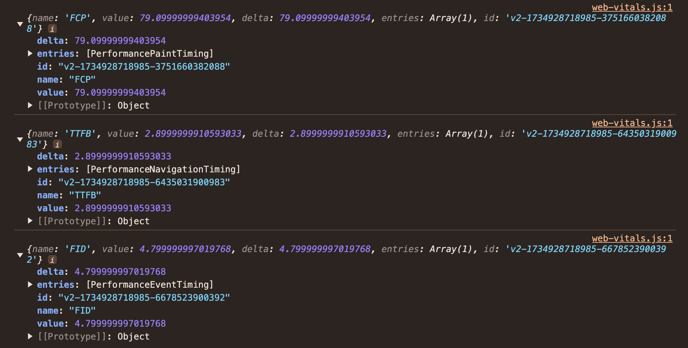

단순히 console.log로 기록한다면 브라우저의 콘솔 창에 기록하는 용도로밖에 활용할 수 없다. 만약 실제로 서버 등 어딘가에 기록하고 싶다면 소량의 분석용 데이터를 전송하기 위해 만들어진 sendBeacon API나 fetch 등의 API를 사용해 임의로 서버로 정보를 보내거나 구글 애널리틱스로 보낼 수도 있다.

```typescript
function sendToAnalytics(metric: Metric) {
  const body = JSON.stringify(metric);
  // 지표 정보를 보낼 위치
  const url = '/api/analysis';

  if (navigator.sendBeacon) {
    navigator.sendBeacon(url, body);
  } else {
    // sendBeacon이 없다면 fetch 또는 axios를 사용해 보낸다
    fetch(url, { body, method: 'POST', keepalive: true });
  }
}

reportWebVitals(sendToAnalytics);
```

```typescript
function sendToAnalytics({ id, name, value }: Metric) {
  // https://support.google.com/analytics/answer/11150547
  ga('send', 'event', {
    eventCategory: 'Web Vitals',
    eventAction: name,
    eventValue: Math.round(name === 'CLS' ? value * 1000 : value),
    eventLabel: id,
    nonInteraction: true,
  });
}

reportWebVitals(sendToAnalytics);
```

**create-next-app**

Next.js에서도 CRA와 비슷한 방식으로 사용해 볼 수 있다. 기본적으로 Next.js는 성능 측정을 할 수 있는 메서드인 NextWebVitalsMetric을 제공한다. `_app` 페이지에 다음과 같이 코드를 추가해서 사용해보자.

```typescript
import type { AppProps, NextWebVitalsMetric } from 'next/app';

export function reportWebVitals(metric: NextWebVitalsMetric) {
  console.log(metric);
}

export default function App({ Component, pageProps }: AppProps) {
  return <Component {...pageProps} />;
}
```

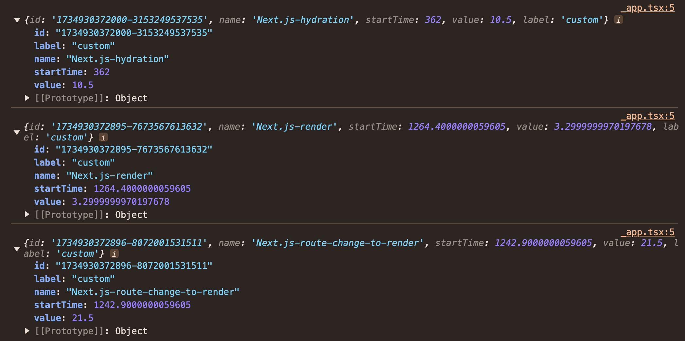

여기서 한 가지 주목할 만한 점은 기본적인 핵심 웹 지표 외에도 다음과 같은 Next.js에 특화된 사용자 지표도 제공한다는 점이다.

- Next.js-hydration: 페이지가 SSR되어 하이드레이션하는 데 걸리는 시간
- Next.js-route-change-to-render: 페이지가 경로를 변경한 후 페이지를 렌더링를 시작하는데 걸리는 시간
- Next.js-render: 경로 변경이 완료된 후 페이지를 렌더링하는데 걸리는 시간

참고로 모든 시간 단위는 밀리초(ms)이다.

위의 3가지 지표는 어느 정도 이하로 지표가 기록되어야 한다는 등의 기준은 없다. 다만 각각의 지표를 살펴보면서 SSR 시에 오래 걸리진 않는지, 페이지 전환 시에 호출되는 getServerSideProps가 오래 걸리지 않는지 등을 살펴보면 좋다. 이 외에는 create-react-app에서 지표를 수집하는 방식과 동일하게 사용할 수 있다.

### 구글 라이트하우스

리액트 애플리케이션에서 reportWebVitals를 설치해서 지표를 수집하는 방식은 단순히 코드 몇 줄만으로 지표를 수집할 수 있다는 장점이 있지만 그럼에도 기존 애플리케이션 코드의 수정이 필요하다는 점, 그리고 별도로 지표 수집을 하기 위한 사전 준비가 필요하다는 번거로움이 있다. 이에 반해 별도의 애플리케이션 코드 수정이나 배포, 수집 없이도 지표를 수집할 수 있는 방법이 있는데 바로 구글 라이트하우스(Googl Lighthouse)이다.

구글 라이트하우스는 구글에서 제공하는 웹 페이지 성능 측정 도구로, 오픈소스로 운영되고 있다. 앞서 살펴본 핵심 웹 지표뿐만 아니라 접근성, PWA, SEO 등 웹 페이지를 둘러싼 다양한 요소들을 측정하고 점검할 수 있다. 구글 라이트하우스를 실행하는 방법은 다음과 같다.

- 브라우저 확장 프로그램 설치: 브라우저의 웹 스토어에 접속해 확장 프로그램을 설치한다.
- 크롬 개발자 도구: 크롬의 개발자 도구에는 라이트하우스가 기본적으로 내장되어 있다.
- CLI: lighthouse라는 npm 라이브러리를 이용하면 CLI 명령어로 지표를 수집할 수 있다.

  ```shell
  lighthouse https://www.naver.com
  ```

  CLI의 경우 깃허브 액션 등 터미널만 제한적으로 사용할 수 있다는 CI/CD 환경에서 사용하기에 적합하다. 여기서는 크롬 개발자 도구를 이용해 라이트하우스를 실행하는 방법을 살펴본다.

먼저 크롬을 실행해 성능 지표를 분석하고자 하는 사이트를 방문한다. 그 다음, 크롬 개발자 도구를 열어 Lighthouse 탭을 클릭한다. 크롬에 설치된 다른 확장 프로그램 등이 영향을 줄 수 있으므로 가급적 시크릿 창으로 실행해 확인하는 것을 권장한다.

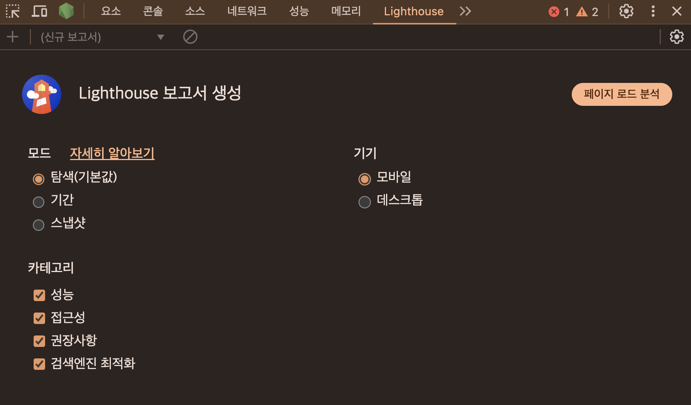

기기 항목에서는 측정하고자 하는 페이지 접근 환경을, 카테고리에서는 확인하고 싶은 지표를 선택할 수 있다. 그리고 각 모드별로 어떠한 결과가 나오는지 살펴보자.

### 구글 라이트하우스 - 탐색 모드

일반적으로 페이지에 접속했을 때부터 페이지 로딩이 완료될 때까지의 성능을 측정하는 모드이다. 이 모드로 측정을 시작하면 페이지를 처음부터 다시 불러와서 페이지 로딩이 끝날 때까지 각각의 지표를 수집한다.

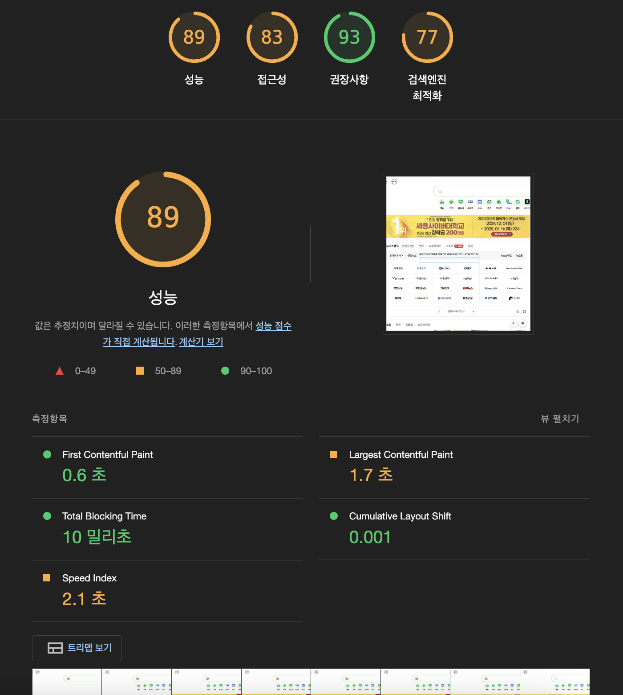

**성능**

성능은 웹페이지의 성능과 관련된 지표를 확인할 수 있는 영역이다.

핵심 웹 지표인 최초 콘텐트풀 페인트(FCP), 최대 콘텐트풀 페인트(LCP), 누적 레이아웃 이동(CLS) 외에도 3가지 추가적인 지표가 있다.

- `Time to Interactive`: 페이지에서 사용자가 완전히 상호작용(인터렉션)할 수 있을 때까지 걸리는 시간을 측정한다. 여기서 상호작용에 걸리는 시간까지란 다음과 같은 것을 의미한다.

  - LCP로 측정되는 페이지 내 콘텐츠가 표시되는 시점
  - 보여지는 페이지 요소의 대부분에 이벤트 핸들러가 부착되는 시점
  - 페이지의 유저가 상호작용에 50ms 내로 응답하는 시점

  구글에서는 이 TTI 지표가 3.8초 이내면 좋음, 7.3초 이내면 보통, 그 이후는 개선이 필요한 것으로 본다. 웹 페이지가 최대한 빠르게 상호작용이 되도록 준비하려면 메인 스레드가 하는 자바스크립트 작업을 최소화하고, 전체적인 자바스크립트 실행속도 또한 높일 필요가 있다.

- `Speed Index`: 페이지가 로드되는 동안 콘텐츠가 얼마나 빨리 시각적으로 표시되는지를 계산한다. 라이트하우스는 브라우저에 로드되는 페이지를 실시간으로 캡처하고, Speedline 라이브러리를 사용해 캡처된 이미지를 분석해 speed index를 계산한다. 구글에서는 이 지표가 3.4초 이내면 좋음, 5.8초 이내면 보통, 그 이후는 느리다고 판단한다.

- `Total Blocking Time`: 메인 스레드에서 특정 시간 이상 실행되는 작업, 즉 긴 작업이 수행될 때마다 메인 스레드가 차단된 것으로 간주한다. 메인 스레드가 차단됐다고 표현하는 이유는 브라우저가 이렇게 길게 실행하는 작업 때문에 무언가 다른 작업을 수행할 수 없기 때문이다. 이렇게 메인 스레드에서 실행하는 작업이 50ms 이상 걸리면 이를 긴 작업이라고 간주하고, 이렇게 실행되는 긴 작업을 모아서 Total Blocking Time(총 차단 시간)이라고 한다. 이 총 차단 시간은 긴 작업을 모아서 각각의 긴 작업의 시간에서 50ms를 뺀 다음, 이를 모두 합해 계산한다. 이 총 차단 시간은 모든 긴 작업을 대상으로 하는 것이 아니고, 최초에 사용자에게 무언가 콘텐츠를 보여줬을 때(최초 콘텐트풀 페인트, FCP)부터 상호 작용까지 걸리는 시간(TTI) 사이의 작업만 대상으로 한다. 즉, 사용자가 무언가 작업이 진행되고 있지 않다는 것을 눈치 챌 수 있는 시간을 대상으로만 총 차단 시간을 구하게 된다.

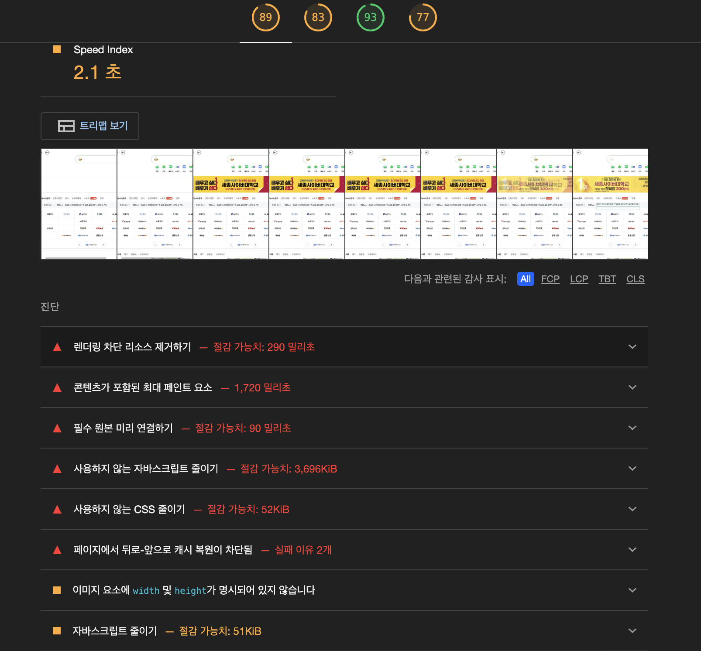

성능에서는 이 6가지 항목에 대해 각각의 점수를 계산하고, 해당 점수를 기반으로 어떠한 부분을 개선해야 하는지 알려준다.

**접근성**

접근성이란 웹 접근성을 말하며, 장애인 및 고령자 등 신체적으로 불편한 사람들이 일반적인 사용자와 동등하게 웹페이지를 이용할 수 있도록 보장하는 것을 말한다. 예를 들어, 시각으로 웹페이지를 보기 어려운 경우를 가정해보자. 이 경우 스크린 리더라고 하는 툴을 활용하면 웹페이지 내용을 직접 듣는 것이 가능하다. 그러나 그림이나 사진의 경우는 어떨까? 이 경우 스크린 리더가 그림과 사진을 읽을 수는 없으므로 적절한 대체 문자가 필요하다. 오디오나 비디오는 청각이 제한적인 경우를 위해 자막이 필요하며, 마우스를 활용할 수 없는 상황에 대비하기 위해서는 키보드만으로 모든 콘텐츠에 접근할 수 있어야 한다. 이러한 다양한 사용자들을 배려하기 위해 HTML과 CSS 등에 적절한 대안을 삽입하는 것을 접근성이라고 하며, 이 영역에서 평가하는 것은 얼마나 적절하게 접근성을 제공하는지 여부이다.

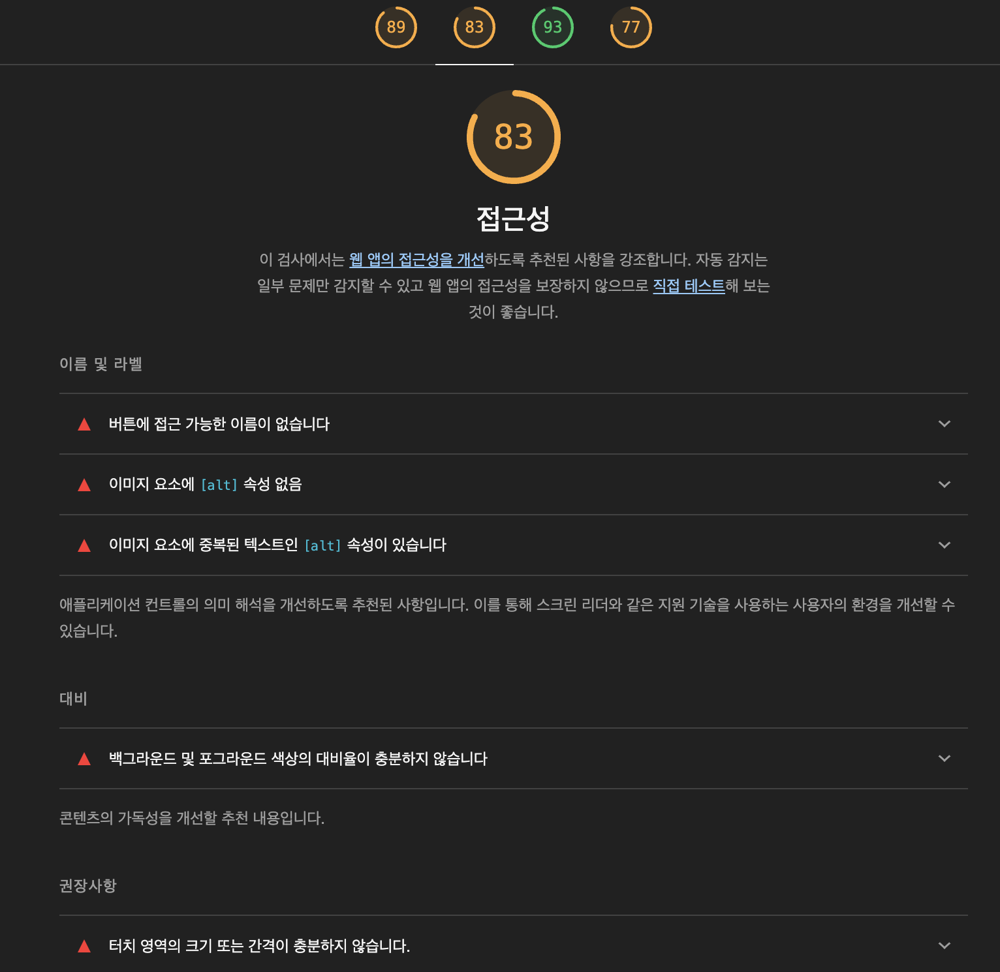

어떻게 수정해야 하는지도 알려준다. 이 영역을 참고해 다양한 사용자들이 모두 평등하게 웹페이지를 이용할 수 있도록 개선하는 것이 좋다.

**권장사항**

권장사항 영역에서는 웹사이트를 개발할 때 고랴해야 할 요소들을 얼마나 지키고 있는지 확인할 수 있다.

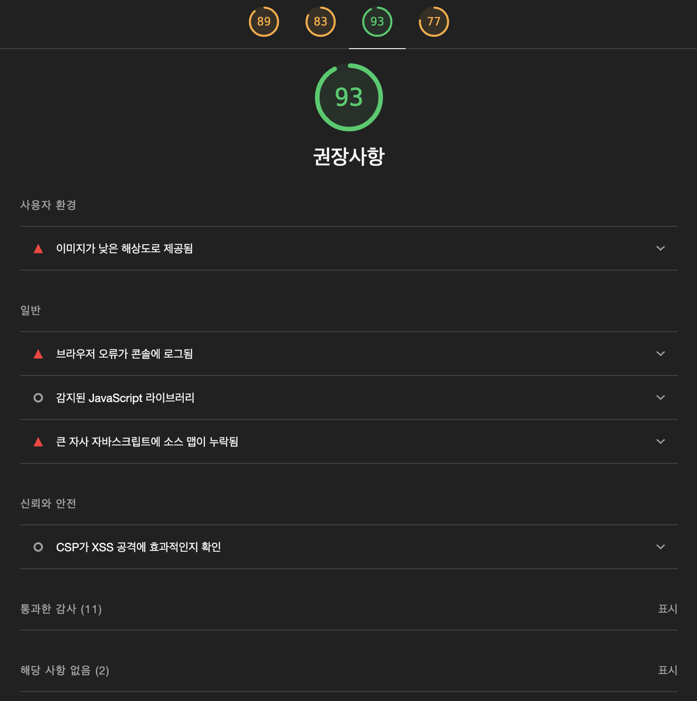

여기서 말하는 권장사항에는 보안, 표준모드, 최신 라이브러리, 소스 맵 등 다양한 요소들이 포함되어 있다. 이러한 권장사항들을 간단하게 살펴보자.

- CSP가 XSS 공격에 효과적인지 확인: XSS란 Cross Site Scripting의 약자로, 개발자가 아닌 제3자가 삽입한 스크립트를 통해 공격하는 기법이다. 예를 들어, 게시판이 있고, 어떠한 악의적인 게시자가 내용 대신 스크립트를 작성했다고 가정해보자. 이때 개발자가 별다른 조치를 취하지 않으면 이 스크립트가 실행되어 사용자에게 위해가 되는 작업을 수행할 수 있게 된다. CSP란 Content Security Policy의 약자로, 웹 사이트에서 호출할 수 있는 컨텐츠를 제한하는 정책을 말한다. 이 제한 정책에는 이미지, 스타일, 스크립트와 같은 정적인 콘텐츠뿐만 아니라, 주소, 도메인 등의 정보도 포함된다.

- 감지된 자바스크립트 라이브러리: 페이지에서 감지되는 자바스크립트 라이브러리를 말한다. jQuery, Next.js, React, Lodash, creat-react-app 등이 나타나며, 버전까지 특정할 수 있는 경우 버전까지 확인할 수 있다.

- HTTPS 사용: HTTP 대신 보안이 더 강력한 HTTPS를 사용하는지 확인한다.

- 페이지 로드 시 위치정보 권한 요청 방지하기: 사용자의 동의 없이 페이지 로드 시에 사용자의 물리적 위치를 알 수 있는 메서드인 window.navigator.geolocation.getCurrentPosition(), window.navigator.geolocation.watchPosition()을 실행하는지 확인한다. 물론 이 두 함수가 호출된다고 해서 바로 사용자의 위치 정보를 가져올 수 있는 것은 아니며, 브라우저에서 한 번 물어보는 절차를 거치게 된다. 그러나 다짜고짜 페이지 로드 시 요청하는 것은 사용자와 특별한 액션없이 가져오는 것이므로 반드시 사용자의 액션 이후에 실행되어야 한다.

- 페이지 로드 시 알림 권한 요청 방지하기: 위치 정보와 마찬가지로 사용자의 동의 없이 페이지 로드 시 웹 페이지 알림을 요청하는 Notification.requestPermission()을 실행하는지 확인한다. 이 함수도 마찬가지로 브라우저에서 사용자에게 알림 허용 여부를 다시 한 번 확인하지만 반드시 사용자 액션이 있을 때만 호출하는 것이 좋다.

- 알려진 보안 취약점이 있는 프론트엔드 자바스크립트 라이브러리를 사용하지 않음: 보안 취약점이 존재하는 자바스크립트 라이브러리를 사용하는지 확인한다.

- 사용자가 비밀번호 입력란에 붙여넣을 수 있도록 허용: 일부 사용자는 복잡한 비밀번호를 별도의 애플리케이션에 관리해 외우지 않고 복사/붙여넣기 방식으로 비밀번호를 입력한다. 이것은 보안 관점으로 봤을 때 타당한 접근방식이나 웹페이지에서 이를 허용하지 않는다면 무용지물이다. 반드시 비밀번호 입력란은 붙여넣기가 가능해야 한다.

- 이미지를 올바른 가로세로 비율로 표시: 이미지의 실제 크기와 표시되는 크기 사이의 비율이 일치하는지 확인한다.

- 이미지가 적절한 해상도로 제공됨: 이미지가 선명하게 보일 수 있도록 크기에 맞는 해상도의 이미지를 제공하는지 확인한다.

- 페이지에 HTML Doctype 있음: 과거 웹 표준이 제대로 정착되지 않았을 때 웹페이지는 넷스케이프 브라우저의 인터넷 익스플로러용 두 가지 버전으로 따로 만들어졌다. 이후 표준이 재정되면서 이 혼란은 멈추게 되었는데, 이 표준을 준수해 웹페이지가 작성되었다고 의미하는 것이 바로 Doctype이다. 이 Doctype이 선언되지 않아다면 표준을 준수하지 않는 것으로 간주되어 호환 모드로 렌더링하게 되는데 이는 불필요한 작업이다. 따라서 웹페이지 첫 번째 줄에 `<!DOCTYPE html>`을 선언해 이러한 호환 모드 실행을 막는 것이 좋다.

- 문자 집합을 제대로 정의함: 서버가 HTML 파일을 전송할 때 문자가 어떻게 인코딩되어 있는지 지정하지 않으면 브라우저는 각 바이트가 나타내는 문자를 알 수 없게된다. 따라서 적절하게 charset을 지정해야 한다. 대부분의 웹페이지는 `<head>`의 최상단에 `<meta charset=utf-8 />`을 삽입해 UTF-8로 인코딩됐다고 명시한다.

- 지원중단 API를 사용하지 않기: 더 이상 지원하지 않는 API는 잠재적으로 보안 취약점이 될 수 있으므로 사용하지 않는 것이 좋다.

- 콘솔에 로그된 브라우저 오류 없음: 콘솔에 에러가 기록되는 것은 사용자에게 영향을 미치지 않을 수도 있지만 분명 웹페이지에 문제가 있다는 사실에는 변함이 없다. 따라서 콘솔에 에러가 기록되지 않게 해야한다.

- Chrome Devtools의 Issues 패널에 문제없음: 크롬 개발자 도구에는 문제(Issues)라는 탭이 있는데, 이 탭에는 웹페이지에 대한 여러가지 문제점을 알려준다. 여기에 기록된 문제가 있다면 확인해 조치하는 것이 좋다.

- 페이지에 유효한 소스 맵이 있음: 소스 맵은 압축되어서 읽기 어려워진 소스코드를 원본 소스코드로 변환할 수 있도록 도와주는 파일로, 이 소스맵이 있으면 개발자가 디버깅하는 데 큰 도움이 된다. 따라서 디버깅을 해야 하는 상황이라면 소스맵이 있는 것이 좋지만, 반대로 그럴 필요가 없는 경우에는 별도로 제공하지 않아도 된다.

- `font-display: optional`을 사용하는 폰트가 미리 로드됨: 폰트를 불러오는 방법 중 하나로, 개발자가 원하는 임의의 폰트를 보여줄 수도 있으면서 동시에 사용자에게 버벅거림 없는 렌더링을 보장할 수 있는 가장 효과적인 방법이다.

**검색 엔진 최적화**

검색 엔진 최적화란 웹페이지가 구글과 같은 검색엔진이 쉽게 웹페이지의 정보를 가져가서 공개할 수 있도록 최적화되어 있는지를 확인하는 것을 의미한다. 단순히 문서를 크롤링하기 쉽게 만들었는지 확인하는 것부터, robots.txt가 유효한지, 이미지와 링크에 설명 문자가 존재하는지, `<meta>`나 `<title>` 등으로 페이지의 정보를 빠르게 확인할 수 있는지 등을 확인한다. 검색엔진에 최적화되어 있을수록 검색 엔진의 검색결과에 우선순위에 높게 나타나며, 사용자가 유입될 가능성이 높아지므로 이러한 SEO를 위한 다양한 요소들을 확인하고 점검할 필요가 있다.

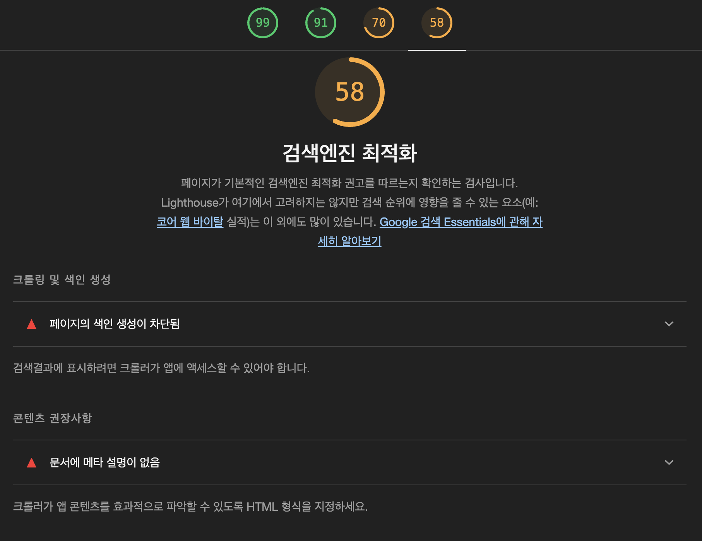

### 구글 라이트하우스 - 기간 모드

기간 모드는 실제 웹페이지를 탐색하는 동안 지표를 측정하는 것이다. 기간 모든 시작을 누른 뒤 성능 측정을 원하는 작업을 수행한 다음, 기간 모드를 종료하면 그 사이에 일어난 작업들에 대한 지표를 다음과 같이 확인할 수 있다.

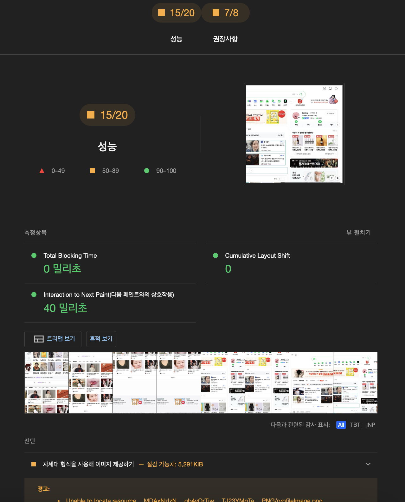

여기서 확인할 수 있는 지표들은 크게 성능과 권장사항으로, 앞서 탐색모드와 크게 다르지 않다. 대다수의 사용자가 빈번하게 수행할 것으로 예상되는 작업을 기간모드로 측정하면 성능 최적화에 큰 도움을 얻을 수 있다.

여기서 앞에서 볼 수 없었던 내용 두 가지를 확인할 수 있는데, 바로 흔적과 트리맵이다.

**흔적**

흔적이라는 이름은 View Trace를 번역한 것으로, 웹 성능을 추적한 기간을 성능 탭에서 보여준다. 단순히 구글에서 제안하는 감사를 보여주는 정도를 넘어서, 상세하게 시간의 흐름에 따라 어떻게 웹페이지가 로딩됐는지를 보여준다.

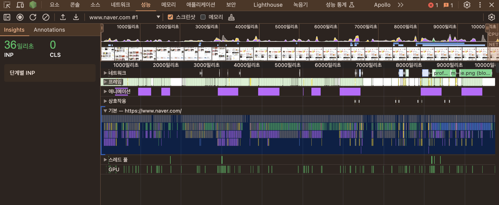

**트리맵**

트리맵은 페이지를 불러올 때 함께 로딩한 모든 리소스를 함께 모아서 볼 수 있는 곳이다. 웹페이지의 전체 자바스크립트 리소스 중 어떠한 파일이 전체 데이터 로딩 중 어느 정도를 차지했는지를 비율로 확인할 수 있으며, 실제 불러온 데이터의 크기를 확인할 수도 있다.

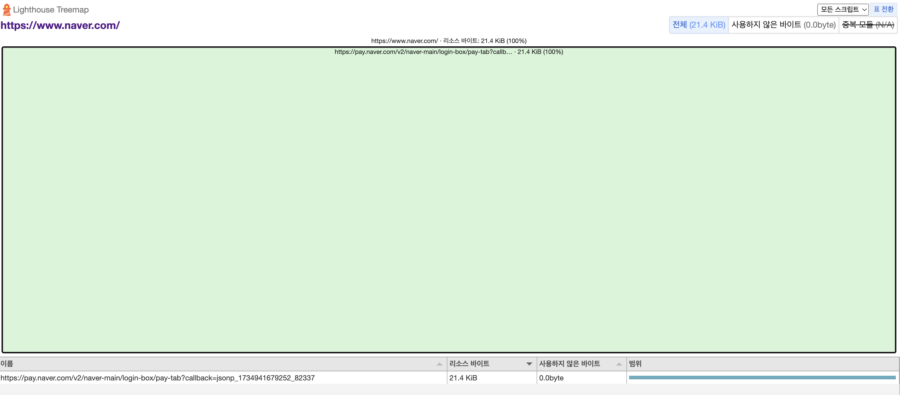

한 가지 더 확인할 수 있는 것은 로딩한 리소스에서 사용하지 않은 바이트의 크기를 확인하는 것인데, 이는 실제로 불러왔지만 사용되지 않은 리소스를 의미한다. 이 또한 전체 리소스에서 어느 정도 비율인지 확인할 수 있지만 특정 시나리오에서만 실행되는 리소스도 있기 때문에 꼭 사용하지 않는다고 해서 불필요한 것이라고 단정 지을 수 없다. 다만 이 사용하지 않는 바이트의 크기가 불필요하게 크다면 번들링된 리소스에서 불필요한 것이 없는지 확인해 보는 것이 좋다.

이러한 리소스들은 크롬 개발자 도구의 소스 탭에서 파일명을 입력해 실제로 내부의 소스코드도 확인할 수 있으니 과도하게 큰 리소스나 혹은 사용하지 않은 바이트의 비중이 큰 리소스는 한 번쯤 눈여겨보는 것이 좋다. 소스맵까지 배포되어 있다면 무슨 소스코드가 번들링되어 있는지 더 정확하게 확인할 수 있을 것이다.

### 구글 라이트하우스 - 스냅샷

스냅샷 모드는 탐색 모드와 매우 유사하지만 현재 페이지의 상태를 기준으로 분석한다는 점이 다르다. 즉, 현재 상태에서 SEO, 접근성, 성능 등을 분석할 수 있다. 페이지 로딩이 아닌 특정 페이지의 특정 상태를 기준으로 분석하고 싶다면 스냅샷 모드를 사용하면 된다. 스냅샷 모드의 지표는 탐색 모드와 매우 유사하므로 이를 참고하면 된다.

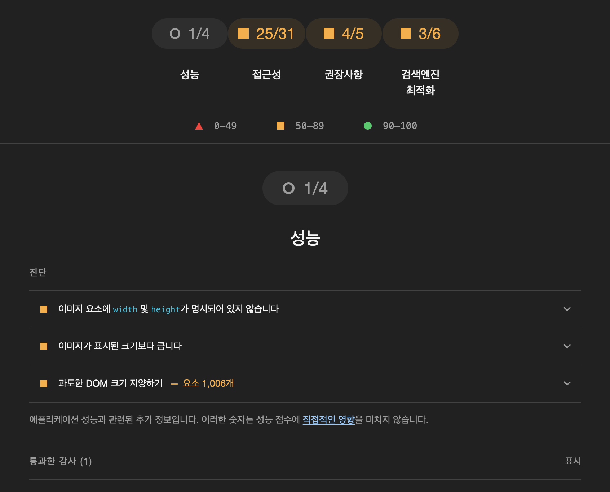

앞서 다른 모드와 다르게 일정 기간 분석을 수행하지 않기 때문에 분석할 수 있는 내용이 제한적이다.

### WebPageTest

WebPageTest는 웹사이트 성능을 분석하는 도구로 가장 널리 알려진 도구이다. 구글에서 제공하는 라이트하우스, 크롬 개발자 도구 등은 무료로 제공되면서도 개발자들이 쉽게 사용할 수 있는 분석 도구이지만 WebPageTest는 무료 기능도 있지만 유료로 제공하는 분석 도구도 있을 만큼 웹사이트 성능을 분석할 수 있는 심도 있는 기능도 많다. 그러나 굳이 유로로 결제하지 않더라도 무료로 제공하는 기능만으로도 웹사이트 성능과 로딩과정에서 일어나는 일을 분석하는데 충분하다.

WebPageTest에서 제공하는 분석도구는 크게 다섯 가지로 나뉜다.

- Site Performance: 웹사이트의 성능 분석을 위한 도구
- Core Web Vitals: 웹사이트의 핵심 웹 지표를 확인하기 위한 도구
- Lighthouse: 구글 라이트하우스 도구
- Visual Comparison: 2개 이상의 사이트를 동시에 실행해 시간의 흐름에 따른 로딩 과정을 비교하는 도구
- Traceroute: 네트워크 경로를 확인하는 도구

기본적으로 WebPageTest는 미국, 인도, 캐나다, 독일 등 한국과 어느 정도 거리가 먼 서버를 기준으로 테스트하기 때문에 앞서 크롬 개발자 도구에서 테스트했을 때보다 성능 지표가 좋지 않을 가능성이 매우 크다. 글로벌 웹사이트를 지향하는 것이 아니라면 이 점은 염두에 두고 테스트하는 것이 좋다.

먼저 `https://www.webpagetest.org`에 접속한 다음, Site Performance를 선택한 뒤 분석을 원하는 웹사이트 주소를 입력한다. 그러고 나서 Start Test를 누르면 테스트가 시작되며, 다소간의 시간이 흐른 이후에 테스트가 완료된다.

### Performance Summary

테스트가 완료되면 다음과 같이 전체적인 결과를 요약해서 볼 수 있다.

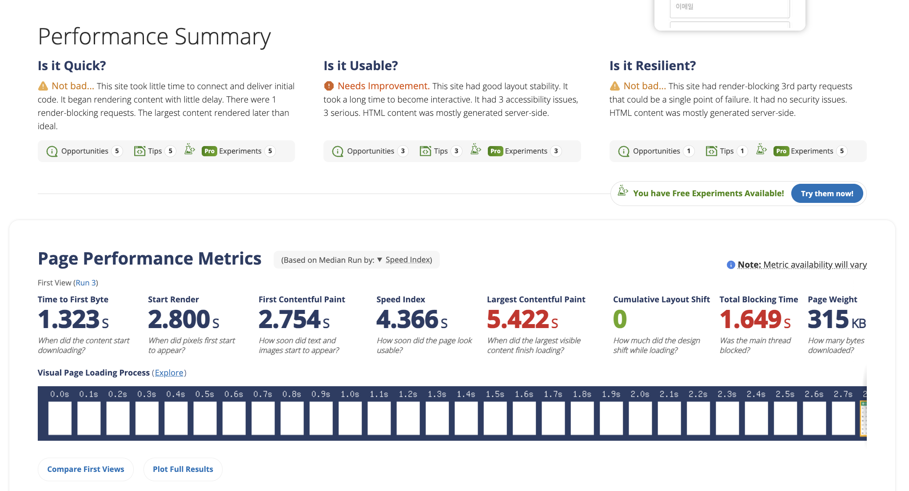

WebPageTest의 성능 테스트는 총 3번 이뤄지기 때문에 3개의 서로 다른 결과를 확인할 수 있다.

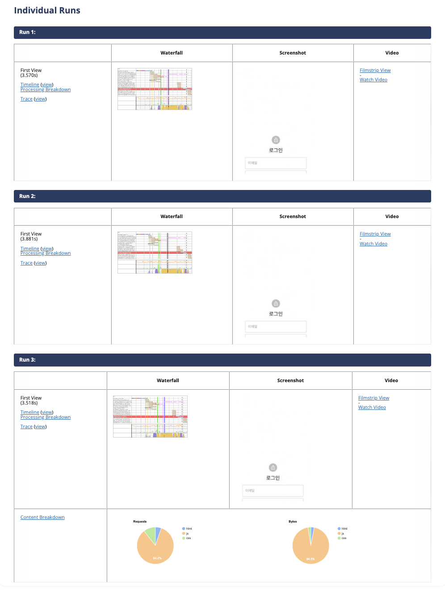

측정 페이지는 크게 3가지 영역으로 나눠져 있으며, 자세한 영역은 클릭해서 확인할 수 있다.

- `Opportunities & Experiments`: 웹사이트에 대한 평가를 총 3가지로 나눠서 보여준다. 각 항목에 대한 간단한 평가를 내리며, 자세한 내용은 클릭을 통해 확인할 수 있다.

  - `Is it Quick`: 웹사이트가 충분히 빠른지를 평가한다. 여기서 빠름을 나타내는 것은 최초 바이트까지 걸리는 시간(TTTB)이 짧은지, 콘텐츠 렌더링이 즉각적으로 일어나는지, 최대 콘텐트풀 페인트(LCP) 시간이 합리적인지를 확인한다.
  - `Is it Usable`: 웹사이트의 사용성과 시각적인 요소를 의미한다. 콘텐츠 누적 이동(CLS)을 최소화하고 있는지, 상호작용을 빠르게 할 수 있는지, 접근성 이슈가 있는지, 클라이언트 사이드에서 과도하게 HTML을 많이 렌더링하는지 등을 점검한다.
  - `Is it Resilient`: 보안 취약성을 점검한다. 렌더링을 블로킹하는 제3자 라이브러리가 존재하는지, 실질적인 위협이 되는 보안 위험 요소가 있는지를 나타낸다.

- `Observed Metrics`: 최초 바이트까지의 시간, 렌더링 시작에 소요되는 시간, 최초 콘텐츠풀 페인트 등 측정할 수 있는 다양한 시간 지표에 대해 나타낸다. 추가로 시간의 흐름에 따라 웹페이지가 어떤 식으로 렌더링되는지도 알 수 있다. 0.1초 단위로 스크린샷을 찍고 있는데, 특정 스크린샷에 네모 박스가 있는 것을 확인할 수 있다. 각 색깔별 의미는 다음과 같다.

  - 주황색 실선: 웹사이트의 모습이 변경된 경우
  - 주황색 점선: 웹사이트의 모습이 변경됐고, 레이아웃 이동도 일어난 경우
  - 빨간색 실선: 최대 콘텐츠풀 페인트
  - 빨간색 점선: 최대 콘텐츠풀 페인트와 동시에 레이아웃 이동도 일어난 경우

- `Individual Runs`: 기본적으로 WebPageTest는 3번의 테스트를 돌려서 평균값을 보여주는데, 각 실행별로 어떠한 결과를 보여주는지 확인할 수 있다.

### Opportunties & Experiments

각 요소별로 확인하는 상세 지표에 대해 살펴보자.

- `Is it Quick?`

  - 최초 바이트까지의 시간(TTFB)을 점검한다. 최초로 응답하는 바이트가 빠르면 빠를수록 렌더링을 빠르게 하는데 도움이된다.
  - 렌더링을 블로킹하는 자바스크립트가 있는지 확인한다. 렌더링을 방해하는 자바스크립트가 적으면 적을수록 렌더링을 하는데 수월해진다.
  - 렌더링을 블로킹하는 CSS가 있는지 확인한다. CSS 또한 잘못된 위치에 잘못 선언되어 있으면 렌더링을 막을 수 있다.
  - 최초 콘텐츠풀 페인트가 2.5초 이내인지 확인한다. 사용자가 콘텐츠를 볼 수 있는 시점은 빠를수록 좋다. 만약 이 지표가 느리다면 어떻게 개선하면 좋을지 제안해 준다.
  - 주요 영역 내에 게으른 로딩되는 이미지가 있는지 확인한다. 이외의 영역에 있는 이미지는 지연 로딩해 다른 급한 리소스를 먼저 로딩하는 것이 좋다.
  - 문자의 노출을 지연시키는 커스텀 폰트가 있는지 확인한다. 만약 font-display=block과 같은 형식으로 폰트를 불러온다면 해당 폰트가 로딩될 때까지 문자가 보이지 않을 것이다. 이는 사용자 경험을 해칠 수 있으므로 폰트가 로딩되기 전까지는 기본 폰트를 사용하는 것이 좋다.
  - 제3자 호스트에서 폰트를 불러오는지 확인한다. 이제 폰트는 캐싱되지 않으므로 제3자 호스트에서 폰트를 불러오는 것은 크게 이점이 없다. 웹사이트와 동일한 곳에서 폰트를 호스팅하거나, rel=preload로 브라우저에 최우선 리소스임을 알려주거나, rel=preconnect로 미리 해당 오리진에 연결할 수 있게끔 하는 것이 좋다.
  - 실제로 사용하지 않는 리소스를 rel=preload로 불러오지 않는지 확인한다. preload는 앞서 설명한 것처럼 브라우저의 최우선 리소스로 지정되기 때문에 꼭 필요한 리소스에만 사용하는 것이 좋다.
  - HTTP 리다이렉트되는 리소스가 없어야 한다. 리다이렉트는 추가적인 네트워크 요청을 유발하기 때문에 성능에 좋지 못하다. 가능한 한 모든 리소스는 리다이렉트되지 않고 바로 리소스를 반환해야 한다.
  - 최초로 다운로드받은 HTML과 최종 결과물 HTML 사이에 크기 차이가 적어야 한다. 최초로 받은 HTML과 최종 결과물 사이에 차이가 클수록 최종 결과물을 그리기 위해 자바스크립트가 많은 힘을 쏟았다는 것을 의미한다. 이는 SPA에서 특히 두드러지게 문제점으로 지적된다.

- Is it Usable

  - 이미지 비율 부재로 인한 레이아웃 이동 가능성 여부를 확인한다. 이미지의 비율이 없을 경우 브라우저는 이미지가 로딩되기 전까지 해당 이미지의 크기를 알 수 없어 결과적으로 레이아웃 이동이 발생하게 된다. 이미지가 있다면 미리 적당한 width와 height을 지정하는 것이 좋다.
  - 어떤 이유에서건 메인 스레드가 장시간 멈춰 있어서는 안된다. 메인 스레드가 어떤 이유에서건 장시간 막혀있게 된다면 페이지 콘텐츠와 상호작용하는 것이 어려워진다. 가능한 한 실행되는 자바스크립트 크기를 줄이는 것이 좋다.
  - meta: viewport가 적절하게 삽입되어 있어야 한다. meta: viewport는 사용자가 볼 수 있는 영역인 뷰포트를 제어하는 속성이다. 이는 사용자가 접속한 디바이스에 따라 달라지는데, 브라우저에 해당 페이지의 면적 및 비율을 어떻게 제어할지를 정의한다. 가장 많이 정의하는 속성은 다음과 같다.

  ```html
  <!-- 너비는 디바이스에 맞게, 최대 확대 축소 수준은 1.0(기본)으로 하겠다는 뜻 -->
  <!-- 모바일 기기에서 해당 웹페이지를 접속할 때 크기를 정할 수 있는 좋은단서가 됨 -->
  <meta name="viewport" content="witdh=device-width, initial-scale=1" />
  ```

  - 접근성 이슈가 있는지 확인한다. 접근성 관려 문제가 있다면 무엇이 문제인지 어떻게 수정해야 하는지 힌트를 준다.
  - 최초로 다운로드 받은 HTML과 최종 결과물 HTML 사이에 크기 차이가 적어야한다. 접근성 측면에서 또한 마찬가지로 최대한 HTML을 빠르게 완성되어 있는 것이 좋다. 자바스크립트로 완성되는 HTML이 많아질수록 스크린 리더기가 해당 콘텐츠를 읽는데 걸림돌이 될 것이다.

- `Is it Resilient`
  - 렌더링을 막는 제3자 라이브러리 요청이 없어야 한다. 기본적으로, 외부에서 불러오는 자바스크립트 CSS 등의 리소스는 페이지의 렌더링을 막는다. 타사 요청은 또한 웹페이지 성능이 이 타사 응답 성능에 의존하게 만들어 버리므로 특히 위험하다.
  - Synk에서 검출된 보안 위협이 없어야 한다. Synk는 자바스크립트 라이브러리에 보안 위협이 존재하는지 확인해 주는 도구이다. 모든 라이브러리가 그렇듯이 외부 이용자가 사용하게 되는 라이브러리에는 보안 취약점이 반드시 없어야 한다.
  - 모든 요청은 HTTP가 아닌 HTTPS를 거쳐야 한다. HTTPS는 데이터 무결성을 담보하고, 사용자의 개인정보를 보호하며, 보안 위협으로부터 지켜주므로 반드시 HTTPS를 사용해야 한다.
  - 최초로 다운로드한 HTML과 최종 결과물 HTML 사이에 크기 차이가 적어야 한다. HTML 의존이 자바스크립트에 의존적일수록 자바스크립트 에러와 제3자 네트워크 요청 실패 등으로 인한 페이지 렌더링 실패 가능성이 높아진다. 가능한한 HTML은 완성된 채로 다운로드돼야 한다.

### Flimstrip

Flimstrip은 말 그대로 웹사이트를 마치 필름을 보는 것처럼 시간의 흐름에 따라 어떻게 웹사이트가 그려졌는지, 또 이때 어떤 리소스가 불러와졌는지 볼 수 있는 메뉴이다. 이 Flimstrip 메뉴를 활용하면 렌더링을 가로막는 리소스나 예상보다 일찍 실행되는 스크립트 등을 확인할 수 있다.

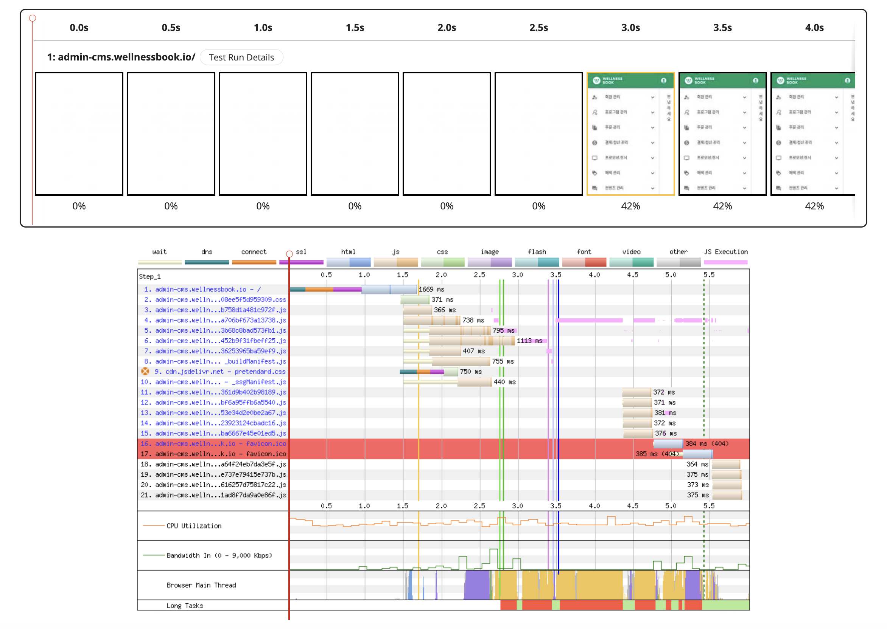

위의 사진중 아래쪽 창에 리소스들 중 왼쪽에 주황색 X표시가 있는 것은 렌더링을 블로킹하는 리소스라는 뜻이다. 현재 결과에는 총 1개(9번)가 보이는데, 이는 아마도 async나 defer로 불러오지 않는 `<script />`일 가능성이 크다. 실제 웹사이트를 가보면 동기식으로 보내는 스크립트가 존재하는 것을 확인할 수 있다.

여기서 유일한 HTML 리소스는 1번으로, 1번의 크기가 매우 작은 것을 볼 수 있다. 그리고 가운데 녹색 세로 선은 최초 콘텐츠풀 페인트를 의미한다. (3.5초경의 마지막 파란 선이 렌더링이 끝난 지점이다.)

이처럼 Filmstrip의 그래프를 직접 확인하면 어떠한 것이 성능에 영향을 미치는지, 개선점은 무엇이 있는지 확인할 수 있다. 이 외에도 이 메뉴에서는 다양한 성능 관련 수치를 그래프로 확인할 수 있다.

다음은 시간에 흐름에 따라 페이지가 완성되는 정도를 나타낸 그래프이다. 0은 페이지에 아무런 내용이 뜨지 않았음을 의미하며, 100%는 페이지가 완성된 것을 의미한다.

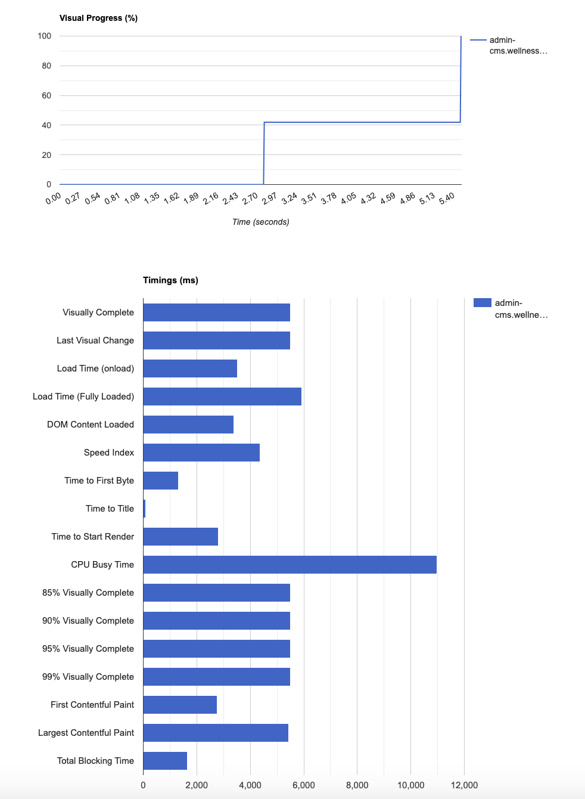
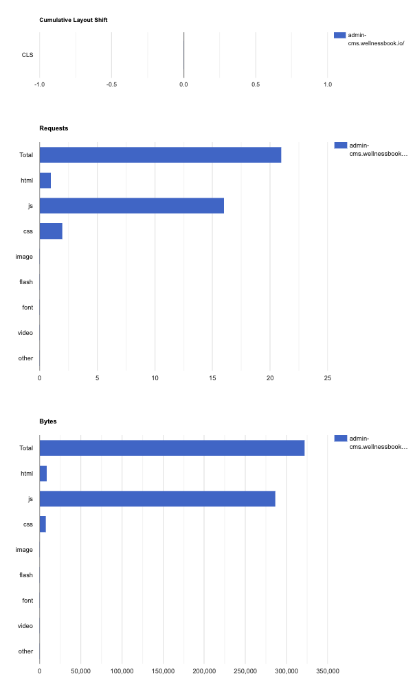

### Details

이 메뉴는 앞서 Filmstrip에서 보여준 내용을 자세하게 보여주는 영역이다. 각 요청에 대한 상세한 설명과 Filmstrip 메뉴에서 제대로 설명해 주지 않았던 각종 실선, 그림과 관련된 설명이 덧붙여저 있으니 Filmstrip에서 제대로 이해하지 못한 내용이 있다면 여기에서 확인하면 좋다.

### Web Vitals

이 메뉴에서는 최대 콘텐츠풀 페인트(LCP), 누적 레이아웃 이동(CLS), 총 블로킹 시간(TBT)에 대한 자세한 내용을 확인할 수 있다. 최대 콘텐츠풀 페인트의 경우 시간의 흐름에 따라 최대 콘텐츠풀 페인트가 어떻게 변화했는지 확인할 수 있으며, 누적 레이아웃 이동은 어떤 요소가 레이아웃 이동에 영향을 미쳤는지 상세하게 확인할 수 있다. 핵심 웹 지표에 대한 관심이 많다면 이 메뉴를 참고하자.

### Optimizations

Optimizations는 말 그대로 최적화와 관련된 메뉴로, 리소스들이 얼마나 최적화되어 있는지를 나타낸다.

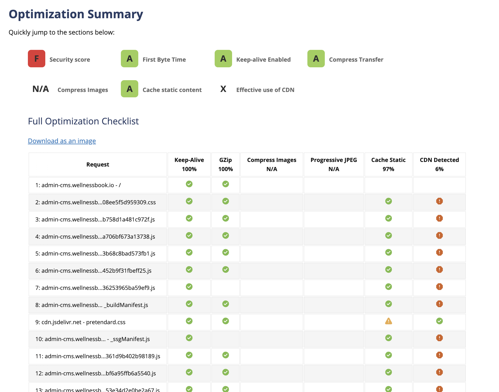

여기에서 확인 가능한 내용은 다음과 같다.

- Keep-Alive 설정으로 서버와의 연결을 계속 유지하고 있는지
- Gzip으로 리소스를 압축하고 있는지
- Progressive JPEG(JPEG를 완벽한 픽셀로 위에서부터 아래까지 서서히 로딩하는 기법이 아니라 전체 이미지를 블러 처리했다가 서서히 또렷해지는 기법)으로 JPEG 이미지를 렌더링하고 있는지
- 리소스 캐시 정책이 올바르게 수립되어 있는지
- 리소스가 CDN(Content Delivery Network)을 거치고 있는지

각 리소스별로 해당 점검사항을 확인하며, 이 요구사항을 만족하지 못하는 리소스를 따로 체크해 개발자로 하여금 손쉽게 점검할 수 있게 도와준다.

### Content

Content 메뉴에서는 말 그대로 웹사이트에서 제공하는 콘텐츠, 에셋을 종류별로 묶어 통계를 보여준다. 에셋 종류별 크기와 로딩 과정을 확인할 수 있으며, 시간에 흐름에 따라 렌더링을 거치면서 또 어떻게 에셋을 불러오는지도 확인할 수 있다.

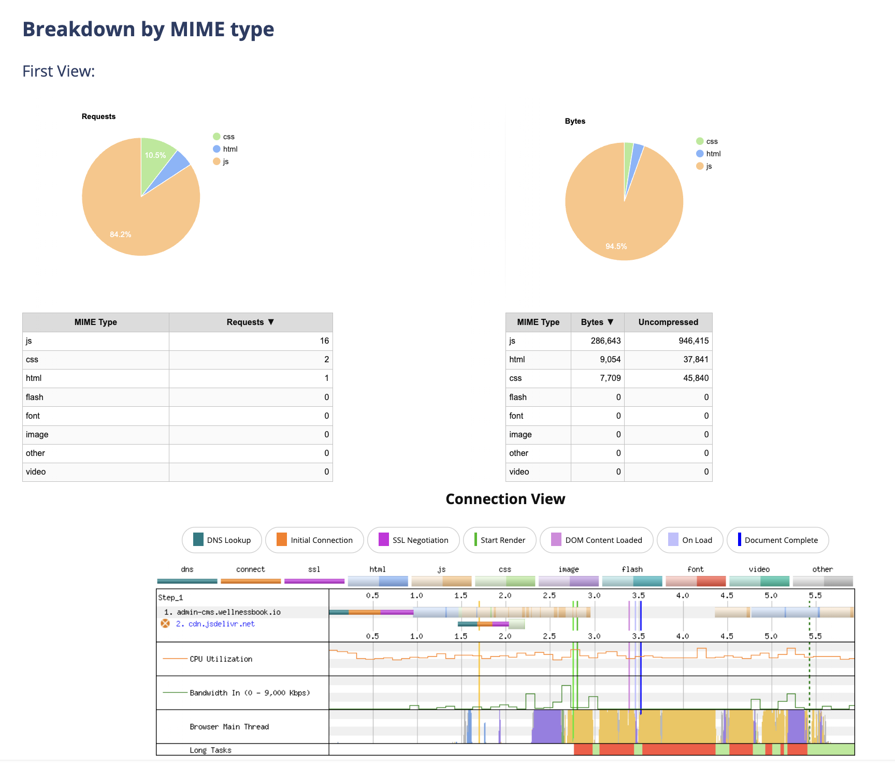

### Domains

Domains 메뉴에서는 Content 메뉴에서 보여준 에셋들이 어느 도메인에서 왔는지를 도메인별로 묶어서 확인할 수 있다. 그리고 해당 도메인별로 요청한 크기는 어느 정도인지도 확인할 수 있다. 웹사이트 성격에 따라 다르지만 중요 리소스는 웹사이트와 같은 곳에서 요청할수록 도메인 연결에 소요되는 비용을 줄일 수 있어서 좋다.

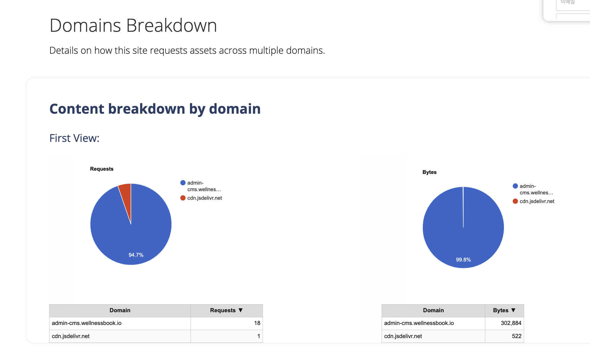

### Console Log

Console Log 메뉴에서는 사용자가 웹사이트에 접속했을 때 console.log로 무엇이 기록됐는지 확인할 수 있다. 대부분의 경우 console.log는 사용자가 확인할 수 없을 뿐더러 console.log 자체도 부하가 발생하는 작업이므로 가급적 console.log를 기록하는 일은 없어야 한다. 만약 디버깅 목적으로 사용하고 있다면 환경변수 등의 방법을 사용해 개발자만 제한적으로 볼 수 있게 해야한다.

### Detected Technologies

웹사이트를 개발하는데 사용된 기술을 확인할 수 있는 메뉴이다. 평소에 관심이 있거나 신기한 웹사이트가 있다면 이 메뉴를 활용해 어떻게 만들었는지 짐작해 볼 수 있다.

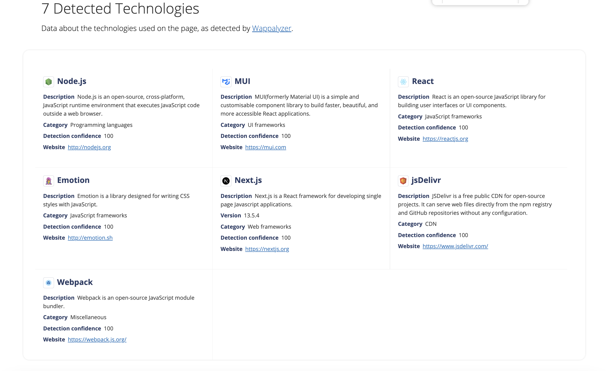

### Main-thread Processing

먼저 이 메뉴의 하위 항목인 Processing Breakdown에서는 메인 스레드가 어떤 작업을 처리했는지 확인할 수 있다. 여기서는 리소스를 기다리는 idle time, 즉 유휴시간은 집계에 포함되지 않는다. 메인 스레드의 작업을 크게 스크립트 실행(Scripting), 레이아웃(Layout), 리소스 로딩(Loading), 페인팅(Painting), 기타의 총 다섯 가지로 분류해서 알려준다.

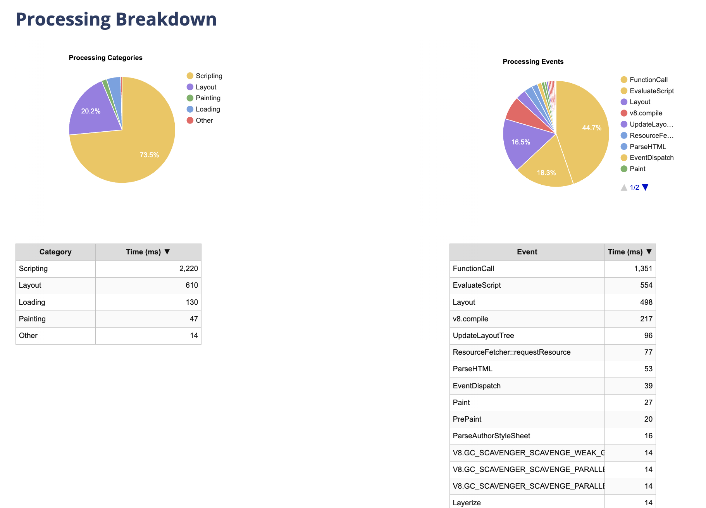

또한 실제로 어떠한 작업을 하고 있었는지 상세하게 확인할 수 있다. 함수실행, HTML 파싱, 페인팅, 스크립트 분석 등 다양한 요소 등을 확인할 수 있으니 웹사이트 로딩을 위해 메인 스레드가 무슨 일을 확인하는지 알고 싶다면 이 메뉴를 참고하면 된다.

다음으로 Time Breakdown에서는 유휴시간을 포함해 메인 스레드의 작업을 확인할 수 있다.

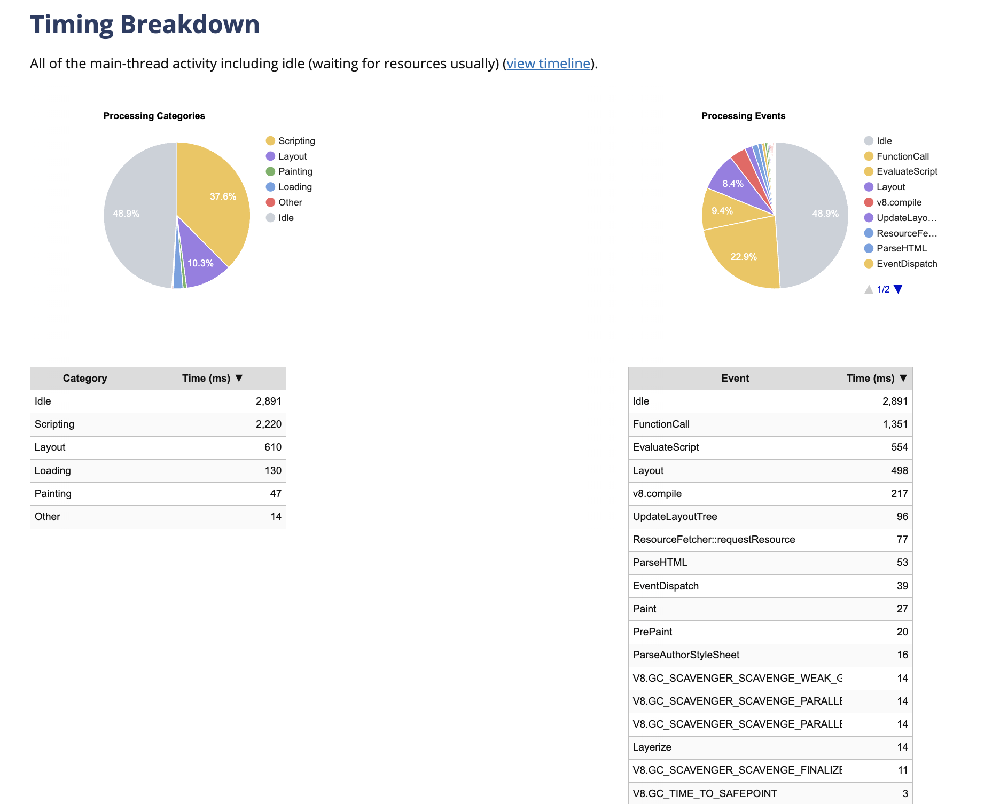

### 기타

이 외의 메뉴는 WebPageTest 외부에서 제공하는 서비스로, 링크를 클릭하면 모두 외부 페이지로 이동한다.

- Image Analysis: 유명한 이미지 & 비디오 클라우드 서비스 업체인 Cloudlinary로 연결되며, 해당 웹사이트에 어떠한 이미지가 있는지, 그리고 이 이미지들이 최적화된다면 이미지 리소스를 어느 정도 아낄 수 있는지 보여준다.

- Request Map: 웹사이트에서 요청이 어떻게 일어나고 있는지를 시각화 도구로 보여준다. 각 리소스의 크기와 특정 리소스가 다른 리소스를 불러오는 등의 요청 관련 연쇄 작용을 확인할 수 있다. 만약 큰 사이즈의 요청이 연쇄 작용의 너무 뒤에서 일어난다면 이러한 요청을 가급적 빠르게 호출할 수 있도록 앞당기는 것도 도움이 될 것이다.

- Data Cost: 각 국가별로 가장 저렴한 요금제를 기준으로 이 웹사이트를 로딩했을 때 실제로 얼마나 가격이 드는지 확인할 수 있는 웹사이트이다. 우리나라의 경우 데이터 가격이 상대적으로 저렴한 편에 속한다.
