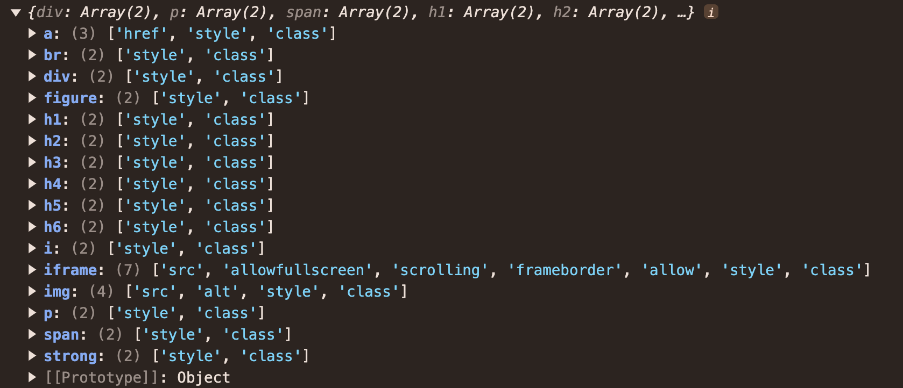
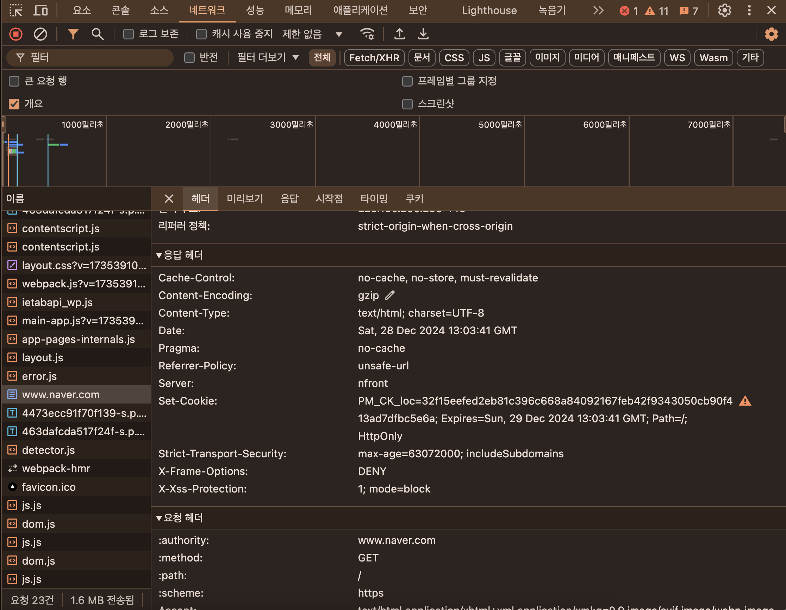

## 14. 웹사이트 보안을 위한 리액트와 웹페이지 보안 이슈

웹사이트 성능만큼이나 중요한 것이 바로 웹사이트의 보안이다. 따라서 개발자들은 웹사이트를 완성도 있게 만들고 충분한 성능을 내는 것과 동시에 외부의 위협에도 안전한 웹사이트를 만들어야 할 책임감을 반드시 지녀야 한다.

### 리액트에서 발생하는 크로스 사이트 스크립팅(XSS)

크로스 사이트 스크립팅(Cross-Site Scripting, XSS)이란 웹 애플리케이션에서 가장 많이 보이는 취약점 중 하나로, 웹사이트 개발자가 아닌 제3자가 웹사이트에 악성 스크립트를 삽입해 실행할 수 있는 취약점을 의미한다. 이 취약점은 일반적으로 게시판과 같이 사용자가 입력을 할 수 있고, 이 입력을 다른 사용자에게 보여줄 수 있는 경우에 발생한다. 예를 들어 어떤 게시판에 사용자가 다음과 같은 글을 올린다고 가정해보자.

```html
<p>사용자가 글을 작성했습니다.</p>
<script>
  alert('XSS');
</script>
```

위 글을 방문했을 때 별도의 조치가 없다면 script도 함께 실행되어 window.alert도 함께 실행될 것이다. script가 실행될 수 있다면 개발자가 할 수 있는 모든 작업을 함께 수행할 수 있으며, 쿠키를 획득해 사용자 로그인 세션 등을 탈취하거나 사용자의 데이터를 변경하는 등 각종 위험성이 있다. 그렇다면 리액트에서 이 XSS 이슈는 어떻게 발생할 수 있을까?

### dangerouslySetInnerHTML props

dangerouslySetInnerHTML는 특정 브라우저 DOM의 innerHTML을 특정한 내용으로 교체할 수 있는 방법이다. 일반적으로 게시판과 같이 사용자나 관리자가 입력한 내용을 브라우저에 표시하는 용도로 사용된다. dangerouslySetInnerHTML은 오직 \_\_html을 키로 가지고 있는 객체만 인수로 받을 수 있으며, 이 인수로 넘겨받은 문자열을 DOM에 그대로 표시하는 역할을 한다. 그러나 이 dangerouslySetInnerHTML의 위험성은 dangerouslySetInnerHTML이 인수로 받은 문자열에는 제한이 없다는 것이다.

```javascript
// 이 코드를 실행하면 origin이 alert로 나타나게 된다
const html = `<span><svg/onload=alert(origin)></span>`;

function App() {
  return <div dangerouslySetInnerHTML={{ __html: html }} />;
}
```

dangerouslySetInnerHTML는 사용에 주의를 기울여야 하는 prop이며, 여기에 넘겨주는 문자열 값은 한 번 더 검증이 필요하다는 것을 알 수 있다.

### useRef를 활용한 직접 삽입

dangerouslySetInnerHTML과 비슷한 방법으로 DOM에 직접 내용을 삽입할 수 있는 방법으로 useRef가 있다. useRef를 활용하면 직접 DOM에 접근할 수 있으므로 이 DOM에 앞서와 비슷한 방식으로 innerHTML에 보안 취약점이 있는 스크립트를 삽입하면 동일한 문제가 발생한다.

```typescript
// 이 코드를 실행하면 origin이 alert로 나타나게 된다
const html = `<span><svg/onload=alert(origin)></span>`;

function App() {
  const divRef = useRef<HTMLDivElement | null>(null);

  useEffect(() => {
    if (divRef.current) {
      divRef.current.innerHTML = html;
    }
  }, []);

  return <div ref={divRef} />;
}
```

`<script>`나 svg/onload를 사용하는 방식 외에도 `<a>` 태그에 잘못된 href를 삽입하거나 onclick, onload 등 이벤트를 활용하는 등 여러 가지 방식의 XSS가 있지만 공통적인 문제는 개발자가 만들지 않은 코드를 삽입한다는 것에 있다.

### 리액트에서 XSS 문제를 피하는 방법

리액트에서 XSS 이슈를 피하는 가장 확실한 방법은 제3자가 삽입할 수 있는 HTML을 안전한 HTML 코드로 한 번 치환하는 것이다. 이러한 과정을 `새니타이즈(sanitize)` 또는 `이스케이프(escape)`라고 하는데, 새니타이즈를 직접 구현해 사용하는 등 다양한 방법이 있지만 가장 확실한 방법은 npm에 있는 라이브러리를 사용하는 것이다. 이와 관련된 유명한 라이브러리로는 다음과 같은 것이 있다.

- [DOMpurity](https://github.com/cure53/DOMPurify)
- [sanitize html](https://github.com/apostrophecms/sanitize-html)
- [js-xss](https://github.com/leizongmin/js-xss)

```typescript
// sanitize html을 사용한 예제

import sanitizeHtml, { IOptions as SanitizeOptions } from 'sanitize-html';

const allowedTags = [
  'div',
  'p',
  'span',
  'h1',
  'h2',
  'h3',
  'h4',
  'h5',
  'h6',
  'figure',
  'iframe',
  'a',
  'strong',
  'i',
  'br',
  'img',
];

const defaultAttributes = ['style', 'class'];

const allowedIframeDomains = ['naver.com'];

const allowedAttributeForTags: {
  [key in (typeof allowedTags)[number]]: Array<string>;
} = {
  iframe: ['src', 'allowfullscreen', 'scrolling', 'frameborder', 'allow'],
  img: ['src', 'alt'],
  a: ['href'],
};

const allowedAttributes = allowedTags.reduce<
  SanitizeOptions['allowedAttributes']
>((result, tag) => {
  const additionalAttr = allowedAttributeForTags[tag] || [];
  return {
    ...result,
    [tag]: [...additionalAttr, ...defaultAttributes],
  };
}, {});

const sanitizedOptions: SanitizeOptions = {
  allowedTags,
  allowedAttributes,
  allowedIframeDomains,
  allowIframeRelativeUrls: true,
};

const html = `<span><svg/onload=alert(origin)></span>`;

export default function App() {
  const sanitizedHtml = sanitizeHtml(html, sanitizedOptions);

  return <div dangerouslySetInnerHTML={{ __html: sanitizedHtml }} />;
}
```



sanitize-html은 허용할 태그와 목록을 일일히 나열하는 이른바 허용 목록(allow list) 방식을 채택하기 때문에 사용하기가 매우 귀찮게 느껴질 수도 있다. 그러나 이렇게 허용 목록을 작성하는 것이 훨씬 안전하다. 허용 목록을 추가하는 것을 깜빡한 태그나 속성이 있다면 단순히 HTML이 안 보이는 사소한 이슈로 그치겠지만 차단 목록(block list)으로 해야 할 것을 놓친다면 그 즉시 보안 이슈로 연결되기 때문이다.

또 한 가지 중요한 것은 단순히 보여줄 때뿐만 아니라 사용자가 콘텐츠를 저장할 때도 한번 이스케이프 과정을 거치는 것이 더 효율적이고 안전하다는 것이다. 애초에 XSS 보안 위험성이 있는 콘텐츠를 데이터베이스에 저장하지 않는 것이 예기치 못한 위협을 방지하는데 훨씬 도움이 될뿐만 아니라, 한번 이스케이프하면 그 뒤로 보여줄 때마다 일일이 이스케이프 과정을 거치지 않아도 되므로 훨씬 효율적이다.

이처럼 치환 과정은 되도록 서버에서 수행하는 것이 좋다. 예를 들어, POST 요청으로 입력받은 HTML을 받은 데이터를 저장하는데, 이 이스케이프 과정을 클라이언트에서만 수행한다고 가정해보자. 일반적인 사용자라면 문제가 되지 않겠지만 POST 요청을 스크립트나 curl 등으로 직접 요청하는 경우에는 스크립트에서 실행하는 이스케이프 과정을 생략하고 바로 저장될 가능성이 있다. 따라서 서버는 `클라이언트에서 사용자가 입력한 데이터는 일단 의심한다`라는 자세로 클라이언트의 POST 요청에 있는 HTML을 이스케이프하는 것이 제일 안전하다.

마지막으로, 단순히 게시판과 같은 예시가 웹사이트에 없다고 하더라도 XSS 문제는 충분히 발생할 수 있다는 점을 명심해야 한다. 예를 들어 다음과 같이 쿼리스트링에 있는 내용을 그대로 실행하거나 보여주는 경우에도 보안 취약점이 발생할 수 있다.

```javascript
import { useRouter } from 'next/router';

function App() {
  const router = useRouter();
  const query = router.query;
  const html = query?.html?.toString() || '';

  return <div dangerouslySetInnerHTML과={{ __html: html }} />;
}
```

따라서 개발자는 자신이 작성한 코드가 아닌 query, GET 파라미터, 서버에 저장된 사용자가 입력한 데이터 등 외부에 존재하는 모든 코드를 위험한 코드로 간주하고 이를 적절하게 처리하는 것이 좋다.

**리액트의 JSX 데이터 바인딩**

XSS에 관련해 리액트의 숨겨진 매커니즘이 있다. 왜 dangerouslySetInnerHTML이라는 속성이 별도로 존재하는걸까? 그 이유는 기본적으로 리액트는 XSS를 방어하기 위해 이스케이프 작업이 존재하기 때문이다.

```javascript
// <span><svg/onload=alert(origin)></span> 출력
const html = `<span><svg/onload=alert(origin)></span>`;

function App() {
  return <div id={html}{html}></div>
}
```

즉, HTML에 직접 표시되는 textContent와 HTML 속성값에 대해서는 리액트가 기본적으로 이스케이프 작업을 해주는 것을 알 수 있다.
그러나 dangerouslySetInnerHTML이나 props로 넘겨받은 값의 경우 개발자의 활용도에 따라 원본 값이 필요할 수 있기 때문에 이러한 작업이 수행되지 않는다.

### getServerSideProps와 서버 컴포넌트를 주의하자

SSR과 서버 컴포넌트는 성능 이점을 가져다 줌과 동시에 서버라는 개발 환경을 프론트엔드 개발자에게 쥐어준 셈이 됐다. 서버에는 일반 사용자에게 노출되면 안되는 정보들이 담겨 있기 때문에 클라이언트, 즉 브라우저에 정보를 내려줄 때는 조심해야 한다.

```typescript
export default function App({ cookie }: { cookie: string }) {
  if (!validateCookie(cookie)) {
    Router.replace(/* ... */);
    return null;
  }
}

export const getServerSideProps = async (ctx: GetServerSidePropsContext) => {
  const cookie = ctx.req.headers.cookie || '';
  return {
    props: {
      cookie,
    },
  };
};
```

getServerSideProps가 반환하는 props 값은 모두 사용자의 HTML에 기록되고, 또한 전역 변수로 등록되어 스크립트로 충분히 접근할 수 있는 보안 위협에 노출되는 값이 된다. 또한 충분히 getServerSideProps에서 처리할 수 있는 리다이렉트가 클라이언트에서 실행되어 성능 측면에서도 손해를 본다. 따라서 getServerSideProps가 반환하는 값 또는 서버 컴포넌트가 클라이언트 컴포넌트에 반환하는 props는 반드시 필요한 값으로만 철저하게 제한되어야 한다. 이는 보안 측면의 이점뿐만 아니라 성능 측면에서도 이점을 가져다 줄 수 있다. 앞의 코드는 다음과 같이 수정할 수 있다.

```typescript
export default function App({ token }: { token: string }) {
  const user = JSON.parse(window.atob(token.split('.')[1]));
  const user_id = user.id;

  // do something...
}

export const getServerSideProps = async (ctx: GetServerSidePropsContext) => {
  const cookie = ctx.req.headers.cookie || '';
  // 클라이언트에서 필요한 token 값만 제한적으로 반환
  const token = validateCookie(cookie);

  if (!token) {
    return {
      redirect: {
        destination: '/404',
        permanent: false,
      },
    };
  }

  return {
    props: {
      token,
    },
  };
};
```

이러한 방식의 접근법은 비단 getServerSideProps와 서버 컴포넌트뿐만 아니라 리덕스에서 서버 사이드에서 가져온 상태로 가져오는 window.**PRELOADED_STATE**와 같은 값을 초기화할 때도 적용된다. window.**PRELOADED_STATE**의 값은 XSS에 취약할 수 있기 때문에 반드시 새니타이즈를 거치고, 꼭 필요한 값만 제공해야 한다.

### `<a>`태그의 값에 적절한 제한을 둬야 한다

웹 개발 시에 `<a>`태그의 href에 javascript:로 시작하는 자바스크립트 코드를 넣어둔 경우를 본 적이 있을 것이다. 이는 주로 `<a>` 태그의 기본 기능, 즉 href로 선언된 URL로 페이지를 이동하는 것을 막고 onClick 이벤트롸 같이 별도 이벤트 핸들러만 작동시키기 위한 용도로 주로 사용된다.

```javascript
function App() {
  function handleClick() {
    console.log('hello');
  }

  return (
    <a href="javascript:;" onClick={handleClick}>
      링크
    </a>
  );
}
```

이러한 방식은 마크업 관점에서 안티패턴으로 볼 수 있다. `<a>`태그는 반드시 페이지 이동이 있을 때만 사용하는 것이 좋다. 페이지 이동이 없이 어떠한 핸들러만 작동시키고 싶다면 `<a>`보다는 button을 사용하는 것이 좋다.

그러나 이 코드를 정확히 이야기하면 href가 작동하지 않는 것이 아니라 href의 javascript:;만 실행되 것이다. 즉, href 내에 자바스크립트 코드가 존재한다면 이를 실행한다는 뜻이다. 따라서 다음 코드를 실행하면 다음과 같은 경고문과 함께 정상적으로 렌더링되는 것을 확인할 수 있다.

```javascript
// Warning: A future version of React will block javascript: URLs as a security precaution. Use event handlers instead if you can. If you need to generate unsafe HTML try using dangerouslySetInnerHTML instead. React was passed "javascript:alert('hello')."
export default function App() {
  return <a href="javascript:alert('hello')">링크</a>;
}
```

XSS에서 소개한 사례와 비슷하게, href에 사용자가 입력한 주소를 넣을 수 있다면 이 또한 보안 이슈로 이어질 수 있다. 따라서 href로 들어갈 수 있는 값을 제한해야 한다. 그리고 피싱 사이트로 이동하는 것을 막기 위해 가능하다면 origin도 확인해 처리하는 것이 좋다.

```javascript
function isSafeHref(href: string) {
  let isSafe = false;

  try {
    const url = new URL(href);
    if (['http:', 'https:'].includes(url.protocol)) {
      isSafe = true;
    }
  } catch {
    isSafe = false;
  }

  return isSafe;
}

export default function App() {
  const unsafeHref = 'javascript:alert("hello")';
  const safeHref = 'https://www.google.com';

  return (
    <>
      <a href={isSafeHref(unsafeHref) ? unsafeHref : '#'}>위험한 href</a>
      <a href={isSafeHref(safeHref) ? safeHref : '#'}>안전한 href</a>
    </>
  );
}
```

### HTTP 보안 헤더 설정하기

HTTP 보안 헤더란 브라우저가 렌더링하는 내용과 관련된 보안 취약점을 미연에 방지하기 위해 브라우저와 함께 작동하는 헤더를 의미한다. 이는 웹사이트 보안에 가장 기초적인 부분으로, HTTP 보안 헤더만 효울적으로 사용할 수 있어도 많은 보안 취약점을 방지할 수 있다. 대표적으로 HTTP 보안 헤더로 무엇이 있는지 먼저 살펴보고, 이를 Next.js 등에 어떻게 적용해 사용할 수 있는지 살펴보자.

### Strict-Transport-Security

HTTP의 Strict-Transport-Security 응답 헤더는 모든 사이트가 HTTPS를 통해 접근해야 하며, 만약 HTTP로 접근하는 경우 이러한 모든 시도는 HTTPS로 변경되게 한다. 사용법은 다음과 같다.

```text
Strict-Transport-Security: max-age=<expire-time>; includeSubDomains
```

`<expire-time>`은 이 설정을 브라우저가 기억해야 하는 시간을 의미하며, 초 단위로 기록된다. 이 기간 내에는 HTTP로 사용자가 요청한다 하더라도 브라우저는 이 시간을 기억하고 있다가 자동으로 HTTPS로 요청하게 된다. 만약 헤더에 이 시간이 경과하면 HTTP로 로드를 시도한 다음 응답에 따라 HTTPS로 이동하는 등의 작업을 수행할 것이다. 만약 이 시간이 0으로 되어 있다면 헤더가 즉시 만료되고 HTTP로 요청하게 된다. 일반적으로 1년 단위로 허용하지만 https://hstspreload.org 에 따르면 권장값은 2년이다.

includeSubDomains가 있을 경우 이러한 규칙이 모든 하위 도메인에도 적용된다.

### X-XSS-Protection

X-XSS-Protection은 비표준 기술로, 현재 제공되지 않는 브라우저가 있다.

이 헤더는 페이지에서 XSS 취약점이 발견되면 페이지 로딩을 중단하는 헤더이다. 이 헤더는 뒤이어 소개할 Content-Security-Policy가 있다면 그다지 필요 없지만 Content-Security-Policy를 지원하지 않는 구형 브라우저에서는 사용이 가능하다. 그러나 헤더를 전적으로 믿어서는 안되며, 반드시 페이지 내부에서 XSS에 대한 처리가 존재하는 것이 좋다.

```text
X-XSS-Protection: 0
X-XSS-Protection: 1
X-XSS-Protection: 1; mode=block
X-XSS-Protection: 1; report=<reporting-uri>
```

- 0은 XSS 필터링을 끈다.
- 1은 기본값으로, XSS 필터링을 켜게 된다. 만약 XSS 공격이 페이지 내부에서 감지되면 XSS 관련 코드를 제거한 안전한 페이지를 보여준다.
- `1; mode=block`은 1과 유사하지만 코드를 제거하는 것이 아니라 아예 접근 자체를 막아버린다.
- `1; report=<reporting-uri>`는 크로미움 기반 브라우저에서만 작동하며, XSS 공격이 감지되면 보고서를 report= 쪽으로 보낸다.

### X-Frame-Options

X-Frame-Options는 페이지를 frame, iframe, embed, object 내부에서 렌더링을 허용할지를 나타낼 수 있다. 예를 들어, 네이버와 비슷한 주소를 가진 페이지가 있고, 이 페이지에서 네이버를 iframe으로 렌더링한다고 가정해보자. 사용자는 이 페이지를 진짜 네이버로 오해할 수 있고, 공격자를 이를 활용해 사용자의 개인정보를 탈취할 수 있다. X-Frame-Options는 외부에서 자신의 페이지를 위와 같은 방식으로 삽입되는 것을 막아주는 헤더이다.

예를 들어, 네이버와 관계없는 제3의 페이지에서 다음과 같이 `<iframe>`으로 네이버 페이지를 삽입해서 실행해보자.

```javascript
export default function App() {
  return (
    <div className="App">
      <iframe src="https://www.naver.com" />
    </div>
  );
}
```

코드를 실행해보면 네이버 페이지가 정상적으로 노출되지 않음을 알 수 있다.

그 이유는 네이버에 `X-Frame-Options: deny` 옵션이 있기 때문이다. 이 옵션은 제3의 페이지에서 `<iframe>`으로 삽입되는 것을 막는 역할을 한다.
네이버의 응답 헤더를 보면 해당 옵션이 활성화되어 있는 것을 알 수 있다.



```text
X-Frame-Options: DENY
X-Frame-Options: SAMEORIGIN
```

- DENY: 만약 위와 같은 프레임 관련 코드가 있다면 무조건 막는다.
- SAMEORIGIN: 같은 origin에 대해서만 프레임을 허용한다.

### Permissions-Policy

Permissions-Policy는 웹사이트에서 사용할 수 있는 기능과 사용할 수 없는 기능을 명시적으로 선언하는 헤더이다. 개발자는 다양한 브라우저의 기능이나 API를 선택적으로 활성화하거나 필요에 따라서는 비활성화할 수도 있다. 여기서 말하는 기능이란 카메라나 GPS와 같이 브라우저가 제공하는 기능을 말한다. 예를 들어, 브라우저에서 사용자의 위치를 확인하는 기능(geolocation)과 관련된 코드를 전혀 작성하지 않았다고 가정해보자. 그러나 해당 기능이 별도로 차단되어 있지 않고, 그 와중에 XSS 공격 등으로 인해 이 기능을 취득해서 사용하게 되면 사용자의 위치를 획득할 수 있게 된다. 그래서 이 헤더를 활용해 혹시 XSS가 발생한다고 하더라도 사용자에게 미칠 수 있는 악영향을 제한할 수 있게 된다.

XSS를 사용하는 예제 헤더를 살펴보자.

```shell
# 모든 geolocation 사용을 막는다
Permissions-Policy: geolocation=()

# geolocation을 페이지 자신과 몇 가지 페이지에 대해서만 허용한다
Permissions-Policy: geolocation=(self "https://a.yceffort.kr" "https://b.yceffort.kr")

# 카메라는 모든 곳에서 허용한다
Permissions-Policy: camera=*;

# pip 기능을 막고, geolocation은 자신과 특정 페이지만 허용하며
# 카메라는 모든 곳에서 허용한다
Permissions-Policy: picture-in-picture=(), geolocation=(self "https://yceffort.kr"), camera=*;
```

여기서 제어할 수 있는 기능 목록은 [MDN 문서](https://developer.mozilla.org/en-US/docs/Web/HTTP/Headers/Permissions-Policy#browser_compatibility)에서 확인해 볼 수 있다. 이를 작성하는 것이 번거롭다면 https://www.permissionspolicy.com에서 기능을 선택해 헤더를 만드는 것도 가능하다.

### X-Content-Type-Options

이 헤더를 이해하려면 먼저 MIME가 무엇인지 알아야 한다. MIME란 Multipurpose Internet Mail Extensions의 약자로, Content-type의 값으로 사용된다. 이름에서처럼 원래는 메일을 전송할 때 사용하던 인코딩 방식으로, 현재는 Content-type에서 대표적으로 사용되고 있다.

네이버에서는 www.naver.com을 Content-Type: text/html; charset=UTF-8로 반환해 브라우저가 이를 UTF-8로 인코딩된 text/html로 인식할 수 있게 도와주고, 브라우저는 이 헤더를 참고해 해당 파일에 대해 HTML을 파싱하는 과정을 거치게 된다. 이러한 MIME는 jpg, CSS, JSON 등 다양하다.

여기서 X-Content-Type-Options란 Content-type 헤더에서 제공하는 MIME 유형이 브라우저에 의해 임의로 변경되지 않게 하는 헤더이다. 즉, Content-type: text/css 헤더가 없는 파일은 브라우저가 임의로 CSS로 사용할 수 없으며, Content-type: text/javascript나 Content-type: application/javascript 헤더가 없는 파일은 자바스크립트로 해석할 수 없다. 즉, 웹서버가 브라우저에 강제로 이 파일을 읽는 방식을 지정하는 것이 바로 이 헤더이다.

예를 들어, 어떠한 공격자가 .jpg 파일을 웹서버에 업로드했는데, 실제로 이 파일은 그림 관련 정보가 아닌 스크립트 정보를 담고 있다고 가정해 보자. 브라우저는 .jpg로 파일을 요청했지만 실제 파일 내용은 스크립트인 것을 보고 해당 코드를 실행할 수도 있다. 여기에 만약 악의적인 스크립트가 담겨져 있다면 보안 위협에 노출될 것이다.

이 경우 다음과 같이 헤더를 설정해 두면 파일의 타입이 CSS나 MIME가 text/css가 아닌 경우, 혹은 파일 내용이 script나 MIME 타입이 자바스크립트 타입이 아니면 차단하게 된다.

```text
X-Content-Type-Options nosniff
```

### Referrer-Policy

HTTP 요청에는 Referer라는 헤더가 존재하는데, 이 헤더에는 현재 요청을 보낸 페이지의 주소가 나타난다. 만약 링크를 통해 들어왔다면 해당 링크가 포함하고 있는 페이지 주소가, 다른 도메인에 요청을 보낸다면 해당 리소스를 사용하는 페이지의 주소가 포함된다. 이 헤더는 사용자가 어디서 와서 방문 중인지 인식할 수 있는 헤더이지만, 반대로 사용자 입장에서는 원치 않은 정보가 노출될 위험도 존재한다. Referrer-Policy 헤더는 이 Referer 헤더에서 사용할 수 있는 데이터를 나타낸다.

참고로 Referer와 Referrer-Policy의 Referrer의 철자가 다른 이유는 Referrer라는 오타가 이미 표준으로 등록된 이후에 뒤늦게 오타임을 발견했기 때문이다. 오타라는 사실을 발견했을 때는 이미 몇몇 군데에서 사용되기 시작한 이후였고, 이에 따른 호환성을 깨버릴 수가 없어 그대로 지금까지 사용하게 됐다.

Referer에 대해 이야기할 때는 출처(origin)를 빼놓을 수 없다. 출처와 이를 구성하는 용어에 대해 먼저 알아보자. 먼저 https://yceffort.kr 이라는 주소의 출처는 다음과 같이 구성되어 있다.

- scheme: HTTPS 프로포콜을 의미한다.
- hostname: yceffort.kr이라는 호스트명을 의미한다.
- port: 443 포트를 의미한다.

이 scheme, hostname, port의 조합을 출처라고 한다.

그리고 두 주소를 비교할 때 same-origin인지, cross-origin인지는 다음과 같이 구분할 수 있다. https://yceffort.kr:443을 기준으로 비교했을 때 다음과 같이 나타낼 수 있다.

- https://fake.kr:443 => cross-origin, 도메인이 다르다.
- https://www.yceffort.kr:443 => cross-origin, 서브도메인이 다르다.
- https://blog.yceffort.kr:443 => cross-origin, 서브도메인이 다르다.
- http://yceffort.kr:443 => cross-origin, scheme이 다르다.
- https://yceffort.kr:80 => cross-origin, port가 다르다.
- https://yceffort.kr:443 => same-origin, 완전히 같다.
- https://yceffort.kr => same-origin, 명시적인 포트가 없지만 HTTPS의 기본 포트인 443으로 간주한다.

이러한 출처에 대한 정보를 바탕으로 Referrer-Policy의 각 값별로 다음과 같이 작동한다.

**no-referrer**

- Referer 헤더를 완전히 생략한다.
- 어떤 요청에도 참조자 정보를 전송하지 않는다.

**no-referrer-when-downgrade**

- 기본값으로, 정책이 명시되지 않았을 때 적용된다.
- 프로토콜 보안 수준이 같거나 향상될 때(HTTP→HTTP, HTTPS→HTTPS, HTTP→HTTPS) 전체 URL을 전송한다.
- 보안 수준이 낮아질 때(HTTPS→HTTP)는 Referer를 전송하지 않는다.

**origin**

- 문서의 출처(origin)만 전송한다.
- 예를 들어, https://example.com/page.html에서는 https://example.com/만 전송된다.

**origin-when-cross-origin**

- 동일 출처 요청에는 전체 URL을 전송한다.
- 교차 출처 요청에는 문서의 출처만 전송한다.

**same-origin**

- 동일 출처 요청에만 Referer를 전송한다.
- 교차 출처 요청에는 Referer 정보를 전송하지 않는다.

**strict-origin**

- 프로토콜 보안 수준이 동일할 때만 출처를 전송한다(HTTPS→HTTPS).
- 보안 수준이 낮아질 때는 Referer를 전송하지 않는다(HTTPS→HTTP).

**strict-origin-when-cross-origin**

- 동일 출처 요청에는 전체 URL을 전송한다.
- 교차 출처 요청 시 프로토콜 보안 수준이 같을 때만 출처를 전송한다.
- 보안 수준이 낮아지면 Referer를 전송하지 않는다.

**unsafe-url**

- 모든 요청에 대해 전체 URL을 Referer로 전송한다.
- 가장 덜 안전한 옵션으로, 개인정보 보호에 취약할 수 있다.

Referrer-Policy는 응답헤더 뿐만 아니라 페이지의 `<meta />` 태그로도 다음과 같이 설정할 수 있다.

```html
<meta name="referrer" content="origin" />
```

그리고 페이지 이동 시나, 이미지 요청, link 태그 등에도 다음과 같이 사용할 수 있다.

```html
<a href="https://yceffort.kr" refferrerpolicy="origin">...</a>
```

구글에서는 이용자의 개인정보 보호를 위해 strict-origin-when-cross-origin 혹은 그 이상을 명시적으로 선언해 둘 것을 권고한다. 만약 이 값이 설정되어 있지 않다면 브라우저의 기본값으로 작동하게 되어 웹사이트에 접근하는 환경별로 다른 결과를 만들어 내어 혼란을 야기할 수 있으며, 이러한 기본값이 없는 구형 브라우저에서는 Referer 정보가 유출될 수도 있다.

### Content-Security-Policy

콘텐트 보안 정책(Content-Security-Policy, 이하 CSP)은 XSS 공격이나 데이터 삽입 공격과 같은 다양한 보안 위협을 막기 위해 설계됐다. 사용할 수 있는 지시문이 굉장히 많기 때문에 여기서는 대표적으로 이용되는 몇 가지만 소개했으며, 사용 가능한 모든 지시문은 웹 표준을 정의한 W3에서 확인할 수 있다.

**\*-src**

font-src, img-src, script-src 등 다양한 src를 제어할 수 있는 지시문이다. 예를 들어, font-src는 다음과 같이 사용할 수 있다.

```text
Content-Security-Policy: font-src <source>;
Content-Security-Policy: font-src <source> <source>;
```

위와 같이 선언해 두면 font의 src로 가져올 수 있는 소스를 제한할 수 있다. 여기서 선언된 font 소스만 가져올 수 있으며, 이 외의 소스는 모두 차단된다. 예를 들어, 다음과 같이 응답 헤더를 설정했다고 가정해보자.

```text
Content-Security-Policy: font-src https://yceffort.kr/;
```

위와 같은 응답헤더를 반환했다면 다음 폰트는 사용할 수 없게된다.

```html
<style>
  @font-face {
    font-family: 'Noto Sans KR';
    font-style: normal;
    font-weight: 400;
    font-display: swap;
    src: url(https://fonts.gstatic.com/blabla.woff2) format('woff2');
  }
</style>
```

이와 비슷한 유형의 지시문에는 다음과 같은 것이 있다.

- script-src: `<script>`의 src
- style-src: `<style>`의 src
- font-src: `<font>`의 src
- img-src: ``의 src
- connect-src: 스크립트로 접근할 수 있는 URL을 제한한다. `<a>` 태그에서 사용되는 ping, XMLHttpRequest나 fetch의 주소, 웹소켓의 EventSource, Navigator.sendBeacon() 등이 포함된다.
- worker-src: Worker의 리소스
- object-src: `<object>`의 data, `<embed>`의 src, `<applet>`의 archive
- media-src: `<audio>`와 `<video>`의 src
- manifest-src: `<link rel="manifest" />`의 href
- frame-src: `<frame>`과 `<iframe>`의 src
- prefetch-src: prefetch의 src
- child-src: Worker 또는 `<frame>`과 `<iframe>`의 src

만약 헤더가 -src로 선언되어 있지 않다면 default-src로 한 번에 처리할 수도 있다.

```text
Content-Security-Policy: default-src <source>;
Content-Security-Policy: default-src <source> <source>;
```

default-src는 다른 여타 _-src에 대한 폴백 역할을 한다. 만약 _-src에 대한 내용이 없다면 이 지시문을 사용하게 된다.

**form-action**

form-action은 폼 양식으로 제출할 수 있는 URL을 제한할 수 있다. 다음과 같이 form-action 자체를 모두 막아버리는 것도 가능하다.

```javascript
<meta http-equiv="Content-Security-Policy" content="form-action 'none'" />;

export default function App() {
  function handleFormAction() {
    alert('form action!');
  }

  return (
    <div>
      <form action={handleFormAction} method="post">
        <input type="text" name="name" value="foo" />
        {/* submit을 누르면 에러메세지가 출력되면서 작동하지 않는다 */}
        <input type="submit" id="submit" value="submit" />
      </form>
    </div>
  );
}
```

### 보안 헤더 설정하기

**Next.js**

Next.js에서는 애플리케이션 보안을 위해 HTTP 경로별로 보안 헤더를 설정할 수 적용할 수 있다. 이 설정은 next.config.js에서 다음과 같이 추가할 수 있다.

```javascript
const securityHeaders = [
  {
    key: 'key',
    value: 'value'
  }
],

module.exports = {
  async headers() {
    return [
      {
        // 모든 주소에 설정한다
        source: '/:paths*',
        headers: securityHeaders,
      },
    ];
  },
};
```

여기서 설정할 수 있는 값은 다음과 같다.

- X-DNS-Prefetch-Control
- Strict-Transport-Security
- X-XSS-Protextion
- X-Frame-Options
- Permissions-Policy
- X-Content-Type-Options
- Referrer-Policy
- Content-Security-Policy: ContentSecurityPolicy의 경우 선언할 수 있는 지시어가 굉장히 많기 때문에 다음과 같이 개별적으로 선언한 이후에 묶어주는 것이 더 편리하다.

```javascript
const ContentSecurityPolicies = [
  { key: 'default-src', value: "'self'" },
  { key: 'script-src', value: "'self'" },
  { key: 'child-src', value: "'example.com'" },
  { key: 'style-src', value: "'self' example.com" },
  { key: 'font-src', value: "'self'" },
];

const securityHeaders = [
  {
    key: 'Content-Security-Policy',
    value: ContentSecurityPolicies.map(
      (item) => `${item.key} ${item.value};`
    ).join(' '),
  },
];
```

**NGINX**

정적인 파일을 제공하는 NGINX의 경우 다음과 같이 경로별로 add_header 지시자를 사용해 원하는 응답을 헤더에 추가할 수 있다.

```shell
location / {
  # ...
  add_header Content-Security-Policy "default-src 'self'";
  add_header X-Frame-Options "SAMEORIGIN";
  # ...
}
```

### 보안 헤더 확인하기

현재 서비스 중인 웹사이트의 보안 헤더를 확인할 수 있는 가장 빠른 방법은 보안 헤더의 현황을 알려주는 https://securityheaders.com 을 방문하는 것이다. 헤더를 확인하고 싶은 웹사이트의 주소를 입력하면 곧 바로 현재 보안 상황을 알 수 있다.

### 취약점이 있는 패키지의 사용을 피하자

npm 프로젝트 구동을 위해서는 수많은 패키지에 의존해야 하는데, 이렇게 의존해야 하는 패키지의 목록은 기본적으로 package.json의 dependencies와 devDependencies에 나열되어 있고, package-lock.json에는 이 package.json이 의존하는 또 다른 패키지들이 명시되어 있다. 개발자 스스로가 어떤 프로젝트의 package.json에 어떤 패키지가 있는지 정도는 파악할 수 있지만 package-lock.json의 모든 의존성을 파악하는 것은 사실상 불가능에 가깝다. 그리고 이 패키지들은 버전에 따라 보안 취약점이 존재할 수도, 혹은 업데이트 이후에 보안 취약점이 새로 드러나거나 파악되지 않았던 취약점이 나타날 수도 있다. 따라서 깃허브의 Dependabot이 발견한 취약점은 필요하다면 빠르게 업데이트해 조치해야 한다. 그리고 이러한 업데이트가 웹사이트의 기능에 문제가 생기지 않도록 적절한 테스트 코드도 준비해야 한다.

그리고 리액트, Next.js 또는 사용 중인 상태 관리 라이브러리와 같이 프로젝트를 구성하는 핵심적인 패키지는 버저닝과 패치 수정 등은 항상 예의주시해야 한다. Next.js의 경우 이따금 보안 이슈가 발견되면 패키지 업데이트를 해주므로 주기적으로 이러한 패치 수정을 눈여겨봐야 한다. https://security.snyk.io 를 방문해 사용하는 패키지 이름으로 검색해 보면 현재 라이브러리의 취약점을 한눈에 파악할 수 있으므로 패키지 보안 이슈를 추적하는데 많은 도움이 된다.

- Next.js: https://security.snyk.io/package/npm/next

- react: https://security.snyk.io/package/npm/react

  - 지금은 거의 사용하지 않는 초기 버전인 0.0.1 ~ 0.14.0 버전 사이에 XSS 취약점이 있었다.

- react-dom: https://security.snyk.io/package/npm/react-dom
  - 16.{0,1,2,3,4}.{0,1} 버전의 react-dom/server에 XSS 취약점이 있었다.

### OWASP Top 10

OWASP은 Open Worldwide (Web) Application Security Project라는 오픈소스 웹 애플리케이션 보안 프로젝트를 의미한다. 주로 웹에서 발생할 수 있는 정보 노출, 악성 스크립트, 보안 취약점 등을 연구하며, 주기적으로 10대 웹 애플리케이션 취약점을 공개하는데 이를 OWASP Top 10이라고 한다. 매번 보안 취약점의 빈도에 따라 순위를 매기며, 이 순위는 발표가 있을 때마다 조금씩 바뀐다. 가장 최근에 발표된 Top 10 자료는 2021년에 있었으며, 다음과 같은 보안 이슈를 손꼽았다.

- Broken Access Control(취약한 접근 제어): 사용자 권한과 접근 제어가 제대로 이루어지지 않아 발생하는 취약점이다.
- Cryptographic Failures(암호화 실패): 민감한 데이터가 제대로 암호화되지 않아 노출될 수 있는 취약점이다.
- Injection(인젝션): SQL 인젝션, 명령어 인젝션 등 신뢰할 수 없는 데이터가 명령이나 쿼리의 일부로 전송되는 취약점이다.
- Insecure Design(안전하지 않은 설계): 보안을 고려하지 않은 설계로 인해 발생하는 다양한 취약점을 포함한다.
- Security Misconfiguration(보안 설정 오류): 애플리케이션, 프레임워크, 서버 등의 보안 설정이 잘못되어 발생하는 취약점이다.
- Vulnerable and Outdated Components(취약하고 오래된 구성요소): 알려진 취약점이 있는 구성요소나 라이브러리 사용으로 인한 위험이다.
- Identification and Authentication Failures(식별 및 인증 실패): 사용자 인증과 세션 관리의 부적절한 구현으로 인한 취약점이다.
- Software and Data Integrity Failures(소프트웨어 및 데이터 무결성 실패): 소프트웨어 업데이트, 중요 데이터, CI/CD 파이프라인의 무결성 검증 부재로 인한 취약점이다.
- Security Logging and Monitoring Failures(보안 로깅 및 모니터링 실패): 보안 관련 로깅과 모니터링이 불충분하여 공격 탐지와 대응이 어려운 상황을 의미한다.
- Server-Side Request Forgery(서버 측 요청 위조): 웹 애플리케이션이 사용자가 제공한 URL의 유효성을 검증하지 않고 원격 리소스를 가져올 때 발생하는 취약점이다.

이처럼 OWASP Top 10은 웹 애플리케이션에서 발생할 수 있는 주요 보안 취약점을 요약해주는 것뿐만 아니라 이 문제를 어덯게 조치해야 하는지도 자세히 소개한다. OWASP Top 10을 기준으로 자신이 운영하는 웹사이트를 살펴보고 어떠한 보안 취약점이 존재할 수 있는지, 현재 문제가 되는 부분은 무엇인지 등을 한번 돌이켜보고 점검해보자.
