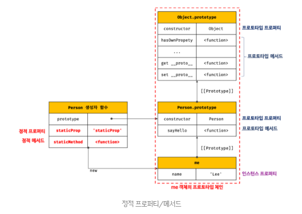

## 01. 리액트 개발을 위해 꼭 알아야 할 자바스크립트

### 리액트에서 자바스크립트 동등비교를 기반으로 하는 작업

1. 의존성 배열(dependencies)의 작동원리
2. 리액트 컴포넌트의 랜더링 판단방법(props의 동등비교)
3. 가상 DOM과 실제 DOM의 비교
4. 변수나 함수의 메모이제이션

### 리액트에서의 동등 비교

리액트에서 사용하는 동등비교는 `==`나 `===`가 아닌 Object.is이다. Object.is는 ES6에서 제공하는 기능이기 때문에 리액트에서는 이를 구현한 폴리필(Polyfill)을 함께 사용한다.

- Object.is: `==`와 `===`가 만족하지 못하는 몇 가지 특이한 케이스를 추가하기 위해 나름의 알고리즘을 추가한 메서드

리액트에서 비교를 요약하자면 Object.is로 먼저 비교를 수행한 다음 Object.is에서 수행하지 못하는 비교, 즉 객체 간 얕은비교를 한 번 더 수행한다. 객체 간 얕은 비교란 객체의 첫 번째 깊이에 존재하는 값만 비교하는 것이다.

```javascript
// Object.is는 참조가 다른 객체에 대해 비교가 불가능하다.
Object.is({ hello: 'world' }, { hello: 'world' }); // false

// 반면, 리액트 팀에서 구현한 shallowEqual는 객체의 1 depth까지는 비교가 가능하다.
shallowEqual({ hello: 'world' }, { hello: 'world' }); // true

// 그러나 2 depth까지 가면 이를 비교할 방법이 없으므로 false를 반환한다.
shallowEqual({ hello: { hi: 'world' } }, { hello: { hi: 'world' } }); // false
```

이렇게 객체의 얕은 비교까지만 구현한 이유는 리액트에서 사용하는 JSX props는 객체이고, props만 일차적으로 비교하면 되기 때문이다.

리액트는 props에서 꺼내온 값을 기준으로 렌더링을 수행하기 때문에 일반적인 케이스에서는 얕은 비교로 충분하다. 하지만 props에 또 다른 객체를 넘겨준다면 리액트 랜더링이 예상치 못하게 작동한다.

**Quiz**

1. ES6에서 새롭게 추가된 7번째 타입으로, 중복되지 않는 어떠한 고유한 값을 나타내기 위해 만들어진 것은?

2. 다음의 실행 결과는?

```javascript
const key = Symbol('key');
const key2 = Symbol('key');

console.log(key === key2);
console.log(Symbol.for('hello') === Symbol.for('hello'));
```

3. `==`와 `===`의 차이점
4. 다음의 실행 결과는?

```javascript
hello();

function hello() {
  console.log('hello');
}
```

```javascript
hello();

var hello = function hello() {
  console.log('hello');
};
```

```javascript
hello();

let hello = function hello() {
  console.log('hello');
};
```

```javascript
hello();

const hello = function hello() {
  console.log('hello');
};
```

5. 화살표 함수의 특징

---

1. Symbol
2. false / true, 동일한 값을 사용하기 위해서는 Symbol.for을 활용한다.
3. `==`는 같음을 비교하기 전에 양쪽이 같은 타입이 아니면 강제로 형변환(type casting)을 한 후에 비교한다. 따라서 5 === '5'는 true를 반환한다. 하지만 `===`는 이런 작업을 하지 않고 타입이 다르면 false를 반환한다.
4. 함수 선언문과 함수 표현식의 차이
   1. hello, 함수의 호이스팅은 함수에 대한 선언을 실행 전에 미리 메모리에 등록하는 작업을 의미한다.
   2. TypeError: hello is not a function, 변수 호이스팅 발생, var는 호이스팅 되는 시점에 undefined로 초기화된다.
   3. ReferenceError: Cannot access 'hello' before initialization
   4. ReferenceError: Cannot access 'hello' before initialization, let, const로 선언한 변수는 호이스팅은 되지만 변수가 선언된 위치에 도달하지 전까지는 초기화가 되지않는 특징이 있다. 이 상태를 TDZ(Temporal Dead Zone)이라고 한다.
5. 1. 생성자 함수로 사용할 수 없다.
   2. arguments 객체가 존재하지 않는다.
   3. this 바인딩 방식이 다르다. 화살표 함수는 표현 뿐만 아니라 내부 동작 또한 간략화 되어있다. 화살표 함수는 함수 내부에 this가 없어서 상위 스코프의 this를 찾아 올라간다. 따라서 화살표 함수에서의 this는 상위 스코프의 this이다.

```javascript
const foo = function () {
  console.dir(this);
};

// 1. 일반 함수 호출
// this: 전역 객체 window
// 자바스크립트에 일반함수 호출 시(strict 모드가 아닌 환경) this는 전역 객체 window
// 리액트는 모든 코드를 strict 모드로 실행하기 때문에 일반함수 호출 시 this는 undefined
foo(); // window

// 2. 메서드 호출
// this : 메서드를 호출한 객체 obj
const obj = { foo };
obj.foo(); // obj

// 3. 생성자 함수 호출
// this : 생성자 함수가 생성한 인스턴스
new foo(); // foo {}
```

```javascript
var value = 1;

const obj = {
  value: 100,
  foo() {
    // 화살표 함수 내부의 this는 상위 스코프의 this를 가리킨다.
    setTimeout(() => console.log(this.value), 100); // 100
  },
};

obj.foo();
// 화살표 함수는 함수 내부에 this가 없다. 따라서 상위 스코프로 찾아올라간다.
// 위의 화살표함수의 상위 스코프는 foo 메서드이다.
```

### 함수를 만들 때 주의해야 할 사항

1. 함수의 부수 효과를 최대한 억제하라

- 부수효과(side effect): 함수 내의 작동으로 인해 함수가 아닌 함수 외부에 영향을 끼친는 것을 의미한다.
- 순수 함수: 부수 효과가 없는 함수, 언제 어디서나 동일한 인수를 받으면 동일한 결과를 반환해야 한다. 그리고 이러한 작동 와중에 외부에 어떠한 영향도 미쳐서는 안된다.
- 비순수 함수: 부수 효과가 존재하는 함수

웹 어플리케이션에서을 만드는 과정에서 부수효과는 어떻게 보면 피할 수 없는 요소이다. 컴포넌트 내부에서 API를 호출하거나(HTTP request에 영향을 끼침) console.log(브라으저의 콘솔창이라는 외부에 영향), HTML 문서에 title을 바꾸는 경우 등 피할 수 없는 요소지만 이러한 부수효과를 최대한 억제할 수 있는 방향으로 함수를 설계해야 한다.

리액트 관점에서 본다면 부수효과를 처리하는 훅인 useEffect의 작동을 최소화하는 것이 그 일환이라고 할 수 있다.

2. 가능한 한 함수를 작게 만들어라
3. 누구나 이해할 수 있는 이름을 붙여라

- 가능한 한 함수 이름은 간결하고 이해하기 쉽게 붙이는 것이 좋다.
- 리액트에서 사용하는 useEffect나 useCallback 등의 훅에 넘겨주는 콜백함수에 네이밍을 붙여준다면 가독성에 도움이 된다.

---

```javascript
useEffect(function apiReqest() {
  // ...do something
}, []);
```

### 클래스란 무엇인가?

- `리액트 클래스 컴포넌트`에 대한 이해를 위해서는
  - 자바스크립트 `클래스`, `프로토타입`, `this`에 대한 이해가 필요하다.
- 클래스란 특정한 형태의 객체를 반복적으로 만들기 위해 사용되는 것(새로운 객체 생성 메커니즘)
- 사실 클래스도 함수이다

**프로토타임 체인(Prototype Chain)**

- 자바스크립트에서 객체의 프로퍼티(메서드 포함)에 접근하려고 할 때, 해당 객체에 접근하려는 프로퍼티가 없다면 `[[Prototype]]` 내부 슬롯의 참조를 따라 자신의 부모 역할을 하는 프로토타입의 프로퍼티를 순차적으로 검색한다. 이를 `프로토타입 체인`이라 한다.
- 프로토타입 체인은 자바스크립트가 객체지향 상속을 구현하는 매커니즘이다.
  

**instanceof**

- 객체 instanceof 생성자 함수
- 우변의 생성자 함수의 prototype에 바인딩된 객체가 좌변의 객체의 프로토타입 체인 상에 존재하면 true, 아니면 false로 평가된다.

```javascript
function Person(name) {
  this.name = name;
}

const me = new Person('Lee');

// Person.prototype이 me 객체의 프로토타입 체인 상에 존재하므로 true
console.log(me instanceof Person); // true

// Object.prototype이 me 객체의 프로토타입 체인 상에 존재하므로 true
console.log(me instanceof Object); // true
```

### 클로저

- `리액트 함수 컴포넌트`에 대한 이해를 위해서는
  - `클로저`에 대한 이해가 필요하다.
- 함수 컴포넌트 구조와 작동방식, 훅의 원리, 의존성 배열 등 함수 컴포넌트 대부분의 기술이 모두 클로저에 의존하고 있다.
- `클로저는 함수와 함수가 선언된 어휘적 환경(Lexical Scope)의 조합`
- 부수효과가 없고 순수해야 한다는 목적을 달성하기 위해 적극적으로 사용되는 개념

**스코프**

- 스코프는 변수의 유효범위
- 다른언어와 달리 자바스크립트는 기본적으로 함수 레벨 스코프를 따른다.
- `var` 키워드로 선언된 변수는 오로지 함수의 코드 블록만을 지역 스코프로 인정하지만, ES6에서 도입된 `let` `const` 키워드는 `블록 레벨 스코프`를 지원한다.

```javascript
// var 키워드로 선언된 변수는 함수 레벨 스코프만 인정하기 때문에
// 함수 밖에서 var 키워드로 선언된 변수는 코드 블록 내에서 선언되었다 할지라도 모두 전역변수이다.

var i = 10;

// for문에서 선언한 i는 전역 변수다. 이미 선언된 전역 변수 i가 있으므로 중복 선언된다.
for (var i = 0; i < 5; i++) {
  console.log(i); // 0 1 2 3 4
}
// 의도치 않게 값이 변경됨
console.log(i); // 5
```

```javascript
let i = 10;

for (let i = 0; i < 5; i++) {
  console.log(i); // 0 1 2 3 4
}

console.log(i); // 10
```

**클로저의 활용**

```javascript
function makeCounter() {
  let count = 0;

  function increment() {
    count += 1;
    console.log(count);
  }

  return increment;
}

const counter = makeCounter();
counter(); // 1
counter(); // 2
counter(); // 3
```

위와 같이 클로저를 사용하면 count 변수를 직접 노출하지 않음으로써 사용자가 직접 수정하는 것을 막았음은 물로, 접근하는 경우를 제한해 로그를 남기는 등의 부차적인 작업도 수행할 수 있다.

이처럼 클로저를 활용하면 `전역 스코프의 사용을 막고`, `개발자가 원하는 정보만 개발자가 원하는 방향으로 노출시킬 수 있다`는 장점이 있다.

**리액트에서의 클로저**
useState 함수 호출은 Component 내부 첫 줄에서 종료되었는데, setState는 useState 내부의 최신 값을 어떻게 계속 확인할 수 있을까? 그것은 바로 클로저가 useState 내부에서 활용되기 때문이다.

외부함수(useState)가 반환한 내부함수(setState)는 외부함수의 호출이 끝났음에도 자신이 선언된 외부함수가 선언된 환경(state가 저장되어 있는 어딘가)을 기억하기 때문에 계속해서 state 값을 사용할 수 있는 것이다.

```javascript
const MyReact = (function () {
  const global = {};
  // react에서는 여러 개의 상태를 하나의 컴포넌트에서 사용할 수 있기 때문에 인데스를 사용해 각 상태를 구분한다.
  let index = 0;

  function useState(initialState) {
    if (!global.states) {
      global.states = [];
    }

    const currentState = global.states[index] || initialState;
    global.states[index] = currentState;

    // setState는 함수 내부의 currentIndex가 클로저로 저장되었다.
    // 외부함수(즉시 실행함수), 내부함수(function (value) {...})
    // setState는 currentIndex라는 값을 기억하고 있어서
    // 이 값으로 항상 해당 인덱스의 상태만 변경하게 된다.
    // 즉시 실행함수를 사용하지 않으면 index 값을 고정하지 못함
    // 이를 통해 useState가 여러 번 호출되어도 각각의 setState는 고유한 idnex 상태를 가지게 된다
    const setState = (function () {
      let currentIndex = index;
      return function (value) {
        global.states[currentIndex] = value;
      };
    })();

    index = index + 1;

    return [currentState, setState];
  }

  function Component() {
    const [value, setValue] = useState(0);
  }
})();
```

**클로저를 사용할 때 주의할 점**
클로저의 기본원리에 따라, 클로저가 선언되는 순간 내부 함수는 외부 함수의 선언적인 환경을 기억하고 있어야 하므로 이를 어디에 사용하는지 여부에 관계없이 저장해둔다.

```javascript
const aButton = document.getElementById('a');

function heavyJob() {
  const longArr = Array.from({ length: 10000000 }, (_, i) => i + 1);
  console.log(longArr.length);
}

// 클릭 시, 스크립트 실행이 조금 길지만 클릭과 동시에 선언, 그리고 길이를 구하는 작업이 모두 스코프 내부에서 끝났기 때문에 메모리 용량에 영향을 미치지 않았다.
aButton.addEventListener('click', heavyJob);
```

```javascript
const aButton = document.getElementById('a');

function heavyJobWithClosure() {
  const longArr = Array.from({ length: 10000000 }, (_, i) => i + 1);

  return function () {
    console.log(longArr.length);
  };
}

const innerFunc = heavyJobWithClosure();

// 스크립트를 실행하는 시점부터 아주 큰 배열을 메모리에 올려두고 시작
// 실제로는 onClick 내부에서만 사용하고 있지만, 이를 알 수 있는 방법이 없기 때문에 긴 배열을 저장해 둔다
aButton.addEventListener('click', function () {
  innerFunc();
});
```

### 이벤트 루프와 비동기 통신의 이해

자바스크립트는 분명히 싱글 스레드(single thread) 방식으로 작동한다. 그러나 이러한 싱글 스레드 기반의 자바스크립트에서도 많은 양의 비동기 작업이 이루어지고 있다.

- 사용자가 검색어를 입력해 검색을 위한 네트워크 요청이 발생하는 순간에도 사용자는 다른 작업을 처리할 수 있다.
- 이처럼 자바스크립트 동시성(concurrency)를 지원하는 것이 바로 `이벤트 루프(event loop)`이다.
- 이벤트 루프는 브라우저에 내장된 기능 중 하나이다.

**스레드(thread)**

- 프로세스(process): 프로그램을 구동해 프로그램의 상태가 메모리상에서 실행되는 작업단위
- 하나의 프로그램은 실행은 하나의 프로세스를 가지고 그 프로세스 내부에서 모든 작업이 처리되는 것을 의미한다.
- 소프트웨어가 점차 복잡해지면서 하나의 프로그램에서 동시에 여러 개의 복잡한 작업을 수행할 필요성이 대두되었다.
- 그래서 탄생한 더 작은 실행단위가 `스레드(thread)`이다.
- 하나의 프로세스에서는 여러 개의 스레드를 만들 수 있고, 스레드끼리는 메모리를 공유할 수 있어 여러가지 작업을 동시에 수행할 수 있다.

- 싱글 스레드: 하나의 프로세스가 하나의 스레드를 가지는 경우

  - `장점`

    1.  자원 접근에 대한 동기화를 신경쓰지 않아도 된다.(공용자원에 대한 각각의 스레드의 접근을 통제할 필요가 없다)
    2.  Context Switching을 요구하지 않는다.
    3.  Context Switching: 멀티프로세스 환경에서 CPU가 어떤 하나의 프로세스를 실행하고 있는 상태에서 인터럽트 요청에 의해 다음 우선 순위의 프로세스가 실행되어야 할 때 기존의 프로세스의 상태 또는 레지스터 값(Context)을 저장하고 CPU가 다음 프로세스를 수행하도록 새로운 프로세스의 상태 또는 레지스터 값(Context)를 교체하는 작업을 Context Switch(Context Switching)라고 한다.

  - `단점`
    1. 여러 개의 CPU를 활용하지 못한다.

- 멀티 스레드: 하나의 프로세스를 다수의 스레드로 구분하여 자원을 공유하고 자원의 생성과 관리의 중복을 최소화하여 수행 능력을 향상시키는 것을 말한다.

  - `장점`

    1. 프로그램의 일부분이 중단되거나 긴 작업을 수행하더라도 프로그램의 수행이 계속되어 사용자에 대한 응답성이 증가한다.
    2. 프로세스 내 자원들과 메모리를 공유하기 때문에 메모리 공간과 시스템 자원의 소모가 줄어든다.
    3. 스레드 간 통신이 필요한 경우에도 쉽게 데이터를 주고 받을 수 있으며, 스레드 간 context switching은 캐시 메모리를 비울 필요가 없어 더 빠르다.
    4. 다중 CPU 구조에서는 각각의 스레드가 다른 프로세서에서 병렬로 수행될 수 있으므로 병렬성이 증가한다.

  - `단점`
    1. 동기화에 대한 적절한 조치가 필요하다.
    2. 운영체제의 지원이 필요하다.
    3. 스레드 스케줄링에 신경써야 한다.

**이벤트 루프와 테스크 큐**


- 콜스택(call stack): 자바스크립트에서 수행해야 할 코드나 함수를 순차적으로 담아두는 스택이다.
- 힙(heap): 객체가 저장되는 메모리 공간, 콜스택 요소인 실행 컨텍스트는 힙에 저장된 객체를 참조한다.

- 콜스택과 힙으로 구성된 자바스크립트 엔진은 단순히 테스크가 요청되면 콜스택을 통해 요청된 작업을 순차적으로 실행할 뿐이다.
- 이벤트 루프는 콜스택에 실행중인 코드가 있는지, 그리고 테스크 큐에 대기중인 함수가 잇는지 반복해서 확인하는 역할을 한다.
- 비동기 처리에서 소스코드의 평가와 실행을 제외한 모든 처리는 자바스크립트 엔진을 구동하는 환경인 브라우저 또는 Node.js가 담당한다.

**마이크로테스크 큐(microtask queue/job queue)**

- 이벤트 루프는 하나의 마이크로테스크 큐를 갖고 있는데, 여기에 들어가는 마이크로 테스크에는 대표적으로 Promise가 있다.
- 마이크로테스크 큐는 테스크 큐보다 우선권을 갖는다.

```javascript
function foo() {
  console.log('foo');
}

function bar() {
  console.log('bar');
}

function baz() {
  console.log('baz');
}

setTimeout(foo, 0);

Promise.resolve().then(bar).then(baz);

// bar baz foo
```

- 랜더링은 각 마이크로테스크 큐 작업이 끝날 때마다 한 번씩 렌더링할 기회를 얻게 된다.

### 선택이 아닌 필수, 타입스크립트

- 타입스크립트
  - 자바스크립트의 슈퍼셋(어떤 언어가 다른 언어의 모든 기능을 포함하면서 추가 기능을 제공하는 언어)
  - 자바스크립트는 동적타입 언어이기 때문에 대부분의 에러를 런타임에 확인할 수 있다는 문제점이 있다.
  - 타입스크립트는 타입 체크를 정적으로 런타임이 아닌 빌드타임(트랜스파일)에 수행할 수 있게 해준다.

**any 대신 unknown을 사용하자**
`unknown`을 사용하는 것은 예상치 못한 타입을 받아들일 수 있음은 물론, 사용하는 쪽에서 더욱 안전하게 쓸 수 있다. any보다는 `unknown`을 사용하는 습관을 들이자.

```typescript
function doSomething(callback: unknown) {
  if (typeof callback === 'function') {
    callback();
    return;
  }

  throw new Error('callback은 함수여야 합니다.');
}
```

**bottom type, never**
top type인 unknown과 반대되는 bottom type으로 never가 있다. never 타입은 unknown과 반대로, 어떠한 타입도 들어올 수 없음을 의미한다.

```typescript
// string과 number를 둘 다 만족시키는 타입은 존재하지 않는다.
// never type
type what1 = string & number;

// never type
type what2 = ('hello' | 'hi') & 'react';
```

**타입 가드를 적극 활용하자 **
unknown 타입의 예제에서 살펴봤듯이, 타입을 사용하는 쪽에서는 최대한 타입을 좁히는 것이 좋다. 이러한 타입을 좁히는데 도움을 주는 것이 바로 타입 가드이다. 조건문과 함께 타입 가드를 사용하면 타입을 효과적으로 좁힐 수 있어 조금 더 명확하게 변수나 함수를 사용할 수 있다.

```typescript
// intanceof는 지정한 인스턴스가 특정 클래스의 인스턴스인지 확인할 수 있는 연산자이다.

class UnAuthorizedError extends Error {
  constructor() {
    super();
  }

  get message() {
    return '인증에 실패했습니다.';
  }
}

class UnExpectedError extends Error {
  constructor() {
    super();
  }

  get message() {
    return '예상치 못한 에러가 발생했습니다.';
  }
}

async function fetchSomething() {
  try {
    const response = await fetch('/api/data');
    return await response.json();
  } catch (e) {
    // e는 unknown이다.

    // UnAuthorizedError를 위한 타입 가드 조건문
    if (e instanceof UnAuthorizedError) {
      // do something...
    }

    // UnExpectedError 위한 타입 가드 조건문
    if (e instanceof UnExpectedError) {
      // do something...
    }
    throw e;
  }
}
```

```typescript
// in은 property in object로 사용되는데, 주로 어떤 객체에 키가 존재하는지 확인하는 용도로 사용된다.

interface Student {
  age: number;
  score: number;
}

interface Teacher {
  name: string;
}

function doSchool(person: Student | Teacher) {
  if ('age' in person) {
    console.log(person.age);
    console.log(person.score);
  }

  if ('name' in person) {
    console.log(person.name);
  }
}
```

**제네릭(generic)**
제네릭은 함수나 클래스 내부에서 단일 타입이 아닌 다양한 타입에 대응할 수 있도록 도와주는 도구이다. 제네릭을 사용하면 타입만 다른 비슷한 작업을 하는 컴포넌트룰 단일 제네릭 컴포넌트로 선언해 간결하게 작성할 수 있다.

```typescript
function getFirstAndLast(list: unknown[]) {
  return [list[0], list[list.length - 1]];
}

const [first, last] = getFirstAndLast([1, 2, 3, 4, 5]);

first; // unknown
last; // unknown
```

```typescript
function getFirstAndLast<T>(list: T[]): [T, T] {
  return [list[0], list[list.length - 1]];
}

const [first, last] = getFirstAndLast([1, 2, 3, 4, 5]);

first; // number
last; // number

const [first, last] = getFirstAndLast(['apple', 'banana', 'cherry']);

first; // string;
last; // string;

// T라는 제네릭을 선언해, getFirstAndLast 함수는 다양한 타입을 처리할 수 있는 함수로 변모했다.
```

제네릭을 하나 이상 사용할 수 있다. 단, 일반적으로 제네릭을 알파벳 T, U 등으로 표현하는 경우가 많은데, 이 경우 제네릭이 의미하는 바를 명확히 할 수 없으니 적절히 네이밍하는 것이 좋다.

```typescript
function multupleGeneric<First, Last>(a1: First, a2: Last): [First, Last] {
  return [a1, a2];
}

const [a, b] = multipleGeneric<string, boolean>('true', true);

a; // string;
b; // boolean;
```

```typescript
// 리액트에서 제네릭을 사용할 수 있는 코드 useState
// useState에 제네릭으로 타입을 선언하면 state 사용과 기본값 선언을 좀 더 명확하게 할 수 있다.
function Component() {
  // state: string
  const [state, setState] = useState<string>('');
}
```

**인덱스 시그니처(index signature)**
인덱스 시그니처는 객체의 키를 정의하는 방식을 의미한다.

```typescript
type Hello = {
  [key: string]: string;
};

const hello: Hello = {
  hello: 'hello',
  hi: 'hi',
};

hello['hello']; // hello
hello['안녕']; // undefined
```

```typescript
// Record<Key, Value>
type Hello = Record<'hello' | 'hi', string>;

const hello: Hello = {
  hello: 'hello',
  hi: 'hi',
};

type Hello = { [key in 'hello' | 'hi']: string };

const hello: Hello = {
  hello: 'hello',
  hi: 'hi',
};
```

```typescript
// error
Object.keys(hello).map((key) => {
  const value = hello[key];
  return value;
});
```

```typescript
// Object.keys가 string[]을 반환해서 이를 해결하기 위해
// 해결 01
// as를 사용해 타입을 단언할 수 있다.
(Object.keys(hello) as Array<keyof Hello>).map((key) => {
  const value = hello[key];
  return value;
});

// 해결 02
// 타입 가드 함수를 만들기
function keyOf<T extends Object>(obj: T): Array<keyof T> {
  return Array.from(Object.keys(obj) as Array<keyof T>);
}

keyof(hello).map((key) => {
  const value = hello[key];
  return value;
});

// 해결 03
Object.keys(hello).map((key) => {
  const value = hello[key as keyof Hello];
  return value;
});
```

그런데 왜 Object.keys는 string[]으로 강제되 있을까? useState와 같이 제네릭을 사용하지도 않고, 혹은 적절히 함수 내부에서 추론할 수 있음에도 왜 string[]으로 강제해 두었을까?

자바스크립트의 특징과, 이를 구조적으로 구현하기 위한 타이스크립트의 구조적 타이핑의 특징 때문이다. 자바스크립트는 다른 언어에 비해 객체가 열려 있는 구조로 만들어져 있어므로 `덕 타이핑(duck typing)`으로 객체를 비교해야 하는 특징이 있다.

`덕 타이핑(duck typing)`이란 객체의 타입이 클래스 상속, 인터페이스 구현 등으로 결정되는 것이 아니고 어떤 객체가 필요한 변수와 메서드만 지니고 있다면 그냥 해당 타입에 속하도록 인정해 주는 것을 의미한다. 덕 타이핑을 비유하는 유명한 말처럼, 어떤 것이 오리처럼 걷고, 헤엄치고, 소리를 내면 그것이 무엇이든 오리라고 부를 수 있는 것이다.

타입스크립트의 핵심 원칙은 타입 체크를 할 때 그 값이 가진 형태에 집중한다는 것이다. 이러한 것을 `덕 타이핑` 또는 `구조적 타이핑`이라고 한다.

```typescript
type Car = { name: string };
type Truck = Car & { power: number };

function born(car: Car) {
  console.log(car.name);
}

const truck: Truck = {
  name: '비싼차',
  power: 2000,
};

born(truck); // '비싼차'
// Car에 필요한 속성을 다 가지고 있기 때문에 Car처럼 name을 가지고 있으므로 유효하다.
```

**tsconfig.json**

```javascript
{
  "compilerOptions": {
    // outDir은 .ts나 .js가 만들어진 결과물을 넣어두는 풀
    // tsc는 타입스크립트를 자바스크립트로 변환하는 명령어인데, 이 tsc를 사용하면 결과물이 outDir로 넘어간다.
    "outDir": "./dist",

    // allowJs는 .js파일을 허용할 것인지 여부이다.
    "allowJs": true,

    // target에는 결과물이 될 자바스크립트 버전을 지정한다.
    "target": "es5"
  },
  // include에는 트랜스파일할 자바스크립트와 타입스크립트 파일 경로를 지정한다.
  "include": ["./src/**/*"]
}
```
